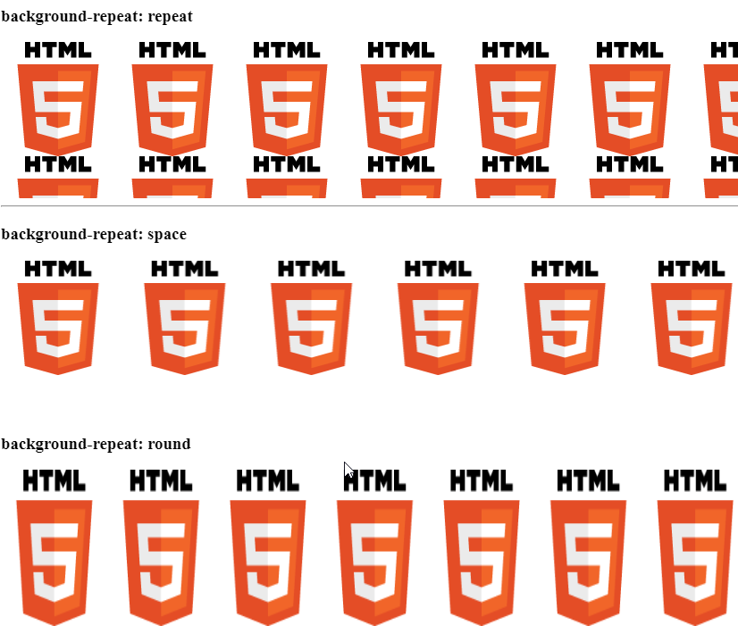

# **Imagenes de fordo en CSS3**

- [3. Imágenes de fondo](#3-imágenes-de-fondo)
  - [3.1. Opacidad](#31-opacidad)
  - [3.1. Fondos múltiples](#31-fondos-múltiples)
  - [3.2. Tamaño de fondos](#32-tamaño-de-fondos)

Es posible que, buscando hacer un diseño más avanzado, en lugar de utilizar un color de fondo quieras utilizar imágenes. Para ello, CSS te proporciona la propiedad `background-image`, con la cuál puedes indicar imágenes de fondo o, como veremos más adelante, incluso degradados de varios colores.

# 3. Imágenes de fondo

En el caso de querer utilizar una imagen de fondo, como ya hemos dicho, utilizaremos la propiedad `background-image` y en el valor, el nombre de la imagen (*o la dirección donde está alojada*), siempre rodeada del texto `url()`.

| Propiedad | Valor | Significado |
| --- | --- | --- |
| `background-image` | **none** | No utiliza ninguna imagen de fondo. |
| `background-image` | url(*imagen.jpg*) | Usa la imagen de nombre **imagen.jpg** como fondo. |

En el caso de que sólo se coloque el nombre de la imagen (*por ejemplo, `imagen.jpg`*), el navegador buscará la imagen en la misma carpeta donde está el archivo CSS. Esto es lo que se llama una **ruta relativa**. En el caso de que se coloque la ruta completa, por ejemplo `https://github.com/Sergio-Rey-Personal/DIW/blob/master/UD07_Elementos_Multimedia_Imagenes_Sonido_Video_Animaciones/img/html5-logo-medium.png?raw=true`, se accederá a la imagen alojada en esa dirección web. Esto es lo que se llama **ruta absoluta**.

> > **NOTA**: En el caso de que no se encuentre la imagen o el valor de **background-image** se haya establecido a **none**, no se utilizará ninguna imagen de fondo, y en su lugar se mostrará el color establecido con **background-color**.

Una vez establecida una imagen de fondo con `background-image`, se puede personalizar la forma en la que se mostrará dicha imagen mediante propiedades como `background-repeat`, `background-attachment` o `background-position`, entre otras:

| Propiedad | Valor | Significado |
| --- | --- | --- |
| `background-repeat` | `repeat` | Repite la imagen de fondo horizontal y verticalmente. |
| | `repeat-x` | Repite la imagen de fondo sólo horizontalmente (eje x). |
| | `repeat-y` | Repite la imagen de fondo sólo verticalmente (eje y). |
| | `space` | Repite la imagen y rellena con espacio los huecos. |
| | `round` | Repite la imagen y amplia cada repetición para ajustar. |
| | `no-repeat` | La imagen de fondo no se repite. |
| `background-attachment` | `scroll` | Cuando hacemos scroll la imagen de fondo se desplaza. |
| | `fixed` | Cuando hacemos scroll, la imagen de fondo permanece fija. |
| `background-position` | [PosX] | 1 parámetro. Desplaza la imagen de fondo al punto (x, 50%). |
| | [PosX PosY] | 2 parámetros. Desplaza la imagen de fondo al punto (x, y). |

La propiedad `background-repeat` especifica si la imagen se repetirá horizontalmente (`repeat-x`), si se repetirá verticalmente (repeat-y), si lo hará en ambas direcciones (`repeat`) o en ninguna (`no-repeat`). Por defecto, si no se indica nada, esta propiedad está ajustada en `repeat`.

```css
div {
  background-image: urlurl(imagen.jpg);
  background-repeat: repeat;
}
```

.b_space {
  background-image: url(https://github.com/Sergio-Rey-Personal/DIW/blob/master/UD07_Elementos_Multimedia_Imagenes_Sonido_Video_Animaciones/img/html5-logo-medium.png?raw=true);
  background-repeat: space;
}
  /* background: <color> <image> <repeat> <attachment> <position> */
  background: #FFF  repeat-x scroll top left;
}

Existen también dos valores interesantes, `space` y `round`, los cuales asumen implícitamente que se repite el fondo. En el caso de que tengamos una imagen de fondo que se repita varias veces en mosaico, `space` evita que se corte la imagen, introduciendo un espacio entre las repeticiones individuales.

```css
div {
  background-image: urlurl(imagen.jpg);
  background-repeat: space;
}
```

Por su parte, `round` lo que hace es ajustar la imagen individual, de modo que la expande o contrae para ajustarla al espacio disponible. En ambos casos la repetición de los fondos nunca se mostrará cortada.

```css
div {
  background-image: urlurl(imagen.jpg);
  background-repeat: round;
}
```

Y el resultado de los 3 estilos es el siguiente: 



> [Ejemplo de backgroud-repeat (Codepen)](https://codepen.io/sergio-rey-personal/pen/OJMoVxp)

Siempre se podrá combinar en cada eje, con valores mixtos, por ejemplo, utilizando `background-repeat: space round`, lo que aplicará `space` al eje X y `round` al eje Y. Si sólo se especifica uno, se aplicará a ambos ejes.

La propiedad `background-attachment` especificará si la imagen de fondo seguirá el desplazamiento del usuario (*scroll, el comportamiento por defecto*) o por el contrario, se quedará fijado y no se moverá (*fixed*), mientras el usuario se desplaza por la página.

Por último, `background-position` coloca la imagen en la zona especificada por y por . Por defecto, esos valores son **0% 0%**, pero pueden especificarse con unidades (*porcentajes, píxels, etc...*) o mediante palabras clave que representan zonas predefinidas (*top, left, right, bottom y center*).

Si sólo se especifica un valor, se tomará para el eje x, mientras que el valor del eje Y será automáticamente establecido a **center** (*o 50%*).

### Atajo clásico: Fondos

Es posible establecer todas estas propiedades anteriores en una sola regla de CSS a modo de atajo, y así ahorrar mucho espacio en escribir las propiedades anteriores por separado. Aunque no es estrictamente obligatorio, se aconseja respetar el siguiente orden (*acostumbrarse a usar el mismo orden es una buena práctica*):

```css
div {
  /* background: <color> <image> <repeat> <attachment> <position> */
  background: #FFF url(imagen.jpg) repeat-x scroll top left;
}
```

Y con esto, ya conocemos las ventajas básicas de CSS a través de propiedades tan interesantes como `background-color` o `background-image` . Sin embargo, la llegada de CSS3 incorporó novedades muy interesantes en nuestros navegadores, que mediante versiones anteriores a CSS3 no era posible realizar (*o era algo bastante complejo*).

## 3.1. Opacidad

Es posible utilizar la propiedad *CSS3* `opacity` para establecer una transparencia total sobre el elemento indicado. Cuando decimos «**transparencia total**» nos referimos a que la transparencia se aplicará al elemento en cuestión y a todos los elementos HTML que estén en su interior.

| Propiedad | Valor | Significado |
| --- | --- | --- |
| `opacity` | [Number] | Establece una transparencia (`0` = 100% transparente, a `1` = 100% opaco) |

El valor a indicar es un número entre `0` (*completamente transparente*) y `1` (*completamente visible*), pudiendo establecer decimales para valores intermedios:

```css
.uno {
  background-color: #4CAF50;
  opacity: 0.1;
  padding: 5px;
}

.dos {
  background-color: #4CAF50;
  opacity: 0.3;
  padding: 5px;
}

.tres {
  background-color: #4CAF50;
  opacity: 0.6;
  padding: 5px;
}

.cuatro {
  background-color: #4CAF50;
  opacity: 1;
  padding: 5px;
}
```


 Si buscamos una transparencia parcial (*color de fondo transparente que no afecte al texto*) debemos utilizar los valores **RGBA** o **HSLA** (*canales alfa*) en la propiedad **background-color**:

```css
div {
  color: white;
  background-color: RGBA(255, 0, 0, 0.5);
}
```

De este modo, sólo aplicamos la transparencia al color de fondo, mientras que con **opacity** se aplica a toda la capa en sí, por lo que afecta a todos los elementos que están dentro de la capa.

## 3.1. Fondos múltiples

**CSS3** ofrece nuevas características a la hora de utilizar imágenes de fondo, como por ejemplo la posibilidad de establecer **múltiples imágenes de fondo** de forma simultánea:

```css
div {
  background-image: url(manz.png), url(fondo2.jpg), url(fondo3.jpg);
  background-repeat: no-repeat;
}
```

De esta forma, se pueden utilizar varias imágenes y superponerlas una sobre la otra, algo especialmente interesante si la primera imagen de fondo está en formato PNG (*la cuál soporta transparencias*). Al establecer imágenes de fondo múltiples, las propiedades complementarias a los fondos como `background-repeat`, `background-position` y otras, pueden actuar de forma personalizada para cada fondo.

Mientras que en el fragmento de código anterior, el navegador le indica a cada una de las tres imágenes que no debe repetirse, en el siguiente fragmento de código veremos que es posible indicar individualmente el comportamiento de cada una, separando por comas:

```css
div {
  background-image: url(manz.png), url(fondo2.jpg), url(fondo3.jpg);
  background-repeat: no-repeat, repeat-x, repeat;
}
```

Además, **CSS3** también añade nuevas propiedades para especificar como cubrirá la imagen de fondo al elemento en cuestión:

| Propiedad | Valor | Significado |
| --- | --- | --- |
| `background-clip` | `border-box` \| `padding-box` \| `content-box` | Modo de relleno de la imagen de fondo |
| `background-origin` | `border-box` \| `padding-box` \| `content-box` | Origen del modo de relleno del fondo |

La propiedad `background-clip` establece la forma en la que el color o la imagen de fondo cubrirá el elemento, mientras que la propiedad `background-origin` intenta posicionar el comienzo de la imagen de fondo, útil con imágenes. La primera utiliza `border-box` como valor por defecto, mientras que la segunda utiliza `padding-box`.

Ambas propiedades pueden tomar uno de los siguientes valores:

| Valor | Significado |
| --- | --- |
| `padding-box` | La imagen o color de fondo cubrirá la zona del espaciado y contenido. |
| `border-box` | La imagen o color de fondo cubrirá la zona del borde, espaciado y contenido. |
| `content-box` | La imagen o color de fondo cubrirá sólo la zona del contenido. |

> **Consejo**: Una buena forma de darse cuenta del funcionamiento de estas propiedades es establecer un borde grueso punteado. Usando `border-box` la imagen de fondo se extenderá en todo el elemento, incluyendo borde, espaciado y contenido. El valor `padding-box` extenderá la imagen de fondo sólo mediante el padding y el contenido, y por último, la propiedad `content-box` extenderá la imagen de fondo sólo en la zona del contenido.

## 3.2. Tamaño de fondos

Una de las últimas incorporaciones a la familia de propiedades de fondos de imagen es la propiedad `background-size`, la cuál ajusta el tamaño (*ancho y alto*) de la imagen de fondo, por si deseamos escalarla a un tamaño diferente. Por defecto, una imagen de fondo toma automáticamente el tamaño de la imagen (*que podría ser demasiado grande, por ejemplo*). Para no tener que modificar la imagen original de forma manual con un editor de imágenes, podemos utilizar esta propiedad y ajustarla a nuestro agrado mediante CSS:

| Propiedad | Valor | Significado |
| --- | --- | --- |
| `background-size` | [size] | 1 parámetro. Aplica un de (*ancho* × **auto**) a la imagen de fondo. |
| | [size size] | 2 parámetros. Aplica un de (*ancho* × *alto*) a la imagen de fondo. |

Los valores de tamaño que podemos utilizar, son los siguientes:

| Valor | Significado |
| --- | --- |
| `auto` | No escala la imagen. Utiliza el tamaño original. Es el valor por defecto. |
| *unidad* | Indicamos el tamaño específico que queremos usar (*píxels o porcentaje, por ej.*). |
| `cover` | Escala el ancho de la imagen de fondo al ancho del elemento. |
| `contain` | Escala el alto de la imagen de fondo al alto del elemento. |

Los dos últimos valores (*cover y contain*) sólo pueden utilizarse en el caso de que se especifique un sólo parámetro como valor en la propiedad `background-size`.

### Atajo moderno: Fondos

Los navegadores modernos, incluyen una nueva propiedad de atajo `background` que permite incluir los valores de propiedades CSS3 como `background-clip` , `background-origin` o `background-size`, que fueron incorporados más tarde que los demás. Es por ello, que el orden aconsejado para adquirir buenas prácticas es el siguiente y varía un poco respecto a la otra propiedad de atajo tradicional:

```css
div {
  /* background: <color> <position> <size> <repeat> <origin> <clip> <attachment> <image> */
  background: #FFF top left cover repeat-x padding-box border-box scroll url(imagen.jpg);
}
```