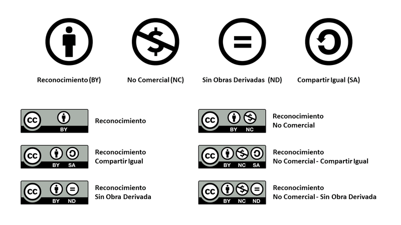

# 4. **Tipos de licencia de imágenes y usos permitidos** 

Tabla de contenidos

- [4. **Tipos de licencia de imágenes y usos permitidos**](#4-tipos-de-licencia-de-imágenes-y-usos-permitidos)
  - [4.1. La Ley que protege el uso de las imágenes](#41-la-ley-que-protege-el-uso-de-las-imágenes)
  - [4.2. Copyright vs Derecho de Autor](#42-copyright-vs-derecho-de-autor)
  - [4.3. El uso de Licencias para la protección legal de las imágenes](#43-el-uso-de-licencias-para-la-protección-legal-de-las-imágenes)
  - [4.4. Licencias Creative Commons (CC)](#44-licencias-creative-commons-cc)
  - [4.5. Copyleft](#45-copyleft)
  - [4.6. Uso de imágenes seguras para tu web](#46-uso-de-imágenes-seguras-para-tu-web)
    - [Sé el **propio autor de las imágenes que usas** en tu web](#sé-el-propio-autor-de-las-imágenes-que-usas-en-tu-web)
    - [Utiliza imágenes con licencia **Creative Commons**](#utiliza-imágenes-con-licencia-creative-commons)
    - [Consulta los bancos de imágenes](#consulta-los-bancos-de-imágenes)
      - [Bancos de imágenes gratuitos:](#bancos-de-imágenes-gratuitos)
      - [Bancos de imágenes de pago:](#bancos-de-imágenes-de-pago)
      - [Iconos:](#iconos)
  
Tener una web, especialmente si realizas tu actividad desde la Unión Europea, conlleva una serie de obligaciones legales y es necesario que lleves a cabo. Tanto es así, que se han desarrollado incluso una serie de herramientas para adecuar tu web a esta legalidad.

Dentro de los diversos facetas legales de una web, la legalidad del uso de imágenes en internet es uno de los que más dudas genera y, efectivamente, da mucho de sí. Conocer algunos pilares básicos y ponerlos en práctica es obligación de todo informático que realice desarrollos web.

## 4.1. La Ley que protege el uso de las imágenes

Las imágenes consideradas obras al amparo de la Propiedad Intelectual encuentran una protección jurídica general en el [**Real Decreto 1/1996, de 12 de abril**](https://www.boe.es/buscar/act.php?id=BOE-A-1996-8930), por el que se aprueba el texto refundido de la **Ley de Propiedad Intelectual,** regularizando, aclarando y armonizando las disposiciones legales vigentes sobre la materia (en adelante, LPI).

La LPI establece que la puesta a disposición del público por terceros de cualquier imagen, obra fotográfica o mera fotografía, divulgada periódicamente o en sitio web, estará sujeta a la autorización de su autor.

La Ley protege así a los autores por el solo hecho de la creación y les otorga **derechos exclusivos sobre el uso, disposición y explotación de la obra**, siempre que se respeten las limitaciones fijadas al derecho de explotación en la Ley.

La LPI establece dos supuestos donde se autoriza el **uso de las imágenes sin que medie la autorización de su autor**:

1.  **Con fines docentes o de investigación:** siempre y cuando se refieran a obras ya divulgadas y se establezca su inclusión a través de citas, comentarios o un juicio crítico. Se deberá indicar la fuente y el nombre del autor de la obra.
2.  **Parodia:** no se requerirá el consentimiento del autor si la transformación de la obra no crea un riesgo de confusión ni daño a la obra original.

La mencionada LPI hace una **diferenciación entre obra fotográfica o de diseño, y la mera fotografía.** La protección que reciben es diferente en cada caso:

-   **Obra fotográfica o de diseño:** son las que llevan implícita la originalidad y personalidad de su creador. Estas obras están protegidas durante toda la vida de su autor y hasta 60 años después de su muerte.
-   **Mera fotografía:** es la que resulta solo de la captura de una imagen, en un momento determinado, sin que medie intención creativa. Estas fotografías solo están protegidas durante 25 años, contados a partir del año siguiente a su realización.

## 4.2. Copyright vs Derecho de Autor

Existe una controversia sobre los términos copyright y derecho de autor:

-   La **Real Academia Española de la Lengua equipara copyright al derecho de autor.** El derecho de autor se les otorga a los creadores de cualquier obra literaria, artística, musical, científica o didáctica, esté o no publicada, reconociéndosele además derechos morales y patrimoniales.
-   La **controversia doctrinal** se debate entre los que consideran que el **derecho de autor** se origina a través del sistema de derecho romano francés, donde el autor ostenta derechos sobre su obra y existe una **identidad entre la creación y su creador**, mientras que el **copyright** proviene del derecho anglosajón conocido como "common law" y **solo se protege la obra en sí misma**, no tomándose en cuenta los derechos morales del autor con su obra.

## 4.3. El uso de Licencias para la protección legal de las imágenes

Antes de explicar algunos de los tipos de licencias existentes, es primordial entender qué es una licencia. Un licencia es el **conjunto de normas que determinan cómo y bajo qué condiciones un autor autoriza a que su obra sea explotada**.

Por tanto, dependiendo del tipo de licencia que conceda el autor, tendrá mayor o menor permisibilidad. Así el autor podrá autorizar a la copia, a la comunicación pública, a la distribución y/o a la modificación de su obra.

Actualmente son muchos los tipos de licencias que se podrían utilizar, pero las más reconocidas y usadas son: Creative Commons y Copyleft.

## 4.4. Licencias Creative Commons (CC)

Las **licencias Creative Commons** (CC) nacen de una organización sin ánimo de lucro, cuyo propósito es el desarrollo de modelos de licencias que permitan un mayor alcance de la cultura, utilizando las nuevas tecnologías, oprimiendo los obstáculos que presenta el copyright y protegiendo los derechos de los autores a la conservación de su obra original.

Con estas licencias **el autor puede definir los usos que se le podrá dar a su obra,** como por ejemplo: si permitirá la reproducción total o parcial, su modificación o su uso con fines comerciales.

Las licencias Creative Commons no solo protegen el contenido de la obra, sino que **permite una gran promoción de la misma.**

El uso de estas licencias es **gratuito** y gozan de **garantías legales internacionales.** El Titular de la obra siempre conservará sus derechos como autor.

Pues existen seis tipos de licencias CC, creadas a partir de las combinaciones de cuatro condiciones. Estas **condiciones** son las siguientes:

1.  **Reconocimiento:** en cualquier explotación de la obra autorizada a través de la licencia será obligatorio el reconocimiento de su autoría.
2.  **No Comercial:** la explotación de la obra estará limitada a usos no comerciales.
3.  **Sin obras derivadas:** la autorización para la explotación de la obra no incluirá su modificación para la creación de una obra derivada.
4.  **Compartir igual:** la explotación autorizada incluirá la creación de obras derivadas siempre y cuando mantengan la misma licencia en el momento de su divulgación.

Con estas condiciones se generan las **seis licencias tipo de CC:**

1.  **Reconocimiento:** Esta licencia les posibilita a otros distribuir, mezclar, ajustar y construir desde la obra; permite además los fines comerciales siempre y cuando sea reconocida la autoría de la creación original. De todas las licencias previstas ésta es la licencia más servicial. Se recomienda para una **máxima difusión y utilización de los materiales dependientes a una licencia**.
2.  **Reconocimiento -- Compartir Igual:** Con esta licencia otros pueden remezclar, modificar y desarrollar sobre la obra original incluso con fines comerciales, pero siempre deben atribuir el crédito a su autor y licenciar sus obras bajo los mismos términos. Esta licencia se compara a menudo con las licencias de "copyleft" y las de software "open source". Esto quiere decir que cualquier obra nueva basada en una original, lo será bajo la misma licencia, de modo que **a las obras derivadas se les permitirá también su uso comercial.**
3.  **Reconocimiento -- Sin Obra Derivada:** Esta licencia permite la **redistribución comercial y no comercial**, siempre y cuando **la obra no sufra modificaciones** y se transmita en su totalidad **reconociendo su autoría.**
4.  **Reconocimiento -- No Comercial:** Esta licencia le permite a otros entremezclar, ajustar y construir a partir de la obra original con fines no comerciales, sin embargo aunque en **las nuevas creaciones** deban reconocer la autoría y no puedan ser usadas de forma comercial, **no tienen que estar bajo una licencia con los mismos términos**.
5.  **Reconocimiento -- No Comercial -- Compartir Igual.** Esta licencia permite a otros entremezclar, ajustar y construir a partir de su obra con fines no comerciales, siempre y cuando le **reconozcan la autoría** y sus **nuevas creaciones esté bajo una licencia con los mismos términos**.
6.  **Reconocimiento -- No Comercial -- Sin Obra Derivada:** Esta es la licencia **más restrictiva** de las seis licencias principales; solo permite que otros puedan descargar las obras y compartirla con otros, pero siempre y cuando se **reconozca la autoría de la obra**, sin que se produzca **ninguna modificación** en la misma, **ni su uso comercial**.

Aquí puedes ver un resumen gráfico:

Resumen de las condiciones y tipo de licencias Creative Commons.

## 4.5. Copyleft

El **Copyleft** es una práctica que consiste en el **ejercicio del derecho de autor, posibilitando la libre distribución de copias y versiones variadas de una obra, exigiendo que los mismos derechos se preserven para las modificaciones creadas.**

Se rige por normas propias de cada país, aunque se suele utilizar fundamentalmente para programas informáticos, obras de arte, o cualquier tipo de obra creativo que sea tutelado por el derecho de autor.

Surge en el campo de la programación informática con el concepto de [software libre](http://es.wikipedia.org/wiki/Software_libre), con la idea de que cualquier usuario pueda acceder a dicho software e incluso modificarlo o desarrollar sobre el mismo libremente, así como su distribución. Todo software de tipo Copyleft es software libre pero no todo el software libre es Copyleft.

La licencia de Copyleft posibilita **independizar una obra seleccionando una licencia libre para su uso, copia, modificación, redistribución** y paralelamente garantizar que se mantengan las **mismas libertades para otros receptores de una copia o una versión derivada**. De esta manera siempre se respetará la voluntad de la obra.

## 4.6. Uso de imágenes seguras para tu web

Veamos entonces algunas pautas para no correr riesgos innecesarios.

### Sé el **propio autor de las imágenes que usas** en tu web

Con ello, por un lado les dirás adiós a tus preocupaciones sobre el tema de la legalidad de las imágenes que usas y, por otro lado, conseguirás imprimir tu sello personal y único.

### Utiliza imágenes con licencia **Creative Commons**

En el caso de que la imagen tenga una licencia de Creative Commons, asegúrate de **cumplir con sus condiciones**. [Y describirlas en tu blog](http://www.innoit.net/como-usar-las-imagenes-con-licencia-creative-commons)

### Consulta los bancos de imágenes

En estos bancos de imágenes podrás encontrar, de forma clasificada y con alta calidad, la imagen que buscas.

Actualmente, los precio de los bancos de imágenes son bastante económicos. Con su compra **podrás certificar que estás haciendo un uso legal** de estas imágenes.

Existen en el mercado **numerosos portales**, aquí te nombro algunos de ellos:

#### Bancos de imágenes gratuitos:

-   **[Flickr creative commons](https://www.flickr.com/creativecommons/)**: Banco de imágenes bajo las diversas tipologías de Creative Commons.
-   **[Pixabay](https://pixabay.com/es/)**: Banco de imágenes y vídeos publicados libres de derechos de autor, bajo la licencia Creative Commons CC0.
-   **[Unsplash](https://unsplash.com/)**: Banco de imágenes publicadas libres de derechos de autor, bajo la licencia Creative Commons CC0.

#### Bancos de imágenes de pago:

-   **[Fotolia](https://es.shutterstock.com/)**
-   **[Istockphoto](http://www.istockphoto.com/es)**
-   **[Foter](http://foter.com/)**

#### Iconos:

-   **[Iconfinder](https://www.iconfinder.com/)**
-   **[Flat Icon](https://www.flaticon.com/)**