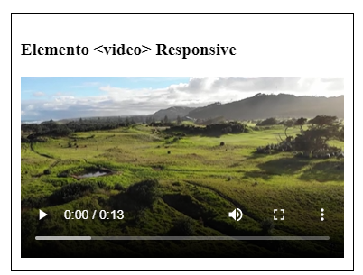
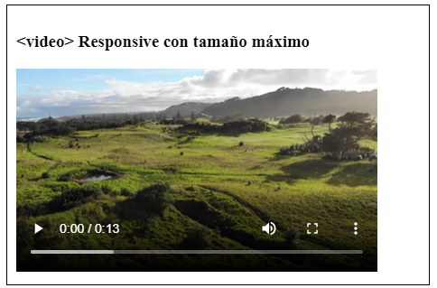

# **Inserción de vídeo en HTML5**

Tabla de contenidos

- [6. Elemento `<video>` en HTML5](#6-elemento-video-en-html5)
  - [6.1. Tipos MIME](#61-tipos-mime)
  - [6.2. Inserción de videos responsive](#62-inserción-de-videos-responsive)
  - [6.3. Inserción de videos responsive con tamaño máximo.](#63-inserción-de-videos-responsive-con-tamaño-máximo)
  - [6.4. Videos Responsive con Bootstrap](#64-videos-responsive-con-bootstrap)

En la sección anterior hemos estudiado los distintos formatos de los vídeos. Además, hemos visto algunos bancos de vídeos gratuitos y hemos convertido un vídeo en los distintos formatos habituales en la web: ***MP4***, ***OGG*** y ***WebM***.

En esta sección vamos a estudiar con detalle la inserción de vídeo en una página web, sin utilizar complementos ni reproductores externos. Para ello vamos a utilizar la etiqueta de HTML5 `<video>`.

# 6. Elemento `<video>` en HTML5

El elemento `<video>` dispone de varios atributos que nos permiten establecer sus diferentes valores de comportamiento.

-   **Width y height,** definen las dimensiones del reproductor de vídeo.
-   **Src**, indica la fuente del vídeo. Este atributo puede ser reemplazado por el elemento <source> y su propio atributo src para declarar varias fuentes con diferentes formatos. En el siguiente ejemplo el navegador leerá la etiqueta <source> y decidirá qué archivo reproducir de acuerdo a los formatos que soporte.

```html
<video id="medio" width="700" height="350" controls>
     <source src="video.mp4">
     <source src="video.ogv">
</video>
```


> [Ejemplo de videos (Codepen)](https://codepen.io/sergio-rey-personal/pen/PoZdZRY)

-   **Controls**, muestra los controles de vídeo que nos ofrece el navegador. Cuando se incluye el atributo el navegador activará su propia interface de control del vídeo. De esta forma el usuario podrá reproducir el vídeo, pausarlo, etc.
-   **Autoplay**, al incluir este atributo, el navegador comienza a reproducir el vídeo automáticamente.
-   **Loop**, al incluir este atributo, el navegador reproduce nuevamente el vídeo cuando llega a su final.
-   **Poster**, provee una imagen que será mostrada mientras el usuario espera a que cargue el vídeo.
-   **Preload**, puede recibir tres valores:
    -   **none**: el vídeo no se cachea.
    -   **metadata**: recomienda al navegador que capture información acerca de la fuente (dimensión, duración, etc.).
    -   **auto**: descarga del archivo lo más pronto posible.

```html
<video id="reproductor" width="700" height="350" preload controls loop poster="portada.jpg">
    <source src="video.mp4">
    <source src="video.ogv">
</video>
```

## 6.1. Tipos MIME

Conviene especificar el contenido de un vídeo para que el navegador sepa identificar el tipo de formatos de nuestros archivos y sepa cómo manejarlos. En el siguiente ejemplo el navegador elegirá solamente un vídeo. Al especificar el atributo type (no obligatorio), permitimos que el navegador conozca el tipo MIME y los tipos de codecs que debe utilizar antes de descargar el vídeo. Si no indicamos dicho atributo, el navegador intentará averiguar, mediante prueba y error, cuál es el tipo adecuado.

```html
 <video>
      <source src="video.webm" type='video/webm; codecs="vp8, vorbis"' />
       <source src="video.ogg" type='video/ogg; codecs="theora, vorbis"' />
       <source src="video.mp4" type="video/mp4">
       
       Su navegador no soporta contenido multimedia.
</video>
```

## 6.2. Inserción de videos responsive

Podemos hacer que nuestros vídeos sean responsive mediante la propiedad `width` si le asignamos un valor de 100%, con lo que el video se autoescalará.

```css
video {
  width: 100%;
  height: auto;
}
```



## 6.3. Inserción de videos responsive con tamaño máximo.

Usando la propiedad `.max-width` a 100%, el vídeo se escalará a un tamaño menor del propio del vídeo, pero no crecerá jamas a un tamaño mayor.

```css
video {
  max-width: 100%;
  height: auto;
}
```


## 6.4. Videos Responsive con Bootstrap

Crear videos inscrustados responsivos mediante bootstrap basados en el acho del padre creadn una relación intrinseca que se escala a cualquier dispositivo

Las reglas se aplican directamente a los elementos `<iframe>`, `<embed>`, `<video>` y `<object>`; opcionalmente, use una clase descendiente explícita `.embed-responsive-item` cuando desee hacer coincidir el estilo con otros atributos.

```html
<div class="embed-responsive embed-responsive-16by9">
  <iframe class="embed-responsive-item" src="https://www.youtube.com/embed/zpOULjyy-n8?rel=0" allowfullscreen></iframe>
</div>
```

Los ratios de dimensionamiento también pueden ser ajustados: 

```html
<!-- 21:9 aspect ratio -->
<div class="embed-responsive embed-responsive-21by9">
  <iframe class="embed-responsive-item" src="..."></iframe>
</div>

<!-- 16:9 aspect ratio -->
<div class="embed-responsive embed-responsive-16by9">
  <iframe class="embed-responsive-item" src="..."></iframe>
</div>

<!-- 4:3 aspect ratio -->
<div class="embed-responsive embed-responsive-4by3">
  <iframe class="embed-responsive-item" src="..."></iframe>
</div>

<!-- 1:1 aspect ratio -->
<div class="embed-responsive embed-responsive-1by1">
  <iframe class="embed-responsive-item" src="..."></iframe>
</div>
```