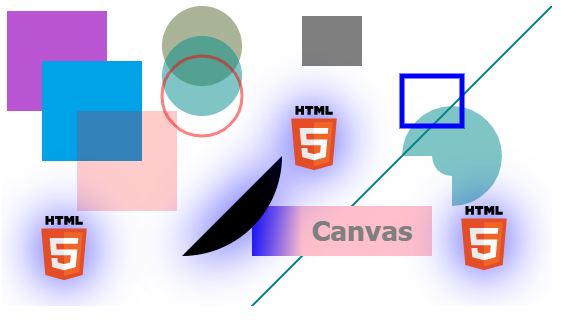

# 12. **Elemento Canvas en HTML5**

Tabla de contenidos

- [12. **Elemento Canvas en HTML5**](#12-elemento-canvas-en-html5)
	- [12.1. Pasos para crear un Canvas:](#121-pasos-para-crear-un-canvas)
	- [12.2. Formas básicas en Canvas](#122-formas-básicas-en-canvas)
		- [12.2.1. Rectángulos](#1221-rectángulos)
		- [12.2.2. Líneas](#1222-líneas)
		- [12.2.3. Arcos](#1223-arcos)
		- [12.2.4. Texto](#1224-texto)
		- [12.2.5. Imágenes](#1225-imágenes)


*En la unidad 4 vimos cómo hacer [transformaciones](https://github.com/Sergio-Rey-Personal/DIW/blob/master/UD04_CSS3_Avanzado_y_Preprocesadores_CSS3/UD04_06_TransformacionesCSS.md) y [transiciones](https://github.com/Sergio-Rey-Personal/DIW/blob/master/UD04_CSS3_Avanzado_y_Preprocesadores_CSS3/UD04_05_TransicionesCSS.md) sobre los elementos de nuestra página web. De esta forma conseguíamos proporcionar a los elementos un efecto de animación sobre algunas propiedades básicas de CSS. Además, en esta unidad también hemos visto cómo utilizar la propiedad animation de CSS para crear animaciones concatenadas.*

En este apartado vamos a seguir viendo cómo crear animaciones, pero en esta ocasión veremos el elemento `<canvas>`. Este elemento nos permite pintar gráficos, crear animaciones y desarrollar videojuegos mediante un API de Javascript. 

Lo primero que tenemos que hacer para trabajar con Canvas es crear un lienzo y, a partir de ese lienzo, incluir elementos y modificarlos. Veamos los pasos a seguir.

## 12.1. Pasos para crear un Canvas:

Para utilizar Canvas haremos lo siguiente:

**1) Crearemos un lienzo (espacio rectangular vacío) en el que serán mostrados todos los elementos:**

```html
<canvas id="lienzo" width="500" height="300">
     El navegador no soporta canvas
</canvas>
```

**2) Accedemos al elemento** `**<canvas>**` **desde Javascript:**

Primero, accedemos al objeto DOM del elemento, normalmente, a través del método getElementById, y posteriormente, utilizamos el método getContext para obtener el contexto de dibujo, sobre el cual, se puede dibujar. 

```javascript
var ctx=null, canvas=null;
function iniciar()
{
      canvas=document.getElementById('lienzo');
      ctx=canvas.getContext('2d');
}
window.addEventListener("load", iniciar, false);
```

En el ejemplo anterior, guardamos una referencia al elemento `<canvas>` en la variable canvas y el contexto de dibujo lo creamos utilizando `getContext('2d')`. Con esto obtenemos un contexto para dibujar en 2 dimensiones. 

**3) Dibujar formas en el lienzo**:

A continuación, podemos empezar a crear formas y realizar manipulaciones según las coordenadas concretas del contexto. Veamos las formas básicas que podemos crear en nuestro lienzo.

## 12.2. Formas básicas en Canvas

### 12.2.1. Rectángulos

La función `fillRect(x, y, width,height)` nos permite dibujar un rectángulo 'relleno' y la función `strokeRect(x, y,width, height)` un rectángulo con sólo su contorno. Mediante `lineWidth` especificamos el ancho de su contorno.

Se puede establecer el color mediante las propiedades `fillStyle` y `strokeStyle`. Es posible usar ***rgb***, ***rgba***, un ***código hexadecimal*** o la ***palabra clave de un color***.

```javascript
ctx.fillStyle = "rgba(0, 0, 0, 0.5)";
ctx.fillRect(100, 10, 60, 50);
ctx.lineWidth = 5
ctx.strokeStyle = "red";
ctx.strokeRect(200, 70, 60, 50);
```

Mediante la función `clearRect(x, y, width, height)` podemos borrar cualquier elemento que haya sido dibujado en el Canvas dentro de un área.

```javascript
ctx.clearRect(210, 20, 25, 25);
```

### 12.2.2. Líneas

Para indicar que queremos dibujar una línea lo primero que debemos hacer es llamar a la función `beginPath()`.

A continuación llamaremos a `moveTo(x, y)` para movernos a la posición donde nuestra línea comenzará. Y a l`ineTo(x, y)` para 'dibujar' la línea. Para hacerla visible utilizaremos la función `stroke()`.

Podemos especificar el ancho y el color de la línea con las propiedades `lineWidth` y `strokeStyle`.

```javascript
ctx.beginPath();
ctx.moveTo(5, 5);
ctx.lineTo(5, 295);
ctx.moveTo(295, 5);
ctx.lineTo(295, 295);
ctx.lineWidth = 1;
ctx.strokeStyle = "#CC0000";
ctx.stroke();
```

### 12.2.3. Arcos

Para indicar que vamos a dibujar un arco llamaremos inicialmente a la función `beginPath()`. Dibujaremos un arco o un círculo con la función `arc(x, y, radio, angIni, angFin, sentidoAntihorario)`. ***X*** e ***Y*** indican el centro del círculo, y los ángulos han de indicarse en radianes. El arco no será visible hasta llamar a `fill()` o a `stroke()`.

```javascript
ctx.beginPath();
// 2*Math.PI es la manera corta de expresar 360 grados
// en radianes.
// var radianes = (Math.PI / 180) * grados;
ctx.arc(150, 150, 50, 0, 2*Math.PI);
ctx.lineWith = 10;
ctx.strokeStyle = "yellow";
ctx.stroke();
```

### 12.2.4. Texto

A través de la función `fillText(texto, x, y)` podemos dibujar texto dentro del Canvas. Podemos dar formato al texto estableciendo previamente las propiedades `font`, `textAlign` y `fillStyle`.

```javascript
ctx.font = 'Bold 20px Tahoma';
ctx.textAlign = 'center';
ctx.fillStyle = 'black';
ctx.fillText('ENIUN', 50, 50);
```

### 12.2.5. Imágenes

Para añadir una imagen lo primero que tenemos que hacer es crear un objeto Image y establecer su propiedad `src`.
Con la función `drawImage(objImg, x, y)` añadiremos la imagen al Canvas.

```javascript
var img = new Image();
img.src = 'img/eniun.png';
img.onload = function(){
   ctx.drawImage(img, 10, 10);
};
```

Si ejecutamos el método `.drawImage()` sin llamar al evento `.onload` puede que no se ejecute correctamente si todavía no se ha cargado la imagen. Por este motivo se utiliza el evento `.onload`.

Más información:

-   [HTML5 Canvas reference](https://www.w3schools.com/tags/ref_canvas.asp)
-   [HTML5 Canvas Cheat Sheet](https://simon.html5.org/dump/html5-canvas-cheat-sheet.html)

Ejemplo con todos los elementos estudiados:

```html
    <canvas id="miCanvas" width="550" height="300">
	Tu navegador no soporta canvas.
</canvas>
```

```javascript
var ctx=null, canvas=null;
function iniciar(){ /*Canvas con los elementos vistos en clase*/
	var myCanvas = document.getElementById("miCanvas");
    var context = myCanvas.getContext("2d");  
    
	//Cuadrados
	context.fillStyle = "rgb(186,85,211)";
	context.fillRect(5, 5, 100, 100);
	context.fillStyle = "rgb(0, 162, 232)";
	context.fillRect(40, 55, 100, 100);
	context.fillStyle = "rgba(255, 0, 0, 0.2)";
    context.fillRect(75, 105, 100, 100); 
    
	//Circulo
	context.beginPath();
	context.fillStyle = "rgba(85,107,47, 0.5)";
	context.arc(200, 40, 40, 0, 2 * Math.PI, true);
	context.fill();
	context.beginPath();
	context.fillStyle = "rgba(0,139,139, 0.5)";
	context.arc(200, 70, 40, 0, 2 * Math.PI, true);
    context.fill();
    
	//Contorno Círculo
	context.beginPath();
	context.strokeStyle = "rgba(255, 0, 0, 0.5)";
	context.arc(200, 90, 40, 0, 2 * Math.PI, true);
	context.lineWidth = 3;
    context.stroke();
    
	//Línea
	context.beginPath();
	context.moveTo(550, 0);
	context.lineTo(0, 550);
	context.lineWidth = 2;
	context.strokeStyle = "#008080";
    context.stroke();
    
	//Imagen
	var img = new Image();
	img.src = 'images/html5-logo-small.png';
	img.onload = function(){
        context.drawImage(img, 450, 200);
        context.drawImage(img, 30, 210);
        context.drawImage(img, 280, 100);
    };	
    
	//Arcos
    context.beginPath();
    context.arc(450,150,50,Math.PI,Math.PI*0.5,false);
    context.arc(450,150,20,Math.PI*0.5,Math.PI*1,false);
    context.closePath()
    context.fill();
    context.beginPath();
    
	//Rectángulo
	context.fillStyle = 'rgba(0, 0, 0, 0.5)';
	context.fillRect(300, 10, 60, 50);
	context.lineWidth = 5;
	context.strokeStyle = 'blue';
	context.strokeRect(400, 70, 60, 50);
	//Gradiente lineal
	var grad = context.createLinearGradient(0,0,300,0);
	grad.addColorStop(0.2, 'red');
	grad.addColorStop(0.8, 'blue');
	grad.addColorStop(1, 'pink');
	context.fillStyle = grad;
	context.fillRect(250, 200, 180, 50);
	//Texto
	context.font = 'Bold 28px Tahoma';
	context.textAlign = 'center';
	context.fillStyle = 'grey';
	context.fillText('Canvas', 360, 235);
	//Sombras y arcos
	context.beginPath();
	context.shadowBlur=50;
	context.shadowColor="blue";
	context.fillStyle="black";
	context.arc(180,150,100,0,0.5*Math.PI);
	context.fill();
}
window.addEventListener("load", iniciar, false);
```

Obteniendo el resultado : 



> [Ejemplo de uso de Canvas en HTML5 (Codepen)](https://codepen.io/sergio-rey-personal/pen/wvMEEEB)