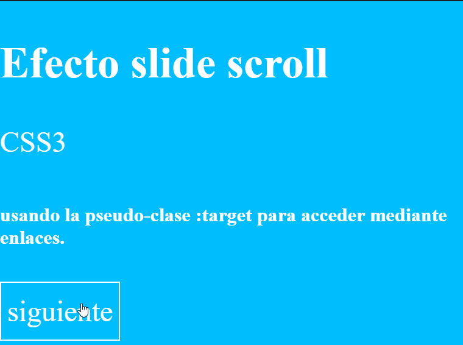

# 14. **Efectos avanzados en CSS3**

Para finalizar, veamos 4 efectos que seguramente habrás visto en alguna web y que transmiten sensación de profesionalidad en tu web 

## 14.1. Efecto Parallax

El parallax scrolling es un principio de diseño propio de la animación que aprovecha los efectos de la percepción humana con el fin de crear una ilusión de profundidad espacial con medios de representación bidimensionales. Para entender mejor el término puede ser útil viajar a sus orígenes.

La paralaje (del griego parállaxis para cambio, diferencia) define a un fenómeno de la percepción por el cual la posición de un objeto en el campo visual cambia en relación con el punto desde donde se observa. Esto puede entenderse con un juego tan básico como simple:

1. Alza un brazo estirado a la altura del rostro con el pulgar hacia arriba
2. Abre y cierra alternativamente el ojo derecho y el izquierdo

Mientras que en el fondo no se percibe ningún movimiento, en cambio parece que el pulgar salte de una posición a la otra. La razón de que se vea así radica en el espacio entre los ojos, el cual desencadena una modificación del punto de observación cuando se cierra uno de los dos.

Para conseguriir un efecto sencillo de parallax se utiliza Para crear un efecto sencillo de parallax se utiliza: `background-attachment: fixed;`

[Veamos un ejemplo también disponible en Codepen](https://codepen.io/sergio-rey-personal/pen/VweGEmo)

```html
<div class="image1">
	<h1>PARALLAX</h1>
	<h2>EFECTO PARALLAX CON MULTIPLES FONDOS</h2>
</div>

<section class="content">
	<p>Lorem ipsum dolor sit amet, consectetur adipiscing elit. Donec eu posuere dui. Phasellus ultrices rutrum viverra. Duis rhoncus elementum facilisis. Donec venenatis diam eu venenatis venenatis. Duis at erat ac nisl adipiscing varius. Integer tincidunt neque egestas quam sodales tempus. Nulla tristique nisi facilisis congue pellentesque. Sed orci elit, dignissim accumsan nibh ut, vulputate fermentum est. Curabitur in ipsum viverra, interdum diam vel, aliquet lorem. Pellentesque lobortis, mauris pellentesque faucibus pretium, nulla nisi eleifend justo, rutrum pulvinar neque magna eget felis.</p>
</section>

<div class="image2">
	<h2>CREADO SOLO CON CSS</h2>
</div>

<section class="content">
	<p>Suspendisse porta non sem eu eleifend. Pellentesque habitant morbi tristique senectus et netus et malesuada fames ac turpis egestas. Etiam id augue quis nibh egestas ultrices eget et justo. Pellentesque a tempor quam. Nam blandit turpis nisi, at sodales quam convallis vel. Aliquam rhoncus, massa ut gravida auctor, ipsum odio consequat orci, in laoreet felis nulla ut erat. Phasellus venenatis velit ut magna imperdiet hendrerit. Nullam dui turpis, venenatis sit amet eleifend non, pulvinar eu quam. Class aptent taciti sociosqu ad litora torquent per conubia nostra, per inceptos himenaeos.</p>
</section>
<div class="image3">	
  <h2>¿TE HA GUSTADO?</h2>
</div>
```

```css
/* Estilos generales */
body {
	margin:0;
	padding:0;
	border:0;
	font-family: 'Black Ops One', cursive;
}


h1 {
	color: #fff;
	font-size: 80px;
	text-align:center;
	font-weight: bold;
	margin: 0 auto;
	width: 800px;
	position: fixed;
	top: 40%;
	left: 50%;
	margin-top: -20%;
	margin-left: -400px;
	opacity:0.8;
}

h2{
	color: #fff;
	font-size: 55px;
	text-align:center;
	margin: 0 auto;
	width: 800px;
	position: absolute;
	top: 50%;
	left: 50%;
	margin-left: -400px;
	opacity:0.8;


}

.content {
	width: 100%;
	max-width: 960px;
	margin: 0 auto;
	box-sizing: border-box;
	-moz-box-sizing: border-box;
	position: relative;
	background: #FFF;
	z-index:2;

}
p {
	font-family: Georgia, Times, "Times New Roman", serif;
	font-size: 22px;
	line-height: 40px;
	margin: 30px 0;
}


a{
	color: #fff;
	text-decoration:none;
	opacity:0.8;

}

/* Inicio del parallax */
.image1 {
	position:relative;
	background: url('https://github.com/Sergio-Rey-Personal/DIW/blob/master/img/img1.jpg?raw=true') no-repeat fixed;
	background-position: center center;
	-webkit-background-size: cover;
	-moz-background-size: cover;
	-o-background-size: cover;
	background-size: cover;
	min-height: 500px;

	
}

.image2 {
	position:relative;
	background: url('https://github.com/Sergio-Rey-Personal/DIW/blob/master/img/img2.jpg?raw=true') no-repeat fixed;
	background-position: center center;
	-webkit-background-size: cover;
	-moz-background-size: cover;
	-o-background-size: cover;
	background-size: cover;
	min-height: 500px;

	
}
.image3 {
	position:relative;
	background: url('https://github.com/Sergio-Rey-Personal/DIW/blob/master/img/img3.jpg?raw=true') no-repeat fixed;
	background-position: center center;
	-webkit-background-size: cover;
	-moz-background-size: cover;
	-o-background-size: cover;
	background-size: cover;
	min-height: 500px;
	
}

/* Fin del parallax */
```

Resultado: 


## 14.2. Scrolling

Otro efecto interesante es el de slide scroll, el cual lo podemos conseguir mediante la pseudo-clase: target accediendo mediante enlaces.

Veamos un ejemplo: 

```html
<div id="contenedor">
  <h2>Efecto slide scroll</h2>
  CSS3
  <h6>usando la pseudo-clase :target para acceder mediante enlaces.</h6>
  <a href="#contenedor1">siguiente</a>		 
</div>

<div id="contenedor1" class="efecto">
  <h2>1º contenedor</h2>
  <a href="#contenedor2">siguiente</a>	 
</div>
  
<div id="contenedor2" class="efecto">
  <h2>2º contenedor</h2>
  <a href="#contenedor3">siguiente</a>		 
</div>
  
<div id="contenedor3" class="efecto">
  <h2>3º contenedor</h2>
  <a href="#contenedor">siguiente</a>
</div>
```

```css
@import url(http://fonts.googleapis.com/css?family=Open+Sans);
html
{      
    width:100%;
    height:100%;       
}

a
{
	color: white;
	background: #00bdff;
	padding: 20px 10px 20px 10px;
	border:2px solid white;
	text-decoration: none;
 }

body
{
    color:white;
    font-family: Open Sans;
    margin:0;
    width:100%;
    height:100%;
    background-color:#00bdff;
}

.efecto
{
    overflow:hidden;
    position:relative;
    font-size:3em;
    width:100%;
    height:0;
    -webkit-transition: all 500ms ease-out;
    -moz-transition:all 500ms ease-out;
    transition: all 500ms ease-out; 
}

#contenedor
{
    position:absolute;
    width:100%;
    height:100%;
    font-size:3em;
    overflow:hidden;
}
 
#contenedor1
{
    background-color:white;
    color:#00bdff;  
}

#contenedor2
{
    background-color:#00bdff;
    color:white;  
}

#contenedor3
{
    background-color:white;
    color:#00bdff;  
}

.efecto:target
{
    height:100%;
}
```

Con el siguiente resultado: 



> [Ejemplo de efecto de Scrollig en Codepen](https://codepen.io/sergio-rey-personal/pen/QWyVZqM)

## 14.3. Efectos con textos

Veamos a continuación algunos efectos con textos que pueden enriquecer nuestra web. Recuerda que debes hacer un uso mesurado de todo estos efectos.

```html
<!-- Efecto Blur -->
<div id="box">
  <span class="txt">I</span>
  <span class="♥">♥</span>
  <span class="txt" contenteditable spellcheck="false">BLUR</span>
</div>
<!-- Fin Efecto Blur -->

<!-- Efecto Neon -->
<div id="container">
    <p><a href="">RED VELVET</a></p>
</div>
<!-- Fin Efecto Neon -->

<!-- Animación fondo -->
<div class="fondo">
  <p>Spice up your type with CSS
      <span>Animated text fill</span>
    &mdash; no JavaScript required &mdash;
  </p>
</div>
<!-- Fin Animación fondo -->
```

```css


body {
  margin: 0;
  width: 100%;
  height: 100%;
  text-align: center;
  font-family: "Lucida Grande", Lucida, Verdana, sans-serif;
  background-color: hsl(210,50%,20%);
  background: url(bg.png), linear-gradient(90deg, hsl(210,40%,12%), hsl(210,40%,20%), hsl(210,40%,12%));
  }

.txt[contenteditable] {
   outline: none;
}

/* EFECTO BLUR */
#box {
  padding: 50px;
  font-size: 5em;
  font-weight: bold;
}

.txt {
  color: hsla(0,0%,0%,0);
  /* color | offset-x | offset-y | blur-radius */
  text-shadow: #fff 0 0 30px;
  /* nombre de la propiedad | duración | función | retardo */
  transition: text-shadow 2s cubic-bezier(0, 1, 0, 1);
  }

#box:hover .txt {
  text-shadow: #fff 0 0 1px;
  transition: text-shadow 1s cubic-bezier(0, 0.75, 0, 1);
}

.♥ {
  margin: 0 10px;
  color: red;
  }

/* FIN EFECTO BLUR */

/* EFECTO NEON */

p{
  text-align:center;
  font-size:7em;
  margin:20px 0 20px 0;
}

a{
  text-decoration:none;
  -webkit-transition: all 0.5s;
  -moz-transition: all 0.5s;
  transition: all 0.5s;
}

p:nth-child(1) a{
  color:#FF1177;
  font-family:Monoton;
}
p:nth-child(1) a:hover{
  -webkit-animation: neon1 1.5s ease-in-out infinite alternate;
  -moz-animation: neon1 1.5s ease-in-out infinite alternate;
  animation: neon1 1.5s ease-in-out infinite alternate;
}

@keyframes neon1 {
  from {
  /* color | offset-x | offset-y | blur-radius */
    text-shadow: 0 0 10px #fff,
               0 0 20px  #fff,
               0 0 30px  #fff,
               0 0 40px  #FF1177,
               0 0 70px  #FF1177,
               0 0 80px  #FF1177,
               0 0 100px #FF1177,
               0 0 150px #FF1177;
  }
  to {
    text-shadow: 0 0 5px #fff,
               0 0 10px #fff,
               0 0 15px #fff,
               0 0 20px #FF1177,
               0 0 35px #FF1177,
               0 0 40px #FF1177,
               0 0 50px #FF1177,
               0 0 75px #FF1177;
  }
}

/* FIN EFECTO NEON */

/* EFECTO ANIMACION FONDO */

.fondo { width: 100%; margin-left: 200px; }

.fondo p {
  font-size: 1em;
  text-transform: uppercase;
  letter-spacing: .8em;
  display: inline-block;
  border: 4px double rgba(255, 255, 255, 0.25);
  border-width: 4px 0;
  padding: 1.5em 0em;
  width: 40em;
  margin: 0 0 0 -25em;
}
.fondo p span { font: 700 3.5em/1 "Oswald", sans-serif;
  letter-spacing: 0;
  padding: .25em 0 .325em;
  display: block;
  margin: 0 auto;
  text-shadow: 0 0 80px rgba(255,255,255,.5);

  /* Clip Background Image */

  background-size: 50px 50px;
  background-color: #c16;
  background-image: -webkit-linear-gradient(-45deg, rgba(255, 255, 255, .2) 25%, transparent 25%,
                    transparent 50%, rgba(255, 255, 255, .2) 50%, rgba(255, 255, 255, .2) 75%,
                    transparent 75%, transparent);
  background-image: -moz-linear-gradient(-45deg, rgba(255, 255, 255, .2) 25%, transparent 25%,
                    transparent 50%, rgba(255, 255, 255, .2) 50%, rgba(255, 255, 255, .2) 75%,
                    transparent 75%, transparent);
  background-image: linear-gradient(135deg, rgba(255, 255, 255, .2) 25%, transparent 25%,
                    transparent 50%, rgba(255, 255, 255, .2) 50%, rgba(255, 255, 255, .2) 75%,
                    transparent 75%, transparent);
  -webkit-background-clip: text;

/* Animate Background Image */

  -webkit-text-fill-color: transparent;
  -webkit-animation: efecto 10s linear infinite;

/* Activate hardware acceleration for smoother animations */

  -webkit-transform: translate3d(0,0,0);
  -webkit-backface-visibility: hidden;
}

/* Animate Background Image */

@-webkit-keyframes efecto {
  0% { background-position: 0% 50%; }
  100% { background-position: 100% 50%; }
}
/* FIN EFECTO ANIMACION FONDO */
```

Con el siguiente resultado : 

[!Efectos de animación con textos](img/Efecto-textos.gif)

> [Ejemplo de efectos con texto en Codepen](https://codepen.io/sergio-rey-personal/pen/QWyVZQq)

## 14.4. Efectos diversos.

Por último, veamos diversos efectos que puedes aplicar a tus tarjetas `<div>` para propiciar dinamismo a tus webs:

```html
<div id="efecto1">
  <ul class="demo effect1">
    <li>
      <h2>Efecto 1</h2>
      <p>Lorem ipsum dolor sit amet, consectetur adipiscing elit, sed do eiusmod tempor incididunt ut labore et dolore magna aliqua. Ut enim ad minim veniam, quis nost.</p>
    </li>
    <li></li>
  </ul>
</div>

<div id="efecto2">
  <ul class="demo effect2">
    <li>
      <h2 class="zero">Efecto 2</h2>
      <p class="zero">Lorem ipsum dolor sit amet.</p>
    </li>
    <li></li>
  </ul>
</div>

<div id="efecto3">
  <ul class="demo">
    <li>
      <figure>
        
        <figcaption>
          <h2>Efecto 3</h2>
          <p>Lorem ipsum dolor sit amet, consectetur adipiscing elit, sed do eiusmod tempor incididunt ut labore et dolore magna aliqua. Ut enim ad minim veniam, quis nost.</p>
        </figcaption>
      </figure>
    </li>
  </ul>
</div>
```

```css
.demo {
  position: relative;
  width: 260px;
  height: 200px;
  overflow: hidden;
  float: left;
  margin-right: 20px;
  background-color: rgba(26, 76, 110, 0.5);
}
.demo p,
.demo h2 {
  color: #fff;
  padding: 10px;
  left: -20px;
  top: 20px;
  position: relative;
}
.demo p {
  font-family: "Lato";
  font-size: 12px;
  line-height: 18px;
  margin: 0;
}
.demo h2 {
  font-family: "Lato";
  font-size: 20px;
  line-height: 24px;
  margin: 0;
}

li {
  list-style: none;
}

/* EFECTO 1 */
.effect1 img {
  position: absolute;
  margin: 60px 0px;
  right: 0;
  top: 0;
  cursor: pointer;
  -webkit-transition: top 0.4s ease-in-out, right 0.4s ease-in-out;
  -moz-transition: top 0.4s ease-in-out, right 0.4s ease-in-out;
  -o-transition: top 0.4s ease-in-out, right 0.4s ease-in-out;
  transition: top 0.4s ease-in-out, right 0.4s ease-in-out;
}
.effect1 img.top:hover {
  top: -230px;
  right: -330px;
  padding-bottom: 200px;
  padding-left: 300px;
}

/* EFECTO 2 */
.effect2 img {
  position: absolute;
  left: 0px;
  bottom: 0;
  cursor: pointer;
  margin: -12px 0;
  -webkit-transition: bottom 0.3s ease-in-out;
  -moz-transition: bottom 0.3s ease-in-out;
  -o-transition: bottom 0.3s ease-in-out;
  transition: bottom 0.3s ease-in-out;
}
.effect2 img.top:hover {
  bottom: -96px;
  padding-top: 100px;
}

/* EFECTO 3 */
div:nth-of-type(3) .demo {
  background-color: transparent;
}

figure {
  margin: 0;
  padding: 0;
  position: relative;
  cursor: pointer;
  margin-left: -40px;
}

figure img {
  display: block;
  position: relative;
  z-index: 10;
  margin: 0;
}

figure h2 {
  font-family: "Lato";
  color: #fff;
  font-size: 20px;
  text-align: left;
}

.demo figure h2 {
  left: 0;
}

figure p {
  display: block;
  font-family: "Lato";
  font-size: 12px;
  line-height: 18px;
  color: #fff;
  text-align: left;
}

.demo figure p {
  left: 0;
}

figure figcaption {
  top: 0;
  left: 0;
  height: 100%;
  text-align: center;
  display: block;
  position: absolute;
  z-index: 5;
  -webkit-box-sizing: border-box;
  -moz-box-sizing: border-box;
  box-sizing: border-box;
  background-color: rgba(26, 76, 110, 0.5);
  backface-visibility: hidden;
  -webkit-transform: rotateY(-180deg);
  -moz-transform: rotateY(-180deg);
  transform: rotateY(-180deg);
  -webkit-transition: all 0.5s;
  -moz-transition: all 0.5s;
  transition: all 0.5s;
}
.demo figure img {
  backface-visibility: hidden;
  -webkit-transition: all 0.5s;
  -moz-transition: all 0.5s;
  transition: all 0.5s;
}

.demo figure:hover img,
figure.hover img {
  -webkit-transform: rotateY(180deg);
  -moz-transform: rotateY(180deg);
  transform: rotateY(180deg);
}
.demo figure:hover figcaption,
figure.hover figcaption {
  -webkit-transform: rotateY(0);
  -moz-transform: rotateY(0);
  transform: rotateY(0);
}
```