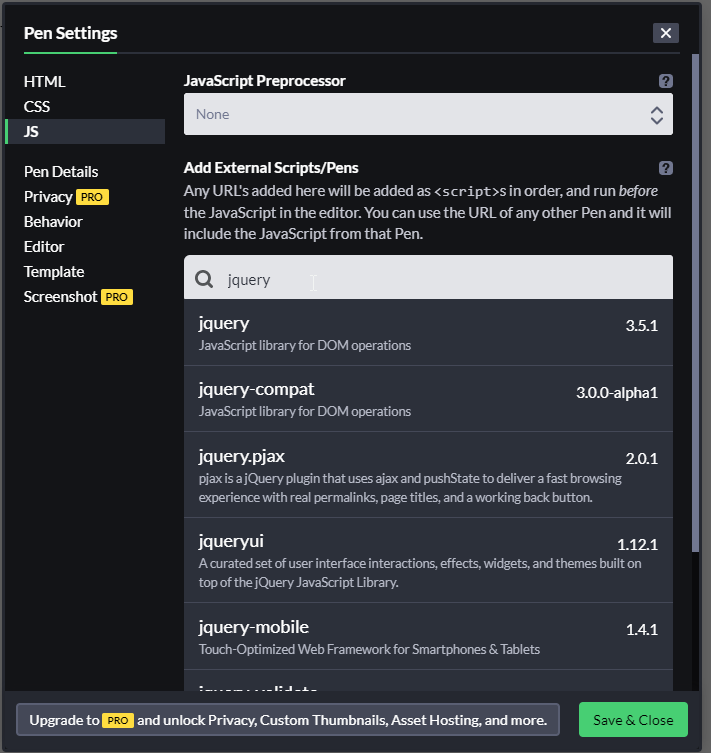
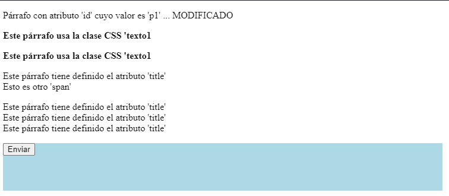
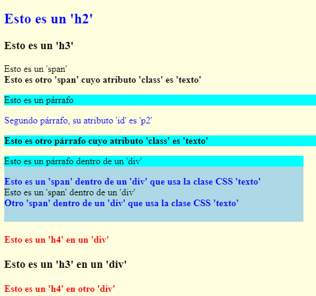

# 2. **Introducción a JQuery**

Tabla de contenidos

- [2. **Introducción a JQuery**](#2-introducción-a-jquery)
  - [2.1. Descarga e instalación](#21-descarga-e-instalación)
  - [2.2. Controlar la carga de la página](#22-controlar-la-carga-de-la-página)
  - [2.2. Llamadas a funciones](#22-llamadas-a-funciones)
  - [2.3. Acceder a elementos de la página](#23-acceder-a-elementos-de-la-página)

JQuery es una completa librería creada en **lenguaje JavaScript** muy utilizada en la creación de páginas web al ser compatible con los navegadores web más utilizados, que permitir acceder y controlar de forma sencilla los diferentes elementos de las mismas.


## 2.1. Descarga e instalación

Para descargar JQuery haz clic en [este enlace](http://jquery.com/) hacia su web oficial, y después en Download JQuery para bajar la última versión disponible.


Encontrarás dos opciones de descarga: 
- Download the compressed, production (versión comprimida en formato gzip, para subirla a nuestro servidor web cuando tengamos una página web terminada)
- Download the uncompressed, development (para utilizarla mientras se está desarrollando un proyecto).

Descargaremos la primera de ellas (dependiendo del navegador web que utilices si haces clic con el botón izquierdo se mostrará su código JavaScript: en tal caso haz clic con el botón derecho y selecciona la opción para guardar el archivo en disco) y después moveremos el archivo a nuestro proyecto.

Al igual que vimos con Bootstrap, tenemos otras opciones como instalarla mediante los pquetes npm, Yam o Bower, e incluso utilizar la **version CDN**, que nos permite utilizar JQuery sin tener que descargar nada.

Para usar la version CDN, debes añadir su enlace en la cabecera

```html
 <head>
  <script src="https://ajax.googleapis.com/ajax/libs/jquery/3.5.1/jquery.min.js"></script>
</head> 
```

## 2.2. Controlar la carga de la página

Una de las primeras cosas a aprender sobre JQuery es cómo controlar en qué momento se ha terminado de cargar la página web: para ello se utiliza el **evento** `ready()`.

Al controlarlo o 'escucharlo' a través del selector `$(document)` dicho evento se producirá cuando se haya terminado de cargar el **DOM** (Document Object Model) del documento, mientras que si lo escuchamos a través del selector `$(window)` se producirá cuando además hayan terminado de cargarse completamente otros elementos (como por ejemplo el contenido de frames, imágenes, css, etc.).

Veamos a continuación un sencillo ejemplo en el que se muestra un mensaje tras haber sido cargada la página (realmente en este caso no notarás diferencia alguna con `$(window)` ya que no tiene apenas contenido descargable):

```html
<!DOCTYPE html>
<html lang="es">  
<head>
  <title>InformaticaPC | Primera página con JQuery</title>
  <meta http-equiv="Content-Type" content="text/html; charset=UTF-8" />

  <!-- Agregamos JQuery -->
  <script type="text/javascript" src="/lib/jquery.min.js"></script>
    <!-- Agregamos código en JQuery que muestre un mensaje tras cargarse la página -->
    <script type="text/javascript">
    $(document).ready(function()
    {
      alert("Se ha cargado el DOM del documento");
    });
  
    $(window).ready(function()
    {
      alert("Se ha cargado el DOM del documento y se ha descargado el resto de elementos (imágenes, etc.)");
    });
  </script>
</head>

<body>
  Primera prueba con JQuery
</body>

</html>
```

> [Ejemplo de uso de JQuery (Codepen)](https://codepen.io/sergio-rey-personal/pen/bGEOErm)

Más adelante explicaremos otros eventos disponibles.

> Nota: Recordar que para `Codepen`, se debe seleccionar dentro de `Settings > JS` la librería JQuery



## 2.2. Llamadas a funciones

Como hemos visto en el punto anterior, podemos definir una función dentro de un método, sin embargo en ocasiones resultará más conveniente crearlas aparte para favorecer tanto la legibilidad como la reutilización del código fuente:

```html
<!-- Agregamos código en JQuery que muestre un mensaje tras cargarse la página -->
<script type="text/javascript">

  $(document).ready( mensaje );

  function mensaje() {
    alert("Se ha cargado el DOM del documento");
  }

</script>
```

## 2.3. Acceder a elementos de la página

Una de las grandes ventajes de JQuery es su capacidad para permitirnos acceder de forma rápida y sencilla a los diferentes elementos de la página web.

Para ello dispone de una serie de **selectores** que nos permiten acceder a ellos a través de la clase CSS que utilizan, así como por su atributo `id` o cualquier otro tenga definido.

Veamos un ejemplo en el que utilizamos los métodos `text()` (usado tanto para obtener como para asignar texto a un contenedor) y `html()` (para obtener e insertar código HTML):


```html
<body>
  <p id="p1">Párrafo con atributo 'id' cuyo valor es 'p1'.</p>

  <p class="texto1">Este párrafo y el siguiente comparten la clase CSS (atributo 'class') es 'texto1'.</p>
  <p class="texto1">Este párrafo y el anterior comparte la clase CSS (atributo 'class') es 'texto1'.</p>

  <span title="titulo">Esto es un 'span' que tiene un atributo 'title'</span><br />
  <span>Esto es otro 'span'</span>
  <p />

  <span title="titulo3">Este 'span' tiene el atributo 'title' con valor 'titulo3'</span><br />
  <span title="titulo2">Este 'span' tiene el atributo 'title' con valor 'titulo2'</span><br />
  <span title="titulo1">Este 'span' tiene el atributo 'title' con valor 'titulo1'</span>

  <div id="div1">Esto es un 'div'</div>
</body>
```

```css
/* Aplicamos algunas propiedades CSS a los elementos */
p { width:740px; }
.texto1 { font-weight:bold; }
.texto2{ text-decoration:underline; }
.rojo { color:red; }
div { width:740px;height:80px;background-color:lightblue; }
```

```javascript
$(document).ready(function () {
  alert("Haz clic para acceder al párrafo cuyo atributo 'id' es 'p1'");

  // Observa que se pone almohadilla antes del id
  $("#p1").text("Párrafo con atributo 'id' cuyo valor es 'p1' ... MODIFICADO");

  alert("Haz clic para insertar un formulario HTML en el 'div'");

  $("#div1").html(
    "<form name='form1' action='#' method='post'><input type='button' name='boton1' id='boton1' value='Enviar' /></form>"
  );

  alert(
    "Haz clic para acceder a los elementos cuya clase CSS (atributo 'class') es 'texto'1"
  );

  // Observa que se pone punto antes del nombre de la clase.
  $(".texto1").text("Este párrafo usa la clase CSS 'texto1");

  alert(
    "Haz clic para acceder a los elementos que tienen el atributo 'title' con valor 'titulo3'"
  );

  // Observa que se pone el nombre del atributo entre corchetes junto con su valor
  $("[title = 'titulo3']").text(
    "Elemento con atributo 'title' con valor 'titulo3' MODIFICADO"
  );

  alert("Haz clic para acceder a los elementos que tienen el atributo 'title'");

  // Observa que se pone el nombre del atributo entre corchetes
  $("[title]").text("Este párrafo tiene definido el atributo 'title'");
});
```
y obtenemos el siguiente resultado: 



> [JQuery. Acceder a elementos de la página](https://codepen.io/sergio-rey-personal/pen/dyGwGmz)

También es posible acceder a través de los propios nombres de los elementos. Veamos otro ejemplo en el que además usamos también los métodos `append()` y `prepend()`, que nos permiten insertar texto antes o después del contenido existente en un elemento.

```html
<body>
  <span>Esto es un 'span'</span><br />
  <span class="texto">Esto es otro 'span' cuyo atributo 'class' es 'texto'</span><p />
  <p>Esto es un párrafo</p>
  <p class="texto">Esto es otro párrafo cuyo atributo 'class' es 'texto'</p>
  <div><p>Esto es un párrafo dentro de un 'div'</p></div>
</body>
```

```javascript
$(document).ready(function () {
  alert("Haz clic para acceder a todas las etiquetas HTML 'span'");
  // Observa que simplemente se pone el nombre de la etiqueta HTML
  $("span").prepend("MODIFICADO ... ");
  alert(
    "Haz clic para acceder sólo a las etiquetas HTML 'p' cuya clase CSS (atributo 'class') es 'texto'"
  );
  // Observa que simplemente se pone el nombre de la etiqueta HTML, seguido de punto y el nombre de la clase CSS
  $("p.texto").append("... MODIFICADO");
  alert(
    "Haz clic para acceder sólo a las etiquetas HTML 'p' que se encuentren dentro de un elemento 'div' "
  );
  // Fíjate en que escribimos el nombre del elemento HTML padre, y el del que deseamos acceder dentro de él
  $("div p").append("... HA SIDO MODIFICADO");
  alert("Haz clic para acceder al cuerpo de la página");
  $("body").html("<p>El contenido de la página ha sido modificado</p>");
});
```

> [Ejemplo de Acceder a elementos de la página (Codepen)](https://codepen.io/sergio-rey-personal/pen/wvMRMXR)

Aparte de los mencionados métodos que posibilitan insertar texto y código HTML tenemos también `before()` y `after()`, que permiten insertar contenido antes o después del elemento y en ambos casos fuera de él.

Así, si por ejemplo usas uno de dichos métodos para insertar contenido antes del que haya en un `<div>`, quedará 'flotando' en la página a no ser que lo envuelvas en alguna etiqueta HTML al definirlo.

Por último comentar que usando `not()` es posible seleccionar varios tipos de elementos a la vez, así como a todos aquellos que no contengan un determinado selector. Veamos una forma de hacerlo:

```html
<body>
  <h2>Esto es un 'h2'</h2>
  <h3>Esto es un 'h3'</h3>

  <span>Esto es un 'span'</span><br />
  <span class="texto">Esto es otro 'span' cuyo atributo 'class' es 'texto'</span><p />

  <p>Esto es un párrafo</p>
  <p id="p2">Segundo párrafo, su atributo 'id' es 'p2'</p>
  <p class="texto">Esto es otro párrafo cuyo atributo 'class' es 'texto'</p>

  <div id="div1">
    <p>Esto es un párrafo dentro de un 'div'</p>
    <span class="texto">Esto es un 'span' dentro de un 'div' que usa la clase CSS 'texto'</span><br />
    <span>Esto es un 'span' dentro de un 'div'</span><br />
    <span class="texto">Otro 'span' dentro de un 'div' que usa la clase CSS 'texto'</span>
  </div>

  <div><h4>Esto es un 'h4' en un 'div'</h4></div>
  <div><h3>Esto es un 'h3' en un 'div'</h3></div>
  <div><h4>Esto es un 'h4' en otro 'div'</h4></div>
</body>
```

```css
body { background-color:lightyellow; }
#div1 { height:110px;width:500px;background-color:lightblue; }
.texto { font-weight:bold; }
```

```javascript
$(document).ready(function()
                  {
  alert("Haz clic para seleccionar varios tipos de elementos definidos");

  $("h2,#p2,div span.texto").css("color", "blue");

  alert("Haz clic para los 'div' que contengan un 'h4'");

  $("div").has("h4").css("color", "red");

  alert("Haz clic para los 'div' que no contengan un 'h4'");

  $("p").not("#p2").css("background-color", "cyan");
});
```
con la siguiente salida: 



> [JQuery. Acceder a elementos de la página](https://codepen.io/sergio-rey-personal/pen/dyGwGqV)

Cuando usamos uno de estos selectores obtenemos realmente objetos JQuery. Existen otros tipos de ellos, pero los comentados son los utilizados con más frecuencia.