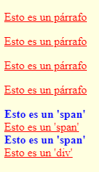

# 4. Trabajando estilos CSS con JQuery

Tabla de contenidos

- [4. Trabajando estilos CSS con JQuery](#4-trabajando-estilos-css-con-jquery)
  - [4.1. Trabajando directamente con los estilos CSS](#41-trabajando-directamente-con-los-estilos-css)
  - [4.2. Cambiar clase CSS](#42-cambiar-clase-css)
  - [4.3. Dimensiones](#43-dimensiones)
  - [4.4. Cargar otra hoja de estilos](#44-cargar-otra-hoja-de-estilos)

## 4.1. Trabajando directamente con los estilos CSS

jQuery incluye una manera útil de obtener y establecer propiedades CSS a los elementos.

```javascript
$('h1').css('fontSize'); // devuelve una cadena de caracteres como "19px"
$('h1').css('font-size'); // también funciona
```

> Las propiedades CSS que incluyen como separador un guión del medio, en JavaScript deben ser transformadas a su estilo ***CamelCase***. Por ejemplo, cuando se la utiliza como propiedad de un método, el estilo CSS `font-size` deberá ser expresado como `fontSize`. Sin embargo, esta regla no es aplicada cuando se pasa el nombre de la propiedad CSS al método `$(elem).css` --- en este caso, los dos formatos (en CamelCase o con el guión del medio) funcionarán.

```javascript
// establece una propiedad individual CSS
$('h1').css('fontSize', '100px');

// establece múltiples propiedades CSS
$('h1').css({ 'fontSize' : '100px', 'color' : 'red' });

// obtiene el valor del color del PRIMER elemento de la lista y lo almacena en una variable
var color = $(“li”).css(“color”);

// Modifica el ancho de una imagen, haciendo que sea 50px más ancha
$(“img”).css(“width”,”+=50”);
```

Notar que el estilo del argumento utilizado en la segunda línea del ejemplo --- es un objeto que contiene múltiples propiedades. Esta es una forma común de pasar múltiples argumentos a una función, y muchos métodos establecedores de la biblioteca aceptan objetos para fijar varias propiedades de una sola vez.

***Ejemplo***

```html
<!DOCTYPE html>
<html lang="es"> 
  <head>
    <title>Acceso a los elementos I</title>
    <meta http-equiv="Content-Type" content="text/html; charset=UTF-8" />

    <style type="text/css">
      p { color:blue;width:200px; }
    </style>

    <script type="text/javascript" src="lib/jquery.min.js"></script>

    <script type="text/javascript">

      $(document).ready(function()
      {
        alert("Haz clic para cambiar el estilo de los párrafos");

        // Observa que se pone almohadilla antes del id
        $("p").css( "color","yellow" );
        $("p").css( "background-color","red" );

        alert("Haz clic para cambiar el estilo de los párrafos");

        // En este caso modificamos varias propiedades CSS a la vez poniéndolas entre corchetes (realmente
        // estamos creando un array asociativo en JavaScript) y separándolas por coma.
        // Fíjate también en que de este modo no usamos el nombre de la propiedad CSS sino su
        // equivalente en lenguaje JavaScript (consulta el enlace que proporcionamos algo más abajo)
        $("p").css( {color : "white", backgroundColor : "black" } );
      });

    </script>
  </head>

  <body>
    <p>Esto es un párrafo</p>
    <p>Esto es otro párrafo</p>
    <p>Esto es un tercer párrafo</p>
  </body>
</html>
```

En este ejemplo podemos observar como podemos ir cambiando las propiedades de los elementos de la web durante la ejecución

> [Ejemplo de acceso a elementos en Codepen](https://codepen.io/sergio-rey-personal/pen/NWxepOJ)

Para obtener valores de los estilos aplicados a un elemento, el método `$(elem).css` es muy útil, sin embargo, su utilización como método establecedor se debe evitar (ya que, para aplicar estilos a un elemento, se puede hacer directamente desde CSS). En su lugar, lo ideal, es escribir reglas CSS que se apliquen a clases que describan los diferentes estados visuales de los elementos y luego cambiar la clase del elemento para aplicar el estilo que se desea mostrar.

Tambien podemos obtener el valor de varias propiedades de elemento seleccionado y asignar de igual forma varias propiedades:

```javascript
//Obtener el valor de varias propiedades del PRIMER ELEMENTO que se obtiene del selector (array o vector)
var props =$(“some_selector”).css([“propiedad1”,“propiedad2”,.....,”propiedadN”]);

//ESTABLECER el valor de varias propiedades para los elementos seleccionados
$(“some_selector”).css( {
  prop1: valor (o expresion),
  prop2: valor (o expresión),
  ….
  propn : valor (o expresión)
});
```

> Hay que tener en cuenta que si la selección afecta a varios elementos, nos devuelve un array con estos elementos, y si seleccionamos el valor de las propiedades, lo estamos haciendo del primero de los elementos. Por el contrario a la hora de asignar, se asignan a todos los elementos seleccionados.

```javascript
//obtenemos el valor del color del primer elemento de la lista
var colores = $(“li”).css([“color”, “background-color”]);

//asignamos a todos los elementos tipo "li" los valores establecidos
$(“li”).css({
  color : #FFF,
  background-color : #000
});
```

## 4.2. Cambiar clase CSS

Con el método `addClass()` podremos asignar clases CSS a elementos HTML, y con `removeClass()` es posible eliminar dicha asignación. Por último `toggleClass()` conmuta el estado, de forma que si la clase no existe la añade, y si existe, la elimina del elemento referenciado.

```javascript
var $h1 = $('h1');

$h1.addClass('big');
$h1.removeClass('big');
$h1.toggleClass('big');

if ($h1.hasClass('big')) { ... }
```

Las clases también pueden ser útiles para guardar información del estado de un elemento, por ejemplo, para indicar que un elemento fue seleccionado.
En el siguiente ejemplo, al cargarse la página se aplica la clase CSS 'rojo' a todos los `<p>` y `<div>`, así como al span cuyo atributo 'id' es 'span2':

```css
body { 
  background-color:lightyellow; 
}
p, span, div { 
  color:blue;
  font-weight:bold; 
}
.rojo { 
  color:red;
  font-weight:normal;
  text-decoration:underline; 
}
```

```javascript
$(document).ready(function()
{
  alert("Pulsa para cambiar las clases CSS de los elementos");

  $("p").addClass("rojo");
  $("#span2").addClass("rojo");
  $("div").addClass("rojo");

  alert("Pulsa para eliminar las clases CSS de los elementos");

  $("p").removeClass("rojo");
  $("#span2").removeClass("rojo");
  $("div").removeClass("rojo");
});
```

```html
<p>Esto es un párrafo</p>
<p>Esto es un párrafo</p>
<p>Esto es un párrafo</p>
<p>Esto es un párrafo</p>

<span>Esto es un 'span'</span><br />
<span id="span2">Esto es un 'span'</span><br />
<span>Esto es un 'span'</span><br />

<div>Esto es un 'div'</div>
```



[Ejemplo de trabajo con clases desde JQuery (Codepen)](https://codepen.io/sergio-rey-personal/pen/KKVbmXM)


También tenemos la posibilidad de revisar si un elemento tiene o no una clase mediante **'.hasclass'**

```javascript
//TRUE si CUALQUIERA de los elementos seleccionados tiene esa clase
$(“some_selector”).hasClass(“clase1”);

//Ejemplo
$(“.btn”).hassClass(“btn-error”);
```

## 4.3. Dimensiones

jQuery ofrece una variedad de métodos para obtener y modificar valores de dimensiones y posición de un elemento.

El código mostrado en el ejemplo "Métodos básicos sobre Dimensiones" es solo un breve resumen de las funcionalidades relaciones a dimensiones en jQuery; para un completo detalle puede consultar [api.jquery.com/category/dimensions](https://api.jquery.com/category/dimensions/).

```javascript
$('h1').width('50px');  // establece el ancho de todos los elementos H1
$('h1').width();        // obtiene el ancho del primer elemento H1

$('h1').height('50px'); // establece el alto de todos los elementos H1
$('h1').height();       // obtiene el alto del primer elemento H1

// devuelve un objeto conteniendo información sobre la posición
// del primer elemento relativo al "offset" (posición) de su elemento padre
$('h1').position();
```

## 4.4. Cargar otra hoja de estilos

Si necesitamos cambiar de archivo de hoja de estilos CSS en cualquier momento tras haberse cargado la página podemos hacerlo accediendo a la etiqueta html <link> tras haberla definido con un atributo 'id' (de haber sólo una etiqueta podríamos acceder también usando su nombre):

```javascript
$(document).ready(function()
{
  $("#estilos").attr("href", "estilos.css");
});
```