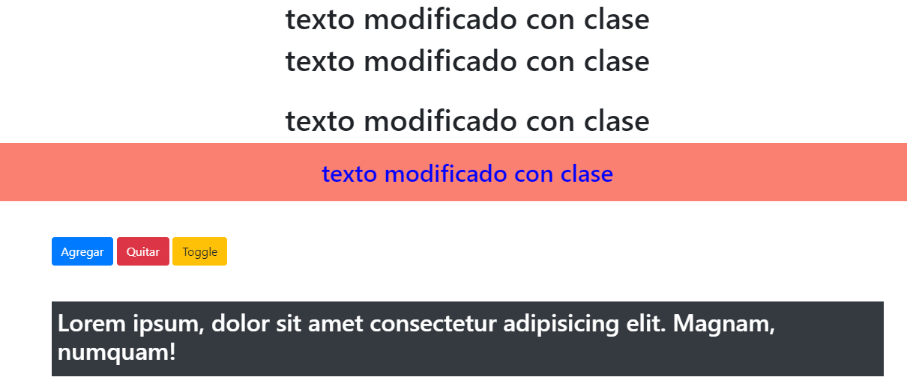

# 5. **Atributos**

Tabla de contenidos

- [5. **Atributos**](#5-atributos)
  - [5.1. Establecer y obtener atributos](#51-establecer-y-obtener-atributos)
  - [5.2. Atributos vs Propiedades](#52-atributos-vs-propiedades)

Los atributos de los elementos HTML que conforman una aplicación pueden contener información útil, por eso es importante poder establecer y obtener esa información.

## 5.1. Establecer y obtener atributos

El método `$(elem).attr` actúa tanto como método establecedor como obtenedor. Además, al igual que el método `$(elem).css`, cuando se lo utiliza como método establecedor, puede aceptar un conjunto de palabra clave-valor o un objeto conteniendo más conjuntos.

```javascript
$('a').attr('href', 'allMyHrefsAreTheSameNow.html');
$('a').attr({
    'title' : 'all titles are the same too',
    'href' : 'somethingNew.html'
});
```

En el ejemplo, el objeto pasado como argumento está escrito en varias líneas. Como se explicó anteriormente, los espacios en blanco no importan en JavaScript, por lo cual, es libre de utilizarlos para hacer el código más legible. En entornos de producción, se pueden utilizar herramientas de minificación, los cuales quitan los espacios en blanco (entre otras cosas) y comprimen el archivo final.

```javascript
var enlace = $('a').attr('href');  // devuelve el atributo href perteneciente
                                   // al primer elemento <a> del documento
```

Por otra parte, `$(elem).removeattr` permite borrar atributos 

```javascript
//Eliminar un atributo dado de los los elementos seleccionados
$(“some_selector”).removeAttr(“some_attribute”);

//Ejemplo
$(“input”).removeAttr(“required”);
```

## 5.2. Ejemplo de uso de selectores, clases y atributos

> [Ha llegado el momento de probar todo lo visto en los puntos anteriores mediante el siguiente ejemplo (Codepen)](https://codepen.io/sergio-rey-personal/pen/NWxejGQ)

```html
<!DOCTYPE html>
<html lang="es">
  <head>
    <meta charset="UTF-8" />
    <meta name="viewport" content="width=device-width, initial-scale=1.0" />
    <meta http-equiv="X-UA-Compatible" content="ie=edge" />
    <title>CDN jQuery</title>

    <!-- Estilos Bootstrap CDN -->
    <link
      rel="stylesheet"
      href="https://maxcdn.bootstrapcdn.com/bootstrap/4.0.0/css/bootstrap.min.css"
      integrity="sha384-Gn5384xqQ1aoWXA+058RXPxPg6fy4IWvTNh0E263XmFcJlSAwiGgFAW/dAiS6JXm"
      crossorigin="anonymous"
    />
  </head>
  <body>
    <div id="contenido" class="division">
      <h1 id="idh1" class="text-center">texto uno H1</h1>
      <h1 id="idh2" class="text-center">texto dos H1</h1>
      
      
      
    </div>
    <div class="division" id="divagregar">
      <h1 id="idagrega" class="text-center">Agregar Clase</h1>
      <h2 id="idquita" class="text-center">Quitar Clase</h2>
    </div>

    <div class="container my-5" id="ideven">
      <button class="btn btn-primary" id="boton1">Agregar</button>
      <button class="btn btn-danger" id="boton2">Quitar</button>
      <button class="btn btn-warning" id="boton3">Toggle</button>

      <div class="bg-dark text-white mt-5 p-2" id="idcont">
        <h2>
          Lorem ipsum, dolor sit amet consectetur adipisicing elit. Magnam,
          numquam!
        </h2>
      </div>
    </div>

    <!-- Aquí esta incorporado jQuery a través de un CDN -->
    <script>
      src="https://code.jquery.com/jquery-3.5.0.min.js"
      integrity="sha256-FgpCb/KJQlLNfOu91ta32o/NMZxltwRo8QtmkMRdAu8="
      crossorigin="anonymous"
    </script>
    <script src="js/Selectores.js"></script>
  </body>
</html>
```

```javascript
$(document).ready(function () {
  $('h1').html('texto modificado con etiqueta h1');
  $('#idh1').html('texto modificado con ID');
  $('.text-center').html('texto modificado con clase');

  //Forma con Javascript de h1
  //document.querySelector('h1').innerHTML = 'Texto con etiqueta JS';
  //document.querySelectorAll('h1').forEach(element => { element.innerHTML = 'Texto con etiqueta JS'});
  //document.querySelector('#idh1').innerHTML = 'Texto con ID JS';
  //document.querySelector('.text-center').innerHTML = 'Texto con clase JS';

  // cambia el texto en todos los h1 de la clase
  // $(".division h1").html("cambio de texto");
  // cambia el texto en el primer h1 de la clase
  // $(".division h1:first").html("cambio de texto --> .division h1:first");
  // cambia el texto en ultimo h1 de la clase
  // $(".division h1:last").html("cambio de texto  --> .division h1:last");

  // Agrengando Clase addClass
  // $('#idagrega').addClass('text-danger');
  // En JavaScript 2 formas de añadir
  //document.querySelector('#idagrega').className +=' text-danger'
  //document.querySelector('#idagrega').className ='text-center text-danger'

  // Quitando Clase removeClass
  //$('#idagrega').removeClass('text-center');

  //añadir un elemento append / prepend
  //$('#contenido').append('<h1 class="text-center mb-5">Esta es la línea 3</h1><br>');
  //$('#contenido').prepend('<h1 class="text-center">Esta es la línea 0</h1>');

  // función css
  //$('#idquita').css('color', 'blue');
  // para múltiples propiedades.
  $("#idquita").css({ color: "blue", background: "salmon", padding: "20px" });

  // función remove / hide
  //$('#contenido').remove(); // lo elimina incluso de la consola
  //$('#idquita').hide(); // únicamente lo oculta.
  //let quitar = document.querySelector('#idquita')
  //console.log(quitar)

  // funcion attr

  //$('img').attr('src','PBHP.png'); // mete la imagen en todos los img
  //$('img:first').attr("width","80")
  //$('img:last').attr("width","100")

  //Evento click Agregando clase

  var parrafo = $("#idcont h2");
  $("#boton1").click(function () {
    parrafo.addClass("display-4"); //cambiamos la clase para h2
  });

  /*Evento click Agregando estilo en css*/
  $("#boton2").click(function () {
    parrafo.removeClass("display-4");
  });

  /*Alternativa al evento click*/
  $("#boton3").on("click", function () {
    parrafo.toggleClass("display-4");
  });
});
```

Vamos a probar cada uno de los usos que se pueden dar a esta página, y veremos como van variando los elementos que se presentan en la misma:



## 5.2. Atributos vs Propiedades

Antes continuar examinando la diferentes funciones hay que aclarar las diferencias que hay entre un atributo y una propiedad.

Los **atributos** nos dan información adicional sobre un elemento o etiqueta que está incluida en el HTML. Cuando lo obtenemos o modificamos hacemos referencia al **valor o estado original**.

**LOS ATRIBUTOS ESTÁN EN EL HTML**

En relación a la **propiedades**, son características de una instancia concreta de esa etiqueta en el DOM. Al obtenerlas o modificarlas estamos haciendo referencia al **valor o estado actual**.

**NO ES NECESARIO QUE LAS PROPIEDADES ESTÉN EL HTML** ya que los objetos al ser instanciados en el DOM tienen una serie de propiedades por defecto.

Para poder aclarar esto de una mejor manera vamos a ver un ejemplo:

```js

    //Si tenemos el siguiente elemento en la página
    // <input id="ej" type="text" value="Pepe">

    console.log($("#ej").attr("value"));
    //Salida -> Pepe

    console.log($("#ej").prop("value"));
    //Salida -> Pepe

    console.log($("#ej").attr("disable"));
    //Salida -> undefined -> No está en el HTML

    console.log($("#ej").attr("disable"));
    //Salida -> false . No está pero es una propiedad del DOM

    //Modificamos el valor del elemento del DOM
    $("#ej").val("Manuel");

    console.log($("#ej").attr("value"));
    //Salida -> Pepe, el valor que tengo en el HTML

    console.log($("#ej").prop("value"));
    //Salida -> Manuel, el valor actual de la propiedad

```

En conclusión y para que no tengamos problemas:

* No usar versiones anteriores a jQuery 1.6.
* Usar siempre que sea posible las funciones que hacen referencia a propiedades. Aunque muchas veces nos vayan a dar resultados iguales.
* Usar .attr() únicamente cuando sean atributos _custom_, es decir que no van a tener propiedades asociadas.
* Tener en cuenta que en los atributos siempre tenemos cadenas de caracteres pero que en las propiedades podemos tener otro tipo de datos.

Una vez ha quedado claro vamos a ver ejemplos de uso de las funciones más comunes en jQuery para trabajar con atributos y propiedades.

Así pues '.attr()' sirve para obtener o establecer el valor de uno o varios atributos.

Vamos a ilustrar su uso con varios ejemplos.

```js
    
    //Obtengo la dirección del PRIMER ENLACE
    //Obtengo el valor del atributo href
    var url = $("a").attr("href");

    //Todos los enlaces se abrirán en una nueva ventana
    //Establezco ese atributo para TODOS LOS enlaces
    $("a").attr("target","_blank");

    //Establezco dos atributos a la vez para 
    //el elemento con ese id (el selector podría devolver más elementos)
    $("#miprofile").attr({
        alt:"Foto de mi cara",
        title:"Foto hecha por mí")
    });


```

y '.removeAttr()' sirve para borrar atributos de los elementos seleccionados (en caso de que existan en los elementos)

Su sintaxis y un ejemplo:

```js
    //Eliminar un atributo dado de los los elementos seleccionados
    $("some_selector").removeAttr("some_attribute");

    //Ejemplo
    //Quita el atributo required de todos los inputs (si es que lo tenían)
    $("input").removeAttr("required");

```

Pero en cuento a las propiedades debemos utilizar '.prop' y '.removeprop'.

En concreto '.prop()' sirve para obtener o  modificar el valor de una o varias propiedades.

Su es uso es análogo a _.attr()_ y lo podemos ver en el siguiente ejemplo:

```js
    //Obtengo propiedad href del primer enlace
    var url = $("a").prop("href");

    //Todos los enlaces se abrirán en una nueva ventana
    //Pongo ese valor a la propiedad
    $("a").prop("target","_blank");

    //Establezco dos propiedades a la vez para una imagen que tiene un id
    $("#miprofile").prop({
        alt:"Foto de mi cara",
        title:"Foto hecha por mí")
    });

```

Mientras que '.removeProp()' sirve para eliminar propiedades de los elementos seleccionados.

Su uso es análogo a _.removeAttr()_ y lo podemos ver en el siguiente ejemplo:

```js
    //Eliminar una propiedad dada de los los elementos seleccionados
    $("some_selector").removeProp("some_attribute");

    //Ejemplo
    $("input").removeProp("required");
```

