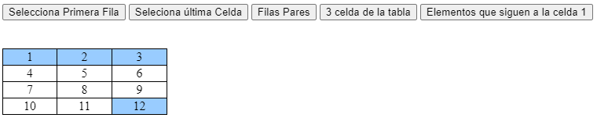

# 6. **Recorrer el DOM**

Tabla de contenidos

- [6. **Recorrer el DOM**](#6-recorrer-el-dom)
  - [6.1. Moverse a través del DOM utilizando métodos de recorrido](#61-moverse-a-través-del-dom-utilizando-métodos-de-recorrido)
  - [6.2. Filtrando elementos](#62-filtrando-elementos)
  - [6.3. Ejemplo de uso de DOM y filtros](#63-ejemplo-de-uso-de-dom-y-filtros)

Una vez obtenida la selección, es posible encontrar otros elementos utilizando a la misma selección. En [api.jquery.com/category/traversing](https://api.jquery.com/category/traversing/) puede encontrar una completa documentación sobre los métodos de recorrido de DOM (en inglés *traversing*) que posee jQuery.

> **Nota** Debe ser cuidadoso en recorrer largas distancias en un documento --- recorridos complejos obligan que la estructura del documento sea siempre la misma, algo que es difícil de garantizar. Uno o dos pasos para el recorrido esta bien, pero generalmente hay que evitar atravesar desde un contenedor a otro.

## 6.1. Moverse a través del DOM utilizando métodos de recorrido

Tal y como se hace mediante JavaScript, con JQuery es incluso más sencillo recorrer todos los elementos de DOM


```javascript
// seleccionar el inmediato y próximo elemento <p> con respecto a H1
$('h1').next('p');

// seleccionar el elemento contenedor a un div visible
$('div:visible').parent();

// seleccionar el elemento <form> más cercano a un input
$('input[name=first_name]').closest('form');

// seleccionar todos los elementos hijos de #myList
$('#myList').children();

// seleccionar todos los items hermanos del elemento <li>
$('li.selected').siblings();
```

También es posible interactuar con la selección utilizando el método `$.fn.each`. Dicho método interactúa con todos los elementos obtenidos en la selección y ejecuta una función por cada uno. La función recibe como argumento el índice del elemento actual y al mismo elemento. De forma predeterminada, dentro de la función, se puede hacer referencia al elemento DOM a través de la declaración `this`.

```javascript
$('#myList li').each(function(idx, el) {
    console.log(
        'El elemento ' + idx +
        'contiene el siguiente HTML: ' +
        $(el).html()
);
```

## 6.2. Filtrando elementos

JQuery enumera todos los elementos del DOM , por lo que se convierte en una tarea sencilla filtrar determinados elementos como el primero, el último, etc.

***Filtros JQuery básicos***

- `$(":first")`: Selecciona la primera ocurrencia de un elemento
- `$(":last")`: Selecciona la última ocurrencia de un elemento
- `$(":even")`: Selecciona los elementos pares según un índice que empieza por 0.
- `$(":odd")`: Selecciona los elementos impares según un índice que empieza por 0
- `$(":eq(índice)")`: Selecciona el elemento concreto con el valor del índice.
- `$(":gt(índice)")`: Selecciona los elementos con un valor de índice superior (greater than ) al valor proporcionado en el parámetro. Se empiezan por 0
- `$(":lt(índice)")`: Selecciona los elementos con un valor de índice inferior (less than ) al valor del parámetro . Los índices en JavaScript empiezan por 0
- `$(":header")`: Devuelve todos los elementos de título como `<h1>`, `<h2>`, `<h3>`, etc

***Filtrar los elementos según su tipo***

- `:nth-of-type`: Selecciona todos los elementos que son el enésimo hijo de sus padres respecto a los hermanos con el mismo nombre de etiqueta
- `:nth-last-of-type`: Selecciona todos los elementos que son el enésimo hijo de sus padres, contando desde la última etiqueta a la primera.
- `:first-of-type`: Selecciona todos los elementos que son el primero de los hermanos con el mismo nombre de etiqueta.
- `:last-of-type`: Selecciona todos los elementos que son el último de los hermanos con el mismo nombre de etiqueta.
- `:only-of-type`: Selecciona todos los elementos que no tienen hermanos con el mismo nombre de etiqueta.

***Filtros de hijos***

- `$(":firstchild")` : Selecciona todos los elementos que son el primer hijo de su padre. `$("ul:first
child"):` selecciona el primer hijo es decir, el primer elemento de lista <li>, de la lista no ordenada `<ul>`.
- `$(":lastchild")`: Selecciona todos los elementos que son el último hijo de su padre.
- `$(":nthchild(*índice*)")`: Selecciona los elementos que son el enésimo hijo de su padre. La posición la indica el parámetro índice.(índice empieza por 1 no por cero)

***Filtros de contenido***
- `$(":contains(texto)")`: Selecciona los elementos que contengan un determinado texto o fragmento de texto que se pasa como argumento.
- `$(":empty")`: Selecciona todos los elementos que no tienen hijos o contenido de texto. `$("div:empty")`: selecciona las cajas div >

***Filtros de visibilida***
- `$(":visible")`: Selecciona los elementos que son visibles. `$("p:visible")`: selecciona los párrafos `<p>` visibles.
- `$(":hidden")`: Selecciona los elementos ocultos. `$("p:hidden")`: selecciona los párrafos `<p>` ocultos.

***Filtros de Atributo***
- `$("[atributo]")`: Selecciona los elementos que tienen el atributo especificado. `$("div[id]")`: selecciona los elementos div > que tienen un atributo
- `$("[atributo=valor]")`: Selecciona los elementos que tienen un atributo con un valor concreto. Es sensible a mayúsculas y minúsculas (case sensitive).` $("input[name newsletter’]")`: selecciona el elemento de formulario `<input>` con un atributo name newsletter

## 6.3. Ejemplo de uso de DOM y filtros

En el siguiente ejemplo podemos ver como seleccionar o modificar elementos de css de diversos elementos de una tabla:

```html
<div id="ideven">
  <button id="boton1">Selecciona Primera Fila</button>
  <button id="boton2">Seleciona última Celda</button>
  <button id="boton3">Filas Pares</button>
  <button id="boton4">3 celda de la tabla</button>
  <button id="boton5">Elementos que siguen a la celda 1</button>
</div>
</br></br>
<table>  
  <tr><td>1</td><td>2</td><td>3</td></tr>  
  <tr><td>4</td><td>5</td><td>6</td></tr>  
  <tr><td>7</td><td>8</td><td>9</td></tr>  
  <tr><td>10</td><td>11</td><td>12</td></tr>  
</table>  
``

```css
table { 
  width: 210px;   
  border-collapse: collapse;  
  border: 1px solid black;
}  
td { 
  text-align: center;  
  border: 1px solid black;
}  
```

```javascript
$(document).ready(function(){
  $('#boton1').click(function(){
    $("tr:first").css("background", "#9cf");
  }); 
  $('#boton2').on('click',function(){
    $("td:last").css("background", "#9cf"); 
  });  
  $('#boton3').on('click',function(){
    $("tr:even").css("background", "#9cf");
  });  
  $('#boton4').on('click',function(){
    $("td:eq(2)").css("background", "#9cf");
  }); 
  $('#boton5').on('click',function(){
    $("td:gt(1)").css("background", "#9cf");
  });   
});  
```



> [Ejemplo de filtros de elementos del DOM con JQuery (Codepen)](https://codepen.io/sergio-rey-personal/pen/qBbLjMW)