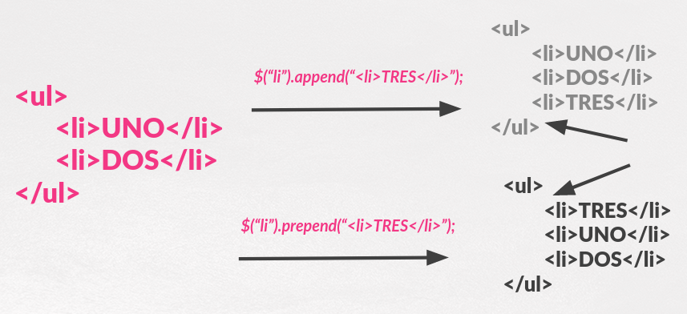
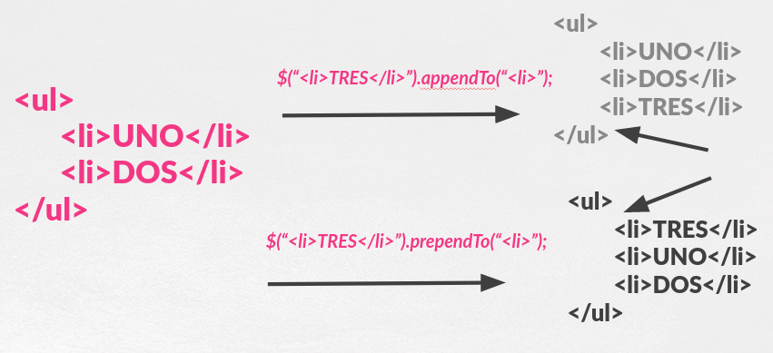
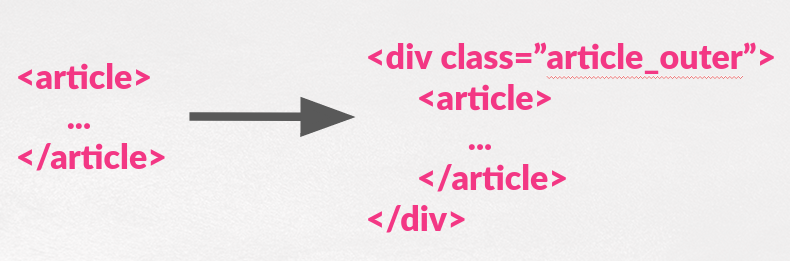
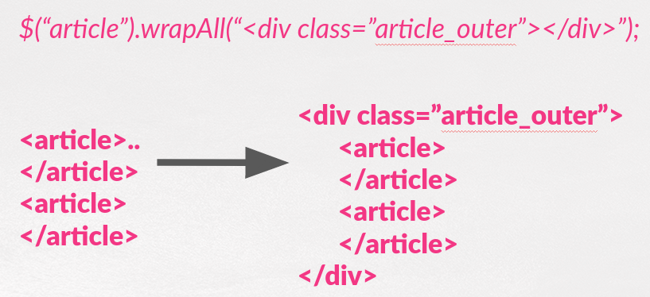
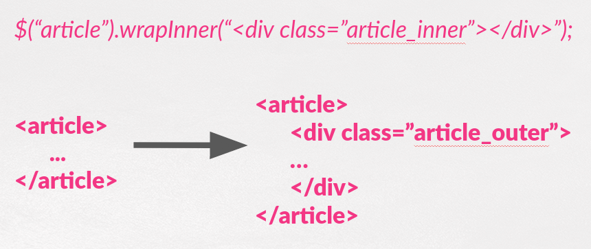

# 7. **Manipulación de elementos de DOM**

Tabla de contenidos

- [7. **Manipulación de elementos de DOM**](#7-manipulación-de-elementos-de-dom)
  - [7.1. Obtener y establecer información en elementos](#71-obtener-y-establecer-información-en-elementos)
  - [7.2. Mover, copiar y eliminar elementos](#72-mover-copiar-y-eliminar-elementos)
    - [7.2.1. .empty(), .html() y .text()](#721-empty-html-y-text)
    - [7.2.2. .append() / .prepend() / .appendTo() / .prependTo()](#722-append--prepend--appendto--prependto)
    - [7.2.3. .wrap() / .unwrap() / .wrapAll() / .wrapInner()](#723-wrap--unwrap--wrapall--wrapinner)
    - [7.2.4. .after() y .before()](#724-after-y-before)
    - [7.2.5. .insertAfter() e .insertBefore()](#725-insertafter-e-insertbefore)
    - [7.2.6. .clone()](#726-clone)
    - [7.2.7. .val()](#727-val)
    - [7.2.8. Borrando nodos con .remove() y .detach()](#728-borrando-nodos-con-remove-y-detach)
    - [7.2.9. Reemplazando nodos con .replaceAll() y .replaceWidth()](#729-reemplazando-nodos-con-replaceall-y-replacewidth)
  - [7.3. Crear nuevos elementos](#73-crear-nuevos-elementos)
  - [7.4. Manipulación de atributos](#74-manipulación-de-atributos)


Una vez realizada la selección de los elementos que desea utilizar, *la diversión comienza*. Es posible cambiar, mover, eliminar y duplicar elementos. También crear nuevos a través de una sintaxis simple.

La documentación completa sobre los métodos de manipulación puede encontrarla en [la sección Manipulation](https://api.jquery.com/category/manipulation/).

## 7.1. Obtener y establecer información en elementos

Existen muchas formas por las cuales se puede modificar un elemento. Entre las tareas más comunes están las de cambiar el HTML interno o algún atributo del mismo. Para este tipo de tareas, jQuery ofrece métodos simples, funcionales en todos los navegadores modernos. Incluso es posible obtener información sobre los elementos utilizando los mismos métodos pero en su forma de método obtenedor.

> ***Nota***: Realizar cambios en los elementos, es un trabajo trivial, pero hay debe recordar que el cambio afectará a todos los elementos en la selección, por lo que, si desea modificar un sólo elemento, tiene que estar seguro de especificarlo en la selección antes de llamar al método establecedor.

> ***Nota***: Cuando los métodos actúan como obtenedores, por lo general, solamente trabajan con el primer elemento de la selección. Además no devuelven un objeto jQuery, por lo cual no es posible encadenar más métodos en el mismo. Una excepción es el método `.text`, el cual permite obtener el texto de los elementos de la selección.

- `.html` Obtiene o establece el contenido HTML de un elemento.
- `.text` Obtiene o establece el contenido en texto del elemento; en caso se pasarle como argumento código HTML, este es despojado.
- `.attr` Obtiene o establece el valor de un determinado atributo.
- `.width` Obtiene o establece el ancho en pixeles del primer elemento de la selección como un entero.
- `.height` Obtiene o establece el alto en pixeles del primer elemento de la selección como un entero.
- `.position` Obtiene un objeto con información sobre la posición del primer elemento de la selección, relativo al primer elemento padre posicionado. Este método es solo obtenedor.
- `.val` Obtiene o establece el valor (*value*) en elementos de formularios.

Veamos un ejemplo de cómo se cambiaria el HTML de un elemento

```javascript
$('#myDiv p:first').html('Nuevo <strong>primer</strong> párrafo');
```

## 7.2. Mover, copiar y eliminar elementos

Existen varias maneras para mover elementos a través del DOM; las cuales se pueden separar en dos enfoques:

- Querer colocar el/los elementos seleccionados de forma relativa a otro elemento
- Querer colocar un elemento relativo a el/los elementos seleccionados.

Por ejemplo, jQuery provee los métodos `.insertAfter` y `.after`. El método `.insertAfter` coloca a el/los elementos seleccionados después del elemento que se haya pasado como argumento; mientras que el método `.after` coloca al elemento pasado como argumento después del elemento seleccionado. Otros métodos también siguen este patrón: `.insertBefore` y `.before`; `.appendTo` y `.append`; y `.prependTo` y `.prepend`.

Estas funciones las vamos a agrupar en:

* .empty(), .html() y .text()
* .append(), .prepend(), .appendTo() , .prependTo()
* .wrap(), .unwrap() , .wrapAll() , .wrapInner()
* .val().
* .remove() o .detach()

La utilización de uno u otro método dependerá de los elementos que tenga seleccionados y el tipo de referencia que se quiera guardar con respecto al elemento que se esta moviendo.

### 7.2.1. .empty(), .html() y .text()

La función **.empty()** borra todos los nodos hijos(y su contenido) de los elementos seleccionados.

Un ejemplo sería el siguiente:

```js
$("ul").empty();
```

De tal manera que si tenemos esta estructura HTML inicial:

```html
<ul>
    <li>UNO</li>
    <li>DOS</li>
    <li>TRES</li>
</ul>
```

La estructura resultante sería:

```html
<ul></ul>
```

La función **.html()** puede ser usada para obtener el **contenido** del **primer elemento** de los seleccionados. Esto quiere decir que obtendremos todo lo que va entre la apertura y el cierre de ese elemento.

Por ejemplo:

```js
//content contienen todo lo que va dentro de esa <li>. Posible etiquetas incluidas
var content = $("li").html();
```

Además de para obtener el contenido, con esta función podemos modificar el contenido de **TODOS** los elementos seleccionados.

Vamos a ilustrar las diferentes posibilidades con ejemplos:

```js
//Hacer que el contenido de todas las listas sea un único elemento
//Sustituye el contenido que tuviera
$("ul").html("<li>UNO</li>"-);

//Lo mismo pero usando una función que pone a nuestra disposición la posición dentro de los elementos seleccionados y el texto anterior.
$("ul").html(function(index,oldText) {
    return "<li>"+index+"</li>";
});
```

El uso de la función **.text()** es totalmente análogo a .html() pero con la diferencia de que trata todo como **TEXTO** y **obvia las etiquetas** quedándose únicamente con el contenido textual de los elementos.

### 7.2.2. .append() / .prepend() / .appendTo() / .prependTo()


las funciones **.append()** y **.prepend()** son análogas en su funcionamiento. Ambas sirven para añadir nuevos elementos HTML a nuestro DOM.

La diferencia principal es que:

* **.append("contenido")** añade ese contenido justo al principio de los elementos seleccionados.
* **.prepend("contenido")** añade ese contenido justo al final de los elementos seleccionados.

Y cuando nos referimos al principio o al final nos referimos a justo después de la etiqueta de inicio de los elementos seleccionados o a justo antes de la etiqueta de cierre de los elementos seleccionados.

Se entiende mejor con esta imágen.




Las funciones **.appendTo()** y **.prependTo()** funcionan de manera muy similar a las dos anteriores pero tenemos un par de cambios:

* Donde antes estaba el contenido está el selector de los elementos en los cuales vamos añadir contenido.
* Donde antes estaba el selector tengo el contenido.

Se entiende mejor con una imagen análoga a la anterior pero usando estas funciones:




- Mover elementos utilizando diferentes enfoques

```javascript
// hacer que el primer item de la lista sea el último
var $li = $('#myList li:first').appendTo('#myList');

// otro enfoque para el mismo problema
$('#myList').append($('#myList li:first'));

// debe tener en cuenta que no hay forma de acceder a la
// lista de items que se ha movido, ya que devuelve la lista en sí
```

- Obtener una copia del elemento

```javascript
// copiar el primer elemento de la lista y moverlo al final de la misma
$('#myList li:first').clone().appendTo('#myList');
```

- Clonar elementos

Cuando se utiliza un método como `.appendTo`, lo que se está haciendo es mover al elemento; pero a veces en lugar de eso, se necesita mover un duplicado del mismo elemento. En este caso, es posible utilizar el método `.clone`.


> ***Nota***: Si se necesita copiar información y eventos relacionados al elemento, se debe pasar `true` como argumento de `.clone`.

### 7.2.3. .wrap() / .unwrap() / .wrapAll() / .wrapInner()

La función **.wrap()** añade cierta estructura HTML alrededor de todos y cada uno de los elementos seleccionados.

Tiene varias posibilidades:

```js

    //Envuelve todos los article con una estructura
    $("article").wrap("<div class="article_outer"></div>");

    //O usando una función que pone a nuestra disposición la posición dentro de los elementos seleccionados
    $("article").wrap(funcion(index) {
        return "<div class='article-"+index+"'></div>";
    });

```

Podemos entenderlo mejor con esta imagen:



La función **.unwrap()** hace justo lo contrario que .wrap().Elimina el padre y saca el hijo a la altura del árbol que estaba el padre.

Por lo tanto:

```js
    //Deshacer el cambio anterior hecho con WRAP
    $("article").unwrap(); 
    //Si queremos comprobar que el padre cumple condiciones
    $("article").unwrap(".article_outer");

```

En relación a las otras dos funciones:

* **wrapAll()** es análogo a .wrap() pero sólo añade un elemento envolvente que cubre a todos los seleccionados. Debemos tener cuidado si hay elementos _intrusos_ o diferentes entre ellos.
* **wrapInner()**  es análogo a .wrap() pero el elemento envolvente se añade no como padre sino al contenido de los seleccionados.

Vamos a entenderlo mejor con las siguientes imágenes:





### 7.2.4. .after() y .before()

Son funciones que me permiten insertar contenido (uno o varios) justo antes (before) o después (after) de los elementos seleccionados. Ambas tienen el mismo uso. Únicamente cambia el nombre.

La forma más sencilla de usarlas sería la siguiente:

```js

    $("some_selector").after(content1,.....,contentN);
    $("some_selector").before(content1,.....,contentN);
```

Es importante destacar que ese contenido puede ser:

- HTML.
- Texto.
- Un objeto jQuery, lo que provoca que ese objeto se desplace por el DOM.
- Un array de varios elementos de los anteriormente citados.

También pueden usarse de otras maneras:

```js

    //Con función cuyo valor devuelto es lo que se añade.
    //Tengo disponible posición y $(this)
    $("some_selector").after(function(index) {
        ...
    });

    //Igual pero con el HTML del elemento disponible
    $("some_selector"”).after(function(index,html) {
        ...
    });

```

A continuación ejemplos de estas posibilidades:

```js
//Añado una fila más después de la última fila
$("tr")
  .last()
  .after("<tr><td>F</td></tr>");

//Muevo la primera fila al final
$("tr")
  .last()
  .after($("tr").first());

//Duplico las filas
$("tr").after(function(index, html) {
  return html;
});
```

### 7.2.5. .insertAfter() e .insertBefore()

Son funciones similares a las anteriores pero en este caso lo seleccionado es lo que se añade a lo que se selecciona después como parámetro (el objetivo) antes (before) o después (after). Al revés que antes:

La síntaxis general es la siguiente:

```js
$("origin").insertAfter(target);
```

Ese _target_ puede ser:

- Un selector.
- HTML.
- Objeto jQuery ( se desplazará).
- Un array de los anteriores.

Por ejemplo:

```js

    //Añado una fila más después de la última fila
    $("<tr><td>F</td></tr>").inserAfter("tr:last");

    //Muevo la primera fila al final
    $("tr:fist").insertAfter($("tr"”).last());

```

Todo esto sería igual para **.insertBefore()**

### 7.2.6. .clone()

Crea una copia profunda(con descendientes) de los elementos seleccionados. Y le puedo pasar como parámetros si quiero conservar sus handlers y los de sus descendientes.

```js

    //De manera general
    $("selector").clone(withEvents);
    $("selector").clone(withEvents,whithDeepEvents);

    //Clono la primera fila y la añado al final
    $("tr").first().clone(false).appendTo(“table”);


```

### 7.2.7. .val()

La función **.val()**  aunque no modifica el DOM si  modifica en cierta manera el contenido de la página al cambiar el valor de los elementos, normalmente de los elementos de los formularios.

Usando **.val()** podremos obtener y fijar el valor de los distintos campos de los formularios.

Para ilustrar ambas posibilidades vamos a ver la síntaxis general y ejemplos:

```js
    //Para obtener el valor de un campo de formulario. El PRIMERO de los seleccionados
    var valor = $("some_selector").val();

    //Para fijar el valor para TODOS los campos seleccionados
    $("some_selector").val("some_value");

    //O usando una función. La posición, el valor actual y $(this) disponibles
    //El valor de retorno será el valor del elemento seleccionado
    $("some_selector").val(funcion(index,valor) {
    ….
    });
```

Un ejemplo para cada uno de estos casos:

```js
    //Obtengo el valor del primer input de tipo texto
    var valor = $("input[type=text]).val();

    //Todos los input de tipo text van a mostrar "Insert Value"
    $("input[type=text).val("Insert Value");

    
    //Voy a añadir al valor que tenían -> y la posición de entre los selecciondos.
    $("input[type=text).val(funcion(index,valor) {
        $(this).val(valor+"->"+index);
    });


```


### 7.2.8. Borrando nodos con .remove() y .detach()

Ls funciones o métodos _.remove() y .detach()_ tienen comportamiento similares. Ambos sirven para borrar elementos seleccionados del DOM. La diferencia entre ambos es que usando _.detach()_ puedo guardarme esos elementos (con eventos incluidos) para reponerlos luego.

La síntaxis general es:

```js
//Borra del DOM los elementos seleccionados
$("some_selector").remove();
//Aplicando un filtro a los seleccionados
$("some_selector").remove("filter_selector");

//Guardando lo borrado
var result = $("some_selector").detach();
//Guardando y filtrando"
var result = $("some_selector").detach("filter_selector");
```

Y podemos poner varios ejemplos:

```js
//Borra todas las imágenes
$("img").remove();

//Borra todas las imágenes de la clase logo
$("img").remove(".logo");

//Borra todas las imágenes y las recupera
var imagenes = $("img").remove();
$("body").append(imagenes);
```

> ***Nota***: El método `.detach` es muy útil cuando se esta manipulando de forma severa un elemento, ya que es posible eliminar al elemento, trabajarlo en el código y luego restaurarlo en la página nuevamente. Esta forma tiene como beneficio no tocar el DOM mientras se está modificando la información y eventos del elemento.
> 
### 7.2.9. Reemplazando nodos con .replaceAll() y .replaceWidth()

Ambas son muy similares, sirven para reemplazar elementos. La primera reemplaza el objetivo con el conjunto de los elementos seleccionados y la segunda funciona al revés.

La síntaxis y un ejemplo para cada una de ellas las podemos ver en el siguiente cuadro de código:

```js
//Reemplaza el elemento objetivo con el conjunto de los seleccionado
$("some_selector").replaceAll(target);

//Se sustituyen todas las celdas td por celdas td que contienen X
$("<td>X</td>").replaceAll("td");

//Igual que el anterior pero el origen y el objetivo están al revés
$(target).replaceWith("some_selector");
//Se sustituyen todas las celdas td por celdas td que contienen X
$("td").replaceWith("<td>X</td>");
```

## 7.3. Crear nuevos elementos

jQuery provee una forma fácil y elegante para crear nuevos elementos a través del mismo método `$()` que se utiliza para realizar selecciones.

***Crear nuevos elementos***

```javascript
$('<p>Un nuevo párrafo</p>');
$('<li class="new">nuevo item de la lista</li>');
```

***Crear un nuevo elemento con atributos utilizando un objeto***

```javascript
$('<a/>', {
    html : 'Un <strong>nuevo</strong> enlace',
    'class' : 'new',
    href : 'foo.html'
});
```

Puedes ver que en el objeto que se pasa como argumento, la propiedad `class` está entre comillas, mientras que la propiedad `href` y `html` no lo están. Por lo general, los nombres de propiedades no deben estar entre comillas, excepto en el caso que se utilice como nombre una palabra reservada (como es el caso de `class`).

Cuando se crea un elemento, éste no es añadido inmediatamente a la página, sino que se debe hacerlo en conjunto con un método.

***Crear un nuevo elemento en la página***

```javascript
var $myNewElement = $('<p>Nuevo elemento</p>');
$myNewElement.appendTo('#content');

// eliminará al elemento <p> existente en #content
$myNewElement.insertAfter('ul:last');

// clonar al elemento <p> para tener las dos versiones
$('ul').last().after($myNewElement.clone());
```

Estrictamente hablando, no es necesario guardar al elemento creado en una variable --- es posible llamar al método para añadir el elemento directamente después de `$()`. Sin embargo, la mayoría de las veces se deseará hacer referencia al elemento añadido, por lo cual, si se guarda en una variable no es necesario seleccionarlo después.

***Crear y añadir al mismo tiempo un elemento a la página***

```javascript
$('ul').append('<li>item de la lista</li>');
```

> ***Nota***:: La sintaxis para añadir nuevos elementos a la página es muy fácil de utilizar, pero es tentador olvidar que hay un costo enorme de rendimiento al agregar elementos al DOM de forma repetida. Si esta añadiendo muchos elementos al mismo contenedor, en lugar de añadir cada elemento uno por vez, lo mejor es concatenar todo el HTML en una única cadena de caracteres para luego anexarla al contenedor. Una posible solución es utilizar un array que posea todos los elementos, luego reunirlos utilizando `join` y finalmente anexarla.

```javascript
var myItems = [], $myList = $('#myList');

for (var i=0; i<100; i++) {
    myItems.push('<li>item ' + i + '</li>');
}

$myList.append(myItems.join(''));
```

## 7.4. Manipulación de atributos

Las capacidades para la manipulación de atributos que ofrece la biblioteca son extensos. La realización de cambios básicos son simples, sin embargo el método `.attr` permite manipulaciones más complejas.

***Manipular un simple atributo***

```javascript
$('#myDiv a:first').attr('href', 'newDestination.html');
```

***Manipular múltiples atributos***

```javascript
$('#myDiv a:first').attr({
    href : 'newDestination.html',
    rel : 'super-special'
});
```

***Utilizar una función para determinar el valor del nuevo atributo***

```javascript
$('#myDiv a:first').attr({
    rel : 'super-special',
    href : function(idx, href) {
        return '/new/' + href;
    }
});

$('#myDiv a:first').attr('href', function(idx, href) {
    return '/new/' + href;
});
```