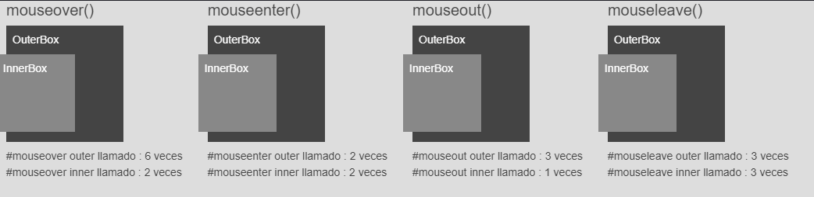
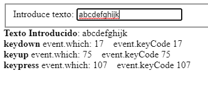
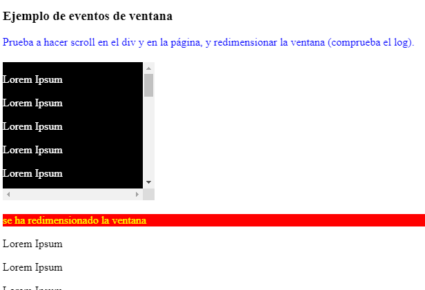
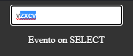

# 8. **Eventos**

Tabla de contenidos

- [8. **Eventos**](#8-eventos)
  - [8.1. Vincular Eventos a Elementos](#81-vincular-eventos-a-elementos)
    - [8.1.1 Vincular Eventos para Ejecutar una vez](#811-vincular-eventos-para-ejecutar-una-vez)
    - [8.1.2 Desvincular Eventos](#812-desvincular-eventos)
    - [8.1.3 Espacios de Nombres para Eventos](#813-espacios-de-nombres-para-eventos)
    - [8.1.4 Vinculación de Múltiples Eventos](#814-vinculación-de-múltiples-eventos)
  - [8.2. El Objeto del Evento](#82-el-objeto-del-evento)
  - [8.3. Ejecución automática de Controladores de Eventos](#83-ejecución-automática-de-controladores-de-eventos)
  - [8.4. Incrementar el Rendimiento con la Delegación de Eventos](#84-incrementar-el-rendimiento-con-la-delegación-de-eventos)
    - [8.4.1 Desvincular Eventos Delegados](#841-desvincular-eventos-delegados)
  - [8.5. Funciones Auxiliares de Eventos](#85-funciones-auxiliares-de-eventos)
    - [8.5.1 `.hover`](#851-hover)
    - [8.5.2 `.toggle`](#852-toggle)
  - [8.6. Eventos habituales](#86-eventos-habituales)
    - [8.6.1. Eventos del ratón](#861-eventos-del-ratón)
    - [5.2. Eventos del teclado](#52-eventos-del-teclado)
    - [5.3. Eventos de ventana](#53-eventos-de-ventana)
    - [5.4. Eventos de formulario](#54-eventos-de-formulario)

jQuery provee métodos para asociar controladores de eventos (en inglés *event handlers*) a selectores. Cuando un evento ocurre, la función provista es ejecutada. Dentro de la función, la palabra clave `this` hace referencia al elemento en que el evento ocurre.

Para más detalles sobre los eventos en jQuery, puede consultar <http://api.jquery.com/category/events/>.

La función del controlador de eventos puede recibir un objeto. Este objeto puede ser utilizado para determinar la naturaleza del evento o, por ejemplo, prevenir el comportamiento predeterminado de éste. Para más detalles sobre el objeto del evento, visite <http://api.jquery.com/category/events/event-object/>.

## 8.1. Vincular Eventos a Elementos

jQuery ofrece métodos para la mayoría de los eventos --- entre ellos `.click`, `.focus`, `.blur`, `.change`, etc. Estos últimos son formas reducidas del método `.on` de jQuery (`.bind` en versiones anteriores a jQuery 1.7). El método `.on` es útil para vincular (en inglés *binding*) la misma función de controlador a múltiples eventos, para cuando se desea proveer información al controlador de evento, cuando se está trabajando con eventos personalizados o cuando se desea pasar un objeto a múltiples eventos y controladores.

***Vincular un evento utilizando un método reducido***

```javascript
$('p').click(function() {
    console.log('click');
});
```

***Vincular un evento utilizando el método `.on`***

```javascript
$('p').on('click', function() {
    console.log('click');
});
```

***Vincular un evento utilizando el método `.on` con información asociada***

```javascript
$('input').on(
    'click blur',  // es posible vincular múltiples eventos al elemento
    { foo : 'bar' }, // se debe pasar la información asociada como argumento

    function(eventObject) {
        console.log(eventObject.type, eventObject.data);
        // registra el tipo de evento y la información asociada { foo : 'bar' }
    }
);
```

### 8.1.1 Vincular Eventos para Ejecutar una vez

A veces puede necesitar que un controlador particular se ejecute solo una vez --- y después de eso, necesite que ninguno más se ejecute, o que se ejecute otro diferente. Para este propósito jQuery provee el método `.one`.

***Cambiar controladores utilizando el método `.one`***

```javascript
$('p').one('click', function() {
    console.log('Se clickeó al elemento por primera vez');
    $(this).click(function() { console.log('Se ha clickeado nuevamente'); });
});
```

El método `.one` es útil para situaciones en que necesita ejecutar cierto código la primera vez que ocurre un evento en un elemento, pero no en los eventos sucesivos.

### 8.1.2 Desvincular Eventos

Para desvincular (en ingles *unbind*) un controlador de evento, puede utilizar el método `.off` pasándole el tipo de evento a desconectar. Si se pasó como adjunto al evento una función nombrada, es posible aislar la desconexión de dicha función pasándola como segundo argumento.

***Desvincular todos los controladores del evento click en una selección***

```javascript
$('p').off('click');
```

***Desvincular un controlador particular del evento click***

```javascript
var foo = function() { console.log('foo'); };
var bar = function() { console.log('bar'); };

$('p').on('click', foo).on('click', bar);
$('p').off('click', bar); // foo esta atado aún al evento click
```

### 8.1.3 Espacios de Nombres para Eventos

Cuando se esta desarrollando aplicaciones complejas o extensiones de jQuery, puede ser útil utilizar espacios de nombres para los eventos, y de esta forma evitar que se desvinculen eventos cuando no lo desea.

***Asignar espacios de nombres a eventos***

```javascript
$('p').on('click.myNamespace', function() { /* ... */ });
$('p').off('click.myNamespace');
$('p').off('.myNamespace'); // desvincula todos los eventos con
                            // el espacio de nombre 'myNamespace'
```

### 8.1.4 Vinculación de Múltiples Eventos

Muy a menudo, elementos en una aplicación estarán vinculados a múltiples eventos, cada uno con una función diferente. En estos casos, es posible pasar un objeto dentro de `.on` con uno o más pares de nombres claves/valores. Cada clave será el nombre del evento mientras que cada valor será la función a ejecutar cuando ocurra el evento.

***Vincular múltiples eventos a un elemento***

```javascript
$('p').on({
    'click': function() {
        console.log('clickeado');
    },
    'mouseover': function() {
        console.log('sobrepasado');
    }
});
```

## 8.2. El Objeto del Evento

Como se menciona en la introducción, la función controladora de eventos recibe un objeto del evento, el cual contiene varios métodos y propiedades. El objeto es comúnmente utilizado para prevenir la acción predeterminada del evento a través del método *preventDefault*. Sin embargo, también contiene varias propiedades y métodos útiles:

- `pageX, pageY`: La posición del puntero del ratón en el momento que el evento ocurrió, relativo a las zonas superiores e izquierda de la página.
- `type`: El tipo de evento (por ejemplo "click").
- `which`: El botón o tecla presionada.
- `data`: Alguna información pasada cuando el evento es ejecutado.
- `target`: El elemento DOM que inicializó el evento.
- `preventDefault()`: Cancela la acción predeterminada del evento (por ejemplo: seguir un enlace).
- `stopPropagation()`: Detiene la propagación del evento sobre otros elementos.

Por otro lado, la función controladora también tiene acceso al elemento DOM que inicializó el evento a través de la palabra clave `this`. Para convertir a dicho elemento DOM en un objeto jQuery (y poder utilizar los métodos de la biblioteca) es necesario escribir `$(this)`, como se muestra a continuación:

```javascript
var $this = $(this);
```

***Cancelar que al hacer click en un enlace, éste se siga***

```javascript
$('a').click(function(e) {
    var $this = $(this);
    if ($this.attr('href').match('evil')) {
        e.preventDefault();
        $this.addClass('evil');
    }
});
```

## 8.3. Ejecución automática de Controladores de Eventos

A través del método `.trigger`, jQuery provee una manera de disparar controladores de eventos sobre algún elemento sin requerir la acción del usuario. Si bien este método tiene sus usos, no debería ser utilizado para simplemente llamar a una función que pueda ser ejecutada con un click del usuario. En su lugar, debería guardar la función que se necesita llamar en una variable, y luego pasar el nombre de la variable cuando realiza el vinculo (*binding*). De esta forma, podrá llamar a la función cuando lo desee en lugar de ejecutar `.trigger`.

***Disparar un controlador de eventos de la forma correcta***

```javascript
var foo = function(e) {
    if (e) {
        console.log(e);
    } else {
        console.log('esta ejecucción no provino desde un evento');
    }
};

$('p').click(foo);

foo(); // en lugar de realizar $('p').trigger('click')
```

## 8.4. Incrementar el Rendimiento con la Delegación de Eventos

Cuando trabaje con jQuery, frecuentemente añadirá nuevos elementos a la página, y cuando lo haga, necesitará vincular eventos a dichos elementos. En lugar de repetir la tarea cada vez que se añade un elemento, es posible utilizar la delegación de eventos para hacerlo. Con ella, podrá enlazar un evento a un elemento contenedor, y luego, cuando el evento ocurra, podrá ver en que elemento sucede.

La delegación de eventos posee algunos beneficios, incluso si no se tiene pensando añadir más elementos a la página. El tiempo requerido para enlazar controladores de eventos a cientos de elementos no es un trabajo trivial; si posee un gran conjunto de elementos, debería considerar utilizar la delegación de eventos a un elemento contenedor.

> ***Nota***: A partir de la versión 1.4.2, se introdujo `.delegate`, sin embargo a partir de la versión 1.7 es preferible utilizar el evento `.on` para la delegación de eventos.

***Delegar un evento utilizando `.on`***

```javascript
$('#myUnorderedList').on('click', 'li', function(e) {
    var $myListItem = $(this);
    // ...
});
```

***Delegar un evento utilizando `.delegate`***

```javascript
$('#myUnorderedList').delegate('li', 'click', function(e) {
    var $myListItem = $(this);
    // ...
});
```

### 8.4.1 Desvincular Eventos Delegados

Si necesita remover eventos delegados, no puede hacerlo simplemente desvinculándolos. Para eso, utilice el método `.off` para eventos conectados con `.on`, y `.undelegate` para eventos conectados con `.delegate`. Al igual que cuando se realiza un vinculo, opcionalmente, se puede pasar el nombre de una función vinculada.

***Desvincular eventos delegados***

```javascript
$('#myUnorderedList').off('click', 'li');
$('#myUnorderedList').undelegate('li', 'click');
```

## 8.5. Funciones Auxiliares de Eventos

jQuery ofrece dos funciones auxiliares para el trabajo con eventos:

### 8.5.1 `.hover`

El método `.hover` permite pasar una o dos funciones que se ejecutarán cuando los eventos `mouseenter` y `mouseleave` ocurran en el elemento seleccionado. Si se pasa una sola función, está será ejecutada en ambos eventos; en cambio si se pasan dos, la primera será ejecutada cuando ocurra el evento `mouseenter`, mientras que la segunda será ejecutada cuando ocurra `mouseleave`.

> ***Nota***: A partir de la versión 1.4 de jQuery, el método requiere obligatoriamente dos funciones.

```javascript
$('#menu li').hover(function() {
    $(this).toggleClass('hover');
});
```

### 8.5.2 `.toggle`

Al igual que el método anterior, `.toggle` recibe dos o más funciones; cada vez que un evento ocurre, la función siguiente en la lista se ejecutará. Generalmente, `.toggle` es utilizada con solo dos funciones. En caso que utiliza más de dos funciones, tenga cuidado, ya que puede ser dificultar la depuración del código.

```javascript
$('p.expander').toggle(
    function() {
        $(this).prev().addClass('open');
    },
    function() {
        $(this).prev().removeClass('open');
    }
);
```

## 8.6. Eventos habituales

En la página oficial de jQuery puedes ver la lista completa de eventos disponibles: api.jquery.com/category/events. Veamos ahora los eventos de ratón, de teclado, ventana y formulario más utilizados.

### 8.6.1. Eventos del ratón

- **`.click()`** : pulsar una vez con el puntero sobre un elemento:

```javascript
$(".click").click(function() {
      alert("click sobre un elemento");
});
```

- **`.dblclick()`** : pulsar dos veces seguidas con el puntero sobre un elemento:

```javascript
$(".dblclick").dblclick(function() {
     alert("doble click sobre un elemento");
});
```

- **`.mouseenter()`** : el puntero se sitúa encima de un elemento:

```javascript
$(".mouseenter").mouseenter(function() {
     $(this).css("color","red");
});
```

- **`.mouseleave()`** : el puntero sale de un elemento:

```javascript
$("#mouseleave").mouseleave(function() {
     $(this).css("color","blue");
});
```

- **`.hover()`**: admite dos funciones, que se definen separadas por una coma. La primera de ellas se produce cuando el puntero entra sobre el elemento, y la segunda cuando sale de él:

```javascript
$("#hover").hover(function() {
    $(this).css("color","yellow");
},
function() {
    $(this).css("color","green");
});
```

- **`.mousedown()`** : pulsar el botón del ratón, independientemente de si se suelta o no. Válido para el botón izquierdo y para el derecho.

```javascript
$("#mousedown").mousedown(function() {
     $(this).html("<b>mousedown</b>")
});
```
- **`.mouseup()`** : soltar un botón del ratón después de hacer click. El evento tiene lugar cuando se suelta el botón.

```javascript
$("#mouseup").**mouseup**(function() {
     $(this).html("<b>mouseup</b>")
});
```

***ejemplo***

```html
<div class="content">
  <div class="container1">
    <h3<span>mouseover()</span>
    <div id="mouseover-outerBox2">
      OuterBox
      <div id="mouseover-innerBox2">InnerBox</div>
    </div>
    <span id="mouseover-outer-msg2">#mouseover outer llamado : 0 veces</span><br/>
    <span id="mouseover-inner-msg2">#mouseover inner llamado : 0 veces</span>
  </div>

  <div class="container1">
    <span>mouseenter()</span>
    <div id="mouseenter-outerBox2">
      OuterBox
      <div id="mouseenter-innerBox2">InnerBox</div>
    </div>
    <span id="mouseenter-outer-msg2">#mouseenter outer llamado : 0 veces</span><br/>
    <span id="mouseenter-inner-msg2">#mouseenter inner llamado : 0 veces</span>
  </div>

  <div class="container1">
    <span>mouseout()</span>
    <div id="mouseout-outerBox2">
      OuterBox
      <div id="mouseout-innerBox2">InnerBox</div>
    </div>
    <span id="mouseout-outer-msg2">#mouseout outer llamado : 0 veces</span><br/>
    <span id="mouseout-inner-msg2">#mouseout inner llamado : 0 veces</span>
  </div>

  <div class="container1">
    <span>mouseleave()</span>
    <div id="mouseleave-outerBox2">
      OuterBox
      <div id="mouseleave-innerBox2">InnerBox</div>
    </div>
    <span id="mouseleave-outer-msg2">#mouseleave outer llamado : 0 veces</span><br/>
    <span id="mouseleave-inner-msg2">#mouseleave inner llamado : 0 veces</span>
  </div>
</div>
```

```css
body {
  font-family: sans-serif;
  font-size: 14px;
  color: #444;
  background-color: #ddd;
}
.content{
  display: inline;
  float: left;
  clear: left;
  margin-bottom: 50px;
}

#mouseover-outerBox1, #mouseenter-outerBox1,
#mouseover-outerBox2, #mouseenter-outerBox2,
#mouseout-outerBox1, #mouseleave-outerBox1,
#mouseout-outerBox2, #mouseleave-outerBox2 {
  width:150px;
  height:150px;
  margin:8px;
  padding:8px;
  color: #fff;
  background-color : #444;
}
#mouseover-innerBox2, #mouseenter-innerBox2,
#mouseout-innerBox2, #mouseleave-innerBox2 {
  position: relative;
  left: -20px;
  width:100px;
  height:100px;
  margin:8px 0;
  padding:8px;
  background-color : #888;
}
span{
  padding:8px;
}

.container1{
  float:left;
  padding-right:16px;
}
```

```javascript
//ejemplo 1
var mouseover1=1;
$('#mouseover-outerBox1').mouseover(function(event) {
  $('#mouseover-msg1').text('#mouseover llamado : ' + mouseover1++ + ' veces')
});

var mouseenter1=1;
$('#mouseenter-outerBox1').mouseenter(function(event) {
  $('#mouseenter-msg1').text('#mouseenter llamado : ' + mouseenter1++ + ' veces')
});

//ejemplo 2
var mouseoverouter2=1;
$('#mouseover-outerBox2').mouseover(function(event) {
  $('#mouseover-outer-msg2').text('#mouseover outer llamado : ' + mouseoverouter2++ + ' veces')
});

var mouseoverinner2=1;
$('#mouseover-innerBox2').mouseover(function(event) {
  $('#mouseover-inner-msg2').text('#mouseover inner llamado : ' + mouseoverinner2++ + ' veces')
});

var mouseenterouter2=1;
$('#mouseenter-outerBox2').mouseenter(function(event) {
  $('#mouseenter-outer-msg2').text('#mouseenter outer llamado : ' + mouseenterouter2++ + ' veces')
});

var mouseenterinner2=1;
$('#mouseenter-innerBox2').mouseenter(function(event) {
  $('#mouseenter-inner-msg2').text('#mouseenter inner llamado : ' + mouseenterinner2++ + ' veces')
});

//ejemplo 1
var mouseout1=1;
$('#mouseout-outerBox1').mouseout(function(event) {
  $('#mouseout-msg1').text('#mouseout llamado : ' + mouseout1++ + ' veces')
});

var mouseleave1=1;
$('#mouseleave-outerBox1').mouseleave(function(event) {
  $('#mouseleave-msg1').text('#mouseleave llamado : ' + mouseleave1++ + ' veces')
});

//ejemplo 2
var mouseoutouter2=1;
$('#mouseout-outerBox2').mouseout(function(event) {
  $('#mouseout-outer-msg2').text('#mouseout outer llamado : ' + mouseoutouter2++ + ' veces')
});

var mouseoutinner2=1;
$('#mouseout-innerBox2').mouseout(function(event) {
  $('#mouseout-inner-msg2').text('#mouseout inner llamado : ' + mouseoutinner2++ + ' veces')
});

var mouseleaveouter2=1;
$('#mouseleave-outerBox2').mouseleave(function(event) {
  $('#mouseleave-outer-msg2').text('#mouseleave outer llamado : ' + mouseleaveouter2++ + ' veces')
});

var mouseleaveinner2=1;
$('#mouseleave-innerBox2').mouseleave(function(event) {
  $('#mouseleave-inner-msg2').text('#mouseleave inner llamado : ' + mouseleaveinner2++ + ' veces')
});
```



> [Ejemplo de eventos de ratón (Codepen)](https://codepen.io/sergio-rey-personal/pen/PoZXBjz)

### 5.2. Eventos del teclado

- **`.keydown()`** : El evento se produce en el momento que se presiona una tecla, independientemente de si se libera o se mantiene la presión. Se produce una única vez en el momento exacto de la presión.

- **`.keypress()`** : Se produce al tener pulsada una tecla. Si se mantiene pulsada la tecla, el evento se produce varias veces.

- **`.keyup()`** : El evento se produce en el momento de dejar de presionar una tecla que teníamos pulsada.

Los eventos de teclado se suelen aplicar al documento (document), y no a un elemento concreto. Veamos un ejemplo:

```javascript
// Al pulsar (bajar) cualquier tecla sobre el documento
$(document).keydown(function(){
     $("#teclado").html("tecla pulsada");
});

// Al levantar la tecla sobre un documento
$(document).keyup(function(){
     $("#teclado").html("tecla sin pulsar");
});
```

***ejemplo***

```html
<form>
  <fieldset>
    <label for="theText">Introduce texto: </label>
    <input id="theText" type="text" />
  </fieldset>
</form>
<div><b>Texto Introducido</b>: <span id="theOutputText"></span>
</div>
<div><b>keydown</b> event.which: <span id="theOutputKeyDown"></span>
</div>
<div><b>keyup</b> event.which: <span id="theOutputKeyUp"></span>
</div>
<div><b>keypress</b> event.which: <span id="theOutputKeyPress"></span>
</div>
```

```javascript
$(function () {
  var theText = $("#theText");
  var theOutputText = $("#theOutputText");
  var theOutputKeyPress = $("#theOutputKeyPress");
  var theOutputKeyDown = $("#theOutputKeyDown");
  var theOutputKeyUp = $("#theOutputKeyUp");

  theText.keydown(function (event) {
    keyReport(event, theOutputKeyDown);
  });

  theText.keypress(function (event) {
    keyReport(event, theOutputKeyPress);
  });


  theText.keyup(function (event) {
    keyReport(event, theOutputKeyUp);
  });

  theText.focusout(function (event) {
    theOutputFocusOut.html(".focusout() fired!");
  });

  function keyReport(event, output) {
    // catch enter key = submit (Safari on iPhone=10)
    if (event.which == 10 || event.which == 13) {
      event.preventDefault();
    }
    // show event.which
    output.html(event.which + "&nbsp;&nbsp;&nbsp;&nbsp;event.keyCode " + event.keyCode);
    // report invisible keys  
    switch (event.which) {
      case 0:
        output.append("event.which not sure");
        break;
      case 13:
        output.append(" Enter");
        break;
      case 27:
        output.append(" Escape");
        break;
      case 35:
        output.append(" End");
        break;
      case 36:
        output.append(" Home");
        break;
    }
    // show field content
    theOutputText.text(theText.val());
  }
});
```



> [Ejemplo de eventos de teclado en JQuery (Codepen)](https://codepen.io/sergio-rey-personal/pen/jOWXeON)


### 5.3. Eventos de ventana

- **`.scroll()`**. Este evento se atiende cuando sobre un elemento que tiene barras de desplazamiento se mueve una de ellas.
- **`.resize()`**. El evento se lanza cuando a un elemento tipo ventana se le cambia el tamaño.


```javascript
// Al redimensionar la ventana
$(window).resize(function(){
  $("#log").text("se ha redimensionado la ventana");
});

// Al hacer scroll en el documento
$(window).scroll(function(){
  $("#log").text("se ha hecho scroll en la página");
});

// Al hacer scroll en 'div2'
$("#div2").scroll(function(){
  $("#log").text("se ha hecho scroll en 'div2'");
});
```

***ejemplo***

```html
<h3>Ejemplo de eventos de ventana</h3>
<div id="div1">Prueba a hacer scroll en el div y en la página, y redimensionar la ventana (comprueba el log).</div>
<div id="div2">
  <p>Lorem Ipsum</p><p>Lorem Ipsum</p><p>Lorem Ipsum</p><p>Lorem Ipsum</p>
  <p>Lorem Ipsum</p><p>Lorem Ipsum</p><p>Lorem Ipsum</p><p>Lorem Ipsum</p>
  <p>Lorem Ipsum</p><p>Lorem Ipsum</p><p>Lorem Ipsum</p><p>Lorem Ipsum</p>
  <p>Lorem Ipsum</p><p>Lorem Ipsum</p><p>Lorem Ipsum</p><p>Lorem Ipsum</p>
  <p>Lorem Ipsum</p><p>Lorem Ipsum</p><p>Lorem Ipsum</p><p>Lorem Ipsum</p>
  <p>Lorem Ipsum</p><p>Lorem Ipsum</p><p>Lorem Ipsum</p><p>Lorem Ipsum</p>
</div>
<div id="log"> </div>
<p>Lorem Ipsum</p><p>Lorem Ipsum</p><p>Lorem Ipsum</p><p>Lorem Ipsum</p>
<p>Lorem Ipsum</p><p>Lorem Ipsum</p><p>Lorem Ipsum</p><p>Lorem Ipsum</p>
<p>Lorem Ipsum</p><p>Lorem Ipsum</p><p>Lorem Ipsum</p><p>Lorem Ipsum</p>
<p>Lorem Ipsum</p><p>Lorem Ipsum</p><p>Lorem Ipsum</p><p>Lorem Ipsum</p>
<p>Lorem Ipsum</p><p>Lorem Ipsum</p><p>Lorem Ipsum</p><p>Lorem Ipsum</p>
</body>
```

```css
#div1 {
  color: blue;
}
#div2 {
  overflow: scroll;
  color: white;
  background-color: black;
  height: 200px;
  width: 220px;
  margin-top: 20px;
}
#log {
  color: yellow;
  background-color: red;
  margin-top: 20px;
}
```

```javascript
$(document).ready(function () {
  // Al redimensionar la ventana
  $(window).resize(function () {
    $("#log").text("se ha redimensionado la ventana");
  });
  // Al hacer scroll en el documento
  $(window).scroll(function () {
    $("#log").text("se ha hecho scroll en la página");
  });
  // Al hacer scroll en 'div2'
  $("#div2").scroll(function () {
    $("#log").text("se ha hecho scroll en 'div2'");
  });
});
```

Con lo que tenemos lo siguiente:



> [Ejemplo de eventos de ventanas con JQuery](https://codepen.io/sergio-rey-personal/pen/vYLvVpQ)


### 5.4. Eventos de formulario

Para interactuar con los componentes de formulario utilizaremos los siguientes eventos:

- **`focus()`**. el componente obtiene el foco.
- **`blur()`**. el componente pierde el foco.
- **`change()`**. el contenido del componente es modificado (se producirá cuando pierda el foco).
- **`select()`**. se selecciona el contenido.
- **`submit()`**: cuando el formulario es enviado.

```javascript
// Cuando 'nombre' obtiene el foco
  $("#nombre").focus(function() {
    $("#log").text("El cuadro de texto 'nombre' ha obtenido el foco");
});

// Cuando 'nombre' pierde el foco
  $("#nombre").blur(function() {
    $("#log").text("El cuadro de texto ha perdido el foco");
});

// Cuando se edita 'apellido1'
  $("#apellido1").change(function() {
    $("#log").text("Se ha modificado el primer apellido");
});

// Cuando se selecciona todo o parte del texto en 'apellido1'
  $("#apellido2").select(function() {
    $("#log").text("Se ha seleccionado el texto");
});

// Seleccionar el texto de 'nombre'
  $("#btnSeleccionar").click(function() {
    $("#nombre").select();
});

  $("#form1").submit(function() {
    $("#log").text("Se ha enviado el formulario");
    // Cancelamos el envío
    return false;
});
```

***ejemplo***

```html
<input style="text" value="" placeholder="input" id="search_input">
<p id="accion">Acción</p>
```

```css
body{
  text-align:center;
}

input{
  padding:0.5rem;
  border-radius:3px;
  border:1px solid #aaa
}

.fixed{
  overflow:hidden;
  height:100%;
  background:rgba(0,0,0,0.8);
  color: white;
}
```

```javascript
$(document).ready(function () {
  $("#search_input").on({
    focus: function () {
      $("body").addClass("fixed");
      $("#accion").html("Evento on FOCUS");
    },
    blur: function () {
      $("body").removeClass("fixed");
      $("#accion").html("Evento on BLUR");
    },
    select: function () {
      $("#accion").html("Evento on  SELECT");
    }
  });
});
```



> [Ejemplo de eventos de formularios (Codepen)](https://codepen.io/sergio-rey-personal/pen/BajvqwX)