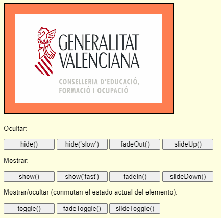
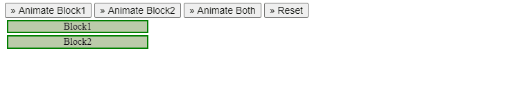

# 9. **Efectos**

Tabla de contenidos

- [9. **Efectos**](#9-efectos)
  - [9.1. Efectos Incorporados en la Biblioteca](#91-efectos-incorporados-en-la-biblioteca)
    - [9.1.1. Cambiar la Duración de los Efectos](#911-cambiar-la-duración-de-los-efectos)
    - [9.1.2. Realizar una Acción Cuando un Efecto fue Ejecutado](#912-realizar-una-acción-cuando-un-efecto-fue-ejecutado)
  - [9.2. Efectos Personalizados con `.animate`](#92-efectos-personalizados-con-animate)
    - [9.2.1. La función .animate()](#921-la-función-animate)
    - [9.2.1. Easing](#921-easing)
  - [9.3. Control de los Efectos](#93-control-de-los-efectos)

Con jQuery, agregar efectos a una página es muy fácil. Estos efectos poseen una configuración predeterminada pero también es posible proveerles parámetros personalizados. Además es posible crear animaciones particulares estableciendo valores de propiedades CSS.

Para una completa documentación sobre los diferentes tipos de efectos puede visitar la sección `effects`: <http://api.jquery.com/category/effects/>.

## 9.1. Efectos Incorporados en la Biblioteca

Los efectos más utilizado ya vienen incorporados dentro de la biblioteca en forma de métodos:

- `.show`: Muestra el elemento seleccionado.
- `.hide`: Oculta el elemento seleccionado.
- `.fadeIn`: De forma animada, cambia la opacidad del elemento seleccionado al 100%.
- `.fadeOut`: De forma animada, cambia la opacidad del elemento seleccionado al 0
- `.slideDown`: Muestra el elemento seleccionado con un movimiento de deslizamiento vertical.
- `.slideUp`: Oculta el elemento seleccionado con un movimiento de deslizamiento vertical.
- `.slideToggle`: Muestra o oculta el elemento seleccionado con un movimiento de deslizamiento vertical, dependiendo si actualmente el elemento está visible o no.

Ejemplo de uso uso básico de un efecto incorporado

```javascript
$('h1').show();
```

Veamos en el siguiente ejemplo de animaciones, donde por medio de botones pordemos ver la ejecución de cada uno de ellos:

```html
  <body>
      <div id="div1"></div>

      <p>Ocultar:</p>

      <input type="button" id="hide1" value="hide()" />
      <input type="button" id="hide2" value="hide('slow')" />
      <input type="button" id="fadeOut" value="fadeOut()" />
      <input type="button" id="slideUp" value="slideUp()" /><p />

      <p>Mostrar:</p>

      <input type="button" id="show1" value="show()" />
      <input type="button" id="show2" value="show('fast')" />
      <input type="button" id="fadeIn" value="fadeIn()" />
      <input type="button" id="slideDown" value="slideDown()" /><p />

      <p>Mostrar/ocultar (conmutan el estado actual del elemento):</p>

      <input type="button" id="toggle" value="toggle()" />
      <input type="button" id="fadeToggle" value="fadeToggle()" />
      <input type="button" id="slideToggle" value="slideToggle()" />

  </body>
```

```css
body {
  background-color: lightyellow;
  font-family: Arial;
  font-size: 10pt;
}
#div1 {
  height: 100px;
  width: 400px;
  background-color: lightgreen;
  padding: 20px;
  margin-bottom: 20px;
  border: 2px solid black;
}
input {
  width: 100px;
}
```

```javascript
$(document).ready(function () {
  // Ocultar

  $("#hide1").click(function () {
    $("#div1").hide();
  });

  $("#hide2").click(function () {
    $("#div1").hide("slow");
  });

  $("#fadeOut").click(function () {
    $("#div1").fadeOut();
  });

  $("#slideUp").click(function () {
    $("#div1").slideUp("fast");
  });

  // Mostrar

  $("#show1").click(function () {
    $("#div1").show();
  });

  $("#show2").click(function () {
    $("#div1").show("fast");
  });

  $("#fadeIn").click(function () {
    $("#div1").fadeIn();
  });

  $("#slideDown").click(function () {
    $("#div1").slideDown("slow");
  });

  // Mostrar y ocultar

  $("#toggle").click(function () {
    $("#div1").toggle("slow");
  });

  $("#fadeToggle").click(function () {
    $("#div1").fadeToggle("slow");
  });

  $("#slideToggle").click(function () {
    $("#div1").slideToggle("slow");
  });
});
```



> [Ejemplo de efectos con JQuery](https://codepen.io/sergio-rey-personal/pen/LYGMKEM)

### 9.1.1. Cambiar la Duración de los Efectos

Con la excepción de `.show` y `.hide`, todos los métodos tienen una duración predeterminada de la animación en 400ms. Este valor es posible cambiarlo.

- Configurar la duración de un efecto:

```javascript
$('h1').fadeIn(300);      // desvanecimiento en 300ms
$('h1').fadeOut('slow');  // utilizar una definición de velocidad interna
```

**Velocidades predeterminadas: jQuery.fx.speeds**

jQuery posee un objeto en `jQuery.fx.speeds` el cual contiene la velocidad predeterminada para la duración de un efecto, así como también los valores para las definiciones *"slow"* y *"fast"*.

```javascript
speeds: {
  slow: 600,
  fast: 200,
  // velocidad predeterminada
  _default: 400
}
```

Por lo tanto, es posible sobrescribir o añadir nuevos valores al objeto. Por ejemplo, puede que quiera cambiar el valor predeterminado del efecto o añadir una velocidad personalizada.

- Añadir velocidades personalizadas a `jQuery.fx.speeds`:

```javascript
jQuery.fx.speeds.muyRapido = 100;
jQuery.fx.speeds.muyLento = 2000;
```

### 9.1.2. Realizar una Acción Cuando un Efecto fue Ejecutado

A menudo, querrá ejecutar una acción una vez que la animación haya terminado --- ya que si ejecuta la acción antes que la animación haya acabado, puede llegar a alterar la calidad del efecto o afectar a los elementos que forman parte de la misma. [Definición: *Las funciones de devolución de llamada* (en inglés ***callback functions***) proveen una forma para ejecutar código una vez que un evento haya terminado.] En este caso, el evento que responderá a la función será la conclusión de la animación. Dentro de la función de devolución, la palabra clave `this` hace referencia al elemento en donde el efecto fue ejecutado y al igual que sucede con los eventos, es posible transformarlo a un objeto jQuery utilizando `$(this)`.

- Ejecutar cierto código cuando una animación haya concluido

```javascript
$('div.old').fadeOut(300, function() { $(this).remove(); });
```

Observa que si la selección no retorna ningún elemento, la función nunca se ejecutará. Este problema lo puede resolver comprobando si la selección devuelve algún elemento; y en caso que no lo haga, ejecutar la función de devolución inmediatamente.

- Ejecutar una función de devolución incluso si no hay elementos para animar:

```javascript
var $thing = $('#nonexistent');

var cb = function() {
  console.log('realizado');
};

if ($thing.length) {
  $thing.fadeIn(300, cb);
} else {
  cb();
}

```

## 9.2. Efectos Personalizados con `.animate`

Es posible realizar animaciones en propiedades CSS utilizando el método `.animate`. Dicho método permite realizar una animación estableciendo valores a propiedades CSS o cambiando sus valores actuales.

- Efectos personalizados con `.animate`:

```javascript
$('div.funtimes').animate(
  {
      left : "+=50",
      opacity : 0.25
  },
  300, // duration
  function() { console.log('realizado'); // función de devolución de llamada
});
```

> **Nota**: Las propiedades relacionadas al color no pueden ser animadas utilizando el método `.animate`, pero es posible hacerlo a través de la extensión [color plugin](http://plugins.jquery.com/files/jquery.color.js.txt). Más adelante veremos la utilizarción de estas extensiones.

### 9.2.1. La función .animate()

Como muchas de las funciones **jQuery** esta función es muy flexible y tiene muchas posibilidades. En este curso nos centraremos, como hemos venido haciendo hasta ahora, en los usos más frecuentes.

```js
    //Especificando los propiedades
    // Valores especiales ‘show’, ‘hide’ ‘toggle’
    // Incremento con respecto al valor actual += y -=
    $("some_selector").animate({
        prop1 : valor1,
        prop2 : valor2,
        …
        proprN : valorN
    });

    //Especificando los propiedades y duración
    $(“some_selector”).animate({
        prop1 : valor1,
        prop2 : valor2,
        …
        proprN : valorN
    }, duración_milisegundos);

```

Podemos ilustarlo con varios ejemplos:

```js
//Animo el tamaño de las letra de los td
//En dos segundos
$("td").animate(
  {
    fontSize: "3rem"
  },
  2000
);

//Incremento el alto y ancho de las imágenes en 3 segundos
$("img").animate(
  {
    height: "+=50px", //50 pixels más
    width: "+=50px" //50 pixels menos
  },
  3000
);

//Efecto de desaparecer de las imágenes
//Cortinilla horizontal
$("img").animate(
  {
    opacity: 0,
    width: "hide"
  },
  5000
);
```

### 9.2.1. Easing

[Definición: El concepto de *Easing* describe la manera en que un efecto ocurre --- es decir, si la velocidad durante la animación es constante o no.] jQuery incluye solamente dos métodos de easing: *swing* y *linear*. Si desea transiciones más naturales en las animaciones, existen varias extensiones que lo permiten.

> A partir de la versión 1.4 de la biblioteca, es posible establecer el tipo de transición por cada propiedad utilizando el método `.animate`.

-  Transición de easing por cada propiedad

```javascript
$('div.funtimes').animate(
  {
      left : [ "+=50", "swing" ],
      opacity : [ 0.25, "linear" ]
  },
  300
);
```

Para más detalles sobre las opciones de easing, consulte <http://api.jquery.com/animate/>.

Veamos un ejemplo de `.animate`, en el que tenemos dos áreas que cambian su tamaño de forma animada:

```html
<button id="go1">&raquo; Animate Block1</button>
<button id="go2">&raquo; Animate Block2</button>
<button id="go3">&raquo; Animate Both</button>
<button id="go4">&raquo; Reset</button>
<div id="block1">Block1</div>
<div id="block2">Block2</div>
```

```css
div {
  background-color: #bca;
  width: 200px;
  height: 1.1em;
  text-align: center;
  border: 2px solid green;
  margin: 3px;
  font-size: 14px;
}
button {
  font-size: 14px;
}
```

```javascript
$("#go1").click(function () {
  $("#block1")
    .animate(
      {
        width: "90%"
      },
      {
        queue: false,
        duration: 3000
      }
    )
    .animate({ fontSize: "24px" }, 1500)
    .animate({ borderRightWidth: "15px" }, 1500);
});

$("#go2").click(function () {
  $("#block2")
    .animate({ width: "90%" }, 1000)
    .animate({ fontSize: "24px" }, 1000)
    .animate({ borderLeftWidth: "15px" }, 1000);
});

$("#go3").click(function () {
  $("#go1").add("#go2").click();
});

$("#go4").click(function () {
  $("div").css({
    width: "",
    fontSize: "",
    borderWidth: ""
  });
});
```

Obtenemos el siguiente resultado : 



> [Ejemplo de efectos con `.animate`en JQuery](https://codepen.io/sergio-rey-personal/pen/NWxeZaj)


## 9.3. Control de los Efectos

jQuery provee varias herramientas para el manejo de animaciones.

- `.stop`: Detiene las animaciones que se están ejecutando en el elemento seleccionado.
- `.delay`: Espera un tiempo determinado antes de ejecutar la próxima animación.
```javascript
$('h1').show(300).delay(1000).hide(300);
```
- `.off`: Si el valor es verdadero (*true*), no existirán transiciones para las animaciones; y a los elementos se le establecerá el estado final de la animación. Este método puede ser especialmente útil cuando se esta trabajando con navegadores antiguos.

Los efectos de JQuery dan la posibilidad de definir una función que se procesará cuando haya finalizado la animación. Veamos un ejemplo de cómo hacerlo:

```html
  <body>
    <div id="log"> </div>
    <div id="div1"></div>
    <input type="button" id="fadeTo" value="Haz clic" />
  </body>
  ```

  ```css
  body {
  background-color: lightyellow;
  font-family: Arial;
  font-size: 10pt;
}
#div1 {
  height: 175px;
  width: 290px;
  background-color: coral;
  padding: 20px;
  margin-bottom: 20px;
  border: 2px solid black;
}
#log {
  color: yellow;
  background-color: red;
  margin-bottom: 10px;
}
```

```javascript
$(document).ready(function () {
  $("#fadeTo").click(function () {
    $("#div1").fadeTo(3000, 0.2, function () {
      $("#log").text("Fin de la animación");
    });
  });
});
```

Con el siguiente resultado :


> [Ejemplo de control de final de animación con JQuery (Codepen)](https://codepen.io/sergio-rey-personal/pen/MWKZdZp)


