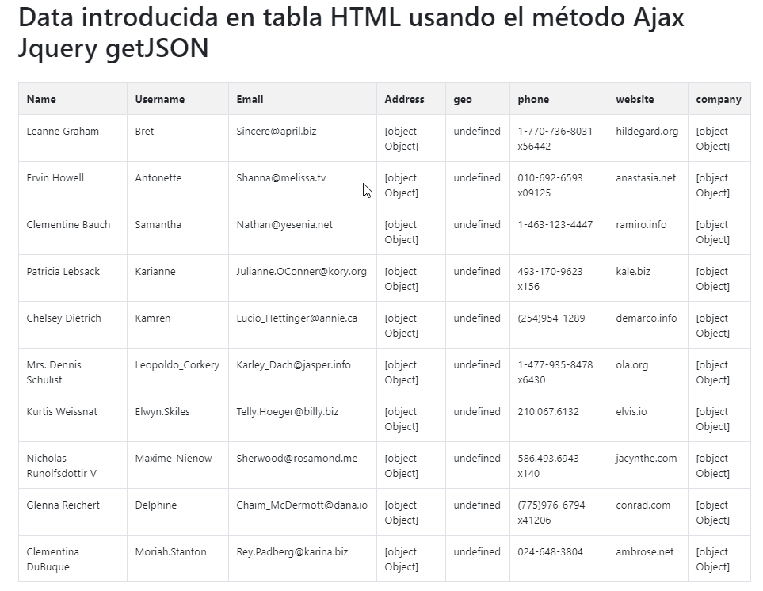

# 10. **Ajax en JQuery**

Tabla de contenidos

- [10. **Ajax en JQuery**](#10-ajax-en-jquery)
  - [10.1 Introducción](#101-introducción)
  - [10.2 Conceptos Clave](#102-conceptos-clave)
    - [10.2.1 GET vs. POST](#1021-get-vs-post)
    - [10.2.2 Tipos de Datos](#1022-tipos-de-datos)
    - [10.2.3 Asincronismo](#1023-asincronismo)
    - [10.2.4 Políticas de Mismo Origen y JSONP](#1024-políticas-de-mismo-origen-y-jsonp)
    - [10.2.5 Ajax y Firebug](#1025-ajax-y-firebug)
  - [10.3 Métodos Ajax de jQuery](#103-métodos-ajax-de-jquery)
    - [10.3.1 $.ajax](#1031-ajax)
      - [10.3.1.1 Opciones del método `$.ajax`](#10311-opciones-del-método-ajax)
    - [10.3.2 Métodos Convenientes](#1032-métodos-convenientes)
    - [10.3.3 `$.fn.load`](#1033-fnload)
  - [10.4 Ajax y Formularios](#104-ajax-y-formularios)
  - [10.5 Trabajar con JSONP](#105-trabajar-con-jsonp)
  - [10.6 Eventos Ajax](#106-eventos-ajax)


## 10.1 Introducción

El método *`XMLHttpRequest`* (XHR) permite a los navegadores comunicarse con el servidor sin la necesidad de recargar la página. Este método, también conocido como Ajax (*Asynchronous JavaScript and XML*), permite la creación de aplicaciones ricas en interactividad.

Las peticiones Ajax son ejecutadas por el código JavaScript, el cual envía una petición a una URL y cuando recibe una respuesta, una función de devolución puede ser ejecutada la cual recibe como argumento la respuesta del servidor y realiza algo con ella. Debido a que la respuesta es asíncrona, el resto del código de la aplicación continua ejecutándose, por lo cual, es imperativo que una función de devolución sea ejecutada para manejar la respuesta.

A través de varios métodos, jQuery provee soporte para Ajax, permitiendo abstraer las diferencias que pueden existir entre navegadores. Los métodos en cuestión son `$.get()`, `$.getScript()`, `$.getJSON()`, `$.post()` y `$().load()`.

A pesar que la definición de Ajax posee la palabra "XML", la mayoría de las aplicaciones no utilizan dicho formato para el transporte de datos, sino que en su lugar se utiliza HTML plano o información en formato JSON (*JavaScript Object Notation*).

En general, Ajax no trabaja a través de dominios diferentes. Sin embargo, existen excepciones, como los servicios que proveen información en formato JSONP (*JSON with Padding*), los cuales permiten una funcionalidad limitada a través de diferentes dominios.

## 10.2 Conceptos Clave

La utilización correcta de los métodos Ajax requiere primero la comprensión de algunos conceptos clave.

### 10.2.1 GET vs. POST

Los dos métodos HTTP más comunes para enviar una petición a un servidor son **GET** y **POST**. Es importante entender la utilización de cada uno.

El método *GET* debe ser utilizado para operaciones no-destructivas --- es decir, operaciones en donde se esta "obteniendo" datos del servidor, pero no modificando. Por ejemplo, una consulta a un servicio de búsqueda podría ser una petición **GET**. Por otro lado, las solicitudes **GET** pueden ser almacenadas en la cache del navegador, pudiendo conducir a un comportamiento impredecible si no se lo espera. Generalmente, la información enviada al servidor, es enviada en una cadena de datos (en inglés *query string*).

El método **POST** debe ser utilizado para operaciones destructivas --- es decir, operaciones en donde se está incorporando información al servidor. Por ejemplo, cuando un usuario guarda un artículo en un blog, esta acción debería utilizar **POST**. Por otro lado, este tipo de método no se guarda en la cache del navegador. Además, una cadena de datos puede ser parte de la URL, pero la información tiende a ser enviada de forma separada.

### 10.2.2 Tipos de Datos

Generalmente, jQuery necesita algunas instrucciones sobre el tipo de información que se espera recibir cuando se realiza una petición Ajax. En algunos casos, el tipo de dato es especificado por el nombre del método, pero en otros casos se lo debe detallar como parte de la configuración del método:

- `text`: Para el transporte de cadenas de caracteres simples.
- `html`; Para el transporte de bloques de código HTML que serán ubicados en la página.
- `script`: Para añadir un nuevo *script* con código JavaScript a la página.
- `json`: Para transportar información en formato JSON, el cual puede incluir cadenas de caracteres, vectores y objetos.

> **Nota**: A partir de la versión 1.4 de la biblioteca, si la información JSON no está correctamente formateada, la petición podría fallar. Visite <http://json.org> para obtener detalles sobre un correcto formateo de datos en JSON.

Es recomendable utilizar los mecanismos que posea el lenguaje del lado de servidor para la generación de información en formato JSON.

- `jsonp`: Para transportar información JSON de un dominio a otro.

- `xml`: Para transportar información en formato XML.

> *A pesar de los diferentes tipos de datos de que se puede utilizar, es recomendable utilizar el formato JSON, ya que es muy flexible, permitiendo por ejemplo, enviar al mismo tiempo información plana y HTML.*

### 10.2.3 Asincronismo

Debido a que, de forma predeterminada, las llamadas Ajax son asíncronas, la respuesta del servidor no esta disponible de forma inmediata. Por ejemplo, el siguiente código no debería funcionar:

```javascript
var response;
$.get('foo.php', function(r) { response = r; });
console.log(response); // indefinido (undefined)
```

En su lugar, es necesario especificar una función de devolución de llamada; dicha función se ejecutará cuando la petición se haya realizado de forma correcta ya que es en ese momento cuando la respuesta del servidor esta lista.

```javascript
$.get('foo.php', function(response) { console.log(response); });
```

### 10.2.4 Políticas de Mismo Origen y JSONP

En general, las peticiones Ajax están limitadas a utilizar el mismo protocolo (*`http`* o *`https`*), el mismo puerto y el mismo dominio de origen. Esta limitación no se aplica a los scripts cargados a través del método Ajax de jQuery.

La otra excepción es cuando se hace una petición que recibirá una respuesta en formato ***JSONP***. En este caso, el proveedor de la respuesta debe responder la petición con un `script` que puede ser cargado utilizando la etiqueta `<script>`, evitando así la limitación de realizar peticiones desde el mismo dominio. Dicha respuesta contendrá la información solicitada, contenida en una función

### 10.2.5 Ajax y Firebug

***Firebug*** (o el inspector WebKit que viene incluido en Chrome o Safari) son herramientas imprescindibles para trabajar con peticiones Ajax, ya que es posible observarlas desde la pestaña Consola de Firebug (o yendo a Recursos > Panel XHR desde el inspector de Webkit) y revisar los detalles de dichas peticiones. Si algo esta fallando cuando trabaja con Ajax, este es el primer lugar en donde debe dirigirse para saber cual es el problema.

## 10.3 Métodos Ajax de jQuery

Como se indicó anteriormente, jQuery posee varios métodos para trabajar con Ajax. Sin embargo, todos están basados en el método `$.ajax`, por lo tanto, su comprensión es obligatoria. A continuación se abarcará dicho método y luego se indicará un breve resumen sobre los demás métodos.

*Generalmente, es preferible utilizar el método $.ajax en lugar de los otros, ya que ofrece más características y su configuración es muy comprensible.*

### 10.3.1 $.ajax

El método `$.ajax` es configurado a través de un objeto, el cual contiene todas las instrucciones que necesita jQuery para completar la petición. Dicho método es particularmente útil debido a que ofrece la posibilidad de especificar acciones en caso que la petición haya fallado o no. Además, al estar configurado a través de un objeto, es posible definir sus propiedades de forma separada, haciendo que sea más fácil la reutilización del código. Puede visitar <http://api.jquery.com/jQuery.ajax/> para consultar la documentación sobre las opciones disponibles en el método.

```javascript
$.ajax({
    // la URL para la petición
    url : 'post.php',

    // la información a enviar
    // (también es posible utilizar una cadena de datos)
    data : { id : 123 },

    // especifica si será una petición POST o GET
    type : 'GET',

    // el tipo de información que se espera de respuesta
    dataType : 'json',

    // código a ejecutar si la petición es satisfactoria;
    // la respuesta es pasada como argumento a la función
    success : function(json) {
        $('<h1/>').text(json.title).appendTo('body');
        $('<div class="content"/>')
            .html(json.html).appendTo('body');
    },

    // código a ejecutar si la petición falla;
    // son pasados como argumentos a la función
    // el objeto jqXHR (extensión de XMLHttpRequest), un texto con el estatus
    // de la petición y un texto con la descripción del error que haya dado el servidor
    error : function(jqXHR, status, error) {
        alert('Disculpe, existió un problema');
    },

    // código a ejecutar sin importar si la petición falló o no
    complete : function(jqXHR, status) {
        alert('Petición realizada');
    }
});

```
> Una aclaración sobre el parámetro `dataType`: Si el servidor devuelve información que es diferente al formato especificado, el código fallará, y la razón de porque lo hace no siempre quedará clara debido a que la respuesta HTTP no mostrará ningún tipo de error. Cuando esté trabajando con peticiones Ajax, debe estar seguro que el servidor esta enviando el tipo de información que esta solicitando y verifique que la cabecera `Content-type` es exacta al tipo de dato. Por ejemplo, para información en formato JSON, la cabecera `Content-type` debería ser `application/json`.

#### 10.3.1.1 Opciones del método `$.ajax`

El método $.ajax posee muchas opciones de configuración, y es justamente esta característica la que hace que sea un método muy útil. Para una lista completa de las opciones disponibles, puede consultar <http://api.jquery.com/jQuery.ajax/>; a continuación se muestran las más comunes:

- `async`: Establece si la petición será asíncrona o no. De forma predeterminada el valor es `true`. Debe tener en cuenta que si la opción se establece en `false`, la petición bloqueará la ejecución de otros códigos hasta que dicha petición haya finalizado.
- `cache`: Establece si la petición será guardada en la cache del navegador. De forma predeterminada es `true` para todos los *dataType* excepto para "*script*" y "*jsonp*". Cuando posee el valor `false`, se agrega una cadena de caracteres anti-cache al final de la URL de la petición.
- `complete`: Establece una función de devolución de llamada que se ejecuta cuando la petición esta completa, aunque haya fallado o no. La función recibe como argumentos el objeto jqXHR (en versiones anteriores o iguales a jQuery 1.4, recibe en su lugar el objeto de la petición en crudo `XMLHTTPRequest`) y un texto especificando el estatus de la misma petición (`success`, `notmodified`, `error`, `timeout`, `abort`, o `parsererror`).
- `context`: Establece el alcance en que la/las funciones de devolución de llamada se ejecutaran (por ejemplo, define el significado de `this` dentro de las funciones). De manera predeterminada `this` hace referencia al objeto originalmente pasado al método `$.ajax`.
- `data`: Establece la información que se enviará al servidor. Esta puede ser tanto un objeto como una cadena de datos (por ejemplo `foo=bar&baz=bim`.)
- `dataType`: Establece el tipo de información que se espera recibir como respuesta del servidor. Si no se especifica ningún valor, de forma predeterminada, jQuery revisa el tipo de *MIME* que posee la respuesta.
- `error`: Establece una función de devolución de llamada a ejecutar si resulta algún error en la petición. Dicha función recibe como argumentos el objeto jqXHR (en versiones anteriores o iguales a jQuery 1.4, recibe en su lugar el objeto de la petición en crudo `XMLHTTPRequest`), un texto especificando el estatus de la misma petición (`timeout`, `error`, `abort`, o `parsererror`) y un texto con la descripción del error que haya enviado el servidor (por ejemplo `Not Found` o `Internal Server Error`).
- `jsonp`: Establece el nombre de la función de devolución de llamada a enviar cuando se realiza una petición *JSONP*. De forma predeterminada el nombre es "*callback*
- `success`: Establece una función a ejecutar si la petición a sido satisfactoria. Dicha función recibe como argumentos el objeto jqXHR (en versiones anteriores o iguales a jQuery 1.4, recibe en su lugar el objeto de la petición en crudo `XMLHTTPRequest`), un texto especificando el estatus de la misma petición y la información de la petición (convertida a objeto JavaScript en el caso que *dataType* sea *JSON*), el estatus de la misma.
- `timeout`: Establece un tiempo en milisegundos para considerar a una petición como fallada.
- `traditional`: Si su valor es true, se utiliza el estilo de serialización de datos utilizado antes de jQuery 1.4. Para más detalles puede visitar <http://api.jquery.com/jQuery.param/>.
- `type`: De forma predeterminada su valor es "GET". Otros tipos de peticiones también pueden ser utilizadas (como PUT y DELETE), sin embargo pueden no estar soportados por todos los navegadores.
- `url`: Establece la URL en donde se realiza la petición.

La opción `url` es obligatoria para el método `$.ajax`;

Como se comentó anteriormente, para una lista completa de las opciones disponibles, puede consultar <http://api.jquery.com/jQuery.ajax/>.

> **Nota**: A partir de la versión 1.5 de jQuery, las opciones `beforeSend`, `success`, `error` y `complete` reciben como uno de sus argumentos el objeto `jqXHR` siendo este una extensión del objeto nativo `XMLHTTPRequest`. El objeto `jqXHR` posee una serie de métodos y propiedades que permiten modificar u obtener información particular de la petición a realizar, como por ejemplo sobreescribir el tipo de *MIME* que posee la respuesta que se espera por parte del servidor. Para información sobre el objeto `jqXHR` puede consultar <http://api.jquery.com/jQuery.ajax/#jqXHR>.

### 10.3.2 Métodos Convenientes

En caso que no quiera utilizar el método `$.ajax`, y no necesite los controladores de errores, existen otros métodos más convenientes para realizar peticiones Ajax (aunque, como se indicó antes, estos están basados el método `$.ajax` con valores pre-establecidos de configuración).

Los métodos que provee la biblioteca son:

- `$.get`: Realiza una petición GET a una URL provista.
- `$.post`: Realiza una petición POST a una URL provista.
- `$.getScript`: Añade un script a la página.
- `$.getJSON`: Realiza una petición GET a una URL provista y espera que un dato JSON sea devuelto.

Los métodos deben tener los siguientes argumentos, en orden:

- `url`: La URL en donde se realizará la petición. Su valor es obligatorio.
- `data`: La información que se enviará al servidor. Su valor es opcional y puede ser tanto un objeto como una cadena de datos (como `foo=bar&baz=bim`). (Ojo *Esta opción no es valida para el método `$.getScript`*).
- `success callback`: Una función opcional que se ejecuta en caso que petición haya sido satisfactoria. Dicha función recibe como argumentos la información de la petición y el objeto en bruto de dicha petición.
- `data type`: El tipo de dato que se espera recibir desde el servidor. Su valor es opcional.


Ejemplo de utilización de métodos convenientes para peticiones Ajax

```javascript
// obtiene texto plano o html
$.get('/users.php', { userId : 1234 }, function(resp) {
    console.log(resp);
});

// añade un script a la página y luego ejecuta la función especificada
$.getScript('/static/js/myScript.js', function() {
    functionFromMyScript();
});

// obtiene información en formato JSON desde el servidor
$.getJSON('/details.php', function(resp) {
    $.each(resp, function(k, v) {
        console.log(k + ' : ' + v);
    });
});
```

***Ejemplo obtención de tabla por `JSON`***

```html
<!-- Tabla usando Bootstrap -->
<div class="container">
  <div class="table-responsive">
    <h1>Data introducida en tabla HTML usando el método Ajax Jquery getJSON</h1>
    <br />
    <table class="table table-bordered table-striped" id="employee_table">
      <tr>
        <th>Name</th>
        <th>Username</th>
        <th>Email</th>
        <th>Address</th>
        <th>geo</th>
        <th>phone</th>
        <th>website</th>
        <th>company</th>
      </tr>
    </table>
  </div>
</div>
```

```javascript
$(document).ready(function () {
  $.getJSON("https://jsonplaceholder.typicode.com/users", function (data) {
    var employee_data = "";
    $.each(data, function (key, value) {
      employee_data += "<tr>";
      employee_data += "<td>" + value.name + "</td>";
      employee_data += "<td>" + value.username + "</td>";
      employee_data += "<td>" + value.email + "</td>";
      employee_data += "<td>" + value.address + "</td>";
      employee_data += "<td>" + value.geo + "</td>";
      employee_data += "<td>" + value.phone + "</td>";
      employee_data += "<td>" + value.website + "</td>";
      employee_data += "<td>" + value.company + "</td>";
      employee_data += "<tr>";
    });
    $("#employee_table").append(employee_data);
  });
});
```

Obtenemos el siguiente resultado:



> [Ejemplo de Datos introducidos en tabla HTML usando el método Ajax Jquery getJSON](https://codepen.io/sergio-rey-personal/pen/BajMRaG)


### 10.3.3 `$.fn.load`

El método `$.fn.load` es el único que se puede llamar desde una selección. Dicho método obtiene el código HTML de una URL y rellena a los elementos seleccionados con la información obtenida. En conjunto con la URL, es posible especificar opcionalmente un selector, el cual obtendrá el código especificado en dicha selección.

Utilizando el método `$.fn.load` para rellenar un elemento

```javascript
$('#newContent').load('/foo.html');
```

y utilización del método `$.fn.load` para rellenar un elemento basado en un selector

```javascript
$('#newContent').load('/foo.html #myDiv h1:first', function(html) {
  alert('Contenido actualizado');
});
```

## 10.4 Ajax y Formularios

Las capacidades de jQuery con Ajax pueden ser especialmente útiles para el trabajo con formularios. Por ejemplo, la extensión [jQuery Form Plugin](http://jquery.malsup.com/form/) es una extensión para añadir capacidades Ajax a formularios. Existen dos métodos que debe conocer para cuando este realizando este tipo de trabajos: `$.fn.serialize` y `$.fn.serializeArray`.

- Transformar información de un formulario a una cadena de datos

```javascript
$('#myForm').serialize();
```

- Crear un vector de objetos conteniendo información de un formulario**

```javascript
$('#myForm').serializeArray();

// crea una estructura como esta:
[
    { name : 'field1', value : 123 },
    { name : 'field2', value : 'hello world' }
]
```

## 10.5 Trabajar con JSONP

En los últimos tiempos, la introducción de JSONP, ha permitido la creación de aplicaciones híbridas de contenidos. Muchos sitios importantes ofrecen JSONP como servicio de información, el cual se accede a través de una API (en inglés *Application programming interface*) predefinida. Un servicio particular que permite obtener información en formato JSONP es [Yahoo! Query Language](http://developer.yahoo.com/yql/console/), el cual se utiliza a continuación para obtener, por ejemplo, noticias sobre gatos:

```javascript
$.ajax({
  url : 'http://query.yahooapis.com/v1/public/yql',

  // se agrega como parámetro el nombre de la función de devolución,
  // según se especifica en el servicio de YQL
  jsonp : 'callback',

  // se le indica a jQuery que se espera información en formato JSONP
  dataType : 'jsonp',

  // se le indica al servicio de YQL cual es la información
  // que se desea y que se la quiere en formato JSON
  data : {
      q : 'select title,abstract,url from search.news where query="cat"',
      format : 'json'
  },

  // se ejecuta una función al ser satisfactoria la petición
  success : function(response) {
      console.log(response);
  }
});
```

jQuery se encarga de solucionar todos los aspectos complejos de la petición JSONP. Lo único que debe hacer es especificar el nombre de la función de devolución (en este caso "*callback*", según lo especifica YQL) y el resultado final será como una petición Ajax normal.

## 10.6 Eventos Ajax

A menudo, querrá ejecutar una función cuando una petición haya comenzado o terminado, como por ejemplo, mostrar o ocultar un indicador. En lugar de definir estas funciones dentro de cada petición, jQuery provee la posibilidad de vincular eventos Ajax a elementos seleccionados. Para una lista completa de eventos Ajax, puede consultar <http://docs.jquery.com/Ajax_Events>.

```javascript
$('#loading_indicator')
    .ajaxStart(function() { $(this).show(); })
    .ajaxStop(function() { $(this).hide(); });
```
