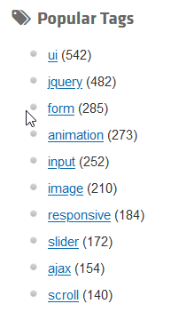
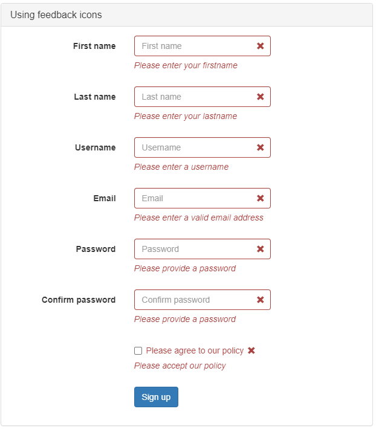
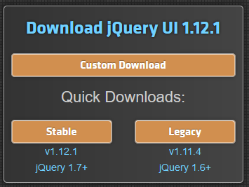
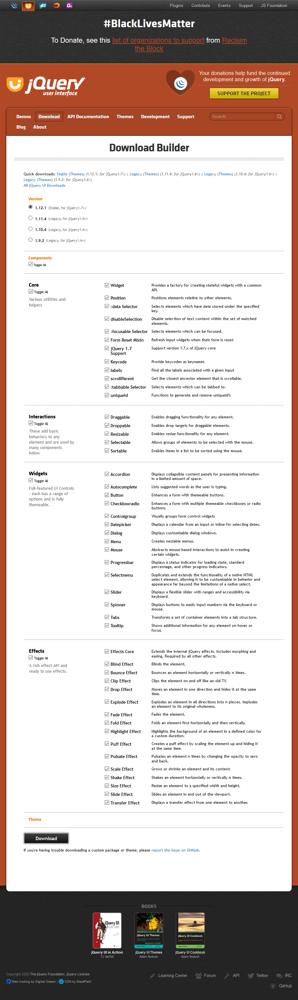
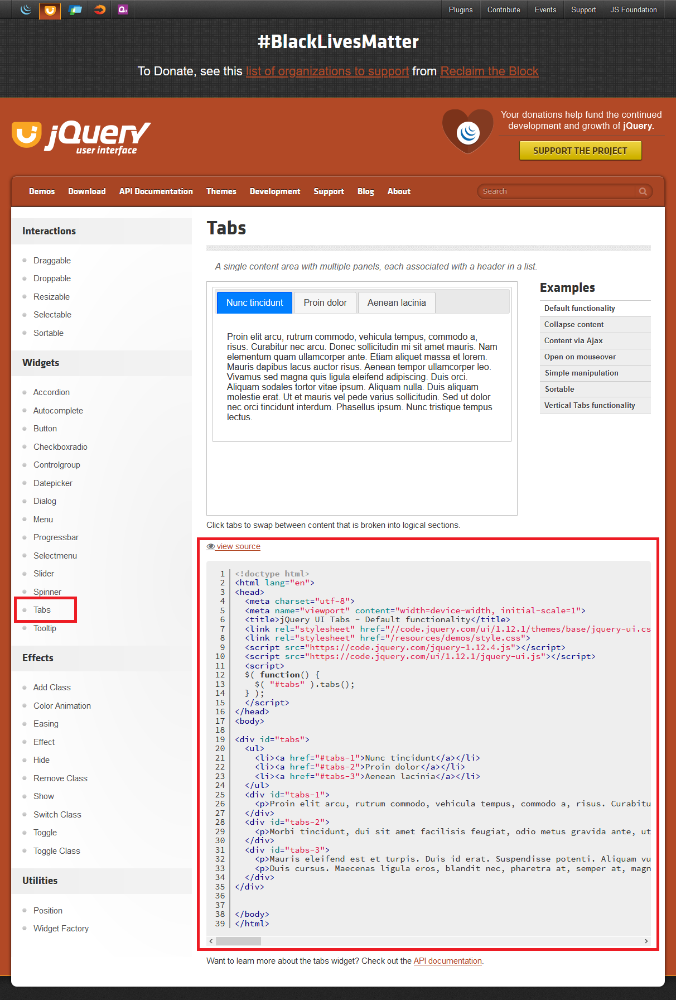
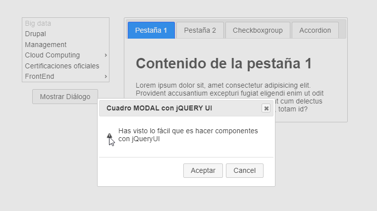
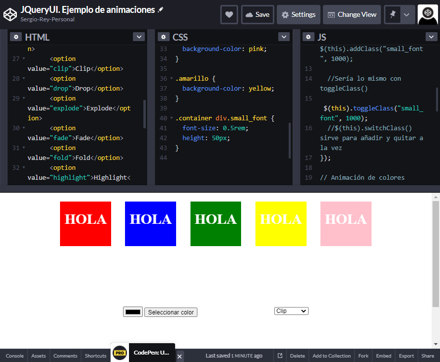
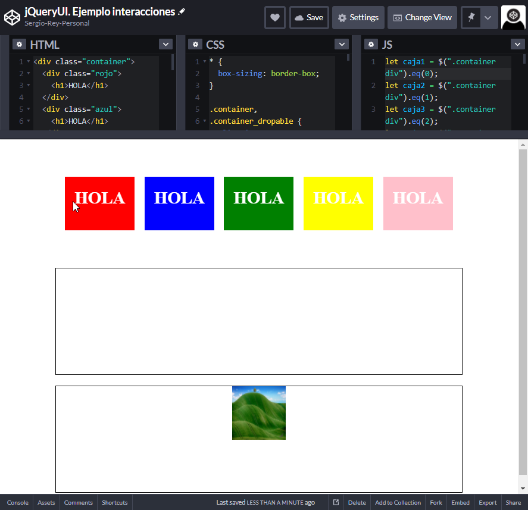

# 11. **Plugins y librerías en JQuery**

Tabla de contenidos

- [11. **Plugins y librerías en JQuery**](#11-plugins-y-librerías-en-jquery)
  - [11.1. Plugins](#111-plugins)
    - [11.1.1. `Validate`: Validando un formulario](#1111-validate-validando-un-formulario)
    - [11.1.2. `slick`: slide de imágenes.](#1112-slick-slide-de-imágenes)
    - [11.1.3. `Skippr`: slide de imágenes.](#1113-skippr-slide-de-imágenes)
  - [11.2. Creación de plugins](#112-creación-de-plugins)
  - [11.3. Librería jQuery UI](#113-librería-jquery-ui)
    - [11.3.1. Instalación de jQueryUI](#1131-instalación-de-jqueryui)
  - [11.3.2. Componentes jQueryUI](#1132-componentes-jqueryui)
    - [11.3.3. Efectos en jQuery UI](#1133-efectos-en-jquery-ui)
    - [11.3.4. Interacciones avanzadas en jQuery UI III](#1134-interacciones-avanzadas-en-jquery-ui-iii)

## 11.1. Plugins

Otro de los puntos fuertes de JQuery es la gran comunidad que gira en torno a dicho proyecto aportando cientos de **plugins** que podemos utilizar de forma totalmente gratuita.

Para descargarlos accede al repositorio oficial de plugins haciendo clic en [este enlace](http://plugins.jquery.com/) y navega entre los etiquetados como más populares (animaciones, AJAX, formularios, etc.) o utiliza el buscador que encontrarás en la parte superior de la página. También puedes encontrar otros muchos buscando en la web.



A continuación mostraremos algunos ejemplos prácticos de cómo integrar plugins de JQuery en una página web.

### 11.1.1. `Validate`: Validando un formulario

En este punto vamos a ver cómo utilizar uno de los mejores plugins existentes para **validar formularios** con JQuery, Validate, el cual dispone de varias métodos para comprobar que los componentes requeridos han sido rellenados y/o que el formato de los datos es el esperado.

Para descargarlo haz clic en [este enlace](http://bassistance.de/jquery-plugins/jquery-plugin-validation/) y a continuación pulsa en Download

Una vez descomprimido el archivo descargado entra en la carpeta dist y copia los archivos jquery.validate.min.js y additional-methods.min.js a nuestro proyecto, para luego enlazarlos en nuestras páginas web.

El primero de dichos archivos contiene el plugin en sí, y el segundo incorpora más métodos aún para relizar la validación.

Por otro lado, podemos extender las funcionalidades del plugin escribiendo otros métodos propios (en tal caso es recomendable guardarlos en un archivo aparte).

Algunos de los métodos de validación más útiles que incluye son (para más información consulta el enlace a la documentación facilitado más abajo):

- `required()`: especifica que el campo debe contener un valor.
- `minlength()` / `maxlength()`: permite indicar un número mínimo/máximo de caracteres que ha de contener.
- `rangelength()`: indica que el número de caracteres que puede contener el componente ha estar entre un rango especificado.
- `min()` / `max()`: permite indicar el valor mínimo/máximo que ha de contener.
- `range()`: indica que el valor ha de estar entre un rango específico.
- `email()`: especifica que el valor introducido debe tener formato de dirección de correo electrónico.
- `url()`: especifica que el valor introducido debe tener formato de dirección URL válida (comenzando por 'http://', 'https://' o 'ftp://').
- `number()`: indica que el valor introducido deberá ser numérico (entero o decimal).
- `digits()`: indica que el valor introducido deberá ser numérico (entero).
- `creditcard()`: indica que el valor introducido deberá tener formato de número de tarjeta de crédito.
- `equalTo()`: permite especificar que el valor introducido tendrá que ser el mismo que contenga otro campo (útil por ejemplo cuando queramos que el usuario confirme la contraseña o dirección E-Mail).
- `accept()`: en caso de usar un componente de formulario para seleccionar un archivo y enviarlo al servidor (hacer upload) permite indicar los tipos de archivo MIME que serán admitidos.
- `extension()`: como la opción anterior, pero permite indicar las extensiones de archivo que serán admitidas.

Por otro lado, si enlazamos el archivo additional-methods.min.js dispondremos entre otros de los siguientes métodos:

- `dateITA()`: admite fechas con formato 'dd/mm/yyyy'.
- `time()`: admite una hora en formato de 24 horas, entre 00:00 y 23:59.
- `time12h()`: admite una hora en formato de 12 horas (ej: '5:30 pm', '05:30 PM').
- `stripHtml()`: elimina tags HTML.
- `minWords()` / `maxWords()`: indica que el componente deberá contener un número mínimo/máximo de palabras.
- `rangeWords()`: indica que el componente podrá contener un número de palabras entre el rango que especifiquemos.
- `letterswithbasicpunc()`: permite que un cuadro de texto contenga sólo letras y unos determinados caracteres (guión medio, punto, coma, paréntesis, comillas simples o dobles y espacio).
- `nowhitespace()`: no permite que hayan espacios.
- `lettersonly()`: pemite que hayan letras únicamente.
- `alphanumeric()`: permite sólo letras, números y guiones bajos.
- `integer()`: admite sólo números enteros (positivos o negativos).
- `ipv4()`: dirección IP en formato IPV4.
- `ipv6()`: dirección IP en formato IPV6.

En caso de que el formulario haya sido cumplimentado de forma correcta tenemos la posibilidad de usar el método submitHandler() para procesar una función callback.

Veamos ahora un ejemplo donde podemo ver junto este plugin y Bootstrap.

[Ejemplo de Plugin de valicación con JQuery usando Bootstrap](https://github.com/jquery-validation/jquery-validation/blob/master/demo/bootstrap/index.html)

Cabe destacar la forma en la que se validan los campos: 

```javascript 
$(document).ready(function () {
  $("#signupForm1").validate({
    rules: {
      firstname1: "required",
      lastname1: "required",
      username1: {
        required: true,
        minlength: 2
      },
      password1: {
        required: true,
        minlength: 5
      },
      confirm_password1: {
        required: true,
        minlength: 5,
        equalTo: "#password1"
      },
      email1: {
        required: true,
        email: true
      },
      agree1: "required"
    },
    messages: {
      firstname1: "Please enter your firstname",
      lastname1: "Please enter your lastname",
      username1: {
        required: "Please enter a username",
        minlength: "Your username must consist of at least 2 characters"
      },
      password1: {
        required: "Please provide a password",
        minlength: "Your password must be at least 5 characters long"
      },
      confirm_password1: {
        required: "Please provide a password",
        minlength: "Your password must be at least 5 characters long",
        equalTo: "Please enter the same password as above"
      },
      email1: "Please enter a valid email address",
      agree1: "Please accept our policy"
    },
    errorElement: "em",
    errorPlacement: function (error, element) {
      // Add the `help-block` class to the error element
      error.addClass("help-block");

      // Add `has-feedback` class to the parent div.form-group
      // in order to add icons to inputs
      element.parents(".col-sm-5").addClass("has-feedback");

      if (element.prop("type") === "checkbox") {
        error.insertAfter(element.parent("label"));
      } else {
        error.insertAfter(element);
      }

      // Add the span element, if doesn't exists, and apply the icon classes to it.
      if (!element.next("span")[0]) {
        $(
          "<span class='glyphicon glyphicon-remove form-control-feedback'></span>"
        ).insertAfter(element);
      }
    },
    success: function (label, element) {
      // Add the span element, if doesn't exists, and apply the icon classes to it.
      if (!$(element).next("span")[0]) {
        $(
          "<span class='glyphicon glyphicon-ok form-control-feedback'></span>"
        ).insertAfter($(element));
      }
    },
    highlight: function (element, errorClass, validClass) {
      $(element)
        .parents(".col-sm-5")
        .addClass("has-error")
        .removeClass("has-success");
      $(element)
        .next("span")
        .addClass("glyphicon-remove")
        .removeClass("glyphicon-ok");
    },
    unhighlight: function (element, errorClass, validClass) {
      $(element)
        .parents(".col-sm-5")
        .addClass("has-success")
        .removeClass("has-error");
      $(element)
        .next("span")
        .addClass("glyphicon-ok")
        .removeClass("glyphicon-remove");
    }
  });
});
```


https://jqueryvalidation.org/files/demo/bootstrap/index.html

> [Ejemplo de validación de formularios con plugin de validación y Bootstrap](https://codepen.io/sergio-rey-personal/pen/QWyYvQw)

Observa que por cada opción de validación definida en `rules` definimos otra en `messages`, y que en caso de que un componente tenga definida una sola regla basa con especificar un mensaje entre comillas.

Fíjate también en que dentro de `messages` es posible incluir código HTML.

### 11.1.2. `slick`: slide de imágenes.

Este componente es muy versatil para poder realizar slides de imágenes.

En la página web del proyecto [slick](http://kenwheeler.github.io/slick/) puedes ver su funcionalidad.

### 11.1.3. `Skippr`: slide de imágenes.

Otro plugin JQuery para realización de slides muy sencillos y vistosos

Visita su web para ver sus capacidades [skippr](http://austenpayan.github.io/skippr/)

## 11.2. Creación de plugins

Los plugins en jQuery se crean asignando una función a la propiedad "fn" del objeto jQuery. A partir de entonces, esas funciones asignadas se podrán utilizar en cualquier objeto jQuery, como uno de los muchos métodos que dispone dicho objeto principal del framework.

La creación de plugins, para ampliar las funcionalidades de jQuery, es una cosa tan básica que la mayoría de las funciones con las que está dotado el propio framework están incluidas en el objeto jQuery por medio de plugins. Es decir, en la construcción del framework en muchas de las ocasiones simplemente se crean plugins para extenderlo. Así pues, esta técnica es usada, no sólo por terceros desarrolladores, para crear nuevos componentes, sino también por el propio equipo de jQuery para el diseño base de este framework.

Si lo deseamos, aparte de seguir los próximos artículos de este manual, podemos ver el código fuente del framework o cómo están hechos los plugins de otros desarrolladores, para tener una idea sobre cómo se utilizan.

A modo de ejemplo, podemos ver a continuación un código fuente de un plugin muy sencillo:

```javascript
jQuery.fn.desaparece = function() {
   this.each(function(){
      elem = $(this);
      elem.css("display", "none");
   });   
   return this;
};
```

Este plugin permitiría hacer desaparecer a los elementos de la página y podríamos invocarlo por ejemplo de la siguiente manera:

```javascript
$("h1").desaparece();
```

## 11.3. Librería jQuery UI


Si atendemos a la definición que nos dan los propios desarrolladores:

> **jQuery UI** es un conjunto seleccionado de efectos, componentes y temas construidos sobre jQuery.

Y esa definición junto con la situación de **jQuery UI** en la siguiente pila de tecnologías:


Nos lleva da decir que:

> **jQuery UI** es una tecnología **construida sobre jQuery** que nos va a permitir dotar de **interactividad compleja** a mi página web de manera más **fácil** ya que **añade** numerosas características nuevas a lo que ya conocemos de **jQuery**.

Los principales elementos de jQuery UI, que trataremos en capítulos posteriores son:

- **Componentes o Widgets**.
- **Efectos**.
- **Interacciones**.


### 11.3.1. Instalación de jQueryUI

Podemos instalar jQuery de varias maneras:



- Mediante el uso de la librería por defecto, ya sea porque las descargamos o porque enlazamos a un CDN (Hosted Libraries).
- Seleccionando los componentes que queremos.
- Seleccionando el tema que queremos.



Para incluir jQueryUI en nuestro proyecto, es imprescindible cargar antes la librería de jQuery

```html
  <script src="https://code.jquery.com/jquery-3.5.1.js"></script>
  <script src="https://code.jquery.com/ui/1.12.1/jquery-ui.js"></script>
```

## 11.3.2. Componentes jQueryUI

**jQuery UI** nos proporciona muchos componentes pero antes de conocerlos y de empezar a trabajar con ellos vamos a definir qué es un componente:

- **Definición de componente**

> **Componente:** son elementos web que son **comunes** y que constan de una **estructura** HTML, de unos **estilos** CSS y de un **comportamiento** normalmente definido mediante javaScript. Además, están bien documentados y preparados para ser reutilizados. En definitiva son **"plantillas"** de elementos web.

- **Lista de componentes de jQuery UI.**

Como hemos visto en la captura anterior, La lista de componentes de jQuery es la siguiente:

- **Acordeón**. 
- Autocompletado.
- **Botones**. 
- **Checkboxradio**. 
- Controlgroup.
- DatePicker.
- **Dialog**.
- **Menú**.
- ProgressBar.
- SelectMenu.
- Slider.
- Spinner.
- **Tabs**.
- Tooltips.

Todos estos componentes tienen un montón de opciones, un montón de métodos y un montón de eventos propios. Podríamos dedicar un curso completo a **jQeuryUI** pero en este apartado vamos a ver únicamente algunas de las opciones (las más básicas) y algunos de los componentes (los que están señalados más arriba).

- **Algunos ejemplos de componentes:**

En todos los casos el flujo de trabajo que vamos a utilizar será similar al siguiente:

1. Seleccionaremos el componente que queremos usar.
2. Iremos a la opción por defecto del componente.
3. Veremos la fuente del ejemplo (View Source), copiaremos y pegaremos el HTML del ejemplo y lo retocaremos para adaptarlo a nuestras necesidades.
4. En caso de necesitar algo más revisaremos las opciones del API de cada componente.
5. Para mostrar el componente y que se ejecute, en la parte del `script` se debe ejecutar la llamada al mismo:

```js
$("#tabs").tabs();
```

En la web, en componente lo encontramos de la siguiente forma



Pretendemos obtener un resultado similar al siguiente ejemplo donde vamos a utilizar varios elementos.:

```html
<div class="container">
  <div class="menu">
    <ul id="menu">
      <li class="ui-state-disabled">
        <div>Big data</div>
      </li>
      <li>
        <div>Drupal</div>
      </li>
      <li>
        <div>Management</div>
      </li>
      <li>
        <div>Cloud Computing</div>
        <ul>
          <li class="ui-state-disabled">
            <div>Azure</div>
          </li>
          <li>
            <div>GCE</div>
          </li>
          <li>
            <div>AWS</div>
          </li>
        </ul>
      </li>
      <li>
        <div>Certificaciones oficiales</div>
      </li>
      <li>
        <div>FrontEnd</div>
        <ul>
          <li>
            <div>JavaScript</div>
            <ul>
              <li>
                <div>NodeJs</div>
              </li>
              <li>
                <div>jQuery</div>
              </li>
            </ul>
          </li>
          <li>
            <div>HTML</div>
            <ul>
              <li>
                <div>BootStrap</div>
              </li>
              <li>
                <div>CSS3</div>
              </li>
              <li>
                <div>HTML5</div>
              </li>
            </ul>
          </li>
        </ul>
      </li>
    </ul>
    <p>
      <button id="showDialog">Mostrar Diálogo</button>
    </p>
  </div>
  <div class="tabs">
    <div id="tabs">
      <ul>
        <li><a href="#tabs-1">Pestaña 1</a></li>
        <li><a href="#tabs-2">Pestaña 2</a></li>
        <li><a href="#tabs-3">Checkboxgroup</a></li>
        <li><a href="#tabs-4">Accordion</a></li>
      </ul>
      <div id="tabs-1">
        <p>
          <h1>Contenido de la pestaña 1</h1>
        </p>
        Lorem ipsum dolor sit, amet consectetur adipisicing elit. Provident accusantium excepturi fugiat
        eligendi enim ut odit perferendis doloremque praesentium quaerat cum delectus temporibus quia illo
        soluta neque, molestiae, totam id?
      </div>
      <div id="tabs-2">
        <p>
          <h1>Contenido de la pestaña 2</h1>
        </p>
        Lorem ipsum dolor sit amet consectetur adipisicing elit. Dolorem, consequuntur earum natus
        architecto, sed aperiam possimus debitis repudiandae maiores at aliquam alias! Eius nesciunt
        suscipit provident blanditiis et porro in.
      </div>
      <div id="tabs-3">
        <p>
          <h1>Contenido de la pestaña 3</h1>
        </p>
        <h2>Planes de suscripción</h2>
        <fieldset>
          <legend>Seleccionar un plan: </legend>
          <label for="radio-1">Plan Menual</label>
          <input type="radio" name="radio-1" id="radio-1">
          <label for="radio-2">Plan Anual</label>
          <input type="radio" name="radio-1" id="radio-2">
          <label for="radio-3">Cupón de descuento</label>
          <input type="radio" name="radio-1" id="radio-3">
        </fieldset>
      </div>
      <div id="tabs-4">
        <p>
          <h1>Contenido de la pestaña 4</h1>
        </p>
        <div id="accordion">
          <h3>Section 1</h3>
          <div>
            <p>
              Mauris mauris ante, blandit et, ultrices a, suscipit eget, quam. Integer
              ut neque. Vivamus nisi metus, molestie vel, gravida in, condimentum sit
              amet, nunc. Nam a nibh. Donec suscipit eros. Nam mi. Proin viverra leo ut
              odio. Curabitur malesuada. Vestibulum a velit eu ante scelerisque vulputate.
            </p>
          </div>
          <h3>Section 2</h3>
          <div>
            <p>
              Sed non urna. Donec et ante. Phasellus eu ligula. Vestibulum sit amet
              purus. Vivamus hendrerit, dolor at aliquet laoreet, mauris turpis porttitor
              velit, faucibus interdum tellus libero ac justo. Vivamus non quam. In
              suscipit faucibus urna.
            </p>
          </div>
          <h3>Section 3</h3>
          <div>
            <p>
              Nam enim risus, molestie et, porta ac, aliquam ac, risus. Quisque lobortis.
              Phasellus pellentesque purus in massa. Aenean in pede. Phasellus ac libero
              ac tellus pellentesque semper. Sed ac felis. Sed commodo, magna quis
              lacinia ornare, quam ante aliquam nisi, eu iaculis leo purus venenatis dui.
            </p>
            <ul>
              <li>List item one</li>
              <li>List item two</li>
              <li>List item three</li>
            </ul>
          </div>
          <h3>Section 4</h3>
          <div>
            <p>
              Cras dictum. Pellentesque habitant morbi tristique senectus et netus
              et malesuada fames ac turpis egestas. Vestibulum ante ipsum primis in
              faucibus orci luctus et ultrices posuere cubilia Curae; Aenean lacinia
              mauris vel est.
            </p>
            <p>
              Suspendisse eu nisl. Nullam ut libero. Integer dignissim consequat lectus.
              Class aptent taciti sociosqu ad litora torquent per conubia nostra, per
              inceptos himenaeos.
            </p>
          </div>
        </div>
      </div>
    </div>
  </div>
</div>

<!-- CUADRO MODAL-->
<div id="dialog-confirm" title="Cuadro MODAL con jQUERY UI">
  <p><span class="ui-icon ui-icon-alert" style="float:left; margin:12px 12px 20px 0;"></span>
    Has visto lo fácil que es hacer componentes con jQueryUI</p>
</div>
```

```css
* {
  box-sizing: border-box;
}

.container {
  display: flex;
  margin: 40px auto;
  width: 80%;
}

.menu {
  padding: 1rem;
  width: 30%;
}

.menu p {
  text-align: center;
}

.tabs {
  padding: 1rem;
  width: 70%;
}

```

```js
//Aplicación de jQuery UI para mostrar los componentes
$("#menu").menu();
$("#tabs").tabs();
//Para que quepa en la pestaña sin problemas
$("#accordion").accordion({ heightStyle: "content" });
$("#tabs-3 input").checkboxradio();
$("#showDialog").button();
$("#dialog-confirm").dialog({
  resizable: false,
  autoOpen: false,
  height: "auto",
  width: 400,
  modal: true,
  buttons: {
    Aceptar: function () {
      $(this).dialog("close");
    },
    Cancel: function () {
      $(this).dialog("close");
    }
  }
});

//Eventos jQuery Normales
$("#showDialog").click(function (event) {
  //Llamada con parámetros al componente Diálogo
  $("#dialog-confirm").dialog("open");
});
```

Quedando el siguiente resulado



> [Ejemplo de uso de componentes en Codepen](https://codepen.io/sergio-rey-personal/pen/KKzmmbM)

> ***Nota***: Para que funcione correctamente el ejemplo en ***codepen***, debemos añadir los `scripts` (js) de `jquery` y `jqueryUI` y además en los estilos debemos añadir el estilo que acompaña a la librería de `jqueryUI`y de la cual hacen uso sus componentes: https://ajax.googleapis.com/ajax/libs/jqueryui/1.12.1/themes/base/jquery-ui.css


### 11.3.3. Efectos en jQuery UI

**jQuery UI** en relación de los efectos, y comparándolo con **jQuery**:

- Añade más _funcionalidades_ o tipos de efectos.
- Soporta la animación de colores,
- Permite las transiciones entre distintas clases CSS interpolando el valor de las propiedades entre ambas.
- Te da la posibilidad de usar nuevas curvas de animación.

**Funciones de efectos en jQuery UI**

Para conseguir todo lo descrito anteriormente jQuery UI nos proporciona la siguiente funciones de efectos.

- **.addClass()**. <---
- Animación de colores con **.animate()**.<---
- **.effect():** Es la función general con la que podemos lograr lo mismo que con las demás.
- **.removeClass()**<---
- **.show()**<---
- **.switchClass():** Es como .addClass() y .removeClass() juntas.
- **.hide():**<---
- **.toggle()**<--
- **.toggleClass()**<---
- **.easing():** Para aplicar una función matemática que describa la evolución del efecto.

Usaremos los señaladas que además, como podéis ver son los mismos métodos que usamos en **jQuery** normal pero, esta vez, tendrán más parámetros indicando duración, tipo de efecto, opciones etc...

El método de trabajo será similar al que hemos explicado para los componentes y de igual maneras vamos a ver los usos más básicos y fáciles.

Veamos su uso con el siguiente ejemplo:

```html
<div class="container">
  <div class="rojo">
    <h1>HOLA</h1>
  </div>
  <div class="azul">
    <h1>HOLA</h1>
  </div>
  <div class="verde">
    <h1>HOLA</h1>
  </div>
  <div class="amarillo">
    <h1>HOLA</h1>
  </div>
  <div class="rosa">
    <h1>HOLA</h1>
  </div>
</div>
<div class="container">
  <p class="colores">
    <input type="color">
    <button>Seleccionar color</button>
  </p>
  <p class="efectos">
    <select>
      <option value="blind">Blind</option>
      <option value="bounce">Bounce</option>
      <option value="clip">Clip</option>
      <option value="drop">Drop</option>
      <option value="explode">Explode</option>
      <option value="fade">Fade</option>
      <option value="fold">Fold</option>
      <option value="highlight">Highlight</option>
      <option value="puff">Puff</option>
      <option value="pulsate">Pulsate</option>
      <option value="scale">Scale</option>
      <option value="shake">Shake</option>
      <option value="size">Size</option>
      <option value="slide">Slide</option>
    </select>
  </p>
</div>
```

```css
* {
  box-sizing: border-box;
}

.container {
  display: flex;
  height: 200px;
  justify-content: space-evenly;
  margin: 20px auto;
  width: 80%;
}

.container div {
  color: white;
  height: 100px;
  text-align: center;
  width: 15%;
}

.rojo {
  background-color: red;
}

.azul {
  background-color: blue;
}

.verde {
  background-color: green;
}

.rosa {
  background-color: pink;
}

.amarillo {
  background-color: yellow;
}

.container div.small_font {
  font-size: 0.5rem;
  height: 50px;
}
```

```js
let caja1 = $(".container div").eq(0);
let caja2 = $(".container div").eq(1);
let caja3 = $(".container div").eq(2);
let caja4 = $(".container div").eq(3);
let caja5 = $(".container div").eq(4);

//Usando las funciones de clases para animar
//Tienen la misma síntaxis que con jQuery pero le añado la duración de la
//Transición
$(".container div").click(function (event) {
  //$(this).hasClass("small_font") ? $(this).removeClass("small_font", 1000)
  //    : $(this).addClass("small_font", 1000);

  //Sería lo mismo con toggleClass()
  $(this).toggleClass("small_font", 1000);
  //$(this).switchClass() sirve para añadir y quitar a la vez
});

// Animación de colores
// Usando la misma función animate pero reconoce las propiedades de color
$(".colores button").on("click", function (event) {
  let color = $("input[type='color']").val();
  console.log(color);

  $(".container:first div").animate(
    {
      "background-color": color
    },
    3000
  );
});

$(".efectos select").change(function (event) {
  $(".container:first div").toggle($(this).val(), 2000);
  //Sería el mismo funcionamiento para .hide()  .show()
});
```

quedando la siguiente pantalla :



> [y como siempre, el ejemplo en formato Codepen](https://codepen.io/sergio-rey-personal/pen/YzqVQyM)

### 11.3.4. Interacciones avanzadas en jQuery UI III 

Para acabar este capítulo y para acabar el curso vamos a hablar de las interacciones que nos proporciona **jQuery UI**.

Pero antes empezar a trabajar con ellas vamos a definir el concepto.

**¿Qué es una interacción?**

Las **interacciones** son _eventos avanzados_ que son realizados por los usuarios de manera frecuente.

**jQuery UI** no permite realizar de manera fácil una serie de interacciones que serían muy difíciles de programar desde cero.

**Lista de interacciones jQuery UI**

Son las siguientes:

- **Draggable:** Permite mover los elementos por la página de manera libre. <---
- **Droppable:** Permite que elementos sean receptores de los elementos que hemos indicados como _draggables_.<---
- **Resizable:** Permite redimensionar los elementos.<---
- **Selectable:** Permite seleccionar uno o varios elementos.
- **Sortable:** Permite reordenar los elementos.

De igual manera que antes con los componentes y con los efectos, las interacciones son muy flexibles y nos ofrecen muchas posibilidades. Para hacer su presentación nos vamos a limitar a las interacciones indicadas, los usos más generales y a una conjunto pequeño de opciones.

Todo esto lo podemos ver en el siguiente ejemplo:

```html
* {
  box-sizing: border-box;
}

.container,
.container_dropable {
  align-items: center;
  display: flex;
  height: 200px;
  justify-content: space-evenly;
  margin: 20px auto;
  width: 80%;
}

.container_img {
  border: 1px solid black;
  height: 200px;
  margin: 20px auto;
  width: 80%;
}

.container_img img {
  height: 100px;
  width: 100px;
}

.container_img > * {
  margin: 0px auto !important;
}
.container_dropable {
  border: 1px solid black;
  align-items: center;
}

.container div,
.container_dropable div {
  color: white;
  height: 100px;
  text-align: center;
  width: 130px;
}

.rojo {
  background-color: red;
}

.azul {
  background-color: blue;
}

.verde {
  background-color: green;
}

.rosa {
  background-color: pink;
}

.amarillo {
  background-color: yellow;
}

.container div.small_font {
  font-size: 0.5rem;
  height: 50px;
}
```

```css
* {
  box-sizing: border-box;
}

.container,
.container_dropable {
  align-items: center;
  display: flex;
  height: 200px;
  justify-content: space-evenly;
  margin: 20px auto;
  width: 80%;
}

.container_img {
  border: 1px solid black;
  height: 200px;
  margin: 20px auto;
  width: 80%;
}

.container_img img {
  height: 100px;
  width: 100px;
}

.container_img > * {
  margin: 0px auto !important;
}
.container_dropable {
  border: 1px solid black;
  align-items: center;
}

.container div,
.container_dropable div {
  color: white;
  height: 100px;
  text-align: center;
  width: 130px;
}

.rojo {
  background-color: red;
}

.azul {
  background-color: blue;
}

.verde {
  background-color: green;
}

.rosa {
  background-color: pink;
}

.amarillo {
  background-color: yellow;
}

.container div.small_font {
  font-size: 0.5rem;
  height: 50px;
}
```

```js
let caja1 = $(".container div").eq(0);
let caja2 = $(".container div").eq(1);
let caja3 = $(".container div").eq(2);
let caja4 = $(".container div").eq(3);
let caja5 = $(".container div").eq(4);

$(".container").sortable({
  //Opción para que se resalte el hueco
  placeholder: "ui-state-highlight"
});

$(".container_img img").resizable({
  containment: "parent",
  classes: {
    center: "center"
  }
});

$(".container div").draggable({
  //Para poder hacer drag and sort a la vez
  connectToSortable: ".container"
});

$(".container_dropable").droppable({
  accept: ".container > div",
  drop: function (event, ui) {
    //Le añado la clase de jQuery UI para resaltar
    $(this).addClass("ui-state-highlight");
    let elemento = ui.draggable;
    elemento.css("position", "static");
    $(this).append(elemento.clone());
    elemento.remove();
    console.log(ui);
  }
});

```



> [Ejemplo de interacciones con componentes JQueryUI en codepen](https://codepen.io/sergio-rey-personal/pen/bGpWRqw)

Las interacciones que valor añadido aportan son **Draggable**, **Droppable** y **Sortable**.

**NOTA:** Las interacciones a veces pueden entrar en conflicto entre ellas. Hay que leer la documentación con cuidado en ese caso.


