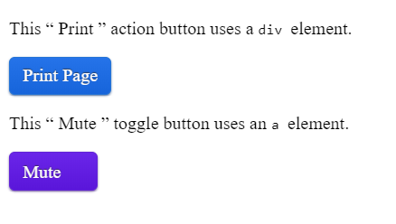

# 5. **Técnicas para satisfacer los requisitos definidos en las WCAG** 

Tabla de contenidos

- [5. **Técnicas para satisfacer los requisitos definidos en las WCAG**](#5-técnicas-para-satisfacer-los-requisitos-definidos-en-las-wcag)
  - [5.1. Técnicas fundamentales](#51-técnicas-fundamentales)
  - [5.2. Técnicas HTML](#52-técnicas-html)
  - [5.3. Técnicas CSS](#53-técnicas-css)
  - [5.4. Javascript](#54-javascript)
  - [5.5. Técnicas para servidor](#55-técnicas-para-servidor)
  - [5.6. Técnicas WAI-ARIA](#56-técnicas-wai-aria)
  - [5.7. Otras técnicas](#57-otras-técnicas)


Las técnicas para satisfacer los requisitos definidos en las WCAG están recogidas en la siguiente web: <https://www.w3.org/WAI/GL/WCAG20-TECHS/>

Como puedes ver, hay más de 400 técnicas para satisfacer todos los requisitos definidos en las WCAG, a continuación se mencionan las más destacadas:

## 5.1. Técnicas fundamentales

- Incluir alternativas de texto al contenido multimedia.
- Permitir pausar el contenido multimedia.
- Incluir alternativas legibles cuando la lectura dependa del contraste de colores.
- Ordenación coherente del contenido.
- Incluir glosarios, mapa del sitio, tabla de contenidos.
- Incluir títulos descriptivos.
- Añadir enlaces para ir al principio de la página.
- Identificar la localización del usuario dentro de la web (breadcrumbs).
- Evitar parpadeos.
- Alinear los textos de manera similar.
- Ofrecer feedback de confirmación o negación al realizar una operación, etc.

## 5.2. Técnicas HTML

- Utilizar elemento title para dar un título coherente a la página.
- Incluir la etiqueta meta description.
- Incluir el botón de submit en los formularios.
- Definir el idioma correspondiente con el atributo lang.
- Incluir el atributo alt en las imágenes.
- Utilizar el atributo caption y summary en las tablas.
- Maquetación sin tablas.
- Utilizar los encabezados h1-h6.
- Crear un orden de tabulación coherente en formularios y enlaces.
- Utilizar [etiquetas estructurales o elementos semánticos](https://github.com/Sergio-Rey-Personal/DIW/blob/master/UD03_Disenyo_y_maquetacion_web_con_HTML5_y_CSS3/UD03_02_HTML5.md).

## 5.3. Técnicas CSS

- Facilitar mecanismos para que se pueda modificar la hoja de estilos CSS: colores, fuentes, etc.
- [Separar la estructura de los estilos y no utilizar estilos en línea](https://github.com/Sergio-Rey-Personal/DIW/blob/master/UD03_Disenyo_y_maquetacion_web_con_HTML5_y_CSS3/UD03_22_ComoAplicarEstilosCSS.md).
- Utilizar tamaño de letra con [medidas relativas: unidades em](https://github.com/Sergio-Rey-Personal/DIW/blob/master/UD03_Disenyo_y_maquetacion_web_con_HTML5_y_CSS3/UD03_24_UnidadesDeMedidaCSS.md).
- Incluir el foco en los elementos mediante la [clase :focus](https://github.com/Sergio-Rey-Personal/DIW/blob/master/UD03_Disenyo_y_maquetacion_web_con_HTML5_y_CSS3/UD03_37_ResumenCSS.md#pseudo-clases-para-los-estados-de-un-elemento).
- Utilizar CSS para presentar el texto, controlar el espaciado, etc.

## 5.4. Javascript

- Aumentar los tiempos de acción.
- Soporte para utilizar tanto ratón como teclado.
- Validación de datos con alertas.
- Usar el DOM para manipular la página.
- Utilizar scripts para modificar el aspecto de la página, como el fondo.
- Utilizar scripts para hacer scroll por la página y que se pueda controlar.

## 5.5. Técnicas para servidor

- Aplicar redirecciones en lado del servidor (.htaccess)  y no en el cliente.

## 5.6. Técnicas WAI-ARIA

Las técnicas **WAI-ARIA (Web Accessibility Initiative -- Accessible Rich Internet Applications)** proporcionan semántica, de tal forma que se pueden transmitir comportamientos de la interfaz de usuario e información estructural a las tecnologías de apoyo (por ejemplo, lectores de pantalla). La especificación de ARIA establece componentes que definen r**oles, estados y propiedades de los elementos de la interfaz de usuario.**

Algunas de las técnicas que se especifican consisten en utilizar los **atributos** que definen los componentes:

- **aria-label**: etiquetar objetos.
- **aria-describedly**: controles de la interfaz de usuario.
- **aria-required:** campos requeridos.
- **aria-role:** indicar el rol de un control y agrupar los controles de grupos.
- **state y property** para mostrar los estados de los componentes.
- **aria landmarks** para establecer las regiones de una página.

> [Profundiza más en la técnica WAI-ARIA](https://olgacarreras.blogspot.com/2007/09/wai-aria-introduccion-referencias.html)

> [Ver ejemplos de ARIA en HTML](https://www.w3.org/TR/aria-in-html/)

> [Ver ejemplos atributo semántico "role"](https://www.ediciones-eni.com/open/mediabook.aspx?idR=82bf10a975d8defafd64bdcf2b089ea6)

Veamos un ejemplo en utilizando WAI-AREA sobre el uso de botones.

```html
<p>
  This
  <q>
    Print
  </q>
  action button uses a
  <code>
    div
  </code>
  element.
</p>
<div tabindex="0" role="button" id="action">
  Print Page
</div>
<p>
  This
  <q>
    Mute
  </q>
  toggle button uses an
  <code>
    a
  </code>
  element.
</p>
<a tabindex="0" role="button" id="toggle" aria-pressed="false">
  Mute
  <svg>
    <use xlink:href="images/mute.svg#icon-sound"></use>
  </svg>
</a>
```

```css
[role="button"] {
  display: inline-block;
  position: relative;
  padding: 0.4em 0.7em;
  border: 1px solid hsl(213, 71%, 49%);
  border-radius: 5px;
  box-shadow: 0 1px 2px hsl(216, 27%, 55%);
  color: #fff;
  text-shadow: 0 -1px 1px hsl(216, 27%, 25%);
  background-color: hsl(216, 82%, 51%);
  background-image: linear-gradient(
    to bottom,
    hsl(216, 82%, 53%),
    hsl(216, 82%, 47%)
  );
}

[role="button"]:hover {
  border-color: hsl(213, 71%, 29%);
  background-color: hsl(216, 82%, 31%);
  background-image: linear-gradient(
    to bottom,
    hsl(216, 82%, 33%),
    hsl(216, 82%, 27%)
  );
  cursor: default;
}

[role="button"]:focus {
  outline: none;
}

[role="button"]:focus::before {
  position: absolute;
  z-index: -1;

  /* button border width - outline width - offset */
  top: calc(-1px - 3px - 3px);
  right: calc(-1px - 3px - 3px);
  bottom: calc(-1px - 3px - 3px);
  left: calc(-1px - 3px - 3px);
  border: 3px solid hsl(213, 71%, 49%);

  /* button border radius + outline width + offset */
  border-radius: calc(5px + 3px + 3px);
  content: "";
}

[role="button"]:active {
  border-color: hsl(213, 71%, 49%);
  background-color: hsl(216, 82%, 31%);
  background-image: linear-gradient(
    to bottom,
    hsl(216, 82%, 53%),
    hsl(216, 82%, 47%)
  );
  box-shadow: inset 0 3px 5px 1px hsl(216, 82%, 30%);
}

[role="button"][aria-pressed] {
  border-color: hsl(261, 71%, 49%);
  box-shadow: 0 1px 2px hsl(261, 27%, 55%);
  text-shadow: 0 -1px 1px hsl(261, 27%, 25%);
  background-color: hsl(261, 82%, 51%);
  background-image: linear-gradient(
    to bottom,
    hsl(261, 82%, 53%),
    hsl(261, 82%, 47%)
  );
}

[role="button"][aria-pressed]:hover {
  border-color: hsl(261, 71%, 29%);
  background-color: hsl(261, 82%, 31%);
  background-image: linear-gradient(
    to bottom,
    hsl(261, 82%, 33%),
    hsl(261, 82%, 27%)
  );
}

[role="button"][aria-pressed="true"] {
  padding-top: 0.5em;
  padding-bottom: 0.3em;
  border-color: hsl(261, 71%, 49%);
  background-color: hsl(261, 82%, 31%);
  background-image: linear-gradient(
    to bottom,
    hsl(261, 82%, 63%),
    hsl(261, 82%, 57%)
  );
  box-shadow: inset 0 3px 5px 1px hsl(261, 82%, 30%);
}

[role="button"][aria-pressed="true"]:hover {
  border-color: hsl(261, 71%, 49%);
  background-color: hsl(261, 82%, 31%);
  background-image: linear-gradient(
    to bottom,
    hsl(261, 82%, 43%),
    hsl(261, 82%, 37%)
  );
  box-shadow: inset 0 3px 5px 1px hsl(261, 82%, 20%);
}

[role="button"][aria-pressed]:focus::before {
  border-color: hsl(261, 71%, 49%);
}

[role="button"] svg {
  margin: 0.15em auto -0.15em;
  height: 1em;
  width: 1em;
  pointer-events: none;
}
```

```javascript
/*
 *   This content is licensed according to the W3C Software License at
 *   https://www.w3.org/Consortium/Legal/2015/copyright-software-and-document
 *
 *   JS code for the button design pattern
 */

var ICON_MUTE_URL = "images/mute.svg#icon-mute";
var ICON_SOUND_URL = "images/mute.svg#icon-sound";

function init() {
  var actionButton = document.getElementById("action");
  actionButton.addEventListener("click", activateActionButton);
  actionButton.addEventListener("keydown", actionButtonKeydownHandler);
  actionButton.addEventListener("keyup", actionButtonKeyupHandler);

  var toggleButton = document.getElementById("toggle");
  toggleButton.addEventListener("click", toggleButtonClickHandler);
  toggleButton.addEventListener("keydown", toggleButtonKeydownHandler);
  toggleButton.addEventListener("keyup", toggleButtonKeyupHandler);
}

/**
 * Activates the action button with the enter key.
 *
 * @param {KeyboardEvent} event
 */
function actionButtonKeydownHandler(event) {
  // The action button is activated by space on the keyup event, but the
  // default action for space is already triggered on keydown. It needs to be
  // prevented to stop scrolling the page before activating the button.
  if (event.keyCode === 32) {
    event.preventDefault();
  }
  // If enter is pressed, activate the button
  else if (event.keyCode === 13) {
    event.preventDefault();
    activateActionButton();
  }
}

/**
 * Activates the action button with the space key.
 *
 * @param {KeyboardEvent} event
 */
function actionButtonKeyupHandler(event) {
  if (event.keyCode === 32) {
    event.preventDefault();
    activateActionButton();
  }
}

function activateActionButton() {
  window.print();
}

/**
 * Toggles the toggle button’s state if it’s actually a button element or has
 * the `role` attribute set to `button`.
 *
 * @param {MouseEvent} event
 */
function toggleButtonClickHandler(event) {
  if (
    event.currentTarget.tagName === "button" ||
    event.currentTarget.getAttribute("role") === "button"
  ) {
    toggleButtonState(event.currentTarget);
  }
}

/**
 * Toggles the toggle button’s state with the enter key.
 *
 * @param {KeyboardEvent} event
 */
function toggleButtonKeydownHandler(event) {
  if (event.keyCode === 32) {
    event.preventDefault();
  } else if (event.keyCode === 13) {
    event.preventDefault();
    toggleButtonState(event.currentTarget);
  }
}

/**
 * Toggles the toggle button’s state with space key.
 *
 * @param {KeyboardEvent} event
 */
function toggleButtonKeyupHandler(event) {
  if (event.keyCode === 32) {
    event.preventDefault();
    toggleButtonState(event.currentTarget);
  }
}

/**
 * Toggles the toggle button’s state between *pressed* and *not pressed*.
 *
 * @param {HTMLElement} button
 */
function toggleButtonState(button) {
  var isAriaPressed = button.getAttribute("aria-pressed") === "true";

  button.setAttribute("aria-pressed", isAriaPressed ? "false" : "true");

  var icon = button.querySelector("use");
  icon.setAttribute(
    "xlink:href",
    isAriaPressed ? ICON_SOUND_URL : ICON_MUTE_URL
  );
}

window.onload = init;
```

> [Ejemplo uso de técnica WAI-AREA en botones (codepen)](https://codepen.io/sergio-rey-personal/pen/xxVwNwZ)





## 5.7. Otras técnicas

Puedes ver más técnicas relacionadas con el uso de PDF, Flash, Silverlight, etc. en la web oficial: <https://www.w3.org/WAI/GL/WCAG20-TECHS/>

> [Ver guía breve y consejos de accesibilidad web](http://accesibilidadweb.dlsi.ua.es/?menu=guiabreve-1)

> [Ver más técnicas y ejemplos de accesibilidad](http://www.codexexempla.org/curso/curso_2_6.php)
