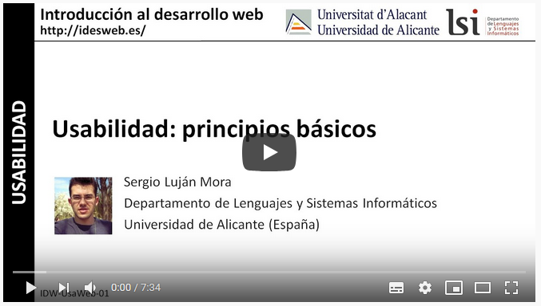

# 1. **Concepto de usabilidad**

Tabla de contenidos

- [1. **Concepto de usabilidad**](#1-concepto-de-usabilidad)
  - [1.1. ¿Que es la usabilidad?](#11-que-es-la-usabilidad)
  - [1.2. Características principales de la usabilidad.](#12-características-principales-de-la-usabilidad)
  - [1.3. Áreas relacionadas con la usabilidad](#13-áreas-relacionadas-con-la-usabilidad)
  - [1.4. Visión práctica de la usabilidad.](#14-visión-práctica-de-la-usabilidad)

## 1.1. ¿Que es la usabilidad?

Todo lo que forma parte de nuestro entorno, todo aquello relacionado con nuestro quehacer habitual, tiene una razón de ser. Los objetos y las herramientas que usamos han sido pensados por alguien y, probablemente, diseñados y construidos por varias personas. **Un producto que no sea agradable de usar, o que no sea funcional, no se utilizará y acabará en el ostracismo.**

¿A que nos referimos con nuestro quehacer habitual? A todo, absolutamente todo. Si para salir a la calle cogemos el ascensor, alguien habrá diseñado la forma y los botones para poder escoger a qué planta vayamos; si cogemos el coche para desplazarnos alguien habrá diseñado las formas y habrá programado la respuesta a nuestra actuación, y todos los carteles de información que encontramos, sus ubicaciones y el tamaño y el color de sus letras que nos guiarán en la hora de conducir también tendrán una razón de ser y una argumento de porque son así. De igual manera, podemos hacer mención de la interfaz gráfica otros dispositivos como sería el caso de un cajero automático, o bien de la interfaz de cualquier tipo de aplicación web o, propiamente, la de una página web.

En nuestro caso nos centraremos en la relación del usuario con la interfaz web y evaluaremos las facilidades que ofrece un determinado sitio web para su uso y también para su correcta explotación.

¿Por qué una página web es más visitada que otra que tiene la misma temática y/o contenidos? ¿Cuáles son los factores que  intervienen y que determinan el éxito o no de la web? La interacción de un usuario con un sitio web, su facilidad de navegación, el aprendizaje que hace para futuros accesos, la facilidad con la cual encuentra la información, si se considera la interfaz web agradable y muchos aspectos más son los que determinan este éxito. Estos aspectos son los que se trabajan en el que se denomina usabilidad web.

Las interfaces gráficas de un sitio web pueden vivir cambios y actualizaciones continuas, tanto de contenidos como de diseño. Aquellas que no se han actualizado a lo largo del tiempo, aunque sea su imagen o sus iconos o simplemente la tecnología con la cual han sido elaboradas, pueden dar la sensación de haberse quedado anticuadas. Precisamente, la interfaz de una web es la imagen de aquello que representa, y tiene que ofrecer unos mínimos de calidad para hacer que el acceso sea amigable y de utilidad para los usuarios.

Así, en la hora de trabajar el concepto de usabilidad habrá que tener en cuenta una serie de aspectos, como por ejemplo el objetivo de la web a analizar y el perfil de usuarios que  acceden. Este punto es clave para tomar decisiones de diseño que después nos ayudarán a mejorar la usabilidad.

Por otro lado, habrá que conocer el que se denominan principios de usabilidad, así como también técnicas de análisis de un sitio web que permitirán hacer una evaluación objetiva de su usabilidad.

## 1.2. Características principales de la usabilidad.

Dadas la definicio anterior, al abordar la Usabilidad implica también revisar una serie de aspectos relacionados con el uso y la manera en que las personas se relacionan con los sistemas que se les ofrecen.

Por lo mismo, se ha hecho necesario hacer una serie de comprobaciones de estos aspectos, mediante la revisión completa de la forma en que el espacio digital apoya a los usuarios en cumplir sus tareas en la mejor forma posible. Dicha revisión debe ser hecha a través de diferentes factores, entre los que se cuentan los siguientes:

- **Facilidad de aprendizaje**: define en cuánto tiempo un usuario, que nunca ha visto una interfaz, puede aprender a usarla bien y realizar operaciones básicas.
- **Facilidad y Eficiencia de uso**: determina la rapidez con que se pueden desarrollar las tareas, una vez que se ha aprendido a usar el sistema.
- **Facilidad de recordar cómo funciona**: se refiere a la capacidad de recordar las caractersticas y forma de uso de un sistema para volver a utilizarlo a futuro.
- **Frecuencia y gravedad de errores**: plantea la ayuda que se le entrega a los usuarios para apoyarlos cuando deban enfrentar los errores que cometen al usar el sistema.
- **Satisfacción subjetiva**: indica lo satisfechos que quedan los usuarios cuando han empleado el sistema, gracias a la facilidad y simplicidad de uso de sus pantallas.

## 1.3. Áreas relacionadas con la usabilidad

En torno a la Usabilidad se ha creado una comunidad que ha ido expandiendo sus capacidades y herramientas, abarcando reas como la "Experiencia de usuario" y la medición de la calidad de la misma, porque se entiende que mientras mayor sea la usabilidad de un sitio, mayor ser el impacto del Sitio Web en quienes lo visitan y utilizan.

Adicionalmente, es útil entender el contexto en el que se desenvuelve esta forma de trabajo utilizando para ello la perspectiva que ofrece Peter Morville, autor ya reseñado en la sección Encontrabilidad de esta Guía, cuando él sitúa la Usabilidad en función de otras variables que permiten medir la calidad de un Sitio Web desde diferentes perspectivas. En ese sentido, señala que un Sitio Web puede ser mejorado desde diferentes acercamientos, quedando la Usabilidad como uno más de ellos, permitiendo la aparición de otros con similar importancia que deben ser tenidos en cuenta al momento de hacer el rediseño de un Sitio Web.

A estos acercamientos simultáneos al de la Usabilidad el autor los denomina las Facetas de la Experiencia del Usuario, y corresponden a los siguientes:

- **Útil**: es necesario preguntarnos si nuestros productos y sistemas son útiles, y aplicar nuestro conocimiento para definir soluciones innovadoras que apoyan la utilidad.
- **Usable**: corresponde a la facilidad de uso o Usabilidad sigue siendo un aspecto fundamental, necesario pero no suficiente, por lo que se debe complementar con las demás facetas.
- **Deseable**: si bien los sitios deben ser eficientes, en particular con el uso de medios ms complejos (imágenes, sonidos, animaciones), esto se debe equilibrar con los demás valores del diseño emocional.
- **Encontrable**: los Sitios Web deben ser navegables y permitir que los usuarios puedan encontrar lo que necesitan.
- **Accesible**: los sitios Web deben ser accesibles a las personas con discapacidades (más de 10% de la población). Para los Sitios Web de Gobierno ya es un requisito normativo.
- **Creíble**: la credibilidad es uno de los factores más importantes de tener en cuenta y por ello se deben revisar los elementos de diseño que afectan la confianza que nos tienen los usuarios.
Valioso: las facetas ayudan a determinar los aspectos que llevan a que nuestros sitios ofrezcan valor para nuestros usuarios.

## 1.4. Visión práctica de la usabilidad.

Veamos en los siguientes vídeos del experto en Accesibilidad y Usabilidad Sergio Luján Mora sobre el concepto de Usabilidad

En primer lugar una introducción con los principios básicos de la usabilidad

> [Usabilidad: principios básicos](https://www.youtube.com/watch?v=a2u5HePNwEQ)

y una vuelta a la definición de usabilidad: ¿Qué es la usabilidad?

> [Usabilidad: qué es. Por Sergio Luján Mora](https://www.youtube.com/watch?v=R-IvF5KRx_M)