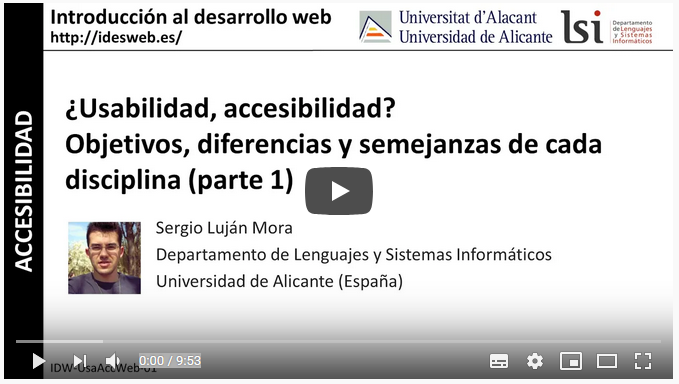
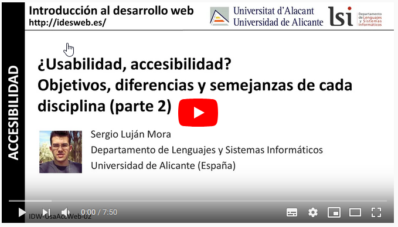
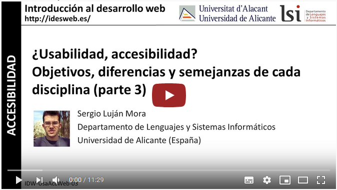
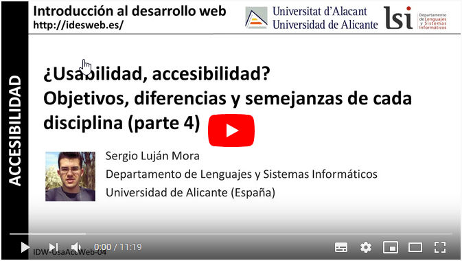

# 2. **Usabilidad vs Accesibilidad**

Tabla de contenidos

- [2. **Usabilidad vs Accesibilidad**](#2-usabilidad-vs-accesibilidad)
  - [2.1. Usabilidad vs. accesibilidad web, dos conceptos que no son lo mismo](#21-usabilidad-vs-accesibilidad-web-dos-conceptos-que-no-son-lo-mismo)
    - [2.1.1. Usabilidad](#211-usabilidad)
    - [2.1.2. Accesibilidad web](#212-accesibilidad-web)
  - [2.2. Objetivos, diferencias y semejanzas de cada disciplina.](#22-objetivos-diferencias-y-semejanzas-de-cada-disciplina)

## 2.1. Usabilidad vs. accesibilidad web, dos conceptos que no son lo mismo

Muchas veces tendemos a pensar que **usabilidad y accesibilidad web** abarcan los mismos conceptos, pero no es así, existen  **diferencias** y hay diferentes **pautas o técnicas** que conviene tener en cuenta a la hora de crear nuestra web.

Para comenzar, diremos que la usabilidad analiza el comportamiento del usuario a la hora de realizar una tarea en el entorno web, mientras que la accesibilidad hace referencia al acceso universal a una página web.

### 2.1.1. Usabilidad

La usabilidad permite que los usuarios puedan alcanzar sus objetivos con un mínimo esfuerzo y unos resultados máximos. Es decir, que puedan navegar por el entorno gráfico de nuestra web de manera sencilla y eficaz.  Los usuarios que accedan a nuestra página deben de disponer de autonomía a la hora de navegar por la web: **deben de tener el control del sitio**. La expresión "El cliente siempre tiene la razón" se transforma en este caso en "El usuario manda".

**La rapidez es imprescindible**. Los sitios cuya velocidad de carga es demasiado lenta hacen que los visitantes desistan de su intento por visitar la página. Según estadísticas, cuando un sitio web tarda más de 20 segundos en cargarse el 80% de sus visitantes acaba abandonando la página antes de verla.

Tenemos que asegurarnos de que **los enlaces de la web funcionen correctamente**, tanto los internos como los externos o los que permitirán al usuario ponerse en contacto con nosotros vía correo electrónico.

Un sitio de **apariencia limpia y sencilla** permitirá a los usuarios navegar con facilidad y encontrar siempre aquello que busquen en nuestra web. Cuanto más cómodo sea el navegar por la página más efectiva será la búsqueda de información de nuestro visitante, lo que se traduce en una mejor experiencia de usuario y a la postre en mejor conversión de usuarios en clientes. En definitiva, en resultados mejores con respecto a los objetivos perseguidos al construir un sitio.

La **interfaz de usuario** no debe de suponer un problema, tiene que requerir un mínimo proceso de aprendizaje y resultar amigable, es decir, **intuitiva**.

**La información es esencial**. Los títulos y descripciones son una gran ayuda para encontrar lo que se está buscando en menor tiempo. También debemos tener en cuenta que leer en pantalla no es tan cómodo como puede resultar en papel. Por eso, el contenido tiene que resumirse para que el usuario no tenga una sobrecarga de información. Debemos proporcionar una** lectura amena y concisa**.

La **percepción de los colores** no es la misma para todos (ni para los todos los dispositivos). Hay que usar los colores  con precaución para que todos usuarios  puedan navegar fácilmente por nuestro sitio.

Lo mismo ocurre con la **legibilidad**. Para que todo aquel que visite nuestra web pueda disfrutar de su contenido tenemos que cuidar que los textos contrasten con el fondo y que el tamaño de la fuente sea correcto para permitir su lectura con comodidad.

### 2.1.2. Accesibilidad web

La accesibilidad hace referencia al **acceso universal** a nuestro sitio web independientemente del hardware, el software, la localización geográfica o las infraestructuras de red de las que dispone el visitante en cuestión.

**Las circunstancias de cada usuario son distintas**: el país en el que reside y el idioma que habla, sus capacidades visuales, motrices, auditivas y cognitivas... Una web accesible tiene en cuenta estas circunstancias para poder brindar a la mayoría de usuarios un fácil acceso a las tecnologías.

Códigos XHTML, vídeos con subtítulos y contenidos ilustrados permiten a usuarios con discapacidades el navegar por Internet de manera satisfactoria, y ayudan a la construcción de una Internet igualitaria.

Por tanto, **la accesibilidad es algo esencial en todo tipo de páginas** y es un ejercicio de solidaridad con todo tipo de perfiles de usuario que pueden llegar a consultarla, con la intención de no dejar a nadie fuera por ser incapaz de usar un sitio web. Frecuentemente se asocia a las páginas gubernamentales, ya que las instituciones deben poder dar soporte a todos los ciudadanos, pero, en realidad, es un ámbito en el que todos debemos participar.

El tipo de contenido debe ser aquel que se pueda leer correctamente, facilitando cosas como las descripciones textuales del contenido de las imágenes. También se debe procurar que el código del HTML se pueda entender semánticamente, usando las etiquetas correctas que aporten significado a su contenido.

## 2.2. Objetivos, diferencias y semejanzas de cada disciplina.

En este apartado, de nuevo no basaremos en vídeos de Sergio Luján Mora para comprender los objetivos, diferencias y semejanzas entre la usabilidad y la accesibilidad, que ya estudiamos en la anterior unidad.

[¿Usabilidad, accesibilidad? Objetivos, diferencias y semejanzas de cada disciplina (parte 1)](https://www.youtube.com/watch?v=ECZ4Jmntdxo)

[¿Usabilidad, accesibilidad? Objetivos, diferencias y semejanzas de cada disciplina (parte 1)](https://www.youtube.com/watch?v=ECZ4Jmntdxo)

[¿Usabilidad, accesibilidad? Objetivos, diferencias y semejanzas de cada disciplina (parte 1)](https://www.youtube.com/watch?v=ECZ4Jmntdxo)

[¿Usabilidad, accesibilidad? Objetivos, diferencias y semejanzas de cada disciplina (parte 1)](https://www.youtube.com/watch?v=ECZ4Jmntdxo)

[¿Usabilidad, accesibilidad? Objetivos, diferencias y semejanzas de cada disciplina (parte 1)](https://www.youtube.com/watch?v=ECZ4Jmntdxo)

[¿Usabilidad, accesibilidad? Objetivos, diferencias y semejanzas de cada disciplina (parte 1)](https://www.youtube.com/watch?v=ECZ4Jmntdxo)