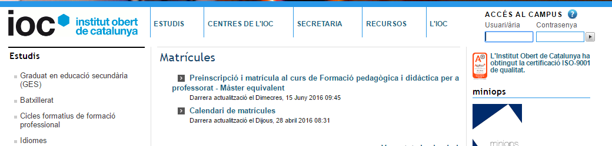
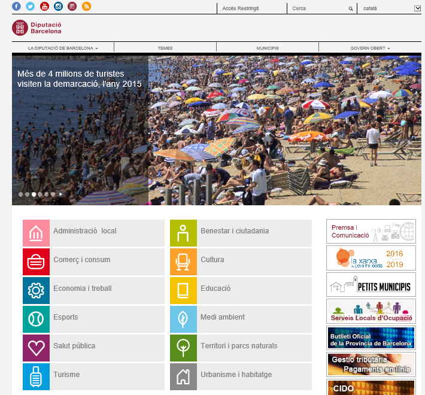
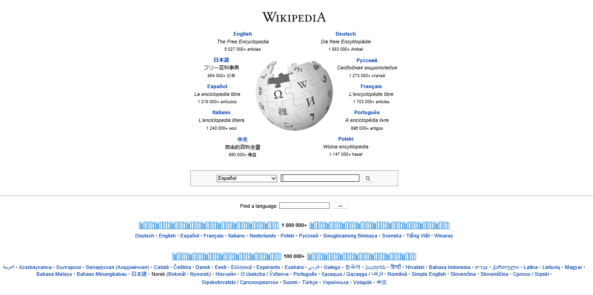
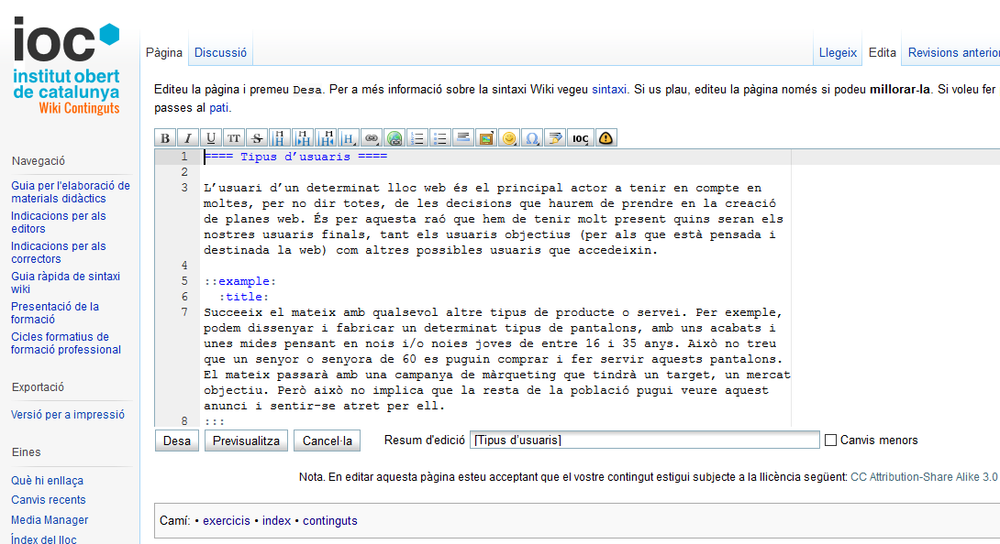

# 3. **Objetivos de la web y tipos de usuarios**.

Tabla de contenidos

- [3. **Objetivos de la web y tipos de usuarios**.](#3-objetivos-de-la-web-y-tipos-de-usuarios)
  - [3.1. Diseño web amigable](#31-diseño-web-amigable)
    - [3.1.1. Contenidos web](#311-contenidos-web)
    - [3.1.2. Diseño de la interface web](#312-diseño-de-la-interface-web)
    - [3.1.3. Navegación web](#313-navegación-web)
    - [3.1.4. Interactividad web](#314-interactividad-web)
  - [3.2. Objetivos de una web](#32-objetivos-de-una-web)
  - [3.3. Perfiles de usuarios de una página web](#33-perfiles-de-usuarios-de-una-página-web)

En la hora de crear una web, el diseñador tiene que conocer a priori algunos puntos clave que serán fundamentales para tomar decisiones:

- ¿Cuáles serán los objetivos de la web a diseñar?
- ¿Qué usuarios la usarán?
- ¿Qué vallas se pueden encontrar estos usuarios?
- ¿Cómo se consigue que la información sea atractiva y fácilmente accesible?

Todos estos aspectos, y el hecho que estén claramente representados en el diseño de la interfaz, harán que la web sea útil, amigable y agradable de usar. Hay que destacar que estos puntos se tienen que tener en cuenta no una vez finalizada la web, sino al inicio y también a lo largo de su desarrollo.

## 3.1. Diseño web amigable

Cuando navegamos por Internet, nuestras expectativas principales serán encontrar la información que buscamos de manera sencilla y acceder en páginas web con una interfaz que sea agradable y que permita una navegación ágil y correcta. Hay que tener presente que todos los elementos que se incorporan al diseño de una página web pueden posar vallas a los usuarios que no los facilitarán el acceso a la información y que harán que la página web no sea visitada nunca más o, al menos, con la frecuencia que sería deseable. Precisamente, habrá que minimizar estos impedimentos para poder maximizar los accesos en la página web.

Por este motivo, es básico conocer qué pasa por el cerebro de un usuario cuando accede en una web y qué reacción de aceptación o rechazo le provoca.

Por otro lado, algunos aspectos o características de un sitio web que hay que identificar y tener en cuenta son los contenidos web, el diseño de la interfaz, la navegación y la interactividad.

### 3.1.1. Contenidos web

Tienen que ser claros, directos, sencillos y apropiados para la tipología de usuarios y para el objetivo que se haya marcado.

Los contenidos no tan solo son el texto con las diferentes informaciones o explicaciones, también hay que considerar como contenidos las imágenes que se utilizarán o las animaciones y los sonidos.

Algunos condicionantes para los usuarios son la utilización de tipografías, medidas de letra, figuras, imágenes o animaciones que no sean adecuadas para la tipología de usuarios a los cuales van destinados. También es un hecho importante usar elementos y complementos adecuados para una página web, con un peso de descarga limitado para conseguir hacer más rápida la navegación.

### 3.1.2. Diseño de la interface web

Tiene especial importancia en sitios web con objetivos muy específicos. En especial, será importante que se tenga en cuenta el aspecto de la página principal del web, puesto que será la primera imagen que el usuario visualizará y es el primer paso para captar su atención.

Así, a partir de aquí, las decisiones de diseño no tienen que establecer limitaciones en los usuarios para acceder a los contenidos. Un ejemplo es asegurar el acceso en la página inicial de manera directa y sencilla desde cualquier página del sitio web, facilitando así la navegación, así como también garantizar que todas las páginas del lugar tengan un diseño coherente y pareciendo entre sí.

### 3.1.3. Navegación web

Es un elemento muy importante en la hora de diseñar un sitio web. La navegación es la interacción más básica entre el usuario y la web, y corresponde a acciones tan sencillas como la selección de los enlaces que lleven de una página a otra del sitio web. Esta navegación tiene que ser intuitiva, transparente y consistente, y toda página web tendrá que mostrar un menú fácilmente accesible y visible que permita moverse por todas las páginas que formen parte del web. En la siguiente imagen se puede observar el ejemplo de la página web de la IOC (ioc.xtec.cat/educacio). El menú y el logotipo quedan siempre visibles, independientemente de la página por la cual se navegue. Esto permite que el usuario siempre tenga la posibilidad de ir a cualquier lugar de la web que lo interese o de ir simplemente a la página principal.

### 3.1.4. Interactividad web

Es otro factor importante que hay que tener en cuenta por no ofrecer problemas de navegación a los usuarios. Que la página web sea interactiva y que los elementos que ofrezca permitan a los usuarios comunicarse con la página web supondrá un punto fundamental para el éxito de la web y para mejorar la experiencia de los usuarios, lo cual optimizará la usabilidad de la página. Todo esto se podrá conseguir mediante imágenes, videos o formularios, por ejemplo. También ayudará el hecho de ofrecer otras formas de ubicarnos en la página, como por ejemplo no enmascarando la dirección URL al navegador o en los enlaces.

En definitiva, una de las tareas del diseñador web es procurar que la información que se ofrece sea fácilmente accesible y que la página tenga una interfaz amigable, y los criterios para conseguirlo se basan, precisamente, en los objetivos y los tipos de usuarios que tenga la web a diseñar.

## 3.2. Objetivos de una web

Todo sitio web tendrá uno o varios objetivos establecidos. El diseño, y por tanto el éxito del lugar, irá estrechamente ligado a este objetivo, por eso su identificación es muy importante.

> Tener y definir previamente un objetivo claro y conciso de la web ayudará a la definición de una estrategia que lleve a su desarrollo exitoso.

Así, el que se tiene que tener claro es que muchas decisiones de diseño, y otros estrechamente vinculadas con las características de cómo de amigable es una página web, están ligadas a sus objetivos y a los usuarios que la usarán. Por ejemplo, una juguetería para niños tendrá que ofrecer tipos de letras, colores, grafismos, imágenes y otros elementos que estén pensados para este público para lograr el objetivo planteado antes de diseñar la página.

Antes de proponer una clasificación de las páginas web según sus objetivos se plantean otros posibles clasificaciones en función de diferentes criterios. Se pueden observar algunos criterios en la siguiente tabla

| Criterios | Descripción |
| --- | --- |
| Según su construcción | Páginas web estáticas (web 1.0), páginas web dinámicas/interactivas (web 2.0), páginas web 3.0 (comportamiento de la web en función del usuario) |
| Según su tecnología | Páginas web desarrolladas en HTML, en Flash, mediante un lenguaje servidor (PHP, ASP…) | 
| Según el tipo de contenidos | Páginas web informativas, buscadores, de música, de juegos, para adultos, infantiles, redes sociales, lugares de colaboración | 
| Según la suya estructura | Páginas web tipos portal web (que incluirá muchas más páginas de diferentes tipos), gestores de contenidos, tiendas virtuales | 
| Según el tipo de usuario y sus permisos | Páginas web completamente públicas, sin restricciones de acceso a los contenidos, páginas web con partes logades, es decir, donde el usuario se tiene que identificar para acceder a partes de los contenidos o páginas web completamente privadas, con el acceso completamente restringido, como puede ser una intranet o un campus virtual | 

A partir de aquí, una posible clasificación de las páginas web basada en sus objetivos que habrá que tener en cuenta en la hora de especificar los criterios de diseño web, será:

- **Informativas o de contenidos**. El objetivo es ofrecer y difundir informaciones, ya sean de uno o de varios temas concretos o de manera más generalista. Pueden ser webs con una finalidad económica (ganando dinero con la publicidad) o simplemente divulgativas. La interfaz será muy importante en el diseño de este tipo de páginas web, puesto que la facilidad de acceso y la satisfacción en la hora de encontrar la información mejorará su experiencia y el retorno de los usuarios. Un ejemplo podría ser cualquier página de cualquier diario o revista, pero también una página divulgativa de una temática concreta.

- **Corporativas e institucionales**. Son webs que tienen como objetivo ofrecer información específica sobre una organización (ya sea una empresa privada o una Administración pública). En la siguiente imagen se muestra un ejemplo de una página web institucional como es la de la Diputación de Barcelona (www.diba.cat). Aspectos como la facilidad para encontrar la información y para navegar por el sitio web con menús claros y sencillos ayudan a encontrar la toda información y facilitan la navegación entre todos los contenidos.

- **Orientadas al servicio**. En el caso de las empresas, pueden ser webs con un objetivo promocional destinadas a hacer publicidad y apoyo de determinados productos. No dispondrán de tienda online incorporada, puesto que el que se busca es dar información y promover determinados productos de los mismos creadores del sitio web para incentivar la compra a los canales de distribución habituales. Un aspecto importante en este tipo de páginas es la necesidad de minimizar el número de clics porque el usuario llegue a su objetivo. Un ejemplo podría ser una consultoría como Indra (www.indracompany.com).

- **De creación de una marca**. Este objetivo se puede confundir con el objetivo de las webs orientadas al servicio. Las de creación de una marca son webs que buscan promocionar un determinado producto o una determinada marca. La utilización de elementos multimedia llamativos, usar poco texto e información muy fácil de encontrar son características que pueden mejorar la usabilidad de estas páginas.

- **De entretenimiento y ocio**. Son páginas web que ofrecen todo tipo de materiales multimedia a sus usuarios. La finalidad acostumbra a ser la económica (a través de la publicidad), y los diseños suelen romper con muchos de los principios establecidos. Pero a nivel de usabilidad, la satisfacción y el atractivo para los usuarios serán muy importantes. Precisamente para mejorar el atractivo se tiene que evitar ofrecer textos con una longitud excesiva que obliguen los usuarios a usar la barra de desplazamiento vertical. Un ejemplo puede ser cualquier página web con juegos para jugar online o para compartir o descargar documentos.

- **Personales**. Los responsables de estas páginas web quieren expresar y compartir sus experiencias e inquietudes. Son vías de promoción personal donde los usuarios colgarán sus trabajos, estudios, creaciones, reflexiones o cualquier otro tipo de contenido con el objetivo de llegar al mayor número de personas posible. Hoy en día cualquiera jugador profesional de cualquier deporte con un mínimo de eco tendrá una página web personal, pero también la tendrán los investigadores o divulgadores.

- **Colaborativas, foros o redes sociales**. Son páginas web donde la responsabilidad de colgar contenidos no recae solo en los propietarios, sino que están abiertas al hecho que todos los usuarios puedan colgar sus opiniones o inquietudes o, directamente, parte de sus contenidos. En la siguiente imagen se muestra un ejemplo de una web colaborativa como es la Wikipedia (www.wikipedia.org). En este caso es importante que la interfaz sea intuitiva para que los usuarios que quieran modificar o añadir contenidos usen las herramientas que tienen disponibles para tal efecto, sin necesitar grandes conocimientos informáticos.

- **Académicas**. Hay que diferenciar las páginas web con un objetivo académico de las que ofrecen un campus virtual. Centros de estudios, universidades, grupos de trabajo o de investigación o cualquier otro tipo de asociación que creen una página web tendrán como objetivo la divulgación científica y llegar al mayor número de personas posible, ofreciéndoles la posibilidad de acceder a sus estudios. La información que quieren ofrecer tiene que ser fácilmente accesible y localizable y se tendrá que ofrecer una navegación sencilla para que los usuarios y alumnos puedan recordar fácilmente como llegar a los lugares clave. Un ejemplo podría ser la página web de la Universitat Autònoma de Barcelona (www.uab.cat).

- **Comerciales, transaccionales o e-commerce**. Son páginas web que permiten las transacciones económicas entre usuario final y empresa o entre empresas. Un segundo objetivo de estos tipos de páginas es ofrecer informaciones y referencias otros compradores sobre los productos que vienen. La facilidad para llevar a cabo las compras en el menor número de pasos será un aspecto a tener en cuenta. Una tienda como la FNAC (www.fnac.es)  es un claro ejemplo.

- **Artísticas**. Son parecidos a las que tienen como objetivo la promoción personal, pero en este caso el diseño de la página web será también parte de la expresión artística de los creadores. Podrán ser páginas artísticas personales o de cualquier grupo o asociación que se dedique a un determinado ámbito cultural.

- **Buscadores**. Estas páginas ayudan en la busca de información a Internet. Podrán ser buscadores de una determinada tipología de información (académica, de noticias…) o genéricos. Un claro ejemplo es Google (www.google.es).

## 3.3. Perfiles de usuarios de una página web

El usuario que accede a un determinado sitio web es el principal actor a tener en cuenta en muchas de las decisiones que se tendrán que tomar en la creación de las páginas; por eso, se tiene que hacer un estudio esmerado de cuál será el rango de los perfiles de los usuarios finales, tanto los usuarios objetivos (para los cuales está pensada y destinada la web) como otros posibles usuarios que  accedan.

--- 
    > *Ejemplo de rango de perfiles*

    Sucede el mismo con cualquier otro tipo de producto o servicio. Por ejemplo, podemos diseñar y fabricar un determinado tipo de pantalones, con unos acabados y unas medidas pensante en chicos y/o chicas jóvenes de entre 16 y 35 años. Esto no saca que un señor o una señora de 60 se puedan comprar y usar estos pantalones. El mismo pasará con una campaña de marketing que tendrá un objetivo, un mercado objetivo, pero esto no implica que el resto de la población pueda ver este anuncio y sentirse atraído.

--- 

Para poder establecer qué decisiones tomar a la hora de hacer el diseño de la interfaz web en función del tipo de usuarios que se espera tener habrá que conocer las posibles tipologías de estos y sus características, entre las cuales podemos destacar:

- profesión y nivel de estudios
- nivel sociocultural y económico
- nacionalidad
- conocimiento de idiomas (qué y cuánto)
- conocimientos informáticos
- discapacitados físicas y/o cognitivas
- motivaciones o hobbies en general
- hábitos de conectividad a Internet (horas, ubicaciones, dispositivo…)
- otros (sexo, edad…)

Con toda esta información se podría definir un perfil bastante concreto del grupo de usuarios potenciales de la web a crear, pero en muchas ocasiones es muy complicado conocer todas estas informaciones de los usuarios que acceden a un determinado sitio web y, por lo tanto, se tendrán que establecer criterios generales siguiendo unos determinados parámetros.

De todas las características comentadas anteriormente hay algunas concretas que nos ayudarán en la agrupación de las tipologías de usuario. A continuación se especifican con más detalle:

- Discapacidades que dificultan el acceso a todos los tipos de contenidos del sitio web. Tendremos que tener en cuenta que las recomendaciones en la creación de páginas establecen que toda web tiene que ser accesible para todos los usuarios, independientemente de si tienen alguna discapacidad o no.

- Según la experiencia en la utilización de Internet, donde podemos encontrar usuarios principiantes, usuarios habituales y usuarios expertos. Tendremos que procurar que el sitio web sea igual de accesible y que tenga una usabilidad reconocida como buena para todos los usuarios, independientemente de su nivel de experiencia.

- Según las funcionalidades asignadas que tenga en la página web: podrá tratarse de un usuario genérico, un usuario invitado, un usuario registrado o un usuario administrador.

En función de las tareas asignadas al sitio web, a continuación se detallan los grupos de usuarios que se pueden establecer:

- **Usuario genérico**. A todo sitio web habrá apartados que no requerirán ninguna acción de registro para acceder. Son espacios destinados al público en general, pero acostumbran a ser limitados. Los usuarios que  accedan no tendrán restricciones de acceso a los contenidos. De estos tipos de usuarios genéricos, de los cuales no tendremos mucha información, será importante conocer qué dificultades o errores encuentran en la hora de moverse por la web.

- **Usuario invitado**. Es un tipo de usuario muy parecido al genérico. Algunos sitios web permiten acceder a determinados contenidos a un tipo de usuario concreto que sin estar registrado podrá acceder además información que los usuarios genéricos. Las necesidades de amigabilidad y accesibilidad a los contenidos del web son análogas a las de los usuarios genéricos.

- **Usuario registrado**. Tendrá asignado un rol específico que le permitirá acceder a determinados contenidos en determinados espacios del sitio web. Este tipo de usuario hará falta que se registre al sitio web y que se identifique cada vez que  acceda, y tendrá un rol asignado que definirá sus posibilidad de actuación. En esta tipología también se podrían añadir sitios web privados como una Intranet, por ejemplo, donde los contenidos están restringidos a usuarios que pertenezcan a una determinada organización o institución.

- **Usuario administrador**. Esta tipología de usuario tendrá acceso no solo a todos los contenidos del sitio web, sino que además podrá llenarlo con nuevos y podrá decidir algunos parámetros de su configuración. Su experiencia con el sistema será muy alta, y, por lo tanto, la interfaz puede ser más técnica.

Algunas decisiones de diseño podrán tomarse en función de los tipos de usuarios que accederán a los determinados espacios del sitio web. Entrando algo más en detalle, otro tipo de clasificación es la que valora el grado de experiencia de los usuarios, que puede ser:

- **Usuario novel**. Es un usuario sin mucho conocimiento de la navegación por Internet ni experiencia con el uso de las tecnologías de la información y la comunicación (TIC). No será capaz de interpretar determinadas iconos, por el hecho de no estar acostumbrado. El amigabilidad del web será muy importante, puesto que necesitará iconos, menús y apartados del sitio web muy claros y una posibilidad de ayuda muy accesible.

- **Usuario intermedio**. Usuarios con un nivel mínimo de experiencia en la navegación por Internet y en el uso de las TIC en general. No requieren tanta claridad en el acceso a los contenidos como los usuarios noveles, pero sí que habrá que mantener algunas facilidades y un grado de acceso alto a las ayudas. Podremos ofrecerle tantas facilidades como nos sea posible durante el diseño y el desarrollo del sitio web. Un ejemplo de usuario intermedio se puede observar en la siguiente imagen. En este caso, en la página web interna de una wiki, el usuario registrado tiene la oportunidad de modificar los contenidos de un artículo. Podemos observar como las metáforas a los menús (barra de herramientas) son para personas que ya tienen cierta experiencia.

- **Usuario experto**. Es un tipo de usuario que ha accedido a muchos sitios web, ya hay estado grabado, y conoce los contenidos y las que se usan. Este tipo de usuario puede acceder en espacios web con muchas funcionalidades, muchos menús y submenús, con unos iconos no tan claras, y podrá hacer más pasos para acceder a las necesidades que tenga sin tantos riesgos como se tendría con un usuario novel o intermedio. En este caso, el usuario se moverá por la web sin ningún problema. Hay que destacar, pero, que este usuario, atendida su pericia, será más exigente en la hora de acceder en una web u otra.

Esta clasificación se ha hecho estableciendo unos grados en el nivel de conocimientos de las TIC y de la navegación por Internet, pero otra variable también importante es el grado de conocimiento de las llamadas reglas de negocio.

--- 

  > *Ejemplo de divisiones en la clasificación*

  Las reglas de negocio son aquellas funcionalidades y conceptos vinculados directamente con la temática del sitio web. Por ejemplo, si se trata de un aplicativo que ayuda a llevar la contabilidad de una organización, las reglas de negocio serán todo aquello vinculado con los términos económicos, como los centros de coste, la homologación de los proveedores o indicar un pago en diferido. Un usuario experto en contabilidad pero novel en el uso de las TIC, como habrá que considerarlo en este sitio web? Y un usuario experto en el uso de las TIC pero novel en términos económicos? Aplicando esta nueva división a la clasificación anterior, esta se podría completar y hacer tan compleja y larga como consideramos.

---

Las tipologías de usuarios nos servirán para identificar las posibles vallas que pueden encontrar para moverse por una web determinada. A veces, estas vienen dadas por el mismo diseño del sitio web, que dificulta el acceso a la información, pero otras muchas veces las llevan implícitas ciertas tipologías de usuarios. Cuando un usuario se encuentra con alguna de estas vallas lo tiene que tener muy fácil para poder encontrar una vía libre para seguir su camino adelante.

[Fuente: Usabilidad Web - Diseño de interfaces web - Instituto Abierto de Cataluña](https://ioc.xtec.cat/materials/FP/Materials/ICC0_DAW/DAW_ICC0_M09/web/html/WebContent/u3/a2/continguts.html)