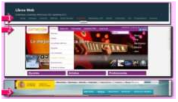

# 4. **Navegación en la web**

Tabla de contenidos

- [4. **Navegación en la web**](#4-navegación-en-la-web)
  - [4.1. Información accesible](#41-información-accesible)
  - [4.2. Consistencia](#42-consistencia)
  - [4.3. Persistencia](#43-persistencia)
  - [4.4. Sencillez de navegación.](#44-sencillez-de-navegación)
  - [4.5. Herramientas ¿ratón o teclado?](#45-herramientas-ratón-o-teclado)

A la hora de diseñar una interfaz para una web es importante que sea atractiva pero, es más importante, que el formato del sitio web cumpla con las expectativas de los usuarios, en especial aquellos relacionados con la navegación, el contenido y la organización.

El sistema de navegación de un sitio web requiere de una interacción del usuario con el sitio, por lo que hay que tener especial cuidado a la hora de diseñarlo.

En el apartado anterior decíamos que una interfaz es usable si los usuarios pueden contestar a las preguntas: ¿Dónde estoy? ¿Cómo llegué aquí? ¿A dónde puedo ir después? ¿Qué puedo hacer en este momento? y ¿Cómo puedo regresar al punto anterior?

La mayoría de estas preguntas serán de fácil respuesta para el usuario si se tienen presentes las características deseables de un sistema de navegación cuando diseñamos un sitio web.

## 4.1. Información accesible

Para lograr un acceso más eficiente y sencillo a la información de un sitio web por parte de todos los usuarios del mismo, con independencia de sus conocimientos técnicos, es importante:

1. Una buena organización de los contenidos del sitio.
2. Un buen diseño del sistema de navegación.

Tanto si el sitio web es complejo, con multitud de páginas, como si es sencillo, el usuario debe poder acceder a la información que busca de una forma cómoda y sencilla. Si el sistema de navegación es engorroso, el usuario terminará por abandonar la página. Si el sitio tiene un sistema de búsqueda que no es eficiente y el usuario no encuentra la información que busca a pesar de saber que existe porque no sabe cómo buscarla, terminará por abandonar la página.

El menú de navegación de una página es aquel que permite acceder a los lugares relevantes de un sitio web. Pero, además del menú, en una página podemos encontrar enlaces a otras páginas ya sean del mismo sitio o de otros.

Es importante comprobar que:

- Todos los contenidos son accesibles ya sea desde el menú de navegación principal o desde alguno de los enlaces.
- No existen enlaces que no conducen a ninguna parte.
- Todos los enlaces muestran el contenido que se esperaba.

> Los enlaces rotos o los que acceden a un contenido inesperado dan una mala imagen de un sitio web. Evita siempre poner enlaces a páginas "En construcción". Ya pondrás el enlace cuando tengas la página terminada.

## 4.2. Consistencia

Este tema ya se mencionó en alguna de las primera unidades, cuando hablábamos de la maquetación web. Hablábamos entonces de coherencia en el uso de los elementos gráficos y vimos algunos ejemplos de páginas que usaban un código de colores en las secciones del menú de navegación que se empleaban después en las páginas de estas secciones.

> Cuando hablamos de consistencia en un sistema  de navegación hacemos referencia a que sus elementos son coherentes en todas las páginas que componen un sitio web.

La navegación en un sitio Web debe de ser predecible para los usuarios. Las barras de navegación deben ser coherentes en su diseño manteniendo el mismo tema visual en las diferentes páginas de un sitio.

En la imagen que ilustra este apartado se muestran tres ejemplos de barras de navegación consistentes en su diseño que mantienen su aspecto y comportamiento en todas sus páginas:

- El primer ejemplo (apuntado por una flecha con el número 1) pertenece al sitio de Libros Web (http://www.libros-web.org/ ). En las páginas de este sitio, el sistema de navegación está formado por unos enlaces (Home, Consejos, Contactos, Noticias, Redes Sociales, Usabilidad, etcétera) con la letra de color blanco sobre un fondo de color negro. Los enlaces se ponen de color rojo cuando el ratón pasa por encima. En la imagen aparece en rojo el enlace Usabilidad.

- El segundo ejemplo (apuntado por una flecha con el número 2) pertenece al sitio de Jamendo (http://www.jamendo.com/es/ ). En las páginas de este sitio, el sistema de navegación está formado por unos enlaces (Música, Selección, Jamendo Pro, etcétera) con letra de color blanco sobre un fondo de color morado que actúan como un menú desplegable cuando el ratón pasa por encima. En la imagen el ratón está situado sobre el enlace Música cuyas letras pasan a ser de color anaranjado con una sombra añadida y con un fondo de color blanco que se repite en todas las opciones del menú desplegado.

- El tercer ejemplo (apuntado por una flecha con el número 3) pertenece al sitio del Ministerio de Educación y Ciencia (http://www.educacion.gob.es/portada.html ). En las páginas de este sitio, el sistema de navegación está formado por unos enlaces (Ministerio, Prensa, Iniciativas, etcétera) con la letra de color blanco con un fondo con dos tonos de color azul. Cuando el ratón se sitúa sobre el enlace el texto aparece subrayado y cuando se visita un enlace éste cambia su color de
fondo por dos tonos de grises.

Además, si vas a incorporar a tu página un sistema de búsqueda para que el usuario pueda encontrar la información que busca, este sistema debe ser igualmente consistente con su diseño. Se suele emplear la palabra "Buscar" dentro de un recuadro de color blanco, el cual puede ir acompañado, o no, de otros elementos adicionales:

- En el primer ejemplo no existe una herramienta buscar como tal. En su lugar, emplea un diseño en dos columnas en el que una parte de la segunda columna contiene un conjunto de palabras de distinto tamaño, ordenadas alfabéticamente y agrupadas bajo el título "Términos" que actúa como filtro de los contenidos que muestra en la primera columna. Estas palabras cambian de color cuando el ratón pasa por encima.

- En el segundo ejemplo el sistema de búsqueda consta de un único rectángulo de color blanco que contiene la palabra "Buscar" seguido de tres puntos. En este rectángulo el usuario tendrá que escribir y pulsar la tecla de entrada (intro, return o enter).

- En el tercer ejemplo el sistema de búsqueda está formado por una palabra "Buscar" seguida del carácter de dos puntos, un rectángulo blanco con el icono de una lupa seguido de la palabra buscar y tres puntos, y la palabra "Buscar" en negrita sobre un fondo de color azul que al pulsarse con el ratón inicia la búsqueda.

A la vista de los tres ejemplos anteriores, podemos decir que el sistema de búsqueda es una parte del diseño Web que todavía no está muy estandarizado y que puede presentar problemas a los usuarios con un nivel de experiencia bajo:

- Los términos del primer ejemplo no forman parte de un sistema de búsqueda sino que se emplean como una forma de estructurar los contenidos y enlazarlos entre sí.
  
- En el segundo ejemplo un usuario acostumbrado a realizar búsquedas en Google, con la predicción de palabras activado, en el que se le van mostrando automáticamente enlaces que concuerdan con lo tecleado hasta el momento, puede llegar a pensar que la herramienta de búsqueda de Jamendo no funciona.
  
- Es, quizás, el tercer ejemplo el que no deja lugar a dudas sobre su funcionamiento y con el que los usuarios tendrán menos problemas.

## 4.3. Persistencia

Cuando hablamos de persistencia en un sistema de navegación hacemos referencia a que sus elementos se colocan siempre en el mismo sitio en todas las páginas que componen un sitio web.

La navegación en un sitio web debe de ser predecible para los usuarios. Las barras de navegación deben mantener su posición en las diferentes páginas de un sitio.
Por regla general, las barras de navegación se colocan a lo ancho de la página, en su parte superior, por debajo del encabezado o formando parte de él.

Haciendo uso de la misma imagen del apartado anterior, mostramos en este caso tres ejemplos de barras de navegación persistentes en su ubicación:

- En el primer ejemplo (apuntado por una flecha con el número 1), el sistema de navegación se encuentra ubicado formando parte del encabezado de la página (parte con fondo de color negro) en su tercera línea.

- En el segundo ejemplo (apuntado por una flecha con el número 2), el sistema de navegación se encuentra ubicado formando parte del encabezado de la página, en su primera línea, a la derecha del logotipo de la empresa (palabra "jamendo" con un triángulo dentro de la letra o).

- En el tercer ejemplo (apuntado por una flecha con el número 3), el sistema de navegación se encuentra ubicado formando parte del encabezado de la página, en su segunda línea alineado por la derecha.

Las barras de navegación deben permitir al usuario encontrar las secciones o áreas de interés de un sitio web sin dificultad. De ahí que siempre se suelan ubicar en los mismos lugares. Un usuario, no puede perder su tiempo tratando de imaginar qué información puede encontrar en la página porque el sistema de navegación no es evidente.

En el siguiente enlace puedes comprobar el funcionamiento del sistema de navegación de la página web de Burning Pixel Productions, aunque para comprobarlo primero tendrás que encontrarlo porque está en el pie de la página (algo común en páginas muy antiguas pero muy poco usual en páginas actuales). Además, el primero de sus enlaces Home que debía ir a la página principal está roto y es el segundo enlace Info el que, aparentemente, realiza esta acción. Todo un ejemplo de lo que no debes
hacer.

http://burningpixel.com/homepage.htm

> También es importante que el sistema de búsqueda permanezca siempre en el mismo sitio. Se suele utilizar también el encabezado y se alinea, normalmente, a la derecha.

## 4.4. Sencillez de navegación.

> Cita (Bruno Munari): “*Cada uno ve lo que sabe*”.

Esta cita tiene mucho que ver con este apartado, ya que, si al usuario se le presenta un sistema de navegación que le recuerde otro tipo de situaciones a las que ya está acostumbrado, tendrá mucha menos dificultad en adaptarse a él.

Cuando diseñas el sistema de navegación de un sitio debes recordar que este sistema sirve para que los usuarios sepan dónde pueden ir y, más importante aún, saber dónde están y cómo pueden regresar a la página donde estaban antes. Ten en cuenta que un sistema de navegación correctamente diseñado debe suministrar al usuario un acceso a la página principal del sitio web, en cualquier momento de la navegación.

En la unidad mencionada al principio de este apartado, se tratan algunos elementos del sistema de navegación que suelen encargarse de asumir estas funciones. Estos elementos son los que permiten al usuario contestar a las preguntas: ¿Dónde estoy? ¿Cómo llegué aquí? ¿A dónde puedoir después? ¿Qué puedo hacer en este momento? ¿Cómo puedo regresar al punto anterior?

- El logotipo de la empresa u organismo del sitio web que suele ir colocado en el encabezamiento de todas las páginas del sitio y que sirve de enlace de regreso a la página principal.

- El enlace al mapa del sitio que suele ir colocado en el encabezado y/o en el pie de todas las páginas y que permite averiguar dónde se puede ir.

- El sistema de navegación que informa del camino recorrido desde la página principal hasta el lugar donde se encuentra el usuario, colocado normalmente por debajo del encabezado y por encima del contenido y que, con el uso de enlaces, permite al usuario regresar a alguna de las páginas previas en las que ha estado.

- El sistema de navegación principal ubicado, normalmente, en el encabezado de todas las páginas del sitio e informa de las principales secciones del mismo.

> Reconocer es mejor que recordar.

Si la ubicación de los elementos de navegación es consistente y persistente y, si además el lenguaje empleado en los enlaces es claro y sencillo, el usuario no tendrá que recordar dónde estaba la información que buscaba o el camino a seguir para encontrarla, lo reconocerá en cuanto lo vea.

Cuando el usuario se encuentra en medio de un proceso que implique un conjunto de pasos, es conveniente mantenerle en todo momento informado del progreso de dicho proceso.

  Una página en la que se solicita al usuario la realización de una encuesta. En dicha página se explica el por qué de la encuesta, en qué consiste y cuánto tiempo aproximadamente le llevará todo el proceso. A continuación de la explicación hay un botón que dice "Realizar encuesta".
  ¿Quién pulsaría ese botón si no se explica previamente el proceso? ¿Qué se encuentra el usuario al pulsar el botón?
  Es conveniente que el proceso de realización de la encuesta sea sencillo para el usuario. En estos casos resulta más útil una navegación guiada paso a paso, confirmando al usuario la realización de cada uno de los pasos, permitiéndole regresar al paso anterior para hacer una corrección e informando de los pasos que le quedan.
  Si esto no fuera así: ¿Quién seguiría contestando preguntas después de confundirse en una y no poder corregirla? ¿Quién seguiría contestando preguntas si no sabes cuántas has contestado y cuántas son en total?
  > Recuerda: El usuario debe tener el control.

## 4.5. Herramientas ¿ratón o teclado?

Cuando hablamos de las herramientas que se pueden usar en un sistema de navegación, pensamos únicamente en el ratón. Esto es porque el mundo de la web es el mundo de los hiperenlaces. Y... ¿hay algo más cómodo que un clic de ratón para visitar un nuevo enlace? Si te paras a observar a las personas que usan Internet visitando páginas y páginas, te darás cuenta de que hacen muy poco uso del teclado. Pero esto no tiene por qué ser así y no debería ser así, de hecho, hay que procurar que no sea así.

Hoy en día, casi todo el software está preparado tanto para el uso del ratón como del teclado. ¿Por qué habría de ser la web diferente?

En los navegadores actuales se puede usar el teclado para poder acceder a las opciones del menú, el cual dispone de un conjunto de teclas aceleradoras. La imagen que ilustra este apartado muestra un ejemplo del uso del teclado para acceder a algunas de la opciones del menú del navegador. En el ejemplo mostrado, si quisiéramos aumentar el zoom en el navegador, podríamos hacerlo de dos formas:

- Usando el método abreviado de teclado que consiste en combinar la pulsación de las teclas Control y el carácter de suma (Ctrl+[+]) que en la imagen se muestra dentro de un rectángulo con fondo rosado.

- Acceder al menú Ver pulsando las teclas ALT+[V] (puesto que "V" es la letra que está subrayada), después la tecla "m" (que es la que está subrayada en la palabra Tamaño) y por último, la letra "A" (que es la que está subrayada en la palabra Aumentar). Este método no hace distinción entre mayúsculas y minúsculas.

Este ejemplo muestra también cómo hay una opción "Detener" que aparece en color gris oscuro. Eso quiere decir que la opción no está operativa por el momento. Ocultar opciones que no se pueden usar en la situación actual, o mantenerlas visibles pero desactivadas, es algo usual en el diseño de interfaces.

Los atajos de teclado ahorran gran cantidad de tiempo pero hay que recordarlos. Sólo los usuarios más avanzados acostumbran a hacerlo. También son usados por las personas que no puedan manejar el ratón por tener una discapacidad visual y por aquellas que utilizan teclados virtuales programables.

Firefox permite habilitar el uso del teclado dentro de una web como si estuviéramos manejando un procesador de textos. Para hacerlo, basta con pulsar F7 en cualquier momento para activar o desactivar esta característica. Al pulsar F7, Firefox te preguntará si realmente quieres activar esta característica. Puedes desactivar esta pregunta si marcas la casilla de verificación No volver a mostrar este diálogo. Así, la próxima vez que lo actives o desactives no te lo volverá a preguntar.

¿Cómo podemos usar el teclado para navegar por la web? La siguiente tabla muestra algunas de las combinaciones de teclado que se usan para navegar por la web.

