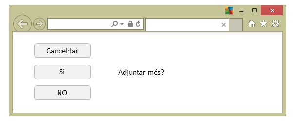
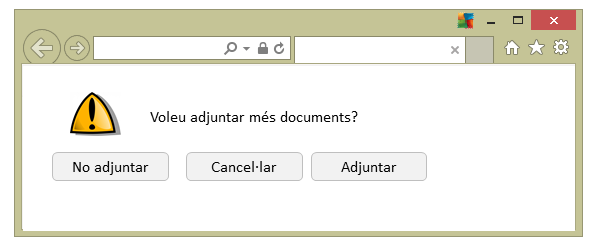
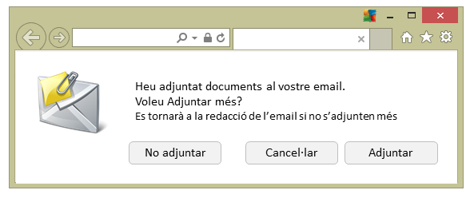
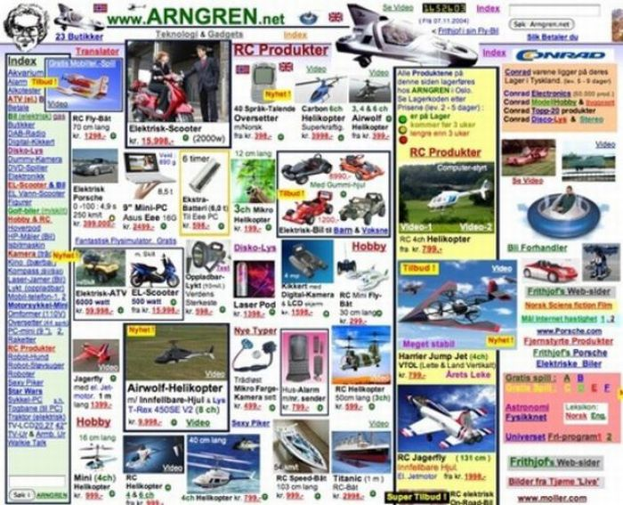
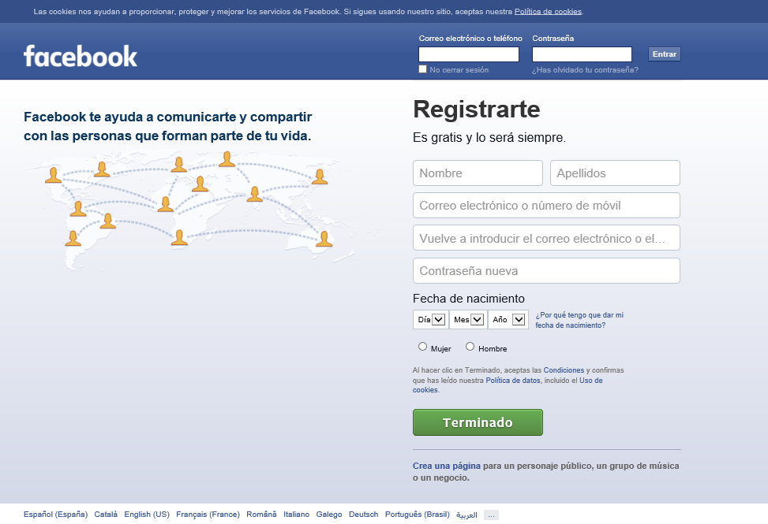
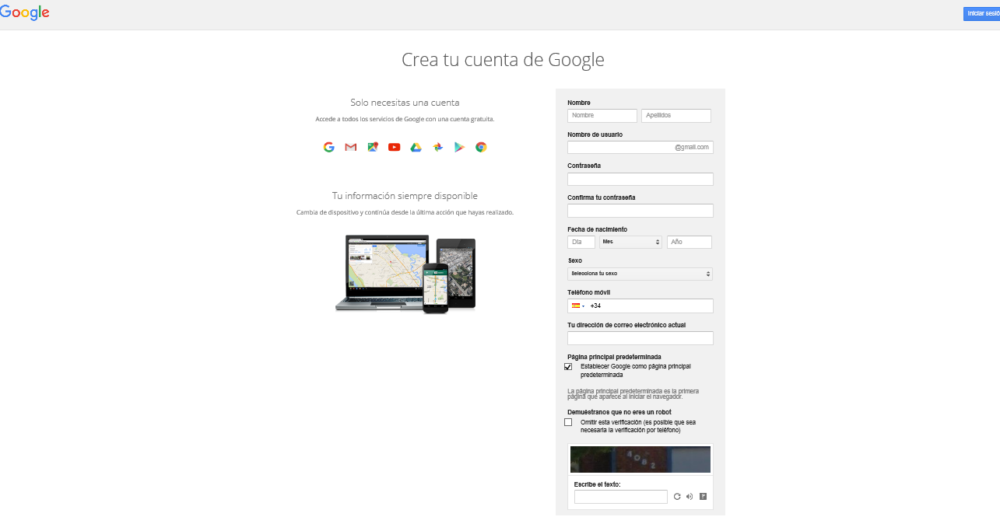
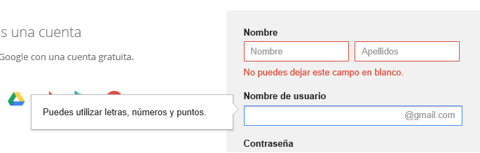
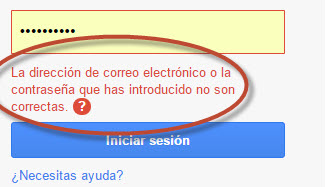

# 5. **Usabilidad y webs amigables. Estandars**

Tabla de contenidos

- [5. **Usabilidad y webs amigables. Estandars**](#5-usabilidad-y-webs-amigables-estandars)
  - [5.1. Concepto de usabilidad: Dimensiones.](#51-concepto-de-usabilidad-dimensiones)
    - [5.1.1. Dimensiones de la usabilidad](#511-dimensiones-de-la-usabilidad)
  - [5.2. Estandars de usabilidad. Las normas ISO](#52-estandars-de-usabilidad-las-normas-iso)
    - [5.2.1. Orientados al proceso: ISO 9241 e ISO 13407](#521-orientados-al-proceso-iso-9241-e-iso-13407)
      - [5.2.1.1. ISO 9241 Ergonomics of Human System Interaction](#5211-iso-9241-ergonomics-of-human-system-interaction)
      - [5.2.1.2. ISO 13407:1999. Human centred design processes for interactive systems](#5212-iso-134071999-human-centred-design-processes-for-interactive-systems)
    - [5.2.2. Orientados al producto: ISO 9126 e ISO 14598](#522-orientados-al-producto-iso-9126-e-iso-14598)
      - [5.2.2.1. ISO 9126 *Software engineering --- Product quality*](#5221-iso-9126-software-engineering-----product-quality)
      - [5.2.2.2. ISO 14598 *Information technology --- Software product evaluation*](#5222-iso-14598-information-technology-----software-product-evaluation)
    - [5.2.3. Ventajas y desventajas de la definición de usabilidad como proceso y como producto](#523-ventajas-y-desventajas-de-la-definición-de-usabilidad-como-proceso-y-como-producto)
    - [5.2.4. ISO 25000 (SQUARE): unificación y revisión de los estándares ISO/IEC 9126 e ISO/IEC 14598](#524-iso-25000-square-unificación-y-revisión-de-los-estándares-isoiec-9126-e-isoiec-14598)

Habitualmente se accede en Internet para hacer una gran diversidad de acciones, como consultar las noticias del día, hacer compras, buscar informaciones concretas de algún tema de interés o establecer comunicación con otras personas (a través de redes sociales, correo electrónico…). En muchas ocasiones, este acceso se hace en unas determinadas webs que ofrecen no tan solo los contenidos que se buscan, sino que muestran la información de una manera organizada y visual que hace que sea fácil encontrar aquello que se busca. Diseñar la web de forma que sea atractiva, útil y que se ajuste a las necesidades del usuario final no es nada fácil, y es aquí donde entran los conceptos de web amigable o usable.

Estos conceptos, refiriéndose a una interfaz gráfica web, tienen muchas acepciones. Son termas que pueden tener interpretaciones subjetivas y, de hecho, una web puede ser muy agradable para unas personas y muy poco para otras.

Sin embargo, habrá que definir unos criterios estándares en la hora de desarrollar una interfaz web, y, como mínimo, marcar unas dimensiones o unos principios básicos sobre los cuales establecer un punto de partida a partir del cual empezar a diseñar.

Existen dos normas ISO que han tratado este concepto de usabilidad y que definen unos estándares mínimos de diseño: la norma ISO/IEC 9126-1 y la norma ISO/IEC 9241-11.

## 5.1. Concepto de usabilidad: Dimensiones.

Qué es la usabilidad? Podemos intuir que, en términos generales, se tratará de conseguir que un producto o una interfaz sean utilizables. A veces el mejor para explicar un concepto es mostrar el contrario, así que el mejor que podemos hacer para acercarnos al concepto de usabilidad es ver ejemplos de productos con una usabilidad que se puede considerar mala.

Antiguamente, en los teléfonos analógicos, la manera de trucar era usar una rueda donde había todos los números. Había que mover esta rueda tantas posiciones como el número que se quería marcar. En un teléfono móvil digital este sistema de marcaje no tendría ningún tipo de sentido, no tendría el que se considera una buena usabilidad.

Explicaremos, por un lado, el que entendemos por usabilidad en entornos web y, por la otra, las definiciones que sí que existen a nivel internacional de este término.

A nivel internacional, *usability está definido en inglés como la facilidad de uso y de aprendizaje de los productos y/o sistemas. Es decir, el término indica el grado de facilidad con el cual un usuario podrá usar una herramienta, un producto o una interfaz concreta.

  > Definición de usabilidad; Hay mucha bibliografía y *webgrafia que hace referencia al concepto de usabilidad y, en especial, al de la usabilidad en entornos web, pero se trata de un término no grabado todavía al diccionario de la Real *Academia *Española (www.rae.es), al menos en el momento de escribir estos materiales.

Esta definición requiere tener en cuenta muchos matices para poder definir o entender el significado de facilidad de uso. Pero hay otros muchos términos que también  están relacionados, termas como efectividad, eficiencia y satisfacción del usuario. Estos conceptos variarán la apreciación en función de si están afectados por los usuarios, sus objetivos o sus expectativas y por la situación de uso de la herramienta, el producto, la aplicación informática o la página web.

  > **UX** es el acrónimo en inglés de **User Experience**, experiencia de usuario. Profuncizaremos más adelante en este aspecto.

Dentro de los objetivos de estos tipos de análisis de la usabilidad de las aplicaciones y las páginas web, el más importante es adaptar el software a los estilos de trabajo reales de los usuarios, en vez de forzarlos a adaptar sus estilos de trabajo al software.

En este sentido, el concepto experiencia de usuario (UX) está cogiendo mucha fuerza últimamente en el mundo del diseño de páginas web. El llamado ***UX Design*** (diseño según la experiencia de usuario) tiene como objetivo crear interfaces que mejoren la satisfacción de los usuarios y fidelización el acceso a la páginas web en cuestión, a partir de las premisas establecidas por la usabilidad.

> La experiencia de trabaja todos los aspectos relacionados con la interacción y la percepción que tiene este con una interfaz o dispositivo, y buscará los elementos para hacer positiva y agradable esta experiencia.

Un ejemplo, entre otros, que explica de este concepto lo encontraréis en el siguiente video:

> [Video: ¿Qué es UX Design? (Diseño de Experiencia de Usuario)](https://www.youtube.com/watch?v=lYWOzxVCTao)

Para poder conseguir un diseño basado en la experiencia de usuario habrá que conocer muy bien los usuarios reales (o los usuarios potenciales) de la web. Entre otras cosas, habrá que conocer:

  - Qué necesitan.
  - Qué valoran de la web.
  - Qué habilidades tienen.
  - Qué objetivos tienen.

Pero también será importante conocer otra característica:

  - Qué limitaciones presentan.

Por esta razón hay que dotar la información que se muestra en la web de características como la de ser útil, ser accesible, ser usable, ser creíble y otras muchas.

A partir del siguiente ejemplo, correspondiendo a una interfaz parcial de una página web, se puede ver un caso que ayudará a entender mejor cuando una interfaz es o no usable. En las siguientes imágenes se muestra un diálogo que se puede dar cuando se quiere enviar un correo con documentos adjuntos. Una vez se ha adjuntado un documento, una ventana mostrará un diálogo que pedirá si se quieren adjuntar más archivos.

A continuación se valorarán tres posibles interfaces con las cuales el usuario tendrá que interaccionar. En la siguiente imagen se puede ver una interfaz que se podría considerar con una usabilidad no muy buena.

Hay una pregunta a la cual el usuario tiene que contestar seleccionando la opción que convenga entre las tres posibles. Hay tres botones de respuesta que son a la izquierda, muy alineados, pero con un orden que costa un poco de entender. La pregunta tampoco da mucha información. No quedar claro qué sucederá si no se da respuesta, es decir, si se escoge la opción de cancelar. De todas maneras, un usuario con conocimientos mínimos de informática podría interactuar con esta interfaz.

En la siguiente imagen se muestra una interfaz con una usabilidad correcta.

La imagen anterior muestra una imagen que alerta igualmente de una situación de duda para la página web, como puede ser que, una vez adjuntado un documento, no sabe si el usuario habrá acabado o querrá adjuntar más documentos. La pregunta que encontramos es bastante más completa y comprensible. Las tres respuestas posibles tienen una ubicación más fácil de identificar, con la más probable como primera opción.

En la propuesta de la siguiente imagen se muestra un diálogo para la interacción de un usuario con la página web. Esta seria de una usabilidad óptima.

En este caso ha habido algunas evoluciones más. En primer lugar, la imagen que se muestra es más indicativa del tipo de acción que se requerirá, y continúa con el símbolo de alerta pero indicando, con la imagen como metáfora de los documentos, que se trata de una posible operación de querer añadir más documentos antes de enviar el correo. Además, los botones de respuesta para el usuario no están alineados, sino que tienen una distancia irregular entre si, buscando un tipo de respuesta por parte del usuario. También hay que remarcar el hecho que las palabras de los botones de respuesta son verbos que indican con más claridad las opciones en la hora de seleccionar una.

Se puede intuir que en muchas ocasiones el concepto de usabilidad y la conclusión que una web sea considerada usable o no tiene una parte subjetiva por parte del usuario. Sin embargo, para hacer un análisis al más objetiva posible se definirán unos estándares que ayuden a tomar decisiones.

### 5.1.1. Dimensiones de la usabilidad

La usabilidad está vinculada a la sencillez, la facilidad, la comodidad y la practicidad de cualquier producto, y esto mismo se entiende en el contexto de las interfaces web.

> Las conocidas como dimensiones de la usabilidad son unas características y unos atributos establecidos para poder valorar las interfaces gráficas o las páginas web y poder establecer, de este modo, un grado de desempeño para un concepto considerado subjetivo. Estas son: eficiencia, eficacia, satisfacción, atractivo, facilidad de aprendizaje, facilidad del sistema para ser recordado y tolerancia al error.

Para poder comprender mejor estas dimensiones de la usabilidad trabajaremos algunas interfaces web con todo el que tiene que ver con estos conceptos. Diferenciaremos el análisis en dos tipos:

- El análisis de páginas web completas a partir de sus páginas principales, es decir, aquellas que nos encontramos solo acceder a la URL, a partir de las cuales tendríamos que encontrar un menú o unas indicaciones que nos permitan intuir como tenemos que - navegar.
Analizaremos algunos ejemplos de partes de páginas web, concretamente las que se refieren a los registros que ofrecerán a sus usuarios.

En la siguiente tabla se muestra una descripción de cada una de las siete dimensiones de la usabilidad.

| Dimensión | Descripción |
| --- | --- |
| Eficiencia | Es la capacidad de conseguir un objetivo planeado o deseado. |
| Eficacia | En términos económicos, se entiende como la relación entre los recursos utilizados y los resultados obtenidos. |
| Satisfacción | Se define como un estado de la mente para un ser humano. En cuanto a páginas web, es la opinión subjetiva que transmite esta al usuario. |
| Atractivo | Una interfaz es atractiva para un usuario cuando este  acepta de buen grado las características y el uso, mostrando una predisposición para utilizarla. |
| Facilidad del sistema para ser recordado/facilidad de aprendizaje | Si las funcionalidades o los iconos son difíciles de interpretar, cada vez que un usuario tenga que interactuar con una interfaz probablemente necesitará utilizar el manual de usuario que indique con claridad como se llega a unas determinadas funcionalidades. |
| Tolerancia al error | Cuando un usuario interactúa con una aplicación es posible que no se pueda hacer una acción porque no cumple alguna validación del software al cometer algún error. Las páginas web tienen que estar preparadas para los errores de los usuarios en su utilización y en la recuperación rápida. |

En primer lugar, en la siguiente imágen se muestra la interfaz de la seb americana www.space-people.org

En nuestro caso estamos observando una página web a través de una imagen. Llevar a cabo un análisis completo es más complicado que poder interactuar con la página y observar qué enlaces tiene y qué reacciones provoca la misma imagen cuando nosotros intentemos navegar. Por esta razón, nuestros comentarios sobre el papel solo pueden ser parciales, y os recomendamos que  accedéis vosotros mismos para poder hacer las pruebas adecuadas.

También hay que decir que los análisis que se llevan a cabo sobre páginas web en cuanto a las dimensiones de la usabilidad muchas veces muestran resultados subjetivos. Por esta razón es importante que las evaluaciones las lleven a cabo usuarios completamente ajenos al diseño de la página o a la organización que haya detrás.

La página que se muestra en la figura.8 se puede considerar de una usabilidad mala. Pero si entramos en detalle dimensión por dimensión quizás nos podemos encontrar alguna donde el análisis no sea tan negativa, pero en general, a primera vista, se puede considerar que se trata de una imagen que nos transmite una usabilidad mala.

En cuanto a la eficiencia, para poder considerar si la página web de la figura.8 consigue el objetivo planteado o deseado haría falta que tuviéramos mucho muy definido cuál es este objetivo. Las macetas de usabilidad se llevan a cabo para conocimiento de los mismos diseñadores, con lo cual ellos mismos podrán establecer los análisis sobre los objetivos que tienen marcados. Si el objetivo de esta página era mostrar una idea concreta, transmitir solo un mensaje, quizás se podría considerar que el apartado de eficiencia no es del doliendo. A partir de aquí no parece sencillo poder avanzar ni acceder a otros contenidos más allá de la imagen.

En cuanto a la eficacia, no parece que esta página pueda considerarse eficaz en cuanto a los resultados obtenidos, no da la sensación de atraer los usuarios a continuar indagando más allá de ver una imagen que se podría encontrar en cualquier medio de comunicación escrito. No parece necesario crear una página web para conseguir transmitir esta idea.

La satisfacción que puede recibir un usuario al acceder dependerá de las ganas o motivaciones que tenga en cuanto a la temática de la página web. En este caso puede parecer que la imagen puede llamar la atención y hará leer el mensaje. Pero quizás con esto no habrá suficiente.

Con el atractivo nos pasará algo pareciendo al que hemos comentado en la dimensión anterior.

En cuanto a la facilidad del sistema para ser recordado o a la facilidad de aprendizaje del sistema, parece que la evaluación tiene que ser necesariamente negativa, en no parecer que haya nada para aprender o, en todo caso, no quedar nada claro ni ayuda los usuarios.

Finalmente, en cuanto a la tolerancia al error, no parece que haya ninguna gestión en este sentido, en no parecer que el usuario tenga ninguna oportunidad de interacción con la página web.

En la siguiente imagen se muestra una página web como ejemplo de usabilidad que se puede considerar mala. A primera vista se puede observar como tanto el atractivo como la satisfacción son mínimos. El hecho de ofrecer tanta información, tantos productos, hace que el usuario no pueda tener claro cuál es el objetivo de la página, donde se encuentra el menú y qué es la información que tiene que distinguir de qué. No parece un sistema fácil para ser recordado ni tampoco sencillo de aprender.

Veamos a continuación dos otros ejemplos más positivos. 

En la siguiente imagen se muestra la posibilidad de registrarse o de identificarse en la página web de Facebook (www.facebook.com), una conocida red social.

Un segundo ejemplo sería la página de Google, el buscador más universal y famoso actualmente (www.google.es). Se puede observar la página de su registro. Se trata de una página web con una usabilidad muy muy trabajada que, aun así, se puede analizar en cuanto a las siete dimensiones.

En la siguiente tabla podemos observar una valoración de las diferentes dimensiones de la usabilidad aplicadas a las páginas web de Facebook y Google.

| Dimensión | Facebook | Google |
| --- | --- | --- |
| Eficiencia | Valoración positiva. Cumple los objetivos de acceso y registro. | Valoración positiva. Cumple todos los objetivos. |
| Eficacia | Cumple los objetivos de acceso y registro de manera óptima. | Cumple los objetivos de acceso y registro de manera óptima. |
| Satisfacción | La utilización de colores suaves ofrece satisfacción en la utilización de la página web por parte de los usuarios. | Diseño y utilización de colores y fuentes muy sencillos y suaves. Alto grado de satisfacción. |
| Atractivo | La interfaz es agradable a la vista y da sensación de atractivo a los usuarios. | Cumple el objetivo de ser atractiva para los usuarios. |
| Facilidad de aprendizaje | Valoración mediana. Por un lado ofrece facilidad de aprendizaje, pero por la otra no indica que los campos son obligatorios. | Indicaciones muy claras al pasar el ratón por encima del campo a llenar. Recordatorio de obligatoriedad si cambias de campo sin llenarlo. |
| Facilidad del sistema para ser recordado | Valoración alta, las opciones son claras y sencillas. | Valoración alta, las opciones son claras y sencillas. |
| Tolerancia al error | Valoración positiva, puesto que detecta si dejas un campo en blanco o si el usuario no está previamente registrado o si el formato del correo electrónico no es el correcto. | Ofrece muchas ayudas en el caso de detectar errores: correos electrónicos que ya existen, campos sin llenar, datos incoherentes… |

En cuanto a posibles mejoras, en el caso de Facebook, una sugerencia seria mejorar con alguna redistribución de las opciones existentes, ofreciendo por ejemplo de una manera más sencilla el acceso al cambio de idioma o indicando como obligatorios los campos que lo sean.

En cuanto a la usabilidad del registro en Google, es más que correcta, y todo los controles que formen los registros son intuitivos y bastante inteligibles. En las siguientes capturas se muestran ejemplos de detección y notificación de errores en la hora de comunicarse con los usuarios.

Notificación de error de Google

Notificación de error de Google 

## 5.2. Estandars de usabilidad. Las normas ISO

La Organización Internacional para la Estandarización (ISO) se creó con el encargo de promover el desarrollo de las normas internacionales de fabricación, comercio y comunicación para todas las industrias sacado de la electricidad y la electrónica.

 

Las normas ISO se dividen por códigos que indican diferentes maneras de clasificar las definiciones de estándares, tanto de procedimientos y procesos como de requerimientos y atributos de productos y servicios.

### 5.2.1. Orientados al proceso: ISO 9241 e ISO 13407

#### 5.2.1.1. ISO 9241 Ergonomics of Human System Interaction

Está compuesta por 17 partes. La 1 y 2 es una introducción y guías para el empleo del estándar. De la 3 a la 9 tratan los requisitos y guías relacionadas con el hardware que impactan en el funcionamiento del software. De la 10 a la 11 se centran en los aspectos del software.

En realidad la norma se llamaba *Ergonomic requirements for office work with visual display terminals (VDTs)* pero en 2006 se le simplificó el nombre; y además se renumeraron sus partes para poder cubrir más temas como la interacción táctil ([ISO 9241-920:2009](http://www.iso.org/iso/iso_catalogue/catalogue_tc/catalogue_detail.htm?csnumber=42904 "Se abre en ventana nueva")) , la interacción con formularios ([ISO 9241-143:2012](http://www.iso.org/iso/iso_catalogue/catalogue_tc/catalogue_detail.htm?csnumber=53590 "Se abre en ventana nueva"))  o interfaces web ([ISO 9241-151:2008](http://www.iso.org/iso/iso_catalogue/catalogue_tc/catalogue_detail.htm?csnumber=37031 "Se abre en ventana nueva"))

La [ISO 9241-11:1998 "Guidance on usability](http://www.iso.org/iso/iso_catalogue/catalogue_tc/catalogue_detail.htm?csnumber=16883 "Se abre en ventana nueva")", define la usabilidad como:

> La medida con la que un producto se puede usar por usuarios determinados para conseguir objetivos específicos con efectividad, eficiencia y satisfacción en un contexto de uso concreto.

Por tanto, los tres factores, los tres atributos de calidad son:

-   **Efectividad:** exactitud e integridad con la que los usuarios alcanzan los objetivos especificados, y por tanto implica la facilidad de aprendizaje, la ausencia de errores del sistema o la facilidad del mismo para ser recordado. Las métricas definidas son:
    -   Número de tareas importantes realizadas
    -   Porcentaje de funciones relevantes utilizadas
    -   Porcentaje de tareas completadas con éxito al primer intento
    -   Número de referencias a la documentación
    -   Número de llamadas para soporte
    -   Número de accesos a la ayuda
    -   Número de funciones aprendidas
    -   Porcentaje de usuarios capaces de aprender sus características
    -   Porcentaje de errores corregidos o reportados por el sistema
    -   Número de errores de los usuarios tolerados
    -   Porcentaje de palabras leídas correctamente a una distancia de visualización normal
-   **Eficiencia:** recursos empleados (esfuerzo, tiempo, etc.) en relación con la exactitud e integridad con la que los usuarios alcanzan los objetivos especificados. Las métricas definidas son:
    -   Eficiencia relativa en comparación con un usuario experto
    -   Tiempo empleado en el primer intento
    -   Eficiencia relativa en el primer intento
    -   Tiempo empleado en reaprender funciones
    -   Número de errores persistentes
    -   Tiempo productivo
    -   Tiempo para aprender características
    -   Tiempo para reaprender características
    -   Eficiencia relativa durante el aprendizaje
    -   Tiempo empleado en la corrección de errores
-   **Satisfacción:** un factor subjetivo que implica una actitud positiva en el uso del producto. Las métricas definidas son:
    -   Calificación (por parte del usuario) de su satisfacción con las características importantes
    -   Tasa de uso voluntario del producto
    -   Frecuencia de reutilización del producto
    -   Calificación (por parte del usuario) de la facilidad de aprendizaje
    -   Calificación (por parte del usuario) del tratamiento de errores

**La ISO 9241‐11 recomienda un enfoque basado en procesos** para evaluar la usabilidad, a través del Diseño Centrado en el Usuario (DCU). Por ello la ISO 9241 **debe aplicarse en conjunto con la ISO 13407**.

La [ISO 9241-151:2008 "Guidance on World Wide Web user interfaces"](http://www.iso.org/iso/iso_catalogue/catalogue_tc/catalogue_detail.htm?csnumber=37031 "Se abre en ventana nueva") referencia a la 9241-11 para la evaluación de criterios y a la ISO 13407 como guía de Diseño Centrado en el Usuario, puesto que señala que el diseño de interfaces web debe seguir un proceso de DCU.

Se pueden consultar comparativas de la 9241-151 con HHS Guidelines [USABILITY.GOB] en [BEVAN, 2005] y actualizado en [BEVAN, 2007]

Dentro de la ISO 9241-151 podemos destacar las siguientes directrices (viene cada una explicada y con ejemplos, y se puede encontrar una *checklist* para la evaluación al final del documento de la ISO):

-   6\. High-level design decisions and design strategy (11 directrices evaluables)
-   7\. Content design
    -   7.1 Conceptual content model (5 directrices evaluables)
    -   7.2 Content objects and functionality (19 directrices evaluables, 5 de las cuales referentes al *7.2.8 Privacy and business policies*; y 7 al punto *7.2.9 Indivudualisation and user adaptation*)
-   8\. Navigation and search
    -   8.1 General
    -   8.2 General guidance on navigation (5 directrices evaluables)
    -   8.3 Navigation structure (11 directrices evaluables, varias de ellas relativas a *Splash screens*)
    -   8.4 Navigation components (16 directrices evaluables)
    -   8.5 Search (22 directrices evaluables)
-   9\. Content presentation
    -   9.1 General
    -   9.2 Observing principles of human perception (1 directrices evaluables)
    -   9.3 Page design issues functions (17 directrices evaluables)
    -   9.4 Link design (15 directrices evaluables)
    -   9.5 Interaction objects (3 directrices evaluables)
    -   9.6 Text design (6 directrices evaluables)
-   10\. General design aspects
    -   10.1 Designing for cultural diversity and multilingual use (5 directrices evaluables)
    -   10.2 Providing help (1 directrices evaluable)
    -   10.3 Making Web user interfaces error-tolerant(2 directrices evaluables)
    -   10.4 URL names (1 directrices evaluable)
    -   10.5 Acceptable download times (1 directrices evaluable)
    -   10.6 Using generally accepted technologies and standards(1 directrices evaluable)
    -   10.7 Supporting common technologies(1 directrices evaluable)
    -   10.8 Making Web user interfaces robust(1 directrices evaluable)
    -   10.9 Designing for input device independence(1 directrices evaluable)
    -   10.10 Making the user interface of embedded objects usable and accessible

#### 5.2.1.2. ISO 13407:1999. Human centred design processes for interactive systems

La [ISO 13407:1999](http://www.iso.org/iso/catalogue_detail.htm?csnumber=21197 "Se abre en ventana nueva")  ha sido revisada por la [ISO 9241-210:2010 Ergonomics of human-system interaction -- Part 210: Human-centred design for interactive systems](http://www.iso.org/iso/iso_catalogue/catalogue_ics/catalogue_detail_ics.htm?csnumber=52075 "Se abre en ventana nueva").

La ISO 13407 proporciona una guía para alcanzar la calidad en el uso mediante la incorporación de actividades de naturaleza iterativa involucradas en el Diseño Centrado en el Usuario (DCU).

El Diseño Centrado en el Usuario (DCU) lo describe como una actividad multidisciplinar, que incluye factores humanos y conocimientos y técnicas de ergonomía con el objetico de mejorar la efectividad y eficiencia, las condiciones de trabajo y contrarrestar los posibles efectos adversos de su uso.

Describe los **cuatro principios del Diseño Centrado en el Usuario**:

-   Involucrar activamente a los usuarios
-   Asignación adecuada de funciones al sistema y el usuario
-   Soluciones de diseño iterativas
-   Diseño multidisciplinar

Y las **cuatro actividades del Diseño Centrado en el Usuario:**

-   Entender y especificar el contexto de uso
-   Especificar los requisitos del usuario y de la organización
-   Producir más de una solución de diseño candidata
-   Contrastar los diseños con los requisitos

Como he dicho, la ISO 13407 ha sido revisada por la ISO 9241-210:2010 *Ergonomics of human-system interaction -- Part 210: Human-centred design for interactive systems* que describe **seis principios clave que caracterizan al Diseño Centrado en el Usuario** [TRAVIS, 2011]:

-   El diseño está basado en una comprensión explícita de usuarios, tareas y entornos.
-   Los usuarios están involucrados durante el diseño y el desarrollo.
-   El diseño está dirigido y refinado por evaluaciones centradas en usuarios.
-   El proceso es iterativo.
-   El diseño está dirigido a toda la experiencia del usuario.
-   El equipo de diseño incluye habilidades y perspectivas multidisciplinares

### 5.2.2. Orientados al producto: ISO 9126 e ISO 14598

#### 5.2.2.1. ISO 9126 *Software engineering --- Product quality*

Es un estándar para evaluar la calidad del software. Esta dividida en cuatro partes:

-   [**ISO/IEC 9126‐1: 2001**](http://www.iso.org/iso/iso_catalogue/catalogue_tc/catalogue_detail.htm?csnumber=22749 "Se abre en ventana nueva") : presenta el modelo de calidad que clasifica la calidad del software en un conjunto estructurado de **características**: funcionalidad, fiabilidad, usabilidad, eficiencia, mantenibilidad y portabilidad.

    Define la **usabilidad** como *la capacidad que tiene un producto software para ser entendido, aprendido, operable, atractivo para el usuario y conforme a estándares/guías, cuando es utilizado bajo unas condiciones específicas*.

    Por ello la usabilidad se divide en las siguientes subcaracterísticas:

    -   **Fácil de aprender**: capacidad para ser aprendido en su manejo
    -   **Fácil de entender:** capacidad del producto de ser entendido por nuevos usuarios en términos de su propósito y cómo puede ser usado en tareas específicas.
    -   **Fácil de operar:** capacidad del producto de ser operado y controlado en cualquier momento.
    -   **Atractivo:** capacidad del producto de ser atractivo para sus usuarios.
    -   **Conformidad:** capacidad del producto para adherirse a estándares, convenciones, guías de estilo o regulaciones relacionadas con la usabilidad.

    ![External and Internal Quality: Functionality (Suitability, Accuracy, Interoperability, Security, Funcionality compliance), Reliability (Maturity, Fault Tolerance, Recoverability, Reliability compliance), Usability (Understand-ability, Learnability, Operability, Attractiveness), Efficiency (Time Behaviour, Resource Utilisation, Efficiency compliance), Maintainability (Analysability, Changeability, Stability, Testability, Maintainability compliance), Portability (Adaptability, Installability, Co-existence, Replaceability, Portability compliance)](https://lh4.ggpht.com/-RYmaHBZ6jbo/T2Hx_dbJl5I/AAAAAAAABfI/_MGswlbyhgU/iso9126_1_modelo_calidad_thumb%25255B2%25255D.jpg?imgmax=800)

-   **[ISO/IEC 9126‐2:2003](http://www.iso.org/iso/iso_catalogue/catalogue_tc/catalogue_detail.htm?csnumber=22750 "Se abre en ventana nueva")** : describe las métricas externas que se pueden utilizar para evaluar el comportamiento del software cuando es operado por el usuario.
-   **[ISO/IEC 9126‐3:2003](http://www.iso.org/iso/iso_catalogue/catalogue_tc/catalogue_detail.htm?csnumber=22891 "Se abre en ventana nueva")** : describe las métricas internas que se pueden utilizar para describir propiedades estáticas de la interfaz, que puede ser evaluadas por la inspección sin poner en funcionamiento el software.
-   **[ISO/IEC 9126‐4:2004](http://www.iso.org/iso/iso_catalogue/catalogue_tc/catalogue_detail.htm?csnumber=39752 "Se abre en ventana nueva")** : describe las métricas de calidad que se pueden utilizar para evaluar el efecto del producto software cuando son operados por el usuario en determinados contextos de uso. **Las métricas definidas son:**

    -   **Efectividad** (el método de aplicación definido para las tres es el test con usuarios)
        -   Efectividad de las tareas: ¿qué proporción de objetivos de las tareas son logrados correctamente?
        -   Tareas completadas, ¿qué proporción de tareas son completadas?
        -   Frecuencia de los errores
    -   **Productividad** (el método de aplicación definido para todas es el test con usuarios)
        -   Tiempo de las tareas, ¿cuánto tiempo lleva completar una tarea?
        -   Efectividad de las tareas, ¿cuán eficientes son los usuarios?
        -   Productividad económica, ¿cómo de rentable es el usuario?
        -   Porcentaje de producción, ¿qué proporción de tiempo dedica el usuario a acciones productivas?
        -   Eficiencia relativa de los usuarios, ¿cómo de eficiente es el usuario comparado con un experto?
    -   **Seguridad** (el método de aplicación definido para todos es el uso de estadísticas)
        -   Salud y seguridad del usuario, ¿cuál es la frecuencia de problemas de salud entre usuarios del producto?
        -   Seguridad de las personas afectadas por el uso del sistema, ¿cuál es la frecuencia de peligro para las personas afectadas por el uso del sistema?
        -   Daños ergonómicos, ¿cuál es la frecuencia de daños ergonómicos?
        -   Daños del software, ¿cuál es la frecuencia de la corrupción del software?
    -   **Satisfacción**
        -   Escala de satisfacción, ¿cómo de satisfecho está el usuario?
        -   Cuestionario de satisfacción, ¿cómo de satisfecho esta el usuario con características específicas del software?
        -   Uso discrecional, ¿qué proporción de potenciales usuarios eligen el uso del sistema? El método de aplicación definido es la observación del uso.

Puesto que **la ISO 9126** se limita a la especificación de un modelo de calidad general, esta **se debe aplicar en conjunto con la ISO 14598**.

#### 5.2.2.2. ISO 14598 *Information technology --- Software product evaluation*

La [ISO 14598](http://www.iso.org/iso/iso_catalogue/catalogue_tc/catalogue_detail.htm?csnumber=24902 "Se abre en ventana nueva")  es un estándar que proporciona un marco de trabajo para evaluar la calidad de todo tipo de producto software e indica los requisitos para los métodos de medición y el proceso de evaluación. Consta de seis partes:

-   **[ISO/IEC 14598‐1: 1999](http://www.iso.org/iso/iso_catalogue/catalogue_tc/catalogue_detail.htm?csnumber=24902 "Se abre en ventana nueva")** : provee una visión general de las otras cinco partes y explica la relación entre la evaluación del producto software y el modelo de calidad definido en la ISO/IEC 9126

    

-   [**ISO/IEC 14598‐2: 2000**](http://www.iso.org/iso/iso_catalogue/catalogue_tc/catalogue_detail.htm?csnumber=24903 "Se abre en ventana nueva") : contiene requisitos y guías para las funciones de soporte tales como la planificación y gestión de la evaluación del producto del software.
-   [**ISO/IEC 14598‐3: 2000**](http://www.iso.org/iso/iso_catalogue/catalogue_tc/catalogue_detail.htm?csnumber=24904 "Se abre en ventana nueva") : provee los requisitos y guías para la evaluación del producto software cuando la evaluación es llevada a cabo en paralelo con el desarrollo por parte del desarrollador.
-   [**ISO/IEC 14598‐4:1999**](http://www.iso.org/iso/iso_catalogue/catalogue_tc/catalogue_detail.htm?csnumber=24905 "Se abre en ventana nueva") : provee los requisitos y guías para que la evaluación del producto software sea llevada a cabo en función a los compradores que planean adquirir o reutilizar un producto de software existente o predesarrollado.
-   [**ISO/IEC 14598‐5: 1998**](http://www.iso.org/iso/iso_catalogue/catalogue_tc/catalogue_detail.htm?csnumber=24906 "Se abre en ventana nueva") : provee los requisitos y guías para la evaluación del producto software cuando la evaluación es llevada a cabo por evaluadores independientes.
-   [**ISO/IEC 14598‐6:2001**](http://www.iso.org/iso/iso_catalogue/catalogue_tc/catalogue_detail.htm?csnumber=24907 "Se abre en ventana nueva") : provee las guías para la documentación del módulo de evaluación.

### 5.2.3. Ventajas y desventajas de la definición de usabilidad como proceso y como producto

[Férnandez-Martinez, 2009] explica las ventajas y desventajas de la definición de la usabilidad como proceso o como producto vistas en el conjunto de normas anteriores:

> **Ventajas de la definición usabilidad como proceso:**
>
> -   Se identifican aspectos de usabilidad y componentes del contexto de uso que deben tenerse en cuenta en las fases de especificación de requisitos, diseño y evaluación de usabilidad.
> -   El rendimiento y la satisfacción del usuario proporcionan medidas directas de usabilidad en un contexto específico.
> -   Las medidas obtenidas proporcionan una base para comparar la usabilidad de varios diseños en un mismo contexto.
>
> **Desventajas de la definición usabilidad como proceso:**
>
> -   La usabilidad está estrictamente tratada desde una perspectiva de proceso, no centrada en el producto.
> -   No tiene en cuenta la característica de "facilidad de aprendizaje", siendo esta recomendada por otros estándares y expertos en usabilidad.
> -   No tiene en cuenta aspectos de seguridad, considerados importantes por expertos del dominio.
>
> **Las ventajas de la definición de usabilidad como producto:**
>
> -   Existe un marco claramente definido y acordado en el modelo, que aclara la
> -   Definición de usabilidad, y propone métricas para proporcionar evidencia objetiva de los logros.
> -   Se puede utilizar como una referencia para los acuerdos contractuales entre un comprador y un proveedor de software, pudiendo ser utilizados además, para eliminar una serie de malentendidos entre el comprador y el proveedor.
> -   Se propone un proceso de evaluación que puede ser adaptado a compradores, desarrolladores y evaluadores externos.
>
> **Desventajas de la definición de usabilidad como producto:**
>
> -   El conjunto de métricas se proporciona para sub‐características que a su vez engloban conceptos difícilmente medibles si no se descomponen en atributos
> -   Existe superposición de conceptos, al definir usabilidad como una característica de calidad interna‐externa, y llamar calidad en uso a otras características también vinculadas a la usabilidad.
> -   El tener por separado dos normas que se aplican conjuntamente produce inconsistencias en los ciclos de vida de ambas dificultando su uso.

### 5.2.4. ISO 25000 (SQUARE): unificación y revisión de los estándares ISO/IEC 9126 e ISO/IEC 14598

La [ISO 25000:2005](http://www.iso.org/iso/iso_catalogue/catalogue_tc/catalogue_detail.htm?csnumber=35683 "Se abre en ventana nueva")  se conoce como SQUARE (Software Quality Requirement Evaluation) y básicamente se trata de una unificación y revisión de los estándares ISO/IEC 9126 e ISO/IEC 14598.

Su objetivo principal es guiar el desarrollo de los productos de software con la especificación y evaluación de requisitos de calidad.

La norma está formada por las siguientes divisiones [ISO25000.com, b]:

-   **División de gestión de calidad (ISO/IEC 2500n):** los estándares que forman esta división definen todos los modelos comunes, términos y referencias a los que se alude en las demás divisiones de SQuaRE.
-   **División del modelo de calidad (ISO/IEC 25001n):** el estándar que conforma esta división presenta un modelo de calidad detallado, incluyendo características para la calidad interna, externa y en uso. 
-   **División de mediciones de calidad (ISO/IEC 25002n):** los estándares pertenecientes a esta división incluyen un modelo de referencia de calidad del producto software, definiciones matemáticas de las métricas de calidad y una guía práctica para su aplicación. Presenta aplicaciones de métricas para la calidad de software interna, externa y en uso.
-   **División de requisitos de calidad (ISO/IEC 25003n):** los estándares que forman parte de esta división ayudan a especificar los requisitos de calidad. Estos requisitos pueden ser usados en el proceso de especificación de requisitos de calidad para un producto software que va a ser desarrollado ó como entrada para un proceso de evaluación.
-   **División de evaluación de la calidad (ISO/IEC 25004n):** estos estándares proporcionan requisitos, recomendaciones y guías para la evaluación de un producto software, tanto si la llevan a cabo evaluadores, como clientes o desarrolladores.

En el modelo de calidad hay **tres vistas del modelo** según el contexto: **modelo de calidad de software, modelo de calidad de datos y modelo de calidad en uso**, que puede tener distintas vistas según la parte beneficiaria que consideremos (usuario final, organización y soporte técnico)

Considerando la vista del usuario final tendríamos una definición de usabilidad más cercana a la planteada en la ISO 9241‐11.

En el **modelo de calidad de software** la usabilidad se mantiene como una característica más del producto, pero que se llama **operabilidad**, y tiene alguna diferencia respecto a la ISO 9126, siendo sus subcaracterísticas:

-   **Fácil de aprender**: capacidad para ser aprendido en su manejo
-   **Fácil de entender**: capacidad del producto de ser entendida por nuevos usuarios en términos de su propósito y cómo puede ser usado en tareas específicas.
-   **Fácil de usar**: capacidad del producto de ser operado y controlado en cualquier momento.
-   **Atractivo**: capacidad del producto de ser atractivo para sus usuarios.
-   **Conformidad**: capacidad del producto para adherirse a estándares, convenciones, guías de estilo o regulaciones relacionadas con la usabilidad.
-   **Facilidad de ayuda**: hace referencia al grado con el que el producto ofrece ayuda a los usuarios cuando la necesitan, algo que en la ISO 9126 se consideraba implícita en la facilidad de aprender.
-   **Accesibilidad técnica**: hace referencia a cómo el producto software puede ser usado por personas con discapacidad.

Tanto [Férnandez-Martinez, 2009, pp. 48 y ss] como [RUIZ MORILLA, 2009] comparan y enumeran las ventajas y desventajas de la ISO 25000 frente a sus predecesoras ISO/IEC 9126 y ISO/IEC 14598.

[Fuente: Blog de Olga Carreras. UsableAccesible](https://olgacarreras.blogspot.com/2012/03/estandares-formales-de-usabilidad-y-su.html)

