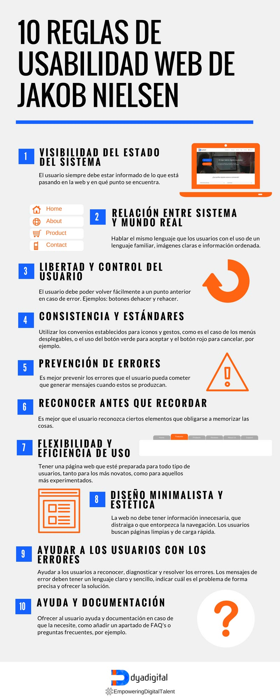

# 6. **Principios de desarrollo de la usabilidad web** 

Tabla de contenidos

- [6. **Principios de desarrollo de la usabilidad web**](#6-principios-de-desarrollo-de-la-usabilidad-web)
  - [6.1. Principios de *Bruce Tognazzini*](#61-principios-de-bruce-tognazzini)
  - [6.2. 10 principios de usabilidad web de *Jakob Nielsen*](#62-10-principios-de-usabilidad-web-de-jakob-nielsen)
  - [5.4. Aplicación de las dimensiones y los principios de usabilidad a un caso práctico: centro de pología.](#54-aplicación-de-las-dimensiones-y-los-principios-de-usabilidad-a-un-caso-práctico-centro-de-pología)

El diseño de un página web es una tarea crítica en el procedimiento de su desarrollo. La página tendrá que ser agradable para los usuarios y cumplir los requisitos de los objetivos para los cuales está diseñada. Cuando se llama que una web tiene que ser amigable nos referimos al hecho que no tendrá que transmitir rechazo, sino que la experiencia de acceder y consultarla tendrá que ser satisfactoria, tendrá que dar ganas de volverla a visitar. Esto implicará que la usabilidad de la página diseñada tendrá que ser buena.

## 6.1. Principios de *Bruce Tognazzini*

Para conseguir estos objetivos de usabilidad óptima se pueden encontrar algunos principios o consejos que ayuden a conseguir diseñar webs amigables, elaboradas por el Normal Nielsen Group. Entre estos principios se pueden distinguir los de ***Bruce Tognazzini*** en su artículo “*First *Principles of Interaction Design (Revised & Expanded)”, y se refieren a todo tipo de interfaz hombre-máquina, en especial a las interfaces de aplicaciones. No son específicos para el diseño de páginas web, pero son completamente viables como base.

Según Bruce Tognazzini los principios para un diseño user-friendly son:

1.  **Anticipación.** Muestra toda la información y herramientas que se te ocurra que el usuario puede necesitar.
2.  **Autonomía.** Me quedo con "el usuario es como un niño pequeño que llora cuando se le mantiene muy atado o se le deja en un edificio grande y vacío". Hay que darle cancha al usuario para que se sienta cómodo y libre, pero también hay que ponerle ciertas restricciones. Para ello es básico: mantener informado al usuario del estado del sistema, como diría [Nielsen](https://usabilidadcss.wordpress.com/2012/02/01/los-10-mandamientos-de-la-usabilidad/ "Los principios heurísticos de Nielsen"). Al final se trata de darle una libertad controlada, que nosotros sepamos todas las variables de acción que puede ejecutar y que él tenga información de dónde está y lo que puede hacer en cada instante.
3.  **Daltonismo.** Hay que tener en cuenta a los daltónicos. El color no puede ser la única manera de transmitir cierta información. Debemos apoyarnos en pistas secundarias como: etiquetas, grafismos complementarios, distintas gradaciones de gris...
4.  **Consistencia.** "La consistencia más importante es aquella que espera el usuario" (por lo que es importante hacer pruebas con ellos). Es tan importante ser visualmente inconsistente con los objetos que se comportan de forma distinta, como ser consistente con los que se comportan de igual manera. Hay que evitar la uniformidad: los objetos que se comportan distinto deben parecer distintos.
5.  **Valores por defecto.** Deben poder ser corregidos con rapidez (por ejemplo, las áreas de texto deben aparecer ya seleccionadas para que el usuario sólo tenga que escribir encima corrigiéndolas).
6.  **Eficacia del usuario.** Debe buscarse la eficacia del usuario antes que la del ordenador: cuanto menos tenga que pensar el humano y cuanto menos se le haga esperar, mejor. Se debe buscar la eficacia de todos, no sólo de ciertos grupos. Formas de lograr la eficacia: mensajes de ayuda concisos y menús y etiquetas de botones que empiecen con la palabra más importante.
7.  **Interfaces explorables.** Para ello es importante ofrecer elementos visuales estables (para facilitar la navegación rápida), habilitar botones de deshacer, mostrar salidas claras... y hacer caso de la **Ley de Fitt:** tiempo necesario para alcanzar un objeto está relacionado con la distancia y tamaño del mismo (botones grandes para funciones importantes; las esquinas y bordes de pantalla son más fácilmente accesibles).
8.  **Objetos humanos.**
9.  **Reducción de latencia.** Es la sensación de que algo está tardando en suceder. Se  reduce con ruedas de carga, barras de estado, aligerando el sistema, reduciendo el número de clicks...
10. **Aprendizaje.** Aunque lo ideal es que el usuario supiera como utilizar el sistema desde la primera vez, esto nunca ocurre. Hay que reducir las limitaciones.
11. **Uso de metáforas.** Para ayudar al usuario a comprender de modo conceptual. Las metáforas pueden ser visuales, auditivas...)
12. **Protege el trabajo del usuario.** Autoguardado.
13. **Legibilidad.** Texto con alto contraste: lo ideal, negro sobre blanco. Tamaños de letras legibles (tener en cuenta a todos).
14. **Guardar el estado.** La información de estado debe almacenarse en una cookie durante la sesión en el ordenador cliente. Luego se almacena en un servidor: los usuarios deberían ser capaces de desconectar, volver a conectarse desde cualquier otro sitio y seguir con su trabajo en donde lo dejaron.
15. **Navegación visible.** Evitar la navegación invisible. Que el usuario sepa dónde está.

Estos principios propuestos por Bruce Tognazzini estan vivos, tal como se puede ver a su sitio web, no es una información estática que servirá para las próximas décadas. Son una muestra de principios que sirven para tener una base importante, pero que hay que ir adaptando a las nuevas tecnologías. Por eso el título de su última versión el 2014: revisados y ampliados.

## 6.2. 10 principios de usabilidad web de *Jakob Nielsen*

Otros principios para lograr el desarrollo de webs amigables son los que propone su socio, ***Jakob Nielsen***. El año 1995 publicó el que denominó “las reglas generales o reglas heurísticas” de la usabilidad. Estos principios o reglas los elaboró a partir del estudio de prácticamente más de 250 problemas de usabilidad, y están más enfocados hacia interfaces del tipo web, es decir, entornos y páginas web.

  > ¿Por qué necesitamos conocer los principios de usabilidad web de Jackob Nielsen?

Para conseguir que el usuario que visite nuestra web se quede en ella necesitamos que su **experiencia con la misma sea positiva**.

  > ¿Que conseguimos si mejoramos la experiencia del usuario?

1.  **Aumentar el tráfico recurrente**. Es decir, que tenemos más puntos para que un usuario después de haber visitado nuestra web o blog, vuelva a ella en un futuro. Aplicando estos consejos podemos [aumentar el número de visitas](http://www.ilusual.com/conseguir-visitas-sin-saber-seo) de nuestras páginas webs.
2.  **Disminuir el porcentaje de rebote.** El **[porcentaje de rebote](https://es.semrush.com/blog/porcentaje-de-rebote-que-es-como-mejorarlo/)** no es otra cosa que conseguir que el tiempo de estancia del usuario sea alto y conseguir que navegue por las diferentes partes de nuestro site.

Eso se consigue facilitándole las decisiones a tomar dentro de nuestra página. 

**[Jackob Nielsen](https://www.nngroup.com/people/jakob-nielsen/)** es un gurú de la Usabilidad web reconocido en todo el mundo. Tienes mucha información sobre él en Internet, nosotros nos vamos a centrar en sus [10 principios básicos](https://www.nngroup.com/articles/ten-usability-heuristics/) de usabilidad web que se usan hoy en día y que él formuló en 1995.

**Se les llaman también Principios Heurísticos** porque están basados en amplias reglas generales y no específicas directrices de usabilidad.

Para llegar a estos 10 Principios de usabilidad y accesibilidad web aplicó el Método Heurístico:

1.  Identificar el problema.
2.  Definir el plan para solucionar el problema.
3.  Realizar el plan establecido.
4.  Analizar el resultado.

Después de esta breve introducción, nos metemos de lleno en el **Decálogo sobre usabilidadde Jackob Nielsen**

1. Visibilidad del estado del sistema: El sistema (web, app o cualquier otro producto digital) debe siempre mantener informado al usuario de lo que está ocurriendo.

> Ejemplo: al subir un archivo a Google Drive, el sistema nos indica que se está cargando y el tiempo restante.

 
2. Relación entre el sistema y el mundo real: El sitio web o aplicación tiene que utilizar el lenguaje del usuario, con expresiones y palabras que le resulten familiares. Además la información debe aparecer en un orden lógico y natural.

> Ejemplo: en la página 404 de Lego, el mensaje es “página no encontrada”. El usuario no tiene por qué saber qué significa el error 404.

 
3. Control y libertad del usuario : En caso de elegir alguna opción del sitio web por error, el usuario agradecerá disponer de una “salida de emergencia” para abandonar el estado no deseado en que se halla. Debe poder deshacer o repetir una acción previamente realizada.

> Ejemplo: En Gmail cuando envías un correo a la papelera te da la opción de deshacer la acción.

 4. Consistencia y estándares: Es importante establecer convenciones lógicas y mantenerlas siempre. El usuario no tiene por qué saber que diferentes palabras, situaciones o acciones significan lo mismo.

> Ejemplo: un estándar de un sitio web es la situación del logo en la cabecera, en la parte superior izquierda de la página. El icono de menú en móvil (llamado menú hamburguesa) también se ha convertido en un estándar y el usuario lo identifica fácilmente.

 
5. Prevención de errores: Ayuda al usuario a que no caiga en un error.

> Ejemplo: Los buscadores proporcionan asistencia a los usuarios para que encuentren lo que están buscando, con la función autocompletar o con la alternativa de resultados. Google ofrece la función autocompletar y aparece Chuck Norris

6. Reconocimiento antes que recuerdo: Debemos hacer visibles acciones y opciones para que el usuario no tenga que recordar información entre distintas secciones o partes del sitio web o aplicación. 

> Ejemplo: los enlaces auxiliares de una home que incluyen texto más icono para reforzar el mensaje. 

7. Flexibilidad y eficiencia de uso: Los aceleradores o atajos de teclado, por ejemplo, pueden hacer más rápida la interacción para usuarios expertos, de tal forma que el sitio web o aplicación sea útil tanto para usuarios básicos como avanzados.

> Ejemplo: MS Exchange ofrece al usuario una configuración avanzada
> 

8. Estética y diseño minimalista: Las páginas no deben contener información innecesaria. Cada información extra compite con la información relevante y disminuye su visibilidad.

> Ejemplo: la tendencia del diseño actual en la web. Apple, el adalid del minimalismo.
 

9. Ayudar a los usuarios a reconocer, diagnosticar y recuperarse de errores: Los mensajes de error se deben entregar en un lenguaje claro y simple, indicando en forma precisa el problema y sugerir una solución constructiva al problema.

Ejemplo: Este formulario te avisa en tiempo real de los errores que cometes al rellenarlo. Este formulario da feedback en tiempo real al usuario para reconocer errores

10. Ayuda y documentación: Aunque es mejor que el sitio web o aplicación pueda ser usado sin ayuda, puede ser necesario proveer cierto tipo de ayuda. En este caso, la ayuda debe ser fácil de localizar, especificar los pasos necesarios y no ser muy extensa.

> Ejemplo: la web de Iberia reserva un espacio importante y fácilmente localizable para la opción de ayuda. Iberia muestra en su web claramente su apartado de ayuda al usuario

Dos de las características más importantes en la creación de sitios web son la estructura que le daremos y como será la navegación que permitiremos a través del lugar. Estas tienen que ser consistentes e intuitivas. También hará falta que ofrecemos una buena funcionalidad, que haga el que tiene que hacer en un tiempo razonable, de manera correcta y con cierta facilidad. La interactividad que ofrecemos al sitio web también será importante, teniendo como objetivo mantener informado en todo momento el usuario.

## 5.4. Aplicación de las dimensiones y los principios de usabilidad a un caso práctico: centro de pología.

Para familiarizaros con la aplicación práctica de estos principios se plantea el caso de una página web de un centro de podología, www.centrepodomedic.com/podologia. Este centro nos pide asesoramiento, puesto que han recibido varias indicaciones referentes a la dificultad que muestren algunos de sus pacientes para encontrar información en la web como, por ejemplo, el teléfono del centro.

El centro tiene una página web principal con informaciones diversas con un menú superior donde se pueden encontrar, entre otros, opciones de los servicios que ofrecen, las mutuas con las cuales trabajan, la localización o un acceso para contactar.

Los usuarios de la página web son pacientes actuales o potenciales. Una gran mayoría son gente mayor que necesitan unos tipos de servicios podológicos muy determinados. Aunque la página web no tiene como principal objetivo este tipo de pacientes, son estos los que han mostrado sus dificultades para encontrar alguna información.

A partir del planteamiento mostrado tenemos que analizar, según los principios de Nielsen y de Tognazzini, si esta página está bien diseñada a nivel de usabilidad. Nos fijaremos solo en esta problemática concreta del teléfono del centro.

Al disponer de la página web ya finalizada nos es sencillo analizar las tipografías, los colores, las medidas y la distribución de los contenidos y, para un usuario habitual de Internet, la información del teléfono puede ser fácilmente accesible. Navegando por la página vemos que, una vez hemos accedido en los diferentes apartados, podemos volver fácilmente a la página principal a través de los menús o de volver atrás, cumpliendo los principios de navegación visible de *Tognazzini o el de control y libertad del usuario de *Nielsen.

Al disponer de un apartado denominado “Contactar”, muchos usuarios seleccionarán esta opción para buscar el teléfono. Otra posibilidad es seleccionar la opción del menú llamada “Localización y horarios”. Pero algunos de los usuarios poco expertos en la hora de navegar por Internet, sobre todo las personas más grandes, no interpretan fácilmente estas opciones.

Así pues, algunos de las sugerencias de mejora en términos de usabilidad que se pueden ofrecer son, por ejemplo:

- Aplicar el principio de *Tognazzini anticipación y recomendar que hagan público su teléfono en la página principal. Con esta modificación también se tendría en cuenta el principio eficiencia.
- Otra posibilidad es usar un icono de un teléfono para clarificar en qué apartado podremos encontrar el que buscamos como usuarios. Usando esta posibilidad estaríamos cumpliendo los principios de *Nielsen correspondencia entre los contenidos web y lo mi real y el de *Tognazzini uso de metáforas.

 

