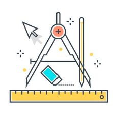

# 7. **Reglas para optimizar la usabilidad web** 

Tabla de contenidos

- [7. **Reglas para optimizar la usabilidad web**](#7-reglas-para-optimizar-la-usabilidad-web)
  - [7.1. Regla de los dos segundos](#71-regla-de-los-dos-segundos)
  - [7.2. Feedback de información](#72-feedback-de-información)
  - [7.3. Eliminar cualquier funcionalidad que no sume valor real](#73-eliminar-cualquier-funcionalidad-que-no-sume-valor-real)
  - [7.4. Sí al espacio entre elementos](#74-sí-al-espacio-entre-elementos)
  - [7.5. Legibilidad de los textos](#75-legibilidad-de-los-textos)
  - [7.6. Coherencia y consistencia](#76-coherencia-y-consistencia)
  - [7.7. La regla de los tres clics](#77-la-regla-de-los-tres-clics)
  - [7.8. Manejar los errores](#78-manejar-los-errores)
  - [7.9. El principio del "número siete, más o menos dos"](#79-el-principio-del-número-siete-más-o-menos-dos)
  - [7.10. Protección del trabajo de los usuarios](#710-protección-del-trabajo-de-los-usuarios)
  - [7.11. Correspondencia entre los contenidos y el mundo real](#711-correspondencia-entre-los-contenidos-y-el-mundo-real)
  - [7.12. Curva de aprendizaje mínima](#712-curva-de-aprendizaje-mínima)
  - [7.13. Navegación rápida entre secciones](#713-navegación-rápida-entre-secciones)
  - [7.16. Simetría / asimetría](#716-simetría--asimetría)

En el apartado anteior hemos visto los principios de la usabilidad web, y a partir de estos principios se pueden definir una serie de reglas básicas para crear webs usables. A continuación se muestran algunas de ellas.

## 7.1. Regla de los dos segundos

Cuando un usuario debe esperar más de dos segundos para obtener una respuesta a una acción realizada en una aplicación web, es muy posible que se impaciente y abandone la página en busca de otra plataforma que le ofrezca mejores resultados. Lo ideal es que la aplicación sea de **carga rápida y evitar toda sobrecarga innecesaria**.

## 7.2. Feedback de información

En el caso de disponer de procesos que tengan un tiempo de respuesta elevado, se debe **diseñar el feedback de información para el usuario**. Por ejemplo: en el proceso de envío de un formulario puede llegar a ser necesario utilizar una **animación de precarga o *spinner*** para mantener al usuario informado del estado del procesado de la información por parte de la plataforma.

## 7.3. Eliminar cualquier funcionalidad que no sume valor real

Siempre debemos facilitar la interacción del usuario en nuestra plataforma y ofrecerle las funcionalidades necesarias acorde a la temática del sitio. Por este motivo **eliminaremos todos los elementos que no aporten valor real y justificado**. Por ejemplo: sería completamente innecesario incluir un widget del tiempo o un calendario en una tienda online de zapatos.

## 7.4. Sí al espacio entre elementos

Tal y como ocurre con toda composición visual, el espacio es necesario. Los espacios bien utilizados dan a los usuarios tiempo para pensar y observar el espacio sin estar bombardeados de textos e imágenes. **La confusión visual es muy perjudicial, y los proyectos que están muy cargados son tremendamente molestos**. El espacio puede ser de cualquier color de fondo.

## 7.5. Legibilidad de los textos

Los textos son la base de la mayoría de sitios web ya que lo más normal es transmitir la información mediante letras. Por este motivo, para mejorar la experiencia del usuario debemos prestar mucha atención en la legibilidad de los textos: **tipos y tamaño de letra, contraste entre texto y fondo, textos con una longitud adecuada, interlineado, etc.**

## 7.6. Coherencia y consistencia

La coherencia y consistencia en el diseño nos ayuda a crear interfaces con elementos relacionados de forma lógica y sin contradicciones. Por ejemplo: en una plataforma es esencial **establecer correctamente los colores que representan los errores y aciertos**, así como **utilizar justificadamente los símbolos e iconos** de los elementos. Por lo tanto, los colores, los tipos de fuente, la distribución de los contenidos, etc. deben ser homogéneos a lo largo de toda la aplicación.

## 7.7. La regla de los tres clics

El usuario debe poder acceder de forma sencilla a todo el contenido de una plataforma. De este modo, se considera que **el contenido que se encuentra a más de tres clics no es importante**. Es por ello que los contenidos más visitados o las funcionalidades más útiles deben situarse a tan solo un clic para conseguir interacciones lo más eficientes.

## 7.8. Manejar los errores

Una plataforma debe estar diseñada de forma que si hay una incidencia al acceder a una página, bien porque se haya eliminado o cambiado la url, aparezca la **redirección correspondiente o el mensaje de error informativo** (denominado "error 404" o "página no encontrada"). En esta página los usuarios deben poder ver el mensaje de error y volver a inicio o *home*. Además, esta "página no encontrada" también debe estar diseñada conforme a la estética de la [guía de estilo](https://github.com/Sergio-Rey-Personal/DIW/blob/master/UD02%20Guia_de_estilo_web/UD02_01_QueEsUnaGuiaDeEstilos.md).

## 7.9. El principio del "número siete, más o menos dos"

Este principio está basado en un estudio llevado a cabo por el psicólogo George A. Miller en el que se descubrió que **la memoria a corto plazo trabajaba mejor cuando se empleaban conjuntos de siete (más o menos dos) datos**. Por ejemplo: si a los usuarios se les ofrece demasiadas opciones en un menú de navegación estarán confusos y no sabrán qué seleccionar. Por lo tanto, lo ideal será descartar más de 7 opciones.

## 7.10. Protección del trabajo de los usuarios

La protección del trabajo de los usuarios es algo prioritario, se debe **asegurar que el usuario nunca pierda el trabajo realizado** como consecuencia de un error. Por ejemplo: cuando un usuario está finalizando un proceso de compra y está rellenando todos sus datos, si hubiera algún error en el proceso se debería recuperar el carrito de compra y los datos que fueran necesarios.

## 7.11. Correspondencia entre los contenidos y el mundo real

El contenido de un sitio web debe estar escrito en el lenguaje de los usuarios con palabras, frases y conceptos familiares. Es decir, el contenido debe seguir las convenciones del mundo real y el diseñador debe ser capaz de **mostrar la información de forma natural y lógica**.

## 7.12. Curva de aprendizaje mínima

Los usuarios se encuentran más cómodos en sitios web que resultan fáciles de utilizar. En este sentido, debe ser tan sencillo utilizar la interfaz que la curva de aprendizaje sea mínima. Por ejemplo: se puede a**provechar la asociación para facilitar el aprendizaje** de los diferentes procesos. En el caso de Apple, fueron los primeros en utilizar un slider para desbloquear la pantalla con el dedo y posteriormente lo utilizaron para todas las demás interacciones de la interfaz gráfica.

## 7.13. Navegación rápida entre secciones

Diseñar un sistema de navegación que facilite las tareas a realizar es esencial para que **el usuario se encuentre cómodo visitando todo el contenido** de nuestra plataforma. Así por ejemplo, se deben implementar correctamente las opciones de desplazamiento entre los diferentes productos o contenidos, agregar migas de pan que ayuden a volver a otros contenidos fácilmente, el menú principal siempre debe estar visible o utilizar adecuadamente los sistemas de paginado, entre otras opciones.

## 7.16. Simetría / asimetría

Jugando con la simetría y la asimetría podemos conseguir diferentes efectos. Así pues, mediante la simetría podemos conseguir **diseños equilibrados**. Un ejemplo de este diseño podría ser colocar 4 iconos, uno al lado del otro, del mismo tamaño y color. Por otro lado, la asimetría puede conseguir que el usuario **focalice su mirada justo hacia el punto que destaca fuera de una composición simétrica**. En el caso anterior, podríamos romper el formato y el equilibrio cambiando el tamaño y el color de uno de los iconos.

> [Fuente: La usabilidad en el diseño de aplicaciones](https://www.eniun.com/usabilidad-diseno-aplicaciones-reglas-principios/)