# 8. **Análisis de la usabilidad web. Técnicas.**

Tabla de contenido

- [8. **Análisis de la usabilidad web. Técnicas.**](#8-análisis-de-la-usabilidad-web-técnicas)
  - [8.1. Ingeniería de la usabilidad](#81-ingeniería-de-la-usabilidad)
  - [8.2. Técnicas objetivas, sin la participación de usuarios.](#82-técnicas-objetivas-sin-la-participación-de-usuarios)
  - [8.3. Técnicas subjetivas con la participación del usuario.](#83-técnicas-subjetivas-con-la-participación-del-usuario)
  - [8.4. Aplicando téncias de testeo objetivas.](#84-aplicando-téncias-de-testeo-objetivas)
    - [8.4.1. Cuestionario de usabilidad](#841-cuestionario-de-usabilidad)
    - [8.4.2. Métricas de usabilidad](#842-métricas-de-usabilidad)
    - [8.4.3. Informe de resultados](#843-informe-de-resultados)
  - [8.5. Aplicando técnicas de testeo subjetivas.](#85-aplicando-técnicas-de-testeo-subjetivas)
    - [8.5.1. Card Sorting](#851-card-sorting)
    - [8.5.2. Tree test](#852-tree-test)
    - [8.5.3. First Click Test](#853-first-click-test)

Durante el proceso de diseño de una página web es frecuente tener dudas sobre cómo, donde y qué elementos ubicar en la interfaz. Qué decisión podría ser la mejor?

Para poder afirmar “la usabilidad de una determinada web puede ser mejor o peor que la de esta otra” o simplemente para poder establecer mejoras en la usabilidad de una determinada página web hacen falta unas métricas o unos criterios que nos permitan hacer valoraciones y comparaciones de la manera más rigurosa posible.

Esta valoración es complicada de establecer, puesto que algunos de los parámetros que se tienen que valorar son objetivos; pero otros no lo son tanto, puesto que tienen un componente subjetivo que  dificulta el resultado. Por esta razón hará falta también tener en cuenta otros parámetros fundamentales en la hora de valorar la usabilidad y de establecer las técnicas para su medida.

## 8.1. Ingeniería de la usabilidad

Un aspecto a tener en cuenta para aplicar las técnicas de valoración de la usabilidad es cuando se harán estas. Si se llevan a cabo una vez, el sitio web está finalizado y se concluye una valoración negativa, habrá que rehacer mucho trabajo ya dado por finalizado, o incluso volver a hacer alguna parte desde cero. Si se llevan a cabo a lo largo de las diferentes fases del desarrollo del proyecto web, por ejemplo durante el diseño o durante la implementación, habrá más opciones de reconducir los errores detectados, pero se harán las pruebas sobre un producto no finalizado.

Fases de un proyecto
  1. Estudio de viabilidad
  2. Análisis
  3. Diseño
  4. Desarrollo
  5. Finalización
  6. Transferencia

Por esta razón, algunos autores consideran que existe el que se denomina ingeniería de la usabilidad, igual que existe la ingeniería del software. De este modo, la usabilidad tiene su propio ciclo de vida que los diseñadores de páginas web tendrán que tener en cuenta. Entre las fases y tareas a llevar a cabo hay que tener en cuenta las siguientes_

  - Analizar los objetivos de la página web.
  - Analizar los usuarios principales y secundarios de la página web.
  - Analizar las tareas a realizar.
  - Escoger la ubicación de las pruebas.
  - Definir los rasgos principales que faciliten la amigabilidad de la web.
  - Deseñar los interfaces.
  - Interactuar con losusuarios para rediseñarlos.
  - Implantación de la versión beta
  - Realizar los test.

Algunes de las técnicas y los software de análisis de la usabilidad que se podrán llevar a cabo están divididas en:

  - Las técnicas que son objetivas o que se pueden ejecutar de manera automática, con los software que ayudan a controlar y revisar la usabilidad de un sitio web.
  - Las técnicas más subjetivas, basadas a recoger indicaciones de las experiencias de los usuarios.

Escoger una técnica o un método para el análisis y la evaluación de la usabilidad de un determinado sitio web o un determinado software dependerá de muchos factores, entre los cuales los dos más importantes son el tiempo y los recursos disponibles. a los recursos disponibles.

## 8.2. Técnicas objetivas, sin la participación de usuarios.

Las técnicas objetivas incluyen las técnicas de inspección que se llevarán a cabo en una revisión exhaustiva de la página web creada. Estas técnicas necesitarán poder acceder a guías de estilo, heurísticas y experiencias documentadas del web. Los usuarios finales no estarán implicados en este tipo de técnicas, y el objetivo será poder establecer una evaluación del sitio web desarrollado (o en vías de desarrollo) en cuanto a su usabilidad.

Algunas técnicas concretas, dentro del grupo de técnicas de inspección, son:

  - Las **inspecciones formales de la usabilidad** (con un equipo de entre 4 y 8 inspectores de usabilidad, considerados expertos).
  - El **ensayo cognoscitivo** aplicado a las primeras fases del desarrollo, donde expertos crean escenarios a partir de las especificaciones.
  - La **evaluación heurística**, en que un equipo de expertos en usabilidad analizan las interfaces de usuario del sitio web. A partir de este análisis se establecen unas reglas o heurísticas a través de las cuales se evaluará el sitio web o interfaz. Esta técnica fue desarrollada por *Nielsen*.

Está establecido que cinco consultores de usabilidad podrán encontrar un 80% de agujeros en los sitios web y que quince podrán encontrar el 100% de los agujeros de usabilidad.

Las técnicas de inspección u otras técnicas con consultores o auditores de la usabilidad son también conocidas como pruebas de expertos, que se diferenciarán de las pruebas de usabilidad con usuarios finales.

Las **pruebas de expertos** se consideran pruebas objetivas en que los expertos basan sus opiniones en su experiencia y en la excelencia. Las pruebas de usabilidad con usuarios finales son pruebas en que los usuarios darán su opinión de manera subjetiva.

Otros criterios para mesurar algunas de las dimensiones de la usabilidad de manera objetiva pueden ser:

  - Facilidad de aprendizaje: tiempo que tarda (o número de intentos que tarda) un usuario novel a llegar a hacer una determinada tarea al sitio web en el mismo tiempo que tarda un usuario experto.
  - Facilidad para recordar: se puede calcular el tiempo que tarda un usuario a llevar a cabo aquella tarea que quería hacer.
  - Eficiencia en el uso: número de tareas que hace un usuario navegante por la página web por unidad de tiempo.
  - Tolerancia al error: se pueden controlar el número de errores que comete un usuario desde que inicia el procedimiento en la página web hasta que llega a su objetivo (por ejemplo, el registro de sus datos en una determinada página).

Otros aspectos, como la satisfacción del usuario, son mucho más subjetivos de evaluar y no entrarían en este grupo.

Todos estos criterios muestran la manera de recoger datos cuantitativos que permitan comparar un diseño de un determinado sitio web con otro.

Otra aplicación que ayuda a recoger información de manera objetiva es la conocida como ***CrazzyEgg*** (www.crazyegg.com). Se trata de una herramienta que muestra un mapa de calor de los movimientos del ratón sobre una determinada página web. Esta información nos ayudará a tener más información para conocer el comportamiento de los usuarios y poder establecer una evaluación en lo referente a la usabilidad de una determinada página.

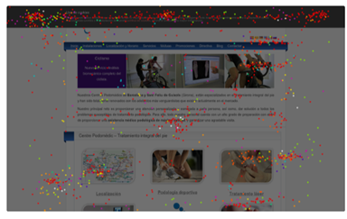

En la imágen aterior se muestra un ejemplo del mapa de calor de la página web de un centro de podología. Con algunos errores de descuadro, se puede observar como la mayoría de movimientos del ratón se hacen por los menús (el superior y las opciones de la parte central de la web).

Otro ejemplo para generar mapas de calor se puede encontrar con la aplicación ***ClickHeat-Clicks heatmap***, en la web www.labsmedia.com/clickheat/index.html.

Otros ejemplos de herramientas objetivas que se pueden encontrar en Internet para la ayuda indirecta en el análisis de la usabilidad de manera objetiva son:

  - **Load Impact** ([loadimpact.com](https://loadimpact.com/)), que ofrece la posibilidad de hacer una test de carga online y gratuito con que se puede simular los tiempos de reacción de la página web simulando el acceso simultáneo de muchos usuarios.
  - **Google Analytics**, otro ejemplo de herramienta que permite conocer muchos datos objetivos del comportamiento de los usuarios hacia una determinada página web ([www.google.com/analytics](https://marketingplatform.google.com/about/analytics/)). Permite, por ejemplo, conocer el número de abandonos de los usuarios de una determinada página web.
  - **Five Seconds** ([fivesecondtest.com](https://fivesecondtest.com/)), que permite llevar a cabo una test sobre una página web indicada en el cual se contestará de manera rápida unas preguntas concretas.
  - **Moby Ready** ([www.ready.mobi](https://ready.mobi/)), que ofrece el comportamiento de la web con diferentes navegadores y dispositivos.

## 8.3. Técnicas subjetivas con la participación del usuario.

Las técnicas subjetivas pretenden analizar las reacciones de los usuarios hacia una determinada página web. Esto es, si los gusta o no y si la encuentran sencilla o no; es decir, todo aquello que depende de la relación del usuario con la web. Para conseguir estas informaciones habrá que llevar a cabo un estudio que entre en detalle para conocer sus opiniones.

Datos cualitativos y cuantitativas

  Los tipos de datos a tratar son:

  - **Datos cualitativos**: ofrecen información de calidad, expresada de manera verbal o escrita por los usuarios sujetos de estudio. Es decir, no se buscarán respuestas controladas como un sí o uno no o una selección entre diferentes opciones, sino que se dejarán respuestas abiertas porque se escoja la opinión real y subjetiva del usuario.
  - **Datos cuantitativos**: son datos que se pueden mesurar. Estos datos se tratarán posteriormente con métodos matemáticos para llegar a conclusiones. Normalmente, las respuestas serán numéricas o booleanas, valoraciones con una respuesta gradual o porcentajes subjetivos, y las preguntas serán mucho más concretas.

El que se querrá conseguir a partir del estudio de los usuarios potenciales y de los usuarios reales es una serie de informaciones cuantitativas que permitan valorar y clasificar las alternativas existentes en la hora de diseñar. **Se podrían llevar a cabo algunas evaluaciones cualitativas, pero hay que establecer un sistema cuantitativo de la usabilidad para poder procesar los datos obtenidos**.

En la práctica, para obtener datos cualitativos es necesario conseguir informaciones de usuarios finales, es decir, se necesita una respuesta del usuario. En cambio, si hablamos de datos cuantitativos habrá que analizar el comportamiento del usuario ante la nueva aplicación, web o interfaz, recogiendo informaciones objetivas como pueden ser el tiempo que se encuentra el usuario en cada pantalla o el número de errores que generará para cada interfaz.

Las **técnicas con usuarios** se podrán llevar a cabo antes del desarrollo del proyecto, durante el mismo o una vez haya finalizado. Pueden ser pruebas cualitativas o cuantitativas, y dentro de estas técnicas se pueden englobar:

  - **Técnicas de indagación o sondeo**. Este tipo de técnicas se basan en la realización de entrevistas con usuarios reales. Existen varios tipos de entrevistas, como pueden ser las abiertas (en que el entrevistador tiene libertad para preguntar el que considere en función de como vaya) o cerradas (hay unas determinadas preguntas cerradas de las cuales no se podrá salir). A partir de charlas, preguntas y entrevistas con los usuarios reales se quiere indagar en el que estos usuarios necesitarán o querrán de un sitio web, a partir de sus experiencias positivas y negativas con otros sitios web parecidos que hayan utilizado. Con los resultados se obtendrá información para hacer mejoras en el diseño del web o criterios para hacer uno de nuevo.
  - **Técnicas de prueba**. También conocidas como técnicas de prueba con usuarios finales. Estos tendrán que hacer una serie de actividades al sitio web que se quiere evaluar, una vez este ya está finalizado o muy avanzado en su desarrollo. A partir de estas actividades se valorará el comportamiento del usuario ante varias situaciones y se podrán establecer los puntos fuertes y los puntos débiles del sitio web. El feedback se podrá obtener a partir de observaciones, resultado de encuestas, valoraciones subjetivas, preguntas con respuesta abierta, opiniones del producto, etc.
  - **Card Sorting**. Es una técnica para categorizar contenidos. Un grupo de usuarios expertos se reúnen para organizar y ordenar los contenidos, cosa que afecta el diseño de la página web y, en definitiva, su usabilidad.
  - **Tree Test**. Es una técnica para evaluar la organización gerárquica de una web, para resolver problemas de organización de contenidos.
  - **First Click Test**. El first click test es una técnica de usabilidad que permiten medir la facilidad de completar una determinada tarea en un producto digital. Su principal objetivo es verificar que el primer clic que realiza el usuario en la interfaz es claro y sencillo.

Hoy en día existen muchos programas que pueden ayudar en el diseño y la ejecución de estas técnicas, pero desgraciadamente muchos de ellos son de pago. A continuación se referencian algunas de estas herramientas informáticas, divididas entre las que se usan para el seguimiento del comportamiento de los usuarios ante una web y las que ayudan a desarrollar los cuestionarios para evaluar la usabilidad de las páginas web.

Entre las herramientas o software para analizar el comportamiento de los usuarios se pueden encontrar:

  - **Navflow** ([www.navflow.com](https://usabilityhub.com/product/first-click-tests)) es una herramienta para evaluar prototipo de páginas web. Se muestra un diseño web y se hacen unas preguntas a los usuarios, que harán una test, y se ofrecerá un informe con los resultados.
  - **Camstudio** ([camstudio.org](https://camstudio.org/)) es una herramienta gratuita que permite grabar todo el que sucede en una pantalla de ordenador. Nos permitirá capturar el comportamiento de un usuario ante una web para poder analizarlo posteriormente.
  - **VNC** ([www.uvnc.com/screenrecorder/index.html](https://www.uvnc.com/screenrecorder/index.html)) es otra herramienta para grabar todo el que sucede en un ordenador y evaluar, por lo tanto, el que hace el usuario al acceder en una determinada web.
  - **Morae** ([www.techsmith.com/morae.asp](https://www.techsmith.com/tutorial-morae-current.html)) es una herramienta que permite grabar comportamientos, pero también diseñar y llevar a cabo tests de usabilidad.

Otro ejemplo de software que puede ayudar en el análisis de la usabilidad de un determinado sitio web es lo **Selenium IDE** ([www.seleniumhq.org/projects/ide](https://www.selenium.dev/selenium-ide/)), un complemento para los navegadores Firefox  y Chrome que nos permite definir guías de actuación de usuarios y simular que estos usan una determinada página web para observar su comportamiento.

Entre las herramientas o software para diseñar, crear y llevar a cabo cuestionarios y tests a los usuarios se encuentran:

  - **Google Forms** (https://docs.google.com/forms): herramienta de Google que permite crear formularios, enviarlos a los usuarios, recoger y analizar las respuestas.
  - **SurveyMonkey** (https://es.surveymonkey.com/): herramienta gratuita que permite crear encuestas y analizar los resultados de manera sencilla.
  - Para las entrevistas cualitativas: grabación de audio y de voz y herramientas para ver en directo el comportamiento del usuario, por ejemplo, Snapshot.

En la siguiente imagen se puede ver un ejemplo de utilización del *SurveyMonkey*, una herramienta muy sencilla para crear encuestas de las muchas que podemos encontrar hoy en día a Internet. A partir de la misma página web de esta aplicación se podrá crear una encuesta y dar de alta los usuarios (los correos electrónicos) que querremos que la reciban por correo electrónico y que la contesten. Una vez enviada, y con la constancia de haber obtenido un mínimo de respuestas, la aplicación permite el análisis de los resultados.

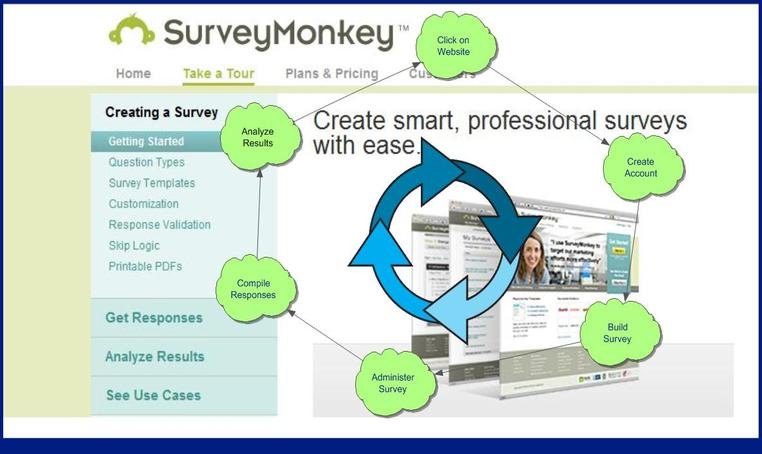)

Un caso práctico de como hacer una test subjetiva de usabilidad se muestra a continuación. Concretamente, se trata de la empresa *Aigües de Barcelona*. Este test está pensada para los usuarios que ya son clientes de la llamada Oficina en Red, que es su intranet. Esta intranet permite a los clientes de *Aigües de Barcelona* conectarse para gestionar todo aquello vinculado con el servicio que tienen contratado. La Oficina en Red ya está acabada y en funcionamiento desde hace tiempo. Por esta razón, piden a sus usuarios una evaluación de la oficina en general y de su usabilidad en particular para poder llevar a cabo mejoras en su diseño y en las funcionalidades que ofrece.

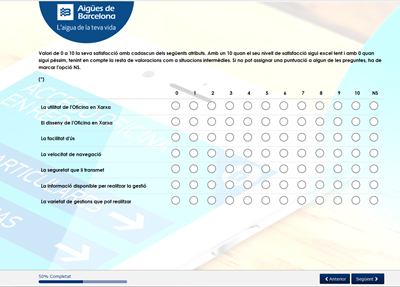

También se pueden observar algunos detalles que se recomiendan para la creación óptima de encuestas y cuestionarios, como puede ser ir mostrando el porcentaje de la encuesta que se lleva hecho (en este caso se informa el encuestado que ya lleva un 50%) y, aunque no lo podamos apreciar en la figura, ir mostrando las preguntas una a una por no cansar el usuario antes de empezar.

Este ejemplo pretende serviros de ejemplo para conocer como se llevan a cabo ciertas tests de usabilidad con usuarios reales.

## 8.4. Aplicando téncias de testeo objetivas. 

El **test de usabilidad objetivo** consta de **dos apartados** diferenciados: en primer lugar **un cuestionario** con diferentes preguntas en las que el evaluador deberá indicar si se cumple o no un determinado criterio de usabilidad y, en segundo lugar, **un conjunto de métricas de usabilidad** que el evaluador deberá cumplimentar para cuantificar el grado de eficacia, eficiencia y satisfacción de la aplicación.

La realización de estos cuestionarios y estas ponderaciones pueden ser particulares o especificas para cada tipo de proyecto. En este caso nos vamos a basar en el test de la junta de Andalucia sobre la accesibilidad de los servicios web ofrecidos.

[Junta de Andalucia: Normativa usabilidad](https://ws001.sspa.juntadeandalucia.es/unifica/web/gobernanza/normativa-usabilidad-web)

### 8.4.1. Cuestionario de usabilidad

Por cada pregunta el evaluador deberá indicar si se cumple o no el criterio de usabilidad definido y, en caso de no superarse, deberá justificar el motivo. De esta forma, al finalizar el cuestionario, se obtendrá una relación de los errores y/o incidencias a subsanar para mejorar la usabilidad de la aplicación.

En la hoja de cálculo adjunta "[Criterios_usabilidad](https://ws001.sspa.juntadeandalucia.es/unifica/documents/1912026/233536707/Criterios_Usabilidad_v1r01.xlsx/7f466bbf-ada3-4b07-a928-ce684ea42b71)" se clasifican cada una de las preguntas o criterios incluidos en el cuestionario en función de los atributos (eficacia, eficiencia y satisfacción) y principios de usabilidad (relación entre el sistema y el mundo real, consistencia y estándares, flexibilidad y eficiencia de uso, etc.) a los que hacen referencia. De esta forma se podrá contabilizar el número de criterios superados por cada atributo y/o principio de usabilidad.

Por otro lado, cada pregunta o criterio del cuestionario tiene definida, además, una prioridad (alta, media o baja) que determina cómo de importante es que se supere el criterio para poder determinar si la aplicación es usable. La incidencia generada en caso de no superarse el criterio será clasificada, también, en función de esta prioridad, así si un criterio es definido con prioridad alta generará una incidencia de tipo error, si su prioridad es media generará un aviso y si es baja una recomendación. Esta clasificación nos permitirá contabilizar el número de criterios de prioridad alta, media o baja superados por cada atributo y/o principio de usabilidad.

A continuación, se enumeran cada una de las preguntas o criterios incluidos en el cuestionario:

  **1. Identidad e información**

     1.  Los logotipos, tanto del SAS como de la aplicación, son suficientemente visibles. Además, el logotipo de la aplicación es significativo y fácilmente identificable.
     2.  Se proporcionan enlaces con información sobre el SAS y sobre el sistema.
     3.  Se proporcionan mecanismos para ponerse en contacto con el SAS.

  **2. Acceso**

     1.  Se facilita el acceso a la aplicación con una url simple y fácil de recordar.
     2.  Se evitan las pantallas introductorias que no aportan ningún tipo de información al usuario y que sólo se utilizan para auto-promoción.
     3.  El proceso de acceso a la aplicación (login) es sencillo.
     4.  Se identifican claramente las diferentes formas de acceso, si las hubiera.
     5.  Se informa de forma clara y precisa cómo proceder si el usuario introducido es inválido o ha caducado.
     6.  El acceso a la aplicación no está limitado a usuarios registrados, a menos que sea estrictamente necesario. Se permite el mayor uso posible de la aplicación sin requerir este proceso.
     7.  En caso de ser necesario, el proceso de registro es sencillo y fácil de realizar

  **3. Lenguaje y redacción**

    1.  Tanto el contenido de las páginas como el de los mensajes del sistema utilizan un lenguaje adaptado al usuario.
    2.  Se emplea un vocabulario sencillo y fácilmente comprensible, evitándose el uso de términos técnicos informáticos.
    3.  Se ofrecen versiones de la aplicación en diferentes idiomas, permitiendo el cambio de idioma en el momento que se desee.

  **4. Rotulado** 

    1.  Los nombres de los elementos de las pantallas (enlaces, botones, etc.) son autodescriptivos.
    2.  Se emplean rótulos estándar y fácilmente compresibles para el usuario, por ejemplo, "Acerca de", "Mapa del sitio", etc.

  **5. Navegación**

    1.  Se evita la sobrecarga memorística mediante el uso de menús simples con un número de opciones reducido.
    2.  Los enlaces son fácilmente reconocibles, muestran su estado (visitado, no visitado, etc.) y se reconocen como "clicables". Se delimita claramente la zona que posee el enlace.
    3.  Se evita colocar enlaces sobre imágenes, se colocan al pie de la misma e indican el contenido que mostrará si el usuario picha sobre él. También se evita colocar enlaces en palabras dentro del cuerpo de un texto.
    4.  No existen enlaces rotos, enlaces que llevan a la misma página (por ejemplo, enlaces a la "home" desde la misma página de inicio) ni enlaces redundantes (dos enlaces al mismo sitio en la misma página).
    5.  Existen elementos de navegación que orientan al usuario acerca de dónde está y cómo deshacer su navegación (por ejemplo, "breadcrumbs" o "migas de pan", botón de "Volver", etc.).
    6.  Se incorporan vínculos a otros contenidos del sitio que están relacionados con el contenido actual y que ayudan al usuario a decidir y a encontrar lo que busca.
    7.  El logotipo de la aplicación contiene un enlace a la página principal de la misma.
    8.  Se mantiene un sistema de navegación común a todas las pantallas de la aplicación.

  **6. Diseño y contenidos**

    1.  Los contenidos se entienden y leen con facilidad. Son concisos, precisos y están correctamente expresados.
    2.  La información está estructurada, ordenada y agrupada de forma coherente, evitando la sobrecarga informativa.
    3.  Se distinguen claramente los contenidos y/o acciones más relevantes.
    4.  Las pantallas se leen con facilidad. Se emplean técnicas para mejorar la legibilidad como el tamaño de los elementos, contraste de color, efectos tipográficos, etc.
    5.  El diseño es sencillo y limpio, evitando elementos innecesarios que no aportan utilidad y/o información (ruido visual).
    6.  Se utilizan códigos de color coherentes y conocidos por el usuario (ej. rojo para cancelar, verde para aceptar, etc.).
    7.  Se emplean iconos sencillos y estandarizados (conocidos por el usuario).
    8.  La disposición de los controles (botones, panel de navegación, etc.) es sencilla y previsible. Por ejemplo, las opciones más probables como "Aceptar" o "Seguir" se sitúan a la derecha.
    9.  Las diferentes pantallas de la aplicación mantienen un diseño homogéneo.
    10. Las pantallas son ajustables a la resolución del equipo o dispositivo (responsive).
    11. Se controla la longitud de la pantalla. Se evita el scroll horizontal y se limita el vertical.
    12. Se evita utilizar ficheros PDF para mostrar información. El uso del PDF se limita a las descargas y a las funciones de imprimir.
    13. Los textos de los contenidos están alineados a la izquierda.
    14. Se evita el uso de elementos que permanecen ocultos y obligan a deducir su funcionamiento.
    15. Se evita ejecutar acciones que recargan la página sin que el usuario las haya ordenado.
    16. Se emplean técnicas que permiten refrescar parte de la pantalla y evitan su recarga completa (Ej. Ajax)

  **7. Recursos Multimedia**

    1.  Se hace un uso adecuado de los recursos multimedia. Las imágenes, vídeos y audios son aclarativos y aportan valor añadido. Se emplean en su justa medida y no son demasiado extensos.
    2.  Los recursos multimedia son óptimos en cuanto a la resolución de la imagen y calidad del sonido.
    3.  Las imágenes disponen de texto alternativo asociado.

  **8. Búsquedas y listados**

    1.  Las opciones de búsqueda se encuentran fácilmente accesible y son claramente reconocibles como tal.
    2.  Se proporcionan opciones de búsqueda no estructurada basada en lenguaje natural (tipo Google).
    3.  Se optimizan los resultados de las búsquedas, obviando, por ejemplo, la coincidencia por mayúsculas o las tildes.
    4.  En caso de ser necesario, se incluyen opciones de búsqueda avanzada.
    5.  Los resultados de las búsquedas se muestran de forma comprensible para el usuario y se indica el número de resultados obtenidos.
    6.  Las cajas de texto de las opciones de búsqueda son lo suficientemente anchas.
    7.  Las búsquedas asisten al usuario en caso de no poder ofrecer resultados.
    8.  En los listados, paginados o no, se muestra el número total de elementos listados.
    9.  En el desplegable de entidades que permiten ejecutar acciones sobre cada elemento de un listado, los iconos que ejecutan dichas acciones se colocan en la parte derecha de cada fila.

  **9. Formularios**

    1.  Se emplean formularios sencillos, que solicitan la información justa y necesaria para cumplir su objetivo, con un número reducido de campos.
    2.  Se asignan títulos a los formularios y se identifica claramente su función.
    3.  Los campos están alineados y agrupados de forma lógica y coherente.
    4.  Los textos del formulario están redactados de forma clara y afirmativa, por ejemplo, "Deseo recibir una notificación por email".
    5.  Se minimiza la necesidad de memorizar del usuario, haciendo visibles objetos, acciones y opciones (ej. "combos", "checbox", "radio buttons", etc.).
    6.  De forma genérica y en formularios poco complejos, las etiquetas de los campos se ubican a la izquierda y las de los "radio buttons" y/o "check box" a la derecha.
    7.  Los campos de texto permiten cierta flexibilidad a la hora de insertar información. Por ejemplo, para introducir valores numéricos se permite el empleo de la coma y el punto en la separación de decimales.
    8.  Se distinguen claramente los campos obligatorios y los deshabilitados.
    9.  La longitud de los campos es suficiente para mostrar toda la información que contiene.
    10. Se evita el uso de "combos" y "radio buttons" con un número elevado de opciones.
    11. En controles de tipo "combos", "radio buttons", "check box", etc., se marca por defecto la opción más probable.
    12. En campos con un formato específico (ej. DNI, teléfono, fecha, etc.) se limitan los tipos de caracteres que se pueden incluir y se muestran ejemplos sobre cómo cumplimentarlos.
    13. Se utiliza la tecla "Intro" o "Enter" para ejecutar la acción principal del formulario.
    14. Se evita el empleo del control "Reset" en el formulario.
    15. La acción más probable de los formularios se localiza a la derecha y la menos probable a la izquierda (por ejemplo, a la izquierda "Cancelar" y a la derecha "Enviar"). Además, los botones que realizan las acciones principales del formulario ("Guardar", "Aceptar", "Enviar"¿), se localizan lo más cerca posible del último campo del formulario.
    16. Se realizan validaciones en las entradas de datos.
    17. Se notifican los errores al enviar el formulario, destacando qué campo ha provocado cada error y cómo solucionarlo. Estos mensajes se listan en la parte superior del formulario y se repiten tras el campo que lo ha provocado.
    18. Cuando se produce un error, no se pierde la información que el usuario ha introducido en otros campos de forma correcta y no se obliga al mismo a que vuelva a introducirla.

  **10. Ayuda**

    1.  La ayuda online es fácilmente reconocible y localizable.
    2.  La ayuda online es completa, fácil de entender y no muy extensa.
    3.  La ayuda online es efectiva, resuelve las dudas que se le presentan a los usuarios.
    4.  Se hace uso de descripciones emergentes (ej. tooltips) y de opciones para ampliar/reducir la información.
    5.  Se proporcionan mensajes de asesoramiento para un mejor uso de la herramienta.
    6.  Se ofrece ayuda contextual (ayuda interactiva sobre determinados objetos) en tareas complejas.

  **11. Gestión de errores, control y retroalimentación**

    1.  La forma de operar y realizar las tareas no induce a errores.
    2.  Se facilitan opciones para subsanar los errores cometidos por el usuario, tales como cancelar o interrumpir una operación, deshacer o rehacer.
    3.  Los mensajes de error son precisos, amigables, fáciles de entender y ofrecen alternativas para subsanar el error.
    4.  Se facilita la subsanación de errores mediante la opción de volver a un estado consistente.
    5.  Se utilizan recursos que permiten al usuario reconocer el estado de la aplicación y/o tareas que se están realizando (barras de proceso, mensajes de confirmación, mensajes de aviso y/o advertencia, etc.).
    6.  En todo momento, el usuario tiene libertad para realizar la tarea que desea y/o salir de situaciones no deseadas.

  **12. Flexibilidad y eficiencia en el uso**

    1.  Se proporcionan utilidades que minimizan el esfuerzo a la hora de realizar las tareas, como el empleo de valores por defecto, autocompletado de campos, etc.
    2.  Se permite la realización de tareas repetitivas de forma masiva o en bloque, etc.
    3.  Se proporcionan utilidades dirigidas al usuario experto como, por ejemplo, personalización de tareas frecuentes, teclas aceleradoras, etc.
    4.  Se emplean técnicas para reducir el tiempo de acceso a los contenidos o las funciones más importantes (ej. buscadores).
    5.  Se emplean controles y recursos que hacen la aplicación más intuitiva, dinámica, atractiva y fácil de usar como, por ejemplo, calendarios, opciones de arrastrar y soltar, menús en acordeón, gráficos, controles deslizante (sliders).
    6.  Los tiempos de carga de pantallas y/o páginas están optimizados y son aceptables.
    7.  La velocidad de procesamiento y el rendimiento del sistema es adecuado.

### 8.4.2. Métricas de usabilidad

Las métricas de usabilidad son cumplimentada por los evaluadores y permitiendo cuantificar el grado de eficacia, eficiencia y satisfacción de la aplicación.

Como paso previo para poder cumplimentar las métricas de usabilidad, se requiere recabar la siguiente información específica del sistema:

1.  ¿Cuáles son los perfiles de usuario a los que va dirigida la aplicación?
2.  ¿Cuáles son los principales objetivos de negocio de la aplicación?
3.  ¿Cómo priorizaría esos objetivos?
4.  ¿Cuáles son las principales tareas que deben realizar los diferentes usuarios de la aplicación?
5.  ¿Cómo priorizaría estas tareas?
6.  ¿Cuáles son las tareas críticas del sistema y/o que impactan con mayor fuerza para la consecución de sus objetivos?

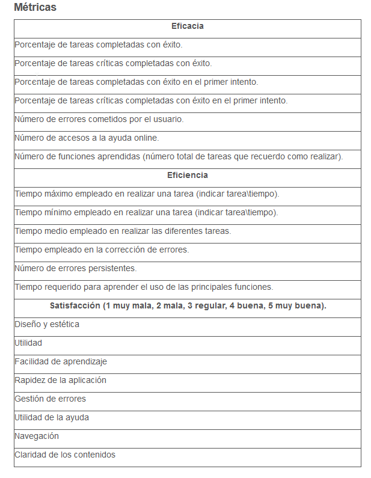

### 8.4.3. Informe de resultados

Una vez cumplimentado el test de usabilidad el evaluador de la Oficina de Calidad emite un informe final de resultados con la siguiente información:

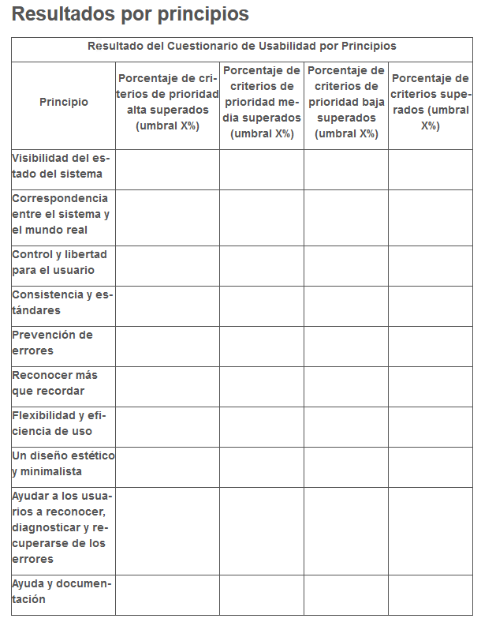

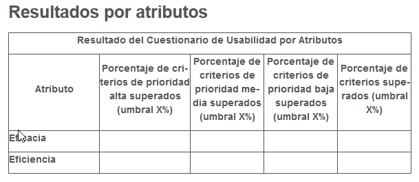

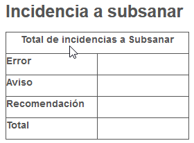

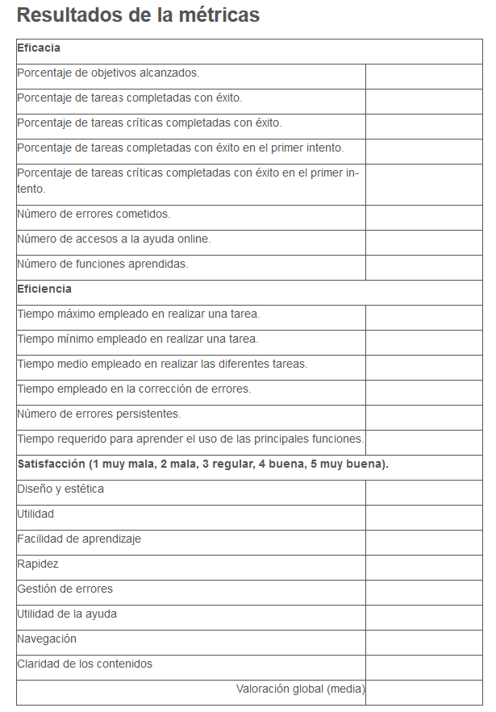

## 8.5. Aplicando técnicas de testeo subjetivas.

Existen diferentes técnicas para validar la arquitectura de la información de un producto digital y testear la usabilidad de tu web con usuarios finales.

### 8.5.1. Card Sorting

El card sorting es una técnica usada en el diseño de experiencia de usuario para **evaluar la taxonomía de un producto** digital. La técnica en sí consiste en proporcionar a los usuarios tarjetas con los diferentes conceptos incluidos en el mapa de contenidos del producto digital con la intención de observar su comportamiento y la clasificación que ellos mismos consideran.

Esta prueba se puede realizar tanto de un modo presencial, haciendo uso de post-its, como online con la ayuda de herramientas digitales. Este segundo método es más oportuno si tratamos de llegar a un número mayor de personas o si los usuarios no disponen de disponibilidad de tiempo o desplazamiento para realizar la prueba. No obstante, como cualquier prueba en remoto supone asumir ciertos puntos negativos como los posibles fallos técnicos o la falta de comprensión de la prueba por parte de los usuarios. Para ello será necesario explicarles correctamente cómo hacer uso de la herramienta e indicar los objetivos de la prueba para motivar a los usuarios a su realización.

Existen tres variantes de la técnica:

- **Card sorting abierto**: los usuarios deberán organizar una serie de tarjetas en diferentes categorías en base a su criterio y también, deberán proporcionar un nombre a cada una de esas categorías. Este enfoque tiene el objetivo de conocer qué tipo de clasificación de categorías sería el más correcto de utilizar.

- **Card sorting cerrado:** este tipo se caracteriza por un número de grupos predefinidos y etiquetados donde el usuario únicamente deberá clasificar las tarjetas en la categoría que crea que corresponda. Este tipo está recomendado cuando se tiene clara la estructura de primer nivel y se pretende verificar si la clasificación es comprensible para el usuario.

- **Card sorting híbrido:** se trata de una mezcla de los casos anteriores. Se ofrecen a los usuarios una serie de tarjetas y varias categorías prediseñadas. Los usuarios podrán clasificarlas en esa serie de categorías y también en nuevas categorías que tengan sentido para ellos.

Card soting híbrido:

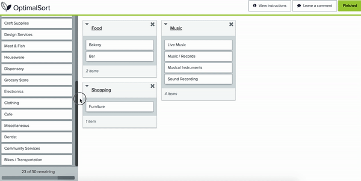

Cabe resaltar que para la puesta en marcha de esta técnica, y para el resto que se mencionarán a continuación, se necesita **reclutar a usuarios potenciales del producto digital.** Solo así, se podrán obtener datos significativos.

Una vez se ha realizado la prueba es importante analizar los resultados obtenidos. Por un lado, si la prueba ha sido presencial, se habrá podido recabar información cualitativa sobre el comportamiento o la actitud de los usuarios durante el desarrollo de la prueba, su rapidez con respecto algunas de las tarjetas o sus posibles dudas con otras.

Por otro lado, tanto en pruebas presenciales como en remoto se podrán conseguir datos cuantitativos que una vez que se hayan procesado se podrán representar haciendo uso de gráficos visuales. Es habitual que en las plataformas digitales se generen este tipo de gráficos. Las más comunes son:

La matriz de similitud muestra los grupos de tarjetas más comunes permitiendo identificar las agrupaciones más evidentes y explorar las más variables.

Ejemplo de una matriz de similitud:

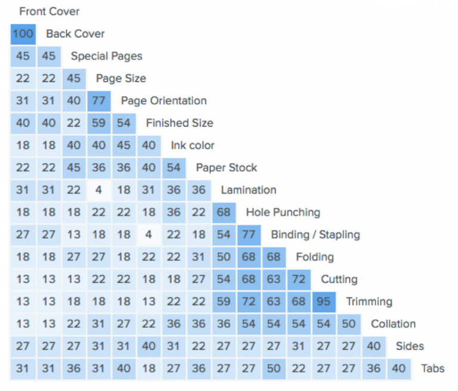

Por su lado, en el dendograma se permite visualizar la relación de agrupación entre las tarjetas en porcentaje.

Ejemplo de un dendograma:

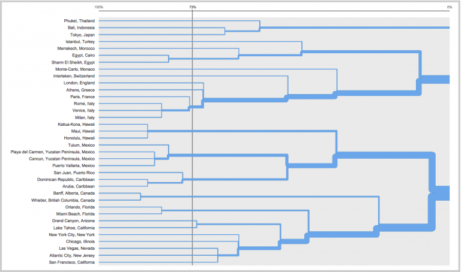

A continuacion, tenemos un articulo en el que explica cómo se ha aplicado esta técnica en el [caso de éxito de Arenal Perfumerías](https://www.hiberus.com/crecemos-contigo/caso-de-exito-arenal-perfumerias-estrategia-de-transformacion-digital-360/)

Existe una herramienta para realizar el cardsorting con https://www.optimalworkshop.com/ y podemos probar realizar un card sorting para que podáis probar por vosotros mismos cómo sería participar en este tipo de prueba. [Puedes hacerlo aquí.](https://g4806f8l.optimalworkshop.com/optimalsort/53526vj2)

### 8.5.2. Tree test

Un **tree test** es una técnica que trata de **evaluar la estructura jerárquica** de un producto digital provocando que los usuarios deban encontrar en el árbol de contenidos los elementos que les permitirán resolver sus tareas. Para conseguir los mejores resultados, se recomienda ejecutarla tras la realización de una prueba de card sorting.

La puesta en marcha de una prueba tree test proporciona las siguientes ventajas:

-   Evalúa la estructura jerárquica en un escenario real siguiendo tareas parecidas a las de un test de usabilidad.
-   Puede desarrollarse mucho antes de haber diseñado una página o un menú de navegación, lo que permite un perfeccionamiento de la taxonomía en fases tempranas.

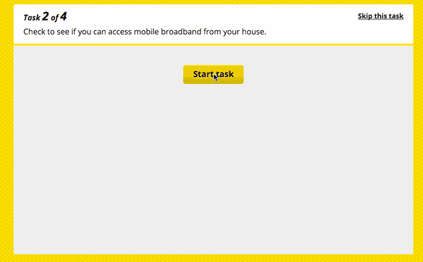

Para realizar esta prueba **se requiere un árbol de contenidos y el diseño de tareas**.

Por un lado, el árbol de contenidos con el que se va desarrollar la prueba debe ser completo. Es decir, debe contener todas las categorías y subcategorías de la estructura original para que el usuario pueda vivir la situación más realista posible.

Por otro lado, la **tareas deben estar relacionadas con los objetivos clave** del sitio web o del rediseño. Es decir, dónde encontrar el producto más vendido o un servicio nuevo, dónde localizar las áreas más problemáticas o más recurrentes.

En cuanto a la narrativa de las tareas, es apropiado ser cautos con las instrucciones. Es apropiado dar contexto al usuario para conseguir transmitir su motivación y su escenario de uso pero, hay que tratar de evitar dar la respuesta en la propia narrativa u ofrecer demasiados detalles.

Un tree test se puede realizar a través de cualquier herramienta que permita hacer clic en el árbol de contenidos y conseguir desplegar las categorías. No obstante, por comodidad es común desarrollarlos a través de un servicio específico en el que se pueda ejecutar la prueba en remoto y dónde se registren las respuestas de cada uno de los usuarios representativos del proyecto. Sin embargo, este formato impide en cierta manera conocer el comportamiento del usuario o la posibilidad de realizar preguntas personalizadas.

### 8.5.3. First Click Test

El **first click test** es una técnica de usabilidad que permiten medir la facilidad de completar una determinada tarea en un producto digital. Su principal objetivo es verificar que el primer clic que realiza el usuario en la interfaz es claro y sencillo.

Según un estudio de usabilidad: "[First Click Usability Test](http://webusability.com/firstclick-usability-testing/)" se concluyó que si el primer clic era correcto, los usuarios tenían un 87% de probabilidad de completar la acción con éxito, en lugar de solo el 46% si el primer clic era incorrecto.

> [Youtube](https://www.youtube.com/watch?v=GTi55c_60pc&feature=emb_logo)

Este tipo de prueba se diferencia de otros análisis en que se conoce la intención del usuario, su objetivo. Por tanto, se permite **investigar el comportamiento de los usuarios** para cada escenario por separado.

Para la realización de esta técnica se requiere la creación de tareas y la recopilación de imágenes de la interfaz que se quiera validar. Se puede hacer uso tanto de las pantallas finales como de diseños, prototipos o sketches. Lo que proporciona la posibilidad de ejecutar esta técnica en cualquier momento de desarrollo del proyecto. Incluso después del lanzamiento para seguir mejorando la usabilidad.

Durante la puesta en marcha de la prueba se podrán recoger datos valiosos como la posición exacta del clic o el tiempo que tardaron en hacerlo. Así mismo, es aconsejable  solicitar más información a los usuarios que justifique sus acciones sobre por qué lo hizo de tal manera o dónde lo esperaba encontrar en un primer momento.

Los **resultados obtenidos pueden ser muy valiosos** para resaltar aquellas zonas confusas donde ocurren clics inesperados o para encontrar alternativas de diseño si la facilidad o utilidad de los elementos es escasa.

https://www.optimalworkshop.com/chalkmark/ es una herramieta que premite realizar estos test de forma sencilla, finalmente para que **puedas poner en práctica esta prueba** se facilita el siguiente first click test donde podrás ponerte en la piel de un usuario. [Puedes hacerlo aquí.](https://g4806f8l.optimalworkshop.com/chalkmark/7s5h7qvg)

Consigue ofrecer una correcta arquitectura de la información alineada con las necesidades de tus usuarios finales haciendo uso de alguna de estas técnicas. De este modo, facilitarás la navegación en tu producto digital y los usuarios se sentirán satisfechos pudiendo conseguir sus objetivos.