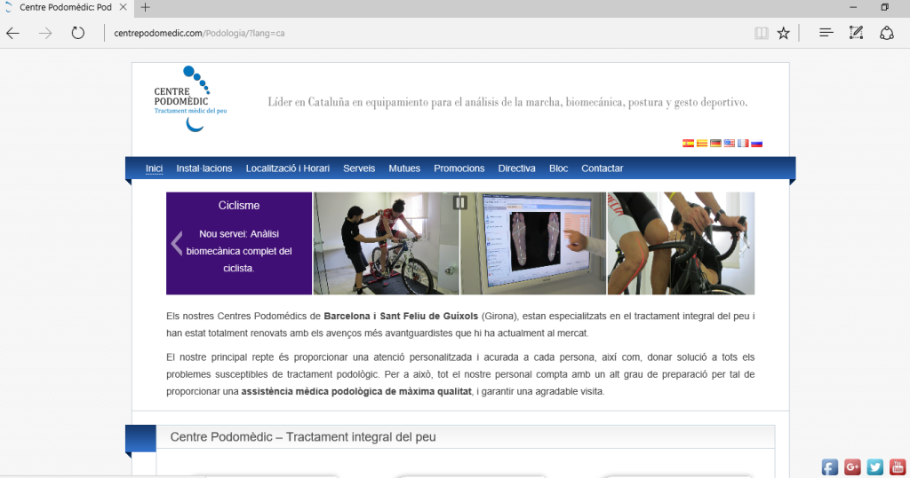
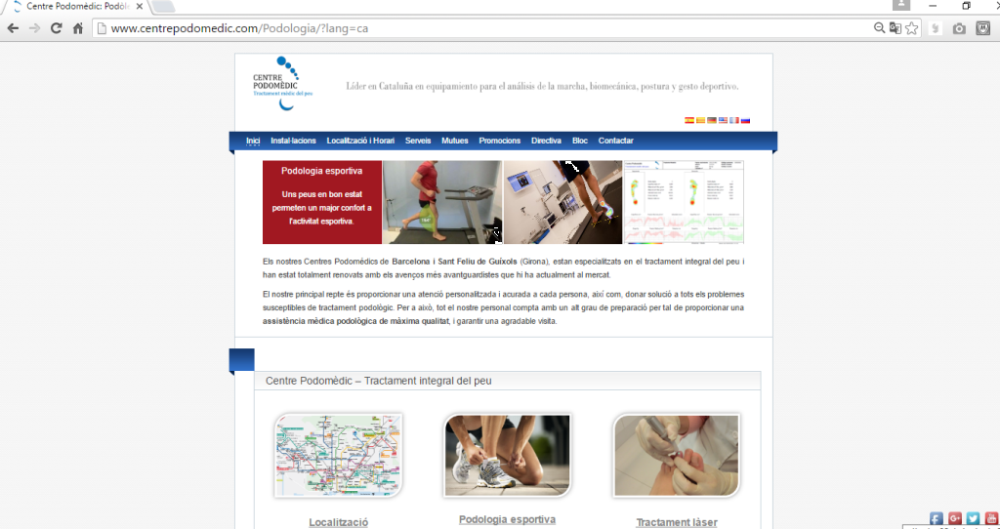
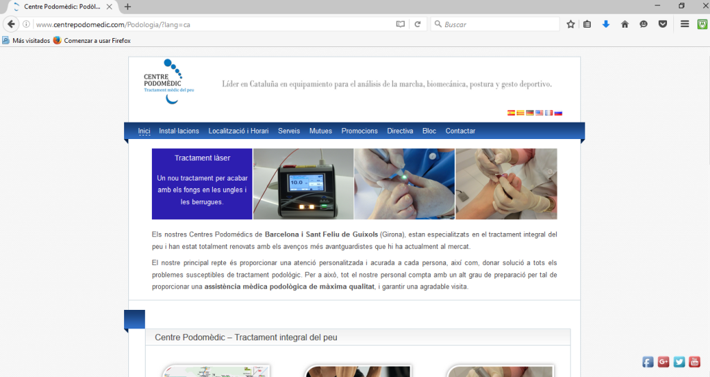
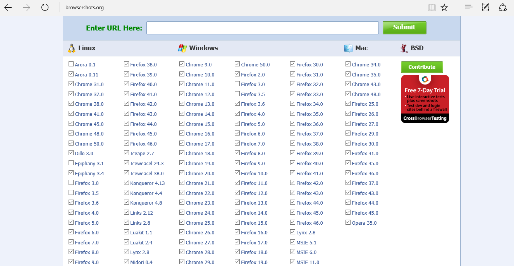
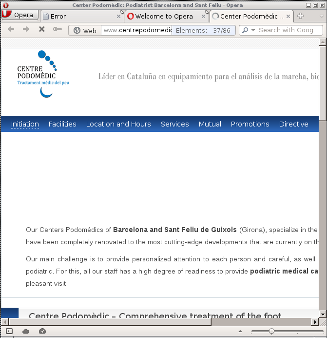
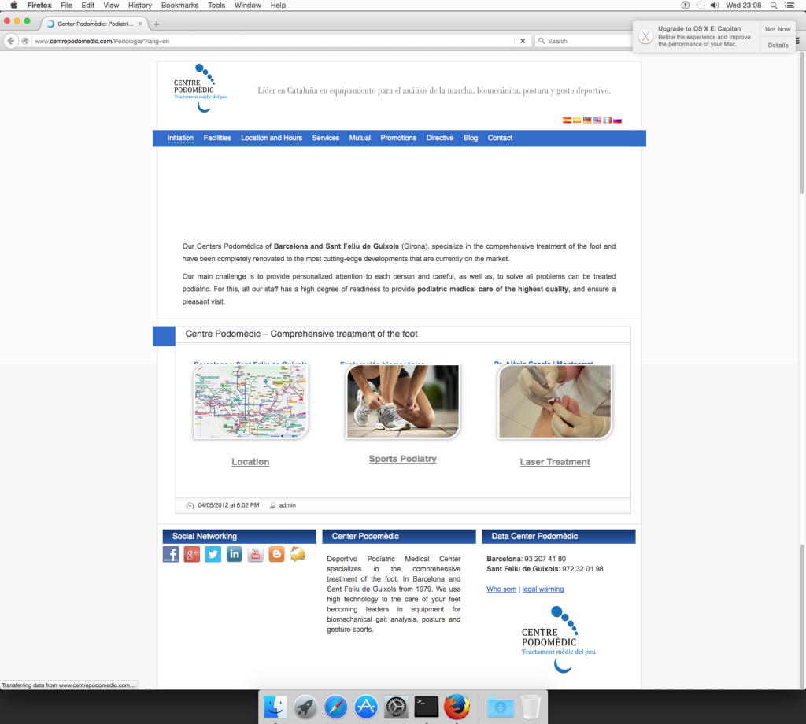
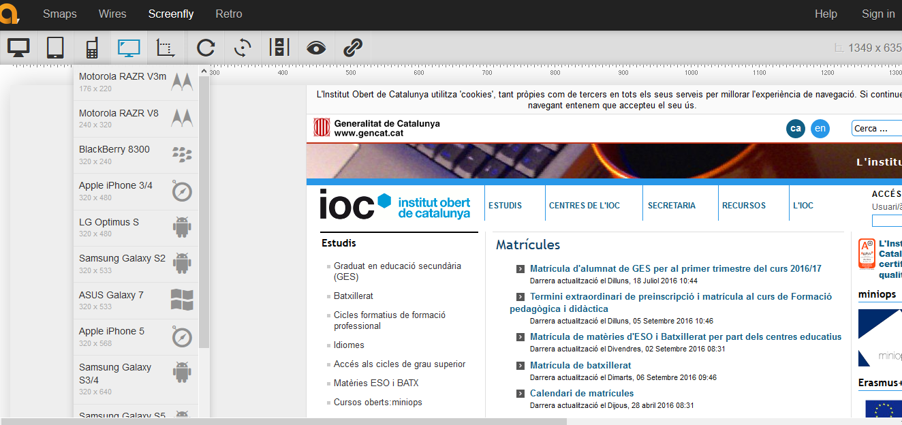

# 9. **Verificación de la usabilidad en diferentes navegadores y dispositivos.**

Tabla de contenidos

- [9. **Verificación de la usabilidad en diferentes navegadores y dispositivos.**](#9-verificación-de-la-usabilidad-en-diferentes-navegadores-y-dispositivos)

El diseño, la creación y el desarrollo de una página web no se limitará a tener una buena idea, llevar a cabo un buen diseño y seguir todas las indicaciones porque la página sea accesible y ofrezca una buena usabilidad. También habrá que validar su correcto funcionamiento en los diferentes tipos de tecnologías que nos podemos encontrar hoy en día, tanto a nivel de hardware como nivel de software.

Este hecho nos lleva a tener que validar que la web desarrollada se pueda visualizar correctamente desde:

  - Los diferentes navegadores que existen o, como mínimo, los más comunes, es decir, aquellos que alcancen el porcentaje más alto posible de utilización. Entre otros, *Firefox*, *Google Chrome*, *Opera*, *Safari* y *Microsoft Edge*. El uso de unos o de otros dependerá en algunos casos del sistema operativo instalado.
  - Los diferentes dispositivos desde donde se podrá navegar por esta página web, como es el caso de ordenadores, móviles y tabletas. La buena visualización o no de una web en cada uno de estos dispositivos es el que se trabaja en el que se denomina diseño web adaptable (Responsive Web Design) como ya conoces.

**Los sitios web que estén diseñados bajo los parámetros de *RWD* proporcionarán beneficios en cuanto a mejor posicionamiento en la red** (SEO), además de otras como la simplificación de contenidos y redundancias, puesto que no se tendrá que diseñar una web para cada dispositivo, sino una única que se adapte a todo tipo de dispositivos.

> *SEO* es el acrónimo de Search Engine Optimization, una disciplina que tiene el objetivo de mejorar el posicionamiento de una web en los motores de busca.

Para analizar diferentes sitios web desde varios navegadores y dispositivos habría que usar las herramientas más lógicas, como sería el hecho de descargar el mayor número de navegadores posibles en uno en torno a desarrollo o en uno en torno a producción y llevar a cabo las pruebas adecuadas, y también probar de navegar desde diferentes dispositivos. Sin embargo, existen páginas web que permiten hacer esta simulación.

Cogemos el ejemplo del centro de podología que ya hemos usado anteriormente. Hay que recordar que las capturas de la página web están hechas en un momento determinado. Es muy posible que cuando queráis validar estos ejemplos las webs correspondientes hayan evolucionado (con cambios de contenidos, cambios de versiones, cambios de diseño…).

En los pantallazos que se muestran en las siguiente imágenes se puede observar como no hay diferencias destacables entre los diferentes navegadores testados para Windows.

Página web con navegador Microsoft Edge

Página web con navegador  Google Chrome 

Página web con navegador Mozilla Firefox

En cambio, usando una herramienta como la que ofrece la página web browsershots.org podremos llevar a cabo un análisis mucho más amplio de los diferentes navegadores. A continuación se puede ver la disponibilidad de navegadores que ofrece para testar una página web ya colgada en un servidor.

De la misma forma que hemos hecho revisando diferentes navegadores en entorno Windows, también se deberian revisar en diferentes sistemas operativos.

En la siguiente imágen veremos como se puede ver nuestro ejemplo de centro de podometría en *Ubuntu*:

y la visualización de la misma web en navegador Safari en entorno Mac:

Vemos que en estas dos capturas ya sí que podemos encontrar diferencias hacia aquello mostrado por los navegadores del sistema operativo Windows. Podemos llegar a la conclusión que este centro ha tenido en cuenta la navegación en Windows pero no tanto a otros sistemas operativos o navegadores.

Igual que hemos visto con los navegadores, puede ocurrir que si utilizamos diferentes dispositivos la visualización de la web difiera. La mejor manera de probar la visión que tendremos de una determinada página web será disponer de los diferentes dispositivos. Pero a través de diferentes herramientas que se ofrecen en Internet podemos emular como se verá una determinada página web en los diferentes dispositivos móviles. Hoy en día existen muchas herramientas en el mercado, a continuación  podemos ver algunas de ellas:

- **Screenfly** ([quirktools.com/screenfly](https://bluetree.ai/screenfly/)): es una de las mejores herramientas de simulación de Android, iPad, etc. También permite simular la visualización en todo tipo de pantallas y resoluciones. Veamos un ejemplo: 

- **iPadpeek** (ipadpeek.com) y **iPhoney** (www.marketcircle.com/iphoney): simuladores de visualización web para dispositivos móviles iPhone.

También podemos encontrar otras herramientas que sin ser simuladores nos ofrecen recomendaciones para mejorar la compatibilidad de la web al dispositivo; por ejemplo, una herramienta de validación de W3C, validator.w3.org/mobile.

También hay herramientas que ofrecen información con referencia a la optimización de una determinada web para dispositivos móviles, como por ejemplo la herramienta de Google informe de usabilidad móvil: goo.gl/3kdfz9. Hay que tener en cuenta que si la web está optimizada para dispositivos móviles hay mayor probabilidad que un usuario  acceda.

En general, hay algunos aspectos que permiten mejorar la usabilidad de una web para adaptarla a dispositivos móviles, entre otros:

  - Hay que tener cura de las barras de desplazamiento horizontales y verticales.
  - Situar en el centro de la web el contenido principal que sea de interés para el usuario.
  - La medida de la letra tiene que ser adecuada (16 *px o superior).
  - La distancia entre los elementos *clicables e interactivos tiene que ser suficiente.
  - Hace falta no abusar de elementos que sean difícilmente *visualitzables.

Muchos de estos aspectos hay que tenerlos en cuenta durante el diseño, sin olvidar la experiencia de usuario (UX).